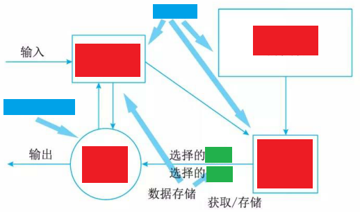
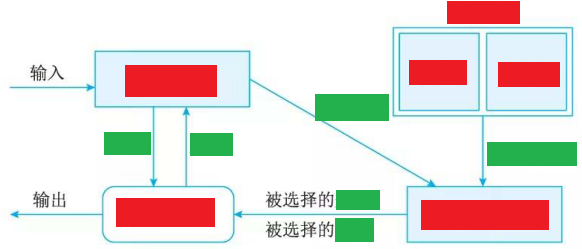
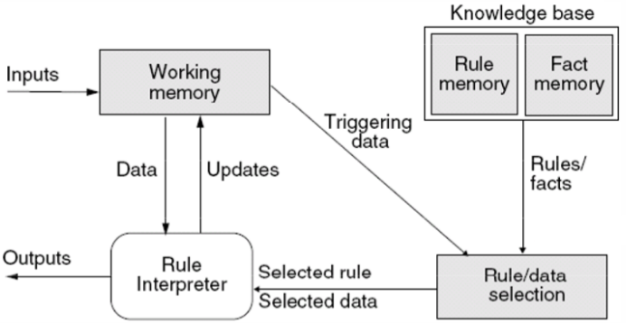

# 虚拟机体系结构风格(Virtual Machine Architecture Style)

## 最佳实践

### 考察问

- 解释器

    定义: 解释器通常被用来建立一种`()`以弥合`()`与`()`之间的差异。

    特点: 解释器具有高度的`()`和更强的`()`，但通常以牺牲`()`为代价。

    

- 规则系统

    

### 题目总结

- 解释器

    定义: 解释器通常被用来建立一种`虚拟机`以弥合`程序语义`与`硬件语义`之间的差异。

    特点: 解释器具有高度的`灵活性`和更强的`动态能力`，但通常以牺牲`运行效率`为代价。

    

- 规则系统

    

## 虚拟机体系结构风格

虚拟机体系结构风格的基本思想是人为构建一个运行环境，在这个环境之上，可以解析与运行自定义的一些语言，这样来增加架构的灵活性。虚拟机体系结构风格主要包括解释器风格和规则系统风格。

## 解释器体系结构风格(Interpreter Architecture Style)

一个解释器通常包括`完成解释工作`的解释引擎，一个包含将`被解释的代码`的存储区，一个`记录解释引擎当前工作状态`的数据结构，以及一个`记录源代码被解释执行进度`的数据结构。解释器通常被用来建立一种`虚拟机`以弥合`程序语义`与`硬件语义`之间的差异。其缺点是执行效率较低。典型的例子是专家系统。

解释器架构是一种软件架构风格，它通过逐条解释程序中的指令（或语法结构）来执行代码。在这种架构中，源代码首先被解析为中间形式，如抽象语法树（AST）或字节码，然后由解释器引擎按照预定义语义一条条执行这些中间表示。

与编译器架构不同，解释器不将程序一次性翻译为机器码，而是在运行时边读边执行。这种特性使解释器具有高度的灵活性和更强的动态能力，但通常以牺牲运行效率为代价。

解释器的组成:

- 构件
    - 一个状态机：解释器引擎

        解释器引擎是核心`执行`模块，它负责遍历中间表示，并根据语言定义的语义规则，逐步解释和执行每一个语法节点。引擎通常具备递归执行机制（适合AST）或字节码指令执行循环（适合字节码解释器），是实现程序语义的中心组件。

    - 三个存储器：被解释执行的程序、被解释的程序的状态、执行引擎的状态

        解释器需要有一个运行时存储系统来管理程序中用到的变量、对象、临时值等。通常分为栈（stack）和堆（heap）：栈用于管理函数调用和临时变量，堆用于存储动态分配的对象和结构体等。

        - 程序执行的状态

            除了解释器自身的内部状态，解释过程还需要维护程序的执行状态。这个状态包含了当前正在执行的函数调用、局部变量上下文、返回地址等信息。每次函数调用通常会创建一个新的“执行帧”，并压入调用栈中。

        - 被解释执行的程序

            被解释执行的程序，通常是源代码在经过词法分析和语法分析之后，形成的结构化表示。例如，一段代码 x = 3 + 4 会被解析成一个赋值语句节点，其中包含一个加法子节点。这个结构通常以抽象语法树（AST）或中间代码（Intermediate Representation, IR）的形式存在。

        - 解释器引擎的状态

            解释器在运行过程中会维护一些内部状态信息，例如当前执行到的语句位置（程序计数器）、调用栈、当前作用域等。这些状态对于控制执行流程、函数调用、异常处理等至关重要。

- 连接件: 数据获取和存储

## 规则系统体系结构风格(Rule-Based System Architecture Style)

规则系统体系结构风格（Rule-based System Style）是解释器体系结构风格的特例（需要被解释执行的是规则），适用于需要根据特定规则进行决策和操作的应用程序（推理系统、业务流程管理系统等）

基于规则的系统(见图) 包括`规则集`、`规则解释器`、`规则／数据选择器`及`工作内存`。

- 构件：工作内存、规则/数据选择、知识库、规则解释器

    - 工作内存
    - 规则/数据选择

        负责规则的解析、评估、执行、管理根据输入数据、规则和事实集合进行推理和匹配，然后触发相应的操作或决策。

    - 知识库

        规则引擎从事实集中获取事实数据，并将其与规则库中的规则进行匹配和推理。

        - 规则集：存储和管理系统全部规则的条件和操作. 🌰规则 1：If（事实集中 “用户类型为学生”）且（事实集中 “当前借阅数量＜5 本”），Then 允许借阅，最长借阅期 30 天
        - 事实集：存储事实数据（规则引擎执行时的输入数据）。🌰用户类型：学生, 当前借阅数量：3 本

    - 规则解释器

        接收来自外部系统的输入→执行规则引擎生成的操作→将结果返回给外部系统

- 连接件：过程调用、直接存储器访问

在现实里的业务需求经常频繁的发生变化，软件系统也要随之适应。如果每一次的需求变化都需要程序员来修改代码，那么，效率将会非常低，成本也非常高。

业务规则在程序中通常是以if-then-else-endif分支结构的形式书写的。业务越复杂，判断逻辑越多，程序越来理解，越难维护。业务变化导致程序修改，通常是对程序进行局部修改。

最好的办法是把频繁变化的业务逻辑抽取出来，形成独立的规则库。这些规则可独立于软件系统而存在，可被随时的更新。`业务逻辑 = 固定业务逻辑 + 可变业务逻辑(规则) +规则引擎`（“频繁变化的规则”与“较少发生变化的规则执行代码”分离。）

基于规则的系统：一个使用模式匹配搜索来寻找规则并在正确的时候应用正确的逻辑知识的虚拟机。

## 参考

- https://blog.csdn.net/cooldream2009/article/details/148362279
- https://blog.csdn.net/weixin_43452424/article/details/104961036
- https://skyjty.github.io/notes/2024/12/05/Software_Architecture.html