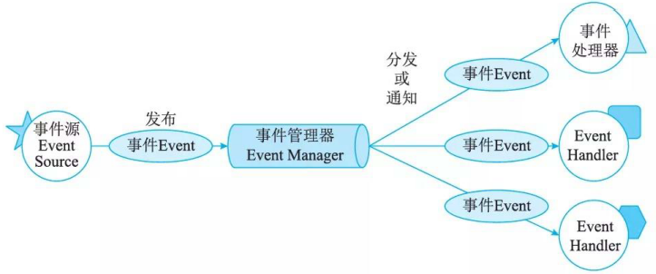
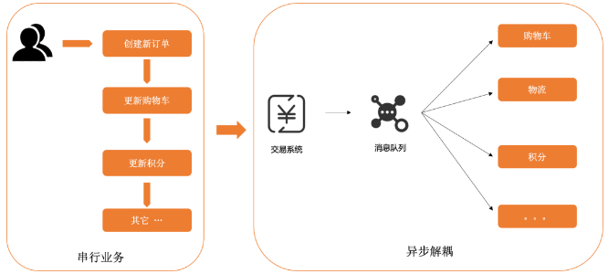

# 独立构件体系结构风格(Independent Component Architecture Style)


## 最佳实践

### 掌握评估


- 进程通信(IPC)
- 事件系统(EDA)
    - 特点:
        - `()`
        - `()`
        - `()`
    - 步骤: 
        - `()`：定义事件的类型、属性和数据。事件可以是内部系统状态变化引起的，也可以是外部环境或其他系统引起的。
        - `()`：定义事件处理器的类型、方法和逻辑。事件处理器可以是函数、方法、类或者其他可执行代码。
        - `()`：定义事件总线的类型、协议和通信机制。事件总线可以是基于消息队列的、基于网络socket的、或者基于其他通信机制的。
        - `()`：将事件处理器注册到事件总线上，使其可以接收到相应的事件。
        - `()`：当事件发生时，将事件发布到事件总线上，使注册的事件处理器可以接收到事件。
        - `()`：当事件处理器接收到事件后，执行相应的处理逻辑。


### 题目总结

- 进程通信(IPC)
- 事件系统(EDA)
    - 特点:
        - `解耦`
        - `异步`
        - `可扩展性`
    - 步骤: 
        - `定义事件`：定义事件的类型、属性和数据。事件可以是内部系统状态变化引起的，也可以是外部环境或其他系统引起的。
        - `定义事件处理器`：定义事件处理器的类型、方法和逻辑。事件处理器可以是函数、方法、类或者其他可执行代码。
        - `定义事件总线`：定义事件总线的类型、协议和通信机制。事件总线可以是基于消息队列的、基于网络socket的、或者基于其他通信机制的。
        - `注册事件处理器`：将事件处理器注册到事件总线上，使其可以接收到相应的事件。
        - `发布事件`：当事件发生时，将事件发布到事件总线上，使注册的事件处理器可以接收到事件。
        - `处理事件`：当事件处理器接收到事件后，执行相应的处理逻辑。


## 独立体系架构风格

独立构件风格主要强调系统中的每个构件都是相对独立的个体，它们之间不直接通信，以降低耦合度，提升灵活性。独立构件风格主要包括进程通信和事件系统风格。

## 进程通信体系结构风格(Inter-Process Communication, IPC)

在进程通信结构体系结构风格中，构件是独立的过程，连接件是消息传递。这种风格的特点是构件通常是命名过程，消息传递的方式可以是点到点、异步或同步方式及远程过程调用等。

进程通信（Inter-Process Communication, IPC）是指在操作系统中，使得两个或多个进程能够互相交换数据和信息的机制。

|通信方式|描述|
|--|--|
| 管道（Pipe）|一种半双工的通信方式，数据只能单向流动，用于父子进程或兄弟进程之间的通信。|
| 消息队列（Message Queue）|消息的链表，存储在内核中，可以实现不同进程间的消息交换。|
| 共享内存（Shared Memory）|允许多个进程访问同一块内存空间，是最快的IPC方式，但需要同步机制来协调访问。|
| 信号量（Semaphore）|用于进程间同步，防止多个进程同时访问同一资源。|
| 套接字（Socket）|支持不同主机间的进程通信，支持面向连接（TCP）和无连接（UDP）的通信方式。|

## 事件系统体系结构风格(Event-Driven Architecture, EDA)

事件系统风格(见图) 基于事件的隐式调用风格的思想是构件不直接调用一个过程，而是触发或广播一个或多个事件。系统中的其他构件中的过程在一个或多个事件中注册，当一个事件被触发，系统自动调用在这个事件中注册的所有过程，这样，一个事件的触发就导致了另一模块中的过程的调用。

支持基于事件的隐式调用的应用系统很多。例如，在编程环境中用于集成各种工具，在数据库管理系统中确保数据的一致性约束，在用户界面系统中管理数据，以及在编辑器中支持语法检查。例如在某系统中，编辑器和变量监视器可以登记相应Debugger的断点事件。当Debugger在断点处停下时，它声明该事件，由系统自动调用处理程序，如编辑器可以卷屏(返回)到断点，变量监视器刷新变量数值。而Debugger本身只`声明事件`，并不关心`哪些过程会启动`，也不关心`这些过程做什么处理`。



### 消息驱动(Message-Driven)

在消息驱动通信中，一般链路就是消息生产者（Producer）向消息消费者（Consumer）发送消息。

消息驱动模式下通常会用到中间件，比较常见的中间组件有 RocketMQ，Kafka，RabbitMQ 等。这些中间件的目的是缓存生产者投递的消息直到消费者准备接收这些消息，以此将两端系统解耦。

消息驱动通讯比较常见的一个例子是商品订单推送，上游组件负责生成订单，下游组件负责接收订单并处理。通过这样的通讯方式上游生成组件其实无需关心整个订单的生命周期，更专注于如何快速生成订单，使单个组件的性能得以提升。



### 事件驱动 Event-Driven

事件驱动其实是对消息驱动方法的改进，它对消息体大小，消息格式做了较为严格的限制，这层基于消息的限制封装其实就称为事件（Event）。

在事件驱动模式中，生产者发布事件来表示系统变更，任何感兴趣且有权限接入的服务都可以订阅这些事件，并将这些事件作为触发器来启动某些逻辑/存储/任务。

事件驱动系统的核心概念包括：

- 事件(Event)：事件是系统中发生的一种行为或状态变化，事件可以是具体的数据结构，例如字符串、数字、对象等，也可以是一种抽象的概念，例如用户操作、系统事件等。事件可以通过事件处理器进行处理，以实现系统的各种功能和业务逻辑。
- 事件处理器(EventHandler)：事件处理器（Event Handler）是事件驱动架构中的一个组件，它负责接收事件并执行相应的操作。事件处理器可以是一个函数、一个类或一个模块等，它可以根据事件的类型和内容进行不同的处理。
- 事件总线(Event Bus)：事件总线（Event Bus）是事件驱动架构中的一个组件，它负责接收事件并将其传递给相应的事件处理器。事件总线可以通过消息队列、数据库、网络协议等方式来实现。

事件驱动系统的具体操作步骤如下：

- 定义事件：定义事件的类型、属性和数据。事件可以是内部系统状态变化引起的，也可以是外部环境或其他系统引起的。
- 定义事件处理器：定义事件处理器的类型、方法和逻辑。事件处理器可以是函数、方法、类或者其他可执行代码。
- 定义事件总线：定义事件总线的类型、协议和通信机制。事件总线可以是基于消息队列的、基于网络socket的、或者基于其他通信机制的。
- 注册事件处理器：将事件处理器注册到事件总线上，使其可以接收到相应的事件。
- 发布事件：当事件发生时，将事件发布到事件总线上，使注册的事件处理器可以接收到事件。
- 处理事件：当事件处理器接收到事件后，执行相应的处理逻辑。

代码实例

购物车系统包括以下组件：

购物车：负责存储用户选购的商品。
商品：负责存储商品的信息，如名称、价格、数量等。
购物车事件处理器：负责处理购物车相关的事件，如添加商品、删除商品、更新商品数量等。
商品事件处理器：负责处理商品相关的事件，如更新商品价格、更新商品数量等。

```python


# 事件类
class Event:
    def __init__(self, event_type, **kwargs):
        self.event_type = event_type
        self.kwargs = kwargs


# 商品类, 及商品事件处理器
class Product:
    def __init__(self, name, price, quantity):
        self.name = name
        self.price = price
        self.quantity = quantity
 
class ProductEventHandler:
    def handle_update_product_price(self, event):
        product = event.product
        product.price = event.price

    def handle_update_product_quantity(self, event):
        product = event.product
        product.quantity = event.quantity

# 购物车类, 及购物车事件处理器
class ShoppingCart:
    def __init__(self):
        self.items = []

    def add_item(self, item):
        self.items.append(item)

    def remove_item(self, item):
        self.items.remove(item)

    def update_item_quantity(self, item, quantity):
        for i, it in enumerate(self.items):
            if it == item:
                self.items[i].quantity = quantity

class ShoppingCartEventHandler:
    def handle_add_item(self, event):
        item = event.item
        self.shopping_cart.add_item(item)

    def handle_remove_item(self, event):
        item = event.item
        self.shopping_cart.remove_item(item)

    def handle_update_item_quantity(self, event):
        item = event.item
        quantity = event.quantity
        self.shopping_cart.update_item_quantity(item, quantity)


# 事件总线
class EventBus:
    def __init__(self):
        self.handlers = {}

    def subscribe(self, event_type, handler):
        if event_type not in self.handlers:
            self.handlers[event_type] = []
        self.handlers[event_type].append(handler)

    def publish(self, event):
        event_type = event.event_type
        if event_type in self.handlers:
            for handler in self.handlers[event_type]:
                handler(event)

# 定义事件
add_item_event = Event('add_item', item=Product('Product A', 10, 1))
remove_item_event = Event('remove_item', item=Product('Product A', 10, 1))
update_item_quantity_event = Event('update_item_quantity', item=Product('Product A', 10, 1), quantity=2)
update_product_price_event = Event('update_product_price', product=Product('Product A', 10, 1), price=20)
update_product_quantity_event = Event('update_product_quantity', product=Product('Product A', 10, 1), quantity=3)

# 定义事件处理器
product_event_handler = ProductEventHandler()
product_event_handler.Product = Product()
shopping_cart_event_handler = ShoppingCartEventHandler()
shopping_cart_event_handler.shopping_cart = ShoppingCart()

# 定义事件总线
event_bus = EventBus()


# 注册事件处理器
event_bus.subscribe('add_item', shopping_cart_event_handler.handle_add_item)
event_bus.subscribe('remove_item', shopping_cart_event_handler.handle_remove_item)
event_bus.subscribe('update_item_quantity', shopping_cart_event_handler.handle_update_item_quantity)
event_bus.subscribe('update_product_price', product_event_handler.handle_update_product_price)
event_bus.subscribe('update_product_quantity', product_event_handler.handle_update_product_quantity)

# 发布事件, 处理事件
event_bus.publish(add_item_event)
event_bus.publish(remove_item_event)
event_bus.publish(update_item_quantity_event)
event_bus.publish(update_product_price_event)
event_bus.publish(update_product_quantity_event)
```

## 参考

- <https://blog.csdn.net/universsky2015/article/details/135812519>
- <https://www.jianshu.com/p/45a3f743882e>
