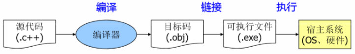
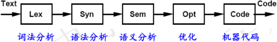
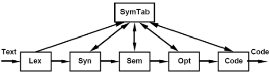
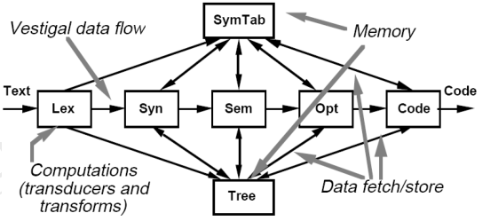
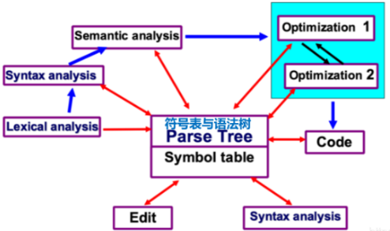
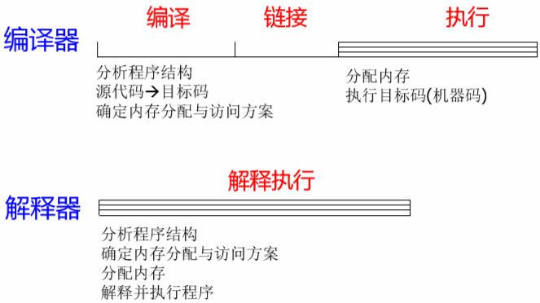
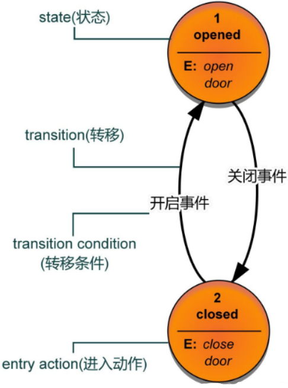
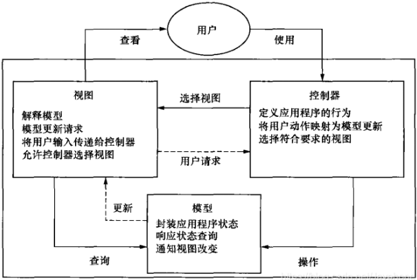
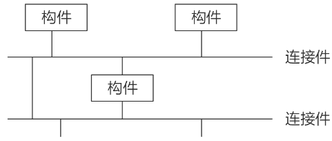
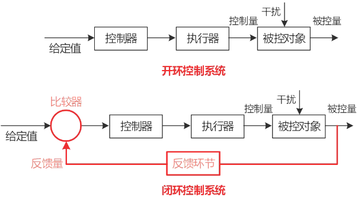

# 编译器与解释器

## 编译器

编译器不会执行输入的源程序代码 而是将其翻译为另种语言 通常是可执行的机器码或目标码 并输 代码 ， 而是将其翻译为另 一 种语言 ， 通常是可执行的机器码或目标码 ， 并输出到文件中以便随后链接为可执行文件并加以执行.

## 编译器的发展

1. 编译器结构_传统：批处理/管道-过滤器

    

2. 编译器结构_符号表

    很多信息在编译过程中可能会被多个阶段的编译程序所使用。例如: 源程序中使用的名字、每个名字的各种属性信息(类型、作用域、分配存储信息等)，将这类信息提取出来, 形成共享的符号表(Symbol Table)。

    

3. 编译器结构_语法树

    随着程序开发语言的发展，源代码中的算法与表示变得越来越复杂，编译过程中的中间结果的表示变得越来越重要，出现了带符号表与语法树(parse tree)的编译器。

    

4. 编译器结构_仓库

    由于随着开发语言的不断发展，编译过程变得越来越困难，所以近些年形成了仓库形式的编译结构：

    

## 编译器与解释器的不同

- 解释器的执行速度要慢于编译器产生的目标代码的执行速度 ， 但是却低 ( 解释器的执行速度要慢于编译器产生的目标代码的执行速度    但是却低于编译器“编译+链接+执行”的总时间
- 解释器通常省略了链接与编译的步骤，从而降低编程时间
- 解释器执行速度之所以慢，是因为 每次解释执行的时候，都需要分析程序的结构，而编译代码则直接执行而无需重复编译
- 解释器对内存的分配是在解释时 才进行的；而编译器则是在编译时进行，因此运行时直接将程序代码装入内存并执行即可

## 状态机

状态机一般指有限状态机（英语：finite-state machine，缩写：FSM）是表示有限个状态以及在这些状态之间的转移和动作等行为的数学计算模型。

状态机中有几个术语：state(状态) 、transition(转移) 、action(动作) 、transition condition(转移条件) 。

- state(状态) ：将一个系统离散化，可以得到很多种状态，当然这些状态是有限的。例如：门禁闸机可以划分为开启状态、关闭状态；电扇可以划分为关、一档、二档、三档等状态。
- transition(转移) ：一个状态接收一个输入执行了某些动作到达了另外一个状态的过程就是一个transition(转移)。定义transition(转移)就是在定义状态机的转移流程。
- transition condition(转移条件) ：也叫做Event(事件)，在某一状态下，只有达到了transition condition(转移条件)，才会按照状态机的转移流程转移到下一状态，并执行相应的动作。
- action(动作)：在状态机的运转过程中会有很多种动作。如：进入动作(entry action)在进入状态时进行、退出动作(exit action)在退出状态时进行、转移动作在进行特定转移时进行。

如下图，就定义了一个只有opened 和closed两种状态的状态机。当系统处于opened状态，在收到输入“关闭事件”，达到了状态机转移条件，系统就转移到了closed状态，并执行相应的动作，此例有一个进入动作(entry action)，进入closed状态，会执行close door动作。

## MVC

惯用模式：

模型-视图-控制器（Model-View-Controller，MVC）是一种常见的体系结构风格。MVC被广泛应用与用户交互程序的设计中。

- 优点：

    - 多个视图与一个模型相对应
    - 具有良好的移植性。
    - 系统被分割为三个独立的部分，当功能发生变化时，改变其中的一个部分就能够满足要求。

- 缺点：

    - 增加了系统设计和运行复杂性。
    - 视图与控制器连接过于紧密，妨碍两者的独立复用。
    - 视图访问模型的效率比较低。

## C2体系结构风格(拓展)

C2(Component and Connector)体系结构风格可以概括为，通过连接件绑定在一起按照一组规则运作的并行构件网络。C2风格中的系统组织规则如下：

1. 系统中的构件和连接件都有一个顶部和一个底部
2. 构件的顶部应连接到某连接件的底部，构件的底部则应连接到某连接件的顶部，而构件与构件之间的直接连接是不允许的
3. 一个连接件可以和任意数目的其他构件和连接件连接
4. 当两个连接件进行直接连接时，必须由其中一个的底部到另一个的顶部

## 闭环控制架构(拓展)

1. 适用于嵌入式系统，能够解决简单的闭环控制问题。
2. 经典应用场景包括空调温控、定速巡航 。

## 参考

- https://blog.csdn.net/weixin_43452424/article/details/104822805
- https://blog.csdn.net/weixin_43452424/article/details/104961036
- https://zhuanlan.zhihu.com/p/543259936

