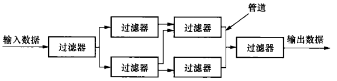
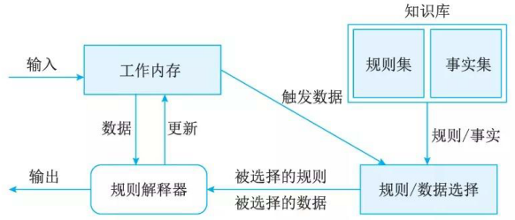

# 软件架构风格
## 最佳实践

### 考察问

1. 软件架构风格概念:`()`,`()`,`()`
    1.`()`: 构件和连接件
    2.`()`: 如何将构件和连接件`组合`
2. 软件架构风格概念
    1. `()`(显式调用): 系统由组件, 递归构成
        1. 四种子类型:
            1.`()`(面相过程): 主程序直接调用子程序
            2.`()`: 构件是对象，通过对象调用封装的方法和属性
            3.`()`: 每层最多影响其`上下两层`
            4.`()`: 数据库服务器, 客户应用程序, 网络
        2. 特点:`()`耦合
        3. 案例:
    2. `()`: 系统由组件顺序构成.
        1. 两种子类型:
            1.`()`:整体传递
            2.`()`:单个传递
        2. 特点:`()`耦合,`()`交互性,`()`拓展性,`()`并行,`()`重用
        3. 案例:`()`编译器
    3. `()`: 构件之间是互相独立, 通过中间件或事件传递消息
        1. 两种子类型
            1.`()`: 进程之间`消息传递`
            2.`()`: `隐式调用`
        2. 特点: 松耦合, 可扩展性
        3. 案例: 语法高亮、语法错误提示
    4. `()`: 数据为中心, 处理单元独立
        1. 两种子类型
            1. `()`:
            2. `()`: 中央数据结构(黑板)来协调多个独立的处理单元(知识源)
        2. 特点:`()`交互性,`()`拓展性,`()`并行
        3. 案例: 语音处理, 图像处理, 知识推理
    5. `()`: 构造运行环境, 解析语言
        1. 两种子类型
            1. `()`: 边分析边执行
            2. `()`: 规则集、规则解释器、规则/数据选择器, 工作内存
        2. 特点:
        3. 案例: JAVA虚拟机, 专家系统
    6. C2: 通过连接件绑定在一起按照一组规则运作的并行构件网络
    7. 过程控制: 发出控制命令并接受反馈，循环往复达到平衡。

### 考察点

1. 软件架构风格概念: `特定领域`, `系统组织`, `惯用模式`
    1. `词汇表`: 构件和连接件
    2. `约束`: 如何将构件和连接件组合
2. 软件架构风格概念
    1. 调用返回(显示调用): 系统由组件, 递归构成
        1. 四种子类型:
            1. `主程序子程序`(面相过程): 主程序直接调用子程序
            2. `面相对象`: 构件是对象，通过对象调用封装的方法和属性
            3. `层次型`: 每层最多影响其`上下两层`
            4. `C/S(B/S)`: 数据库服务器, 客户应用程序, 网络
        2. 特点: `紧`耦合
        3. 案例:
    2. 数据流: 系统由组件顺序构成.
        1. 两种子类型:
            1. `批处理`: 整体传递
            2. `管道过滤器`: 单个传递
        2. 特点: `低`耦合, `低`交互性, `高`拓展性, `可`并行, `可`重用`
        3. 案例: `传统`编译器
    3. 独立构件: 构件之间是互相独立, 通过中间件或事件传递消息
        1. 两种子类型
            1. `进程通信`: 进程之间`消息传递`
            2. `事件驱动`: 基于事件的`隐式调用`，通过事件驱动,
        2. 特点: 松耦合, 可扩展性
        3. 案例: 语法高亮、语法错误提示
    4. 以数据为中心: 数据为中心, 处理单元独立
        1. 两种子类型
            1. `仓库`:
            2. `黑板`: 中央数据结构(黑板)来协调多个独立的处理单元(知识源)
        2. 特点: `好`交互性, `好`拓展性, `不`并行
        3. 案例: 语音处理, 图像处理, 知识推理
    5. 虚拟机: 构造`运行环境`, 解析语言
        1. 两种子类型
            1. `解释器`: 边分析边执行
            2. `规则中心`: 规则集、规则解释器、规则/数据选择器, 工作内存
        2. 特点:
        3. 案例: JAVA虚拟机, 专家系统
    6. C2: 通过连接件绑定在一起按照一组规则运作的并行构件网络
    7. 过程控制: 发出控制命令并接受反馈，循环往复达到平衡。

## 软件架构风格概述

软件架构风格是描述某一`特定应用领域`中`系统组织方式`的`惯用模式`。架构风格定义一个系统家族，即一个架构定义`一个词汇表`和`一组约束`。

1. `词汇表`中包含一些`构件和连接件`类型
2. `约束`指出系统是`如何`将这些构件和连接件`组合`起来的。
🔒题目:

1. 软件架构风格描述某一特定应用领域中系统组织方式的惯用模式。架构风格定义一个系统家族，即一个体系结构定义______。

    - A. 一组构件和一组约束
    - B. 一组模块和一个连接件
    - C. 一个词汇表和一组约束
    - D. 一个系统和一组连接件

    答案: C

## 软件架构风格概述(拓展)

|五大架构风格|子风格|
| ---- | ---- |
|数据流风格(Data Flow)|批处理(Batch Sequential)、管道-过滤器(Pipes and Filters)|
|调用/返回风格(Call/Return)|主程序/子程序(Main Program and Subroutine)、面向对象(Object-oriented)、分层架构(Layered System)|
|独立构件风格(Independent Components)|进程通信(Communicating Processes)、事件驱动系统(隐式调用)(Event system)|
|虚拟机风格(Virtual Machine)|解释器(interpreter)、规则系统(Rule-based System)|
|以数据为中心(Data-centered)|数据库系统(Database System)、黑板系统(Blackboard System)、超文本系统(Hypertext System)|

|架构风格|主要特点|主要优点|主要缺点|适合领域|
| ---- | ---- | ---- | ---- | ---- |
|管道-过滤器|过滤器相对独立|高内聚、低耦合；支持软件复用；可维护性、可扩展性较强；具有并发性、灵活性|不适于交互性强的应用，对于存在关系的数据流必须进行协调|系统可划分清晰的模块；模块相对独立；有清晰的模块接口|
|解释器风格|系统核心是虚拟机|自定义一套规则，开发构件，增加灵活性，能够跨平台|执行效率低，如果语法规则数量太多，会增加系统复杂度，性能较差|适合于模式匹配系统与语言编译器|
|面向对象|构件是对象，对象是通过函数和过程的调用 来交互的|高度模块化；实现封装；代码共享灵活；易维护；性能好|增加了对象之间的依赖关系|多种领域|
|事件系统|构件不直接调用一个过程，而是触发或广播一个或多个事件|支持软件复用；容易实现并发处理和多任务；可扩展性好；具有类层次结构；简化代码|对系统计算的控制能力弱，各个对象的逻辑关系复杂|一个系统对外部的表现可以从它对事件的处理表征出来|
|层次型|构件组成一个层次结构；多层相互协同工作，每一层为上层提供服务，并作为下层的客户，只对与自己相邻的层可见|支持系统设计过程中的逐级抽象；可扩展性好；支持软件复用|不同层次之间耦合度高的系统很难实现，即难以划分层次|适合功能层次的抽象和相互之间低耦合的系统|
|仓库|由中央数据结构(说明当前数据状态)和一组独立构件(对中央数据进行操作)组成|中央数据结构实现了数据的集中，以数据为中心|适合于特定领域|以数据为中心|

## 数据流休系结构风格(Data Flow Style)

数据流体系结构没有概念上的程序计数器：指令的可执行性和执行仅基千指令输入参数的可用性来确定，因此，指令执行的顺序是不可预测的，即行为是不确定的。数据流体系结构风格主要包括批处理风格和管道－过滤器风格。

1. 批处理体系结构风格(Batch Sequential)

    在批处理风格(见图 7-7) 的软件体系结构中，每个处理步骤是一个单独的程序，每一步必须在前一步结束后才能开始，并且数据必须是完整的，以整体的方式传递。它的基本构件是独立的应用程序，连接件是某种类型的媒介。连接件定义了相应的数据流图，表达拓扑结构。

    

2. 管道-过滤器体系结构风格(Pipe-Filter)

    现有的解决方案是把系统分解为几个序贯的处理步骤，这些步骤之间通过数据流连接，一个步骤的输出是另一个步骤的输入。每个处理步骤由一个过滤器 (Filter) 实现，处理步骤之间的数据传输由管道 (Pipe) 负责。每个处理步骤(过滤器)都有一组输入和输出，过滤器从管道中读取输入的数据流，经过内部处理，然后产生输出数据流并写入管道中。因此，管道－过滤器风格(见图 7-8) 的基本构件是过滤器，连接件是数据流传输管道，将一个过滤器的输出传到另一过滤器的输入。

    

## 调用返回休系结构风格(Call-and-Return Styles)

调用／返回风格是指在系统中采用了调用与返回机制。利用调用－返回实际上是一种分而治之的策略，其主要思想是将一个复杂的大系统分解为若干子系统，以便降低复杂度，并且增加可修改性。程序从其执行起点开始执行该构件的代码，程序执行结束，将控制返回给程序调用构件。调用 I 返回体系结构风格主要包括主程序／子程序风格、面向对象风格、层次型风格以及客户端／服务器风格。

### 主程序／子程序风格(Main Program-Subroutine)

主程序／子程序风格一般采用单线程控制，把问题划分为若干处理步骤，构件即为主程序和子程序。子程序通常可合成为模块。过程调用作为交互机制，即充当连接件。调用关系具有层次性，其语义逻辑表现为子程序的正确性取决于它调用的子程序的正确性。

### 面向对象体系结构风格

抽象数据类型概念对软件系统有着重要作用，目前软件界已普遍转向使用面向对象系统。这种风格建立在数据抽象和面向对象的基础上，数据的表示方法和它们的相应操作封装在一个抽象数据类型或对象中。这种风格的构件是对象，或者说是抽象数据类型的实例(见图 7-9) 。

### 层次型体系结构风格

层次系统(见图 7-10) 组成一个层次结构，每一层为上层提供服务，并作为下层的客户。在一些层次系统中，除了一些精心挑选的输出函数外，内部的层接口只对相邻的层可见。这样的系统中构件在层上实现了虚拟机。连接件由通过决定层间如何交互的协议来定义，拓扑约束包括对相邻层间交互的约束。由于每一层最多只影响两层，同时只要给相邻层提供相同的接口，允许每层用不同的方法实现，这同样为软件重用提供了强大的支持。

### 客户端／服务器体系结构风格

两层 C/S 体系结构有 3 个主要组成部分：数据库服务器、客户应用程序和网络。服务器(后台)负责数据管理，客户机(前台)完成与用户的交互任务，称为“胖客户机，瘦服务器”。

三层 C/S 结构(见图 7-12) 增加了一个应用服务器。整个应用逻辑驻留在应用服务器上，只有表示层存在于客户机上，故称为＂瘦客户机”。应用功能分为表示层、功能层和数据层三层。表示层是应用的用户接口部分，通常使用图形用户界面；功能层是应用的主体，实现具体的业务处理逻辑；数据层是数据库管理系统。以上三层逻辑上独立。

## 以数据为中心的休系结构风格

以数据为中心的体系结构风格主要包括仓库体系结构风格和黑板体系结构风格。

### 仓库体系结构风

仓库 (Repository)是存储和维护数据的中心场所。在仓库风格(见图 7-13) 中，有两种不同的构件：中央数据结构说明当前数据的状态以及一组对中央数据进行操作的独立构件，仓库与独立构件间的相互作用在系统中会有大的变化。这种风格的连接件即为仓库与独立构件之间的交互。

### 黑板体系结构风格

黑板体系结构风格(Blackboard Architecture Style) 适用千解决复杂的非结构化的问题，能在求解过程中综合运用多种不同知识源，使得问题的表达、组织和求解变得比较容易。黑板系统是一种问题求解模型，是组织推理步骤、控制状态数据和问题求解之领域知识的概念框架。它将问题的解空间组织成一个或多个应用相关的分级结构。分级结构的每一层信息由一个唯一的词汇来描述，它代表了问题的部分解。领域相关的知识被分成独立的知识模块，它将某一层次中的信息转换成同层或相邻层的信息。各种应用通过不同知识表达方法、推理框架和控制机制的组合来实现。影响黑板系统设计的最大因素是应用问题本身的特性，但是支撑应用程序的黑板体系结构有许多相似的特征和构件。

对千特定应用问题，黑板系统可通过选取各种黑板、知识源和控制模块的构件来设计，也可以利用预先定制的黑板体系结构的编程环境。黑板系统的传统应用是信号处理领域，如语音识别和模式识别。另一应用是松耦合代理数据共享存取。

## 虚拟机休系结构风格(Virtual Machine Architecture Style)

虚拟机体系结构风格的基本思想是人为构建一个运行环境，在这个环境之上，可以解析与运行自定义的一些语言，这样来增加架构的灵活性。虚拟机体系结构风格主要包括解释器风格和规则系统风格。

### 解释器体系结构风格(Interpreter Architecture Style)

一个解释器通常包括完成解释工作的解释引擎，一个包含将被解释的代码的存储区，一个记录解释引擎当前工作状态的数据结构，以及一个记录源代码被解释执行进度的数据结构。解释器通常被用来建立一种虚拟机以弥合程序语义与硬件语义之间的差异。其缺点是执行效率较低。典型的例子是专家系统。

### 规则系统体系结构风格(Rule-Based System Architecture Style)

基于规则的系统(见图 7-16) 包括规则集、规则解释器、规则／数据选择器及工作内存。

## 独立构件休系结构风格(Independent Component Architecture Style)

独立构件风格主要强调系统中的每个构件都是相对独立的个体，它们之间不直接通信，以降低耦合度，提升灵活性。独立构件风格主要包括进程通信和事件系统风格。

### 进程通信体系结构风格(Inter-Process Communication, IPC)

在进程通信结构体系结构风格中，构件是独立的过程，连接件是消息传递。这种风格的特点是构件通常是命名过程，消息传递的方式可以是点到点、异步或同步方式及远程过程调用等。

### 事件系统体系结构风格(Event-Driven Architecture, EDA) 

事件系统风格(见图 7-17) 基于事件的隐式调用风格的思想是构件不直接调用一个过程，而是触发或广播一个或多个事件。系统中的其他构件中的过程在一个或多个事件中注册，当一个事件被触发，系统自动调用在这个事件中注册的所有过程，这样，一个事件的触发就导致了另一模块中的过程的调用。

支持基于事件的隐式调用的应用系统很多。例如，在编程环境中用于集成各种工具，在数据库管理系统中确保数据的一致性约束，在用户界面系统中管理数据，以及在编辑器中支持语法检查。例如在某系统中，编辑器和变量监视器可以登记相应 Debugger 的断点事件。当Debugger 在断点处停下时，它声明该事件，由系统自动调用处理程序，如编辑器可以卷屏(返回)到断点，变量监视器刷新变量数值。而 Debugger 本身只声明事件，并不关心哪些过程会启动，也不关心这些过程做什么处理。

## C2体系结构风格(拓展)

C2(Component and Connector)体系结构风格可以概括为，通过连接件绑定在一起按照一组规则运作的并行构件网络。C2风格中的系统组织规则如下：

1. 系统中的构件和连接件都有一个顶部和一个底部
2. 构件的顶部应连接到某连接件的底部，构件的底部则应连接到某连接件的顶部，而构件与构件之间的直接连接是不允许的
3. 一个连接件可以和任意数目的其他构件和连接件连接
4. 当两个连接件进行直接连接时，必须由其中一个的底部到另一个的顶部

## 闭环控制架构(拓展)

1. 适用于嵌入式系统，能够解决简单的闭环控制问题。
2. 经典应用场景包括空调温控、定速巡航 。

## 🔒题目

1. Java程序可以做到“一次编写，到处运行”，从架构风格上看符合(  )风格的特点。虚拟机风格

2. 在网络通信中，进行包的解析，一般先进行包头的分离，然后进行报文解析及后续处理，根据这一特点，选用( )风格最合适。数据流

3. 某公司欲开发一个基于图形用户界面的集成调试器。该调试器的编辑器和变量监视器可以设置调试断点。当调试器在断点处暂停运行时，编辑程序可以自动卷屏到断点，变量监视器刷新变量数值。针对这样的功能描述，采用(  )的架构风格最为合适。事件驱动

4. 某游戏公司欲开发一个大型多人即时战略游戏，游戏设计的目标之一是能够支持玩家自行创建战役地图，定义游戏对象的行为和之间的关系。针对该目标，公司应该采用(  )架构风格最为合适。解释器

5. 某公司承接了一个开发家用空调自动调温器的任务，调温器测量外部空气温度，根据设定的期望温度控制空调的开关。根据该需求，公司应采用(  )架构风格最为合适。过程控制

6. 某公司欲开发一个语音识别系统，语音识别的主要过程包括分割原始语音信号、识别音素、产生候选词、判定语法片断、提供语义解释等。每个过程都需要进行基于先验知识的条件判断并进行相应的识别动作。针对该系统的特点，采用(  )架构风格最为合适。 黑板

7. 某公司欲开发一个漫步者机器人，用来完成火星探测任务。机器人的控制器首先定义探测任务和任务之间的时序依赖性，机器人接受任务后，需要根据自身状态和外界环境进行动态调整，最终自动完成任务。针对这些需求，该机器人应该采用( )架构风格最为合适。 解释器

8. Windows操作系统在图形用户界面处理方面采用的核心架构风格是(  )风格。事件驱动

9. “编译器”是一种非常重要的基础软件，其核心功能是对源代码形态的单个或一组源程序依次进行预处理、词法分析、语法分析、语义分析、代码生成、代码优化等处理，最终生成目标机器的可执行代码。考虑以下与编译器相关的软件架构设计场景：

    传统的编译器设计中，上述处理过程都以独立功能模块的形式存在，程序源代码作为一个整体，依次在不同模块中进行传递，最终完成编译过程。针对这种设计思路，传统的编译器采用( )架构风格比较合适。

    随着编译、链接、调试、执行等开发过程的一体化趋势发展，集成开发环境(IDE)随之出现。IDE集成了编译器、连接器、调试器等多种工具，支持代码的增量修改与处理，能够实现不同工具之间的信息交互，覆盖整个软件开发生命周期。针对这种需求，IDE采用( )架构风格比较合适。IDE强调交互式编程，用户在修改程序代码后，会同时触发语法高亮显示、语法错误提示、程序结构更新等多种功能的调用与结果呈现，针对这种需求，通常采用( )架构风格比较合适。

    某公司已经开发了一款针对某种嵌入式操作系统专用编程语言的IDE，随着一种新的嵌入式操作系统上市并迅速占领市场，公司决定对IDE进行适应性改造，支持采用现有编程语言进行编程，生成符合新操作系统要求的运行代码，并能够在现有操作系统上模拟出新操作系统的运行环境，以支持代码调试工作。针对上述要求，为了使IDE能够生成符合新操作系统要求的运行代码，采用基于( )的架构设计策略比较合适；为了模拟新操作系统的运行环境，通常采用( )架构风格比较合适。

    - (1) A. 管道-过滤器  
    - B. 顺序批处理
    - C. 过程控制  
    - D. 独立进程  
    - (2) A. 规则引擎  
    - B. 解释器  
    - C. 数据共享  
    - D. 独立构件  
    - (3) A. 隐式调用  
    - B. 显式调用  
    - C. 主程序-子程序  
    - D. 层次结构  
    - (4) A. 代理  
    - B. 适配  
    - C. 包装  
    - D. 模拟  
    - (5) A. 隐式调用  
    - B. 仓库结构  
    - C. 基于规则  
    - D. 虚拟机

    答案: 1B, 2C, 3A, 4B, 5D

10. 软件体系结构风格是描述某一特定应用领域中系统组织方式的惯用模式。其中，在批处理风格软件体系结构中，每个处理步骤是一个单独的程序，每一步必须在前一步结束后才能开始，并且数据必须是完整的，以______的方式传递，基于规则的系统包括规则集、规则解释器、规则/数据选择器及______。

    - A. 迭代
    - B. 整体
    - C. 统一格式
    - D. 递增

    - A. 解释引擎
    - B. 虚拟机
    - C. 数据
    - D. 工作内存

    答案: B D

11. 软件架构风格是描述某一特定应用领域中系统组织方式的惯用模式，按照软件架构风格，物联网系统属于 (  ) 软件架构风格。

    - A. 层次型
    - B. 事件系统
    - C. 数据线
    - D. C2

    - 答案：A 

12. 某软件公司为新推出的字处理软件设计了一种脚本语言，用于开发该软件的附加功能插件。为提高该语言编程效率，软件工具开发部门要为其研制一套集成开发环境。

    经对字处理软件特点分析，得出集成开发环境的3项核心需求：

    1. 需支持脚本语言的编辑、语法检查、解释、执行和调试等功能，且能灵活组合、配置与替换这些功能。

    2. 要提供一组可视化编程界面，让用户通过拖拽界面元素和填充代码完成功能插件核心业务流程编写与组织。

    3. 在代码调试方面，要在脚本语言编辑界面实现代码自动定位，即响应调试断点命中事件，自动跳转到对应代码处。

    针对这些需求，王工认为应采用管道-过滤器架构风格，李工认为应采用以数据存储为中心的架构风格。公司组织专家评审后，最终采用了李工的方案。

    4. (问题1)请用200字以内的文字解释什么是软件架构风格，并从集成开发环境与用户的交互方式、集成开发环境的扩展性、集成开发环境的数据管理三个方面说明为什么最终采用了李工的设计方案。

        软件架构风格是指描述特定软件系统组织方式的惯用模式。组织方式描述了系统的组成构件和这些构件的组织方式，惯用模式则反映众多系统共有的结构和语义。

        从集成开发环境与用户的交互方式来看，用户通常采用交互式的方式对脚本语言进行编辑、解释执行与调试，以数据存储为中心的架构风格能很好地支持交互式数据处理，而管道-过滤器架构风格对其支持有限。

        从集成开发环境的扩展性来看，系统核心需求要求实现多种功能的灵活组织、配置与替换。以数据存储为中心的架构风格，可通过数据格式解耦各功能间的依赖关系，还能灵活定义功能间的逻辑顺序；管道-过滤器架构风格在解耦数据处理过程依赖关系上类似，但在灵活定义数据处理逻辑关系方面较差。

        从集成开发环境的数据管理来看，其需要支持多种数据类型和数据格式转换。以数据存储为中心的架构将数据存储在统一的中心存储器中，能表示多种数据格式并提供转换支持；管道-过滤器架构风格通常只能支持有限的数据格式，在数据格式转换上灵活性欠佳 。

        ✨根据题干内容答即可

    5. (问题2)在对软件系统架构进行设计时，要对架构需求进行分析，针对特定需求选择最为合适的架构风格，因此实际的软件系统通常会混合多种软件架构风格。请对核心需求进行分析，说明为了满足需求(2)和(3)，分别应采用何种架构风格，并概要说明采用相应架构风格后的架构设计过程。

        为了满足需求(2)，应该采用解释器架构风格。具体来说，需要：

        1. 为可视化编程元素及其拖拽关系定义某种语言，并描述其语法与语义；
        2. 编写解释器对该语言进行解释；
        3. 生成对应的脚本语言程序。

        为了满足需求(3)，应该采用隐式调用架构风格。具体来说：

        首先需要定义“断点在调试过程中命中”这一事件，并实现当断点命中后的屏幕定位函数。集成开发环境维护一个事件注册表结构，将该事件与屏幕定位函数关联起来形成注册表中的一个记录项。在调试过程中，集成开发环境负责监听各种事件，当“断点在调试过程中命中”这一事件发生时，集成开发环境查找事件注册表，找到并调用屏幕定位函数，从而实现脚本语言编辑界面与调试代码的自动定位。

13. 某电子商务公司拟升级其会员与促销管理系统，向用户提供个性化服务，提高用户的粘性。在项目立项之初，公司领导层一致认为本次升级的主要目标是提升会员管理方式的灵活性，由于当前用户规模不大，业务也相对简单，系统性能方面不做过多考虑，新系统除了保持现有的四级固定会员制度外，还需要根据用户的消费金额、偏好、重复性等相关特征动态调整商品的折扣力度，并支持在特定的活动周期内主动筛选与活动主题高度相关的用户集合，提供个性化的打折促销活动。

    1. (13分)针对该系统的功能，李工建议采用面向对象的架构风格，将折扣力度计算和用户筛选分别封装为独立对象，通过对象调用实现对应的功能；王工则建议采用解释器(interpreters)架构风格，将折扣力度计算和用户筛选条件封装为独立的规则，通过解释规则实现对应的功能。请针对系统的主要功能，从折扣规则的可能改性、个性化折扣定义灵活性和系统性能三个方面对这两种架构风格进行比较与分析，并指出该系统更适合采用哪种架构风格。(2022下)

    应该选择解释器架构风格。

    - 折扣规则的可修改性：解释器风格比面向对象方式实现强。因为解释器风格折扣规则是独立的语法规则，由解释器可以对变化的规则进行解析，修改更容易。而面向对象相对固定，有变化时需要修改具体的类。

    - 个性化折扣定义灵活性：解释器强于面向对象，解释器可以根据用户灵活解释执行规则，做到千人千面。

    - 系统性能：面向对象优于解释器。面向对象的实现相对固定，而解释器是运行期动态绑定执行。
    (面向对象风格：效率高，质量高，易维护，灵活性稍差，性能好；解释器风格：可修改性高，个性化和灵活性强，性能较差。)

    由于本项目的目标是提升灵活性，并且业务简单，系统性能方面不做过多考虑，因此建议采用解释器风格。

14. 某公司拟开发一套机器学习应用开发平台，支持用户使用浏览器在线进行基于机器学习的智能应用开发活动。该平台的核心应用场景是用户通过拖拽算法组件灵活定义机器学习流程，采用自助方式进行智能应用设计、实现与部署，并可以开发新算法组件加入平台中。

    1. (16分)针对该系统的功能，赵工建议采用解释器(interpreter)架构风格，李工建议采用管道-过滤器(pipe - and - filter)的架构风格，王工则建议采用隐式调用(implicit invocation)架构风格。请针对平台的核心应用场景，从机器学习流程定义的灵活性和学习算法的可扩展性两个方面对三种架构风格进行对比与分析，并指出该平台更适合采用哪种架构风格。 (2021下)

        应该选择解释器架构风格。

        - 灵活性：解释器可以通过灵活的自定义规则实现规则的重组。
        - 可扩展性：解释器可以包括一个完成解释工作的解释引擎、一个包含将被解释的代码的存储区、一个记录解释引擎当前工作状态的数据结构，以及一个记录源代码被解释执行的进度的数据结构。可以通过新建规则实现可扩展性。

        管道 - 过滤器风格具备高内聚低耦合、支持软件重用、扩展性好、支持并发等优点，但它有编写复杂、不适合处理交互应用等缺点。

        隐式调用基于事件触发思想，具备支持软件重用、改进系统方便等优点，但它有构件放弃了对系统计算的控制、事件传递中的数据交换存在问题、语义依赖于被触发事件的上下文约束等缺点。

        解释器通常包括解释引擎、代码存储区、记录解释引擎当前工作状态的数据结构、记录源代码被解释执行进度的数据结构。它含有一个虚拟机，可以仿真硬件的执行过程和一些关键应用，其缺点是执行效率比较低。优点：语法由很多类(每个规则对应一个类)表示，容易改变及扩展；缺点：如果语法规则数量太多，会增加系统复杂度，性能下降。

        本题中，由于需要交互操作，显然管道 - 过滤器风格不合适；基于事件触发的隐式调用风格也不合适；只有解释器风格通过灵活自定义规则，具备较强的灵活性和可扩展性，适合本题中的机器学习应用场景。

15. 某公司拟开发一套在线软件开发系统，支持用户通过浏览器在线进行软件开发活动。该系统的主要功能包括代码编辑、语法高亮显示、代码编译、系统调试、代码仓库管理等。

    1. (13分)针对该系统的功能，李工建议采用管道 - 过滤器(pipe and filter)的架构风格，而王工则建议采用仓库(repository)架构风格。请指出该系统更适合采用哪种架构风格，并针对系统的主要功能，从数据处理方式、系统的可扩展性和处理性能三个方面对这两种架构风格进行比较与分析，填写表1 - 1中的(1)～(4)空白处。 (2020下)

        |架构风格名称|数据处理方式|系统可扩展性|处理性能|
        | ---- | ---- | ---- | ---- |
        |管道 - 过滤器|数据驱动机制，处理流程事先确定，交互性差|(2)|劣势：需要数据格式转换，性能降低 优势：支持过滤器并发调用，性能提高|
        | 仓库 | (1) | 数据与处理解耦合，可动态添加和删除处理组件 | 劣势：(3) 优势：(4)|

        根据该系统的功能需求，采用仓库架构风格更合适。
        1. 数据统一保存在中央数据仓库，数据处理流程相对独立，支持交互式处理。
        2. 管道过滤器风格容易添加新的过滤器，可扩展性好。
        3. 仓库风格不支持并行，效率低。
        4. 仓库风格容错性和健壮性好。

        答案解析：管道过滤器架构风格由一系列处理单元(过滤器)组成，每个单元的输出是下一个单元的输入。过滤器负责处理数据，管道负责数据传输。如Linux/Unix中的shell、传统的编译器就是管道过滤器风格。
        优点：
        ①高内聚，过滤器是执行特定功能的处理服务，具有较强的内聚性；
        ②低耦合，过滤器之间仅通过管道通信；
        ③可重用，支持过滤器的重用；
        ④能简单地实现并发或顺序系统；
        ⑤可扩展性，容易添加新的过滤器；
        ⑥灵活性，过滤器功能可重新定义，管道路线可改变。
        缺点：
        ①管道中数据传输需要通用的标准；
        ②难以支持基于事件的交互。

        仓库风格是一种数据共享风格，主要有两类，一是传统的数据库，另一是黑板。数据库系统是由输入流中的事件来驱动信息处理，把执行结构存储到中央数据单元。黑板则由中央数据单元的当前状态来驱动系统运行，用来解决状态冲突并处理可能存在的不确定性知识源。黑板常用信号处理，如语音识别、模式识别、机器翻译、句法分析等。
        优点：
        ①便于多客户共享大量数据，不必关心数据的产生、有谁提供、如何提供等；
        ②便于将构件作为知识源添加到系统中来；
        ③解决问题的多方法性；
        ④具有可修改性和可维护性；
        ⑤有可重用的知识源；
        ⑥支持容错性和健壮性。
        缺点：
        ①对共享数据结构，不同知识源要达成一致；
        ②需要同步机制、加锁机制来保障数据的完整性和一致性，增大了系统设计的复杂度；
        ③测试困难；
        ④缺少对并行机的支持，效率低；
        ⑤开发成本高。

        题干的系统功能包括代码编辑、语法高亮显示、代码编译、系统调试、代码仓库管理等。这些功能相对独立，代码通过中央数据单元存储，各个功能彼此之间不依赖，采用仓库风格更合适。

