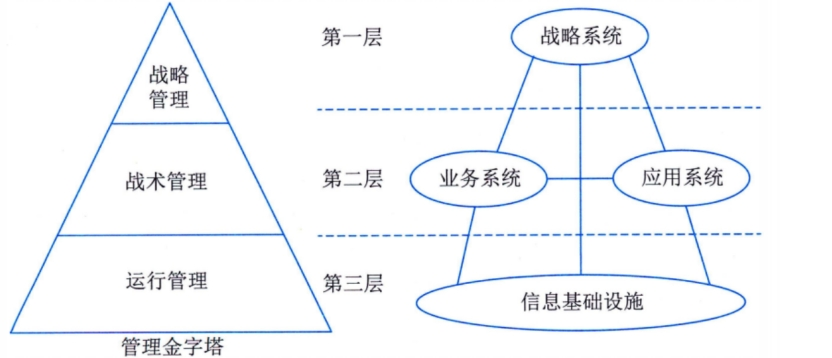

# 信息系统架构设计

## 信息系统架构基本概念

信息系统架构(ISA)是指对某一特定内容里的信息进行统筹、规划、设计、安排等一系列有机处理的活动。

为了更好地理解信息系统架构的定义，特作如下说明：

1. 架构是对系统的抽象，它通过描述元素、元素的外部可见属性及元素之间的关系来反映这种抽象。因此，仅与内部具体实现有关的细节是不属于架构的，即定义强调元素的“外部可见”属性。
2. 架构由多个结构组成，结构是从功能角度来描述元素之间的关系的，具体的结构传达了架构某方面的信息，但是个别结构一般不能代表大型信息系统架构。 
3. 任何软件都存在架构，但不一定有对该架构的具体表述文档。即架构可以独立于架构的描述而存在。如文档已过时，则该文档不能反映架构。 
4. 元素及其行为的集合构成架构的内容。体现系统由哪些元素组成，这些元素各有哪些功能(外部可见)，以及这些元素间如何连接与互动。即在两个方面进行抽象：在静态方面，关注系统的大粒度(宏观)总体结构(如分层)；在动态方面，关注系统内关键行为的共同特征。 
5. 架构具有“基础”性：它通常涉及解决各类关键重复问题的通用方案(复用性)，以及系统设计中影响深远(架构敏感)的各项重要决策(一旦贯彻，更改的代价昂贵)。
6. 架构隐含有“决策”，即架构是由架构设计师根据关键的功能和非功能性需求(质量属性及项目相关的约束)进行设计与决策的结果。 

## 信息系统架构

### 架构风格

软件架构风格是描述某一特定应用领域中系统组织方式的惯用模式。架构风格定义一个系统家族，即一个架构定义、一个词汇表和一组约束。词汇表中包含一些构件和连接件类型，而这组约束指出系统是如何将这些构件和连接件组合起来的。

### 信息系统架构分类

信息系统架构可分为`物理`结构与`逻辑`结构两种，物理结构是指不考虑系统各部分的实际工作与功能结构，只抽象地考查其硬件系统的空间分布情况。逻辑结构是指信息系统各种功能子系统的综合体。

物理结构一般分为集中式与分布式两大类。

在信息系统开发中，强调各子系统之间的协调一致性和整体性。要达到这个目的，就必须在构造信息系统时注意对各种子系统进行统一规划，并对各子系统进行综合。

1. 横向综合：将同一管理层次的各种职能综合在一起，例如，将运行控制层的人事和工资子系统综合在一起，使基层业务处理一体化。
2. 纵向综合：把某种职能的各个管理层次的业务组织在一起，这种综合沟通了上下级之间的联系，如工厂的会计系统和公司的会计系统综合在一起，它们都有共同之处，能形成一体化的处理过程。 
3. 纵横综合：主要是从信息模型和处理模型两个方面来进行综合，做到信息集中共享，程序尽量模块化，注意提取通用部分，建立系统公用数据库和统一的信息处理系统。 

### 信息系统架构的一般原理

信息系统架构指的是在全面考虑企业的战略、业务、组织、管理和技术的基础上，着重研究企业信息系统的组成成分及成分之间的关系，建立起多维度分层次的、集成的开放式体系结构，并为企业提供具有一定柔性的信息系统及灵活有效的实现方法。

### 信息系统常用4种架构模型 

1. 单机应用模式（Standalone）：是最简单的软件结构，是指运行在一台物理机器上的独立应用程序。单机系统本身也可以很复杂。
2. 客户机/服务器（Client/Server）模式：即两层、三层C/S、B/S模式、MVC模式等。 
3. 面向服务架构（SOA）模式。 
4. 企业数据交换总线：不同的企业应用之间进行信息交换的公共通道。 

### 企业信息系统的总体框架

要在企业中建立一个有效集成的ISA，必须考虑企业中的四个方面：战略系统、业务系统、应用系统和信息基础设施。 

1. 战略系统

    战略系统是指企业中与战略制定、高层决策有关的管理活动和计算机辅助系统。

    在ISA中战略系统由两个部分组成，其一是为以计算机为基础的高层决策支持系统，其二是企业的战略规划体系。

    在ISA中设立战略系统有两重含义：一是它表示信息系统对企业高层管理者的决策支持能力；二是它表示企业战略规划对信息系统建设的影响和要求。

2. 业务系统

    业务系统是指企业中完成一定业务功能的各部分(物质、能量、信息和人)组成的系统。

    作用：对企业现有业务系统、业务过程和业务活动进行建模，并在企业战略的指导下，采用业务流程重组(BPR)的原理和方法进行业务过程优化重组。

3. 应用系统

    应用系统即应用软件系统，指信息系统中的应用软件部分。如TPS、MIS、DSS等。

    包含两个基本组成部分：内部功能实现部分和外部界面部分。

4. 企业信息基础设施

    企业信息基础设施(EII)是指根据企业当前业务和可预见的发展趋势，及对信息采集、处理、存储和流通的要求，构筑由信息设备、通信网络、数据库、系统软件和支持性软件等组成的环境。这里可以将企业信息基础设施分成三部分：技术基础设施、信息资源设施和管理基础设施。

    - 技术基础设施由计算机、网络、系统软件、支持性软件、数据交换协议等组成；
    - 信息资源设施由数据与信息本身、数据交换的形式与标准、信息处理方法等组成；
    - 管理基础设施指企业中信息系统部门的组织结构、信息资源设施管理人员的分工、企业信息基础设施的管理方法与规章制度等。 

## 信息系统架构设计方法

### ADM架构开发方法

1. TOGAF概述

    TOGAF是一种开放式企业架构框架标准，它为标准、方法论和企业架构专业人员之间的沟通提供一致性保障。

    该框架旨在通过以下四个目标帮助企业组织和解决所有关键业务需求：确保从关键利益相关方到团队成员的所有用户都使用相同的语言、避免被“锁定”到企业架构的专有解决方案、节省时间和金钱更有效地利用资源、实现可观的投资回报。

    TOGAF框架核心思想：模块化架构、内容框架、扩展指南、架构风格。

    TOGAF的关键是架构开发方法（Architecture Development Method：ADM），为开发企业架构所需要执行各个步骤以及它们之间的关系进行详细的定义。

2. ADM架构开发方法

    ADM方法是由一组按照架构领域的架构开发顺序而排列成一个环的多个阶段所构成。

    将ADM全生命周期十个阶段主要活动： 

    1. 准备阶段：为实施成功的企业架构项目做好准备，包括定义组织机构、特定的架构框架 、架构原则和工具
    2. 需求管理：完成需求的识别、保管和交付，相关联的ADM阶段则按优先级顺序对需求进行处理。TOGAF项目的每个阶段，都是建立在业务需求之上并且需要对需求进行确认
    3. 阶段A：架构愿景：设置TOGAF项目的范围、约束和期望。创建架构愿景，包括定义利益相关者；确认业务上下文环境；创建架构工作说明书；取得上级批准
    4. 阶段B：业务架构、阶段C：信息系统架构（应用&数据）、阶段D：技术架构：从业务、信息系统和技术三个层面进行架构开发，在每一个层面分别完成开发基线架构描述；开发目标架构描述；执行差距分析
    5. 阶段E：机会和解决方案：进行初步实施规划，并确认在前面阶段中确定的各种构建块的交付物形式；确定主要实施项目；对项目分组并纳入过渡架构；决定途径（制造/购买/重用、外包、商用、开源）；评估优先顺序；识别相依性
    6. 阶段F：迁移规划：对阶段E确定的项目进行绩效分析和风险评估，制订一个详细的实施和迁移计划
    7. 阶段G：实施治理：定义实施项目的架构限制；提供实施项目的架构监督；发布实施项目的架构合同；监测实施项目以确保符合架构要求
    8. 阶段H：架构变更管理：提供持续监测和变更管理的流程，以确保架构可以响应企业的需求并且将架构对于业务的价值最大化 

### 信息化总体架构方法

1. 信息化的一般概念

    信息化是指培育、发展以智能化工具为代表的新的生产力并使之造福于社会的历史过程。

    实现信息化就要构筑和完善6个要素（开发利用信息资源，建设国家信息网络，推进信息技术应用，发展信息技术和产业，培育信息化人才，制定和完善信息化政策）的国家信息化体系。

    完整的信息化内涵包括四方面内容：信息网络体系、信息产业基础、社会运行环境、效用积累过程。

    信息化建设指品牌利用现代信息技术来支撑品牌管理的手段和过程。信息化建设包括了企业规模，企业在电话通信、网站、电子商务方面的投入情况，在客户资源管理、质量管理体系方面的建设成就等。

    信息化主要体现以下6种特征：易用性；健壮性；平台化、灵活性、扩展性；安全性；门户化、整合性；移动性。 

2. 信息化工程建设方法

    信息化架构一般有两种模式，一种是数据导向架构，一种是流程导向架构。对于数据导向架构，重点是在数据中心，BI商业智能等建设中使用较多，关注数据模型和数据质量；对于流程导向架构，SOA本身就是关键方法和技术，关注端到端流程整合，以及架构对流程变化的适应度。两种架构并没有严格的边界，而是相互配合和补充。

    数据导向架构研究的是数据对象和数据对象之间的关系，这是首要的内容。在这个完成后仍然要开始考虑数据的产生、变更、废弃等数据生命周期，这些自然涉及的数据管理的相关流程。

    流程导向架构关注的是流程，架构本身的目的是为了端到端流程整合服务。因此研究切入点会是价值链分析，流程分析和分解，业务组件划分。

    信息系统的生命周期可以分为系统规划、系统分析、系统设计、系统实施、系统运行和维护等五个阶段。

    1. 系统规划阶段：任务是对组织的环境、目标及现行系统的状况进行初步调查，根据组织目标和发展战略确定信息系统的发展战略，对建设新系统的需求做出分析和预测，同时考虑建设新系统所受的各种约束，研究建设新系统的必要性和可能性。根据需要与可能，给出制建系统的备选方案。

    输出：可行性研究报告、系统设计任务书。

    2. 系统分析阶段：任务是根据系统设计任务书所确定的范围，对现行系统进行详细调查，描述现行系统的业务流程，指出现行系统的局限性和不足之处，确定新系统的基本目标和逻辑功能要求，即提出新系统的逻辑模型。系统分析阶段又称为逻辑设计阶段。这个阶段是整个系统建设的关键阶段，也是信息系统建设与一般工程项目的重要区别所在。

    输出：系统说明书。 

    3. 系统设计阶段：系统分析阶段的任务是回答系统“做什么”的问题，而系统设计阶段要回答的问题是“怎么做”。该阶段的任务是根据系统说明书中规定的功能要求，具体设计实现逻辑模型的技术方案，也就是设计新系统的物理模型。这个阶段又称为物理设计阶段，可分为总体设计(概要设计)和详细设计两个子阶段。

    输出：系统设计说明书(概要设计、详细设计说明书)。

    4. 系统实施阶段：是将设计的系统付诸实施的阶段。这一阶段的任务包括计算机等设备的购置、安装和调试、程序的编写和调试、人员培训、数据文件转换、系统调试与转换等。这个阶段的特点是几个互相联系、互相制约的任务同时展开，必须精心安排、合理组织。系统实施是按实施计划分阶段完成的，每个阶段应写出实施进展报告。系统测试之后写出系统测试分析报告。

    输出：实施进展报告、系统测试分析报告。

    5. 系统运行和维护阶段：系统投入运行后，需要经常进行维护和评价，记录系统运行的情况，根据一定的规则对系统进行必要的修改，评价系统的工作质量和经济效益。 

