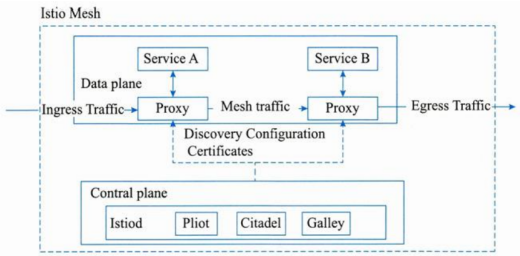

# 云原生架构设计

## 最佳实践

### 考察问

1. 🔴🟨❤️定义: 将云应用中的`()`业务代码部分进行最大化的剥离，从而让`()`(IaaS和PaaS)接管应用中原有的大量`()`(如弹性、韧性、安全、可观测性、灰度等). 
2. 🔴🟨❤️组成: 
    1. `()`模式：每个接口可以部署不同数量的实例，单独扩缩容，从而使得整体的部署更经济。
    2. `()`模式: 但并非真的没有服务器，而是将服务器的运维管理等工作交给云厂商。
    3. `()`: 一个大操作由多个分布在不同服务器、属于不同应用的小操作组成，需保证这些小操作要么全部成功，要么全部失败 ，以此保障数据库的数据一致性和原子性。比如比如用户信息和订单信息分别存于两个 MySQL 实例，删除用户信息时需同时删其订单信息，因操作涉及不同数据库实例，会产生分布式事务。

### 考察点

1. 定义: 将云应用中的`非功能`业务代码部分进行最大化的剥离，从而让`云设施`(IaaS和PaaS)接管应用中原有的大量`非功能`业务特性(如弹性、韧性、安全、可观测性、灰度等). 
2. 组成:  
    1. `微服务`模式：每个接口可以部署不同数量的实例，单独扩缩容，从而使得整体的部署更经济。
    2. `无服务`模式:但并非真的没有服务器，而是将服务器的运维管理等工作交给云厂商。
    3. `分布式事务`: 一个大操作由多个分布在不同服务器、属于不同应用的小操作组成，需保证这些小操作要么全部成功，要么全部失败 ，以此保障数据库的数据一致性和原子性。比如比如用户信息和订单信息分别存于两个 MySQL 实例，删除用户信息时需同时删其订单信息，因操作涉及不同数据库实例，会产生分布式事务。

## 云原生架构产生背景

云原生（Cloud Native），Cloud指软件都是在云端而非传统数据中心。Native代表应用软件一开始就是基于云环境、专门为云端特性设计，可充分利用和发挥云平台的优势（如弹性+分布式）。

发展历程：瀑布式流程--->敏捷开发--->DevOps。

敏捷开发只是解决了软件开发的效率和版本更新的速度，还没有和运维打通。出于协调开发和运维的“信息对称”问题，开发者又推出了一套新的方法——DevOps，DevOps可以看作是开发、技术运营和质量保障三者的交集，促进之间的沟通、协作与整合，从而提高开发周期和效率。而云原生的容器、微服务等技术正是为DevOps提供了很好的前提条件，保证IT软件开发实现DevOps开发和持续交付的关键应用。

## 云原生架构内涵

### 云原生架构定义

云原生架构是基于云原生技术的一组架构原则和设计模式的集合，旨在将云应用中的非业务代码部分进行最大化的剥离，从而让云设施接管应用中原有的大量非功能特性(如弹性、韧性、安全、可观测性、灰度等)，使业务不再有非功能性业务中断困扰的同时，具备轻量、敏捷、高度自动化的特点。 

云原生的代码通常包括三部分：业务代码、三方软件、处理非功能性特性的代码。从业务代码中剥离大量非功能性特性(不会是所有，比如易用性还不能剥离)到IaaS和PaaS中，从而减少业务代码开发人员的技术关注范围，通过云厂商的专业性提升应用的非功能性能力。

具备云原生架构的应用可以最大程度利用云服务和提升软件交付能力，进一步加快软件开发。其特点包括：代码结构发生巨大变化、非功能性特性大量委托、高度自动化的软件交付。

### 云原生架构原则

1. 服务化原则：拆分为微服务架构、小服务架构，分别迭代。
2. 弹性原则：系统的部署规模可以随着业务量的变化而自动伸缩，无须根据事先的容量规划准备固定的硬件和软件资源。 
3. 可观测原则：通过日志、链路跟踪和度量等手段，使得一次点击背后的多次服务调用的耗时、返回值和参数都清晰可见。
4. 韧性原则：当软件所依赖的软硬件组件出现各种异常时，软件表现出来的抵御能力。
5. 所有过程自动化原则：一方面标准化企业内部的软件交付过程，另一方面在标准化的基础上进行自动化，通过配置数据自描述和面向终态的交付过程，让自动化工具理解交付目标和环境差异，实现整个软件交付和运维的自动化。
6. 零信任原则：默认情况下不应该信任网络内部和外部的任何人 / 设备 / 系统，需要基于认证和授权重构访问控制的信任基础，以身份为中心。
7. 架构持续演进原则：云原生架构本身也必须是一个具备持续演进能力的架构。 

### 主要架构模式

1. 服务化架构模式：典型模式是微服务和小服务模式。通过服务化架构，把代码模块关系和部署关系进行分离，每个接口可以部署不同数量的实例，单独扩缩容，从而使得整体的部署更经济。
2. Mesh化架构模式：把中间件框架(如RPC、缓存、异步消息等)从业务进程中分离，让中间件SDK与业务代码进一步解耦，从而使得中间件升级对业务进程没有影响，甚至迁移到另外一个平台的中间件也对业务透明。分离后在业务进程中只保留很“薄”的Client部分，Client通常很少变化，只负责与Mesh进程通信，原来需要在SDK中处理的流量控制、安全等逻辑由Mesh进程完成。
3. Serverless模式：将“部署”这个动作从运维中“收走”，使开发者不用关心应用运行地点、操作系统、网络配置、CPU性能等，从架构抽象上看，当业务流量到来/业务事件发生时，云会启动或调度一个已启动的业务进程进行处理，处理完成后云自动会关闭/调度业务进程，等待下一次触发，也就是把应用的整个运行都委托给云。
4. 存储计算分离模式：在云环境中，推荐把各类暂态数据(如session)、结构化和非结构化持久数据都采用云服务来保存，从而实现存储计算分离。
5. 分布式事务模式：大颗粒度的业务需要访问多个微服务，必然带来分布式事务问题，否则数据就会出现不一致。架构师需要根据不同的场景选择合适的分布式事务模式。 
6. 可观测架构：可观测架构包括Logging、Tracing、Metrics三个方面，其中Logging提供多个级别的详细信息跟踪，由应用开发者主动提供；Tracing提供一个请求从前端到后端的完整调用链路跟踪，对于分布式场景尤其有用；Metrics则提供对系统量化的多维度度量。 
7. 事件驱动架构：本质上是一种应用/组件间的集成架构模式。可用于服务解耦、增强服务韧性、数据变化通知等场景中。

典型的云原生架构反模式：庞大的单体应用、单体应用“硬拆”为微服务、缺乏自动化能力的微服务。 

## 云原生架构相关技术

### 容器技术

1. 容器技术的背景与价值

    容器作为标准化软件单元，它将应用及其所有依赖项打包，使应用不再受环境限制，在不同计算环境间快速、可靠地运行。

    通过容器技术，企业可以充分发挥云计算弹性优势，降低运维成本。一般而言，借助容器技术，企业可以通过部署密度提升和弹性降低50%计算成本。

2. 容器编排

    Kubernetes（K8s）已经成为容器编排的事实标准，被广泛用于自动部署，扩展和管理容器化应用。Kubernetes提供了分布式应用管理的核心能力，包括：资源调度、应用部署与管理、自动修复、服务发现与负载均衡、弹性伸缩、声明式API、可扩展性架构、可移植性。 

### 云原生微服务

1. 微服务发展背景

    微服务模式将后端单体应用拆分为松耦合的多个子应用，每个子应用负责一组子功能。这些子应用称为“微服务”，多个“微服务”共同形成了一个物理独立但逻辑完整的分布式微服务体系。这些微服务相对独立，通过解耦研发、测试与部署流程，提高整体迭代效率。

### 微服务设计约束

1. 微服务个体约束：功能在业务域划分上应是相互独立的，低耦合、单一职责。
2. 微服务与微服务之间的横向关系：主要从微服务的可发现性和可交互性处理服务间的横向关系，一般需要服务注册中心。 
3. 微服务与数据层之间的纵向约束：在微服务领域，提供数据存储隔离原则，即数据是微服务的私有资产，对于该数据的访问都必须通过当前微服务提供的API来访问。 
4. 全局视角下的微服务分布式约束：故障发现时效性和根因精确性始终是开发运维人员的核心诉求。

### 主要微服务技术

Apache Dubbo作为源自阿里巴巴的一款开源高性能RPC框架，特性包括基于透明接口的RPC、智能负载均衡、自动服务注册和发现、可扩展性高、运行时流量路由与可视化的服务治理。

Spring Cloud作为开发者的主要微服务选择之一，为开发者提供了分布式系统需要的配置管理、服务发现、断路器、智能路由、微代理、控制总线、一次性Token、全局锁、决策竞选、分布式会话与集群状态管理等能力和开发工具。

Eclipse MicroProfile作为Java微服务开发的基础编程模型，它致力于定义企业Java微服务规范，MicroProfile提供指标、API文档、运行状况检查、容错与分布式跟踪等能力，使用它创建的云原生微服务可以自由地部署在任何地方，包括服务网格架构。

Tars是腾讯将其内部使用的微服务框架，包含一整套开发框架与管理平台，兼顾多语言、易用性、高性能与服务治理，理念是让开发更聚焦业务逻辑，让运维更高效。

SOFAStack是由蚂蚁金服开源的一套用于快速构建金融级分布式架构的中间件，也是在金融场景里的最佳实践。

DAPR(分布式应用运行时)是微软新推出的一种可移植的、无服务器的、事件驱动的运行时，它使开发人员可以轻松构建弹性，无状态和有状态微服务，这些服务运行在云和边缘上，并包含多种语言和开发框架。 

### 无服务器技术

无服务器技术(Serverless)因为屏蔽了服务器的各种运维复杂度，让开发人员可以将更多精力用于业务逻辑设计与实现，而逐渐成为云原生主流技术之一。Serverless计算包含以下特征：

1. 全托管的计算服务，客户只需要编写代码构建应用，无需关注同质化的、负担繁重的基于服务器等基础设施的开发、运维、安全、高可用等工作；
2. 通用性，结合云BaaSAPI的能力，能够支撑云上所有重要类型的应用； 
3. 自动弹性伸缩，让用户无需为资源使用提前进行容量规划； 
4. 按量计费，让企业使用成本得有效降低，无需为闲置资源付费。

函数计算(FaaS)是Serverless中最具代表性的产品形态。通过把应用逻辑拆分多个函数，每个函数都通过事件驱动的方式触发执行。

无服务器技术关注点：计算资源弹性调度、负载均衡和流控、安全性。

### 服务网格

服务网格(ServiceMesh)是分布式应用在微服务软件架构之上发展起来的新技术，旨在将那些微服务间的连接、安全、流量控制和可观测等通用功能下沉为平台基础设施，实现应用与平台基础设施的解耦。这个解耦意味着开发者无需关注微服务相关治理问题而聚焦于业务逻辑本身，提升应用开发效率并加速业务探索和创新。 

在这张架构图中，服务A调用服务B的所有请求，都被其下的服务代理截获，代理服务A完成到服务B的服务发现、熔断、限流等策略，而这些策略的总控是在控制平面(ControlPlane)上配置。

## 实战SpringCloud

## 论文范文

> ✨范文的结构
>
> 1. 理论1段
> 2. 过渡1段
> 3. 理论联系实际3段

云原生架构以微服务和容器技术为代表，有服务化、强韧性、可观测性和自动化四类设计原则。通过`服务化`的设计原则，应用被分解为多个服务，可分别选择不同的技术，单个服务模块很容易开发、理解和维护，无需协调其他服务对本服务的影响；通过`强韧性`的设计原则，微服务可以分布式云化部署，负载均衡管理请求的分发，避免单机失败对整体服务的影响，以及弹性调整资源容量；通过`可观测性`的设计原则，能够对系统进行健康检查、指标监控、日志管理和链路追踪，提高系统运维、管理和排错能力；通过`自动化`的设计原则，可实现系统的自动化部署、自动化扩展伸缩、自动化运维、持续交付和集成，有效减少人工操作的工作量。

OJ系统基于Spring Cloud微服务框架开发，将平台服务划分为三类，分别为前端Web服务、平台保障服务、业务服务。下面针对这三类服务展开具体说明。

1. 前端Web服务

    前端Web服务主要提供给用户使用的界面，分为前置Nginx负载均衡服务器、前端网站Nginx集群。当用户通过网络访问系统时，首先会访问到前置的`Nginx负载均衡服务器`，负载均衡服务器会将请求转发到前端网站的`Nginx集群`，前端网站通过发起Http请求来和`后端`交互，具体是通过Ajax方式来调用后端RESTAPI接口。用户访问网站通过前置的Nginx负载均衡服务器来转发到前端网站集群，以起到将用户请求进行分流的作用。当前端网站集群中的部分服务发生故障时，系统仍可正常地对外提供服务。前置Nginx负载均衡服务器使用软件反向代理的方式来实现负载均衡，部署为路由模式，系统内部网络与外部网络分属于不同的逻辑网络，以实现系统内部与外部网络的隔离。在负载均衡算法的选择上，使用最小连接法，每当用户的请求来临时，任务分发单元会将任务平滑分配给最小连接数的前端网站节点，这样的架构以廉价且透明的方式扩展了服务器和网络的带宽，可以大大提升系统的并发量，同时保证网站前端整体的稳定性和可靠性。

    > 该段介绍了前端web服务器的组成, 户使用的界面, Nginx负载均衡服务器, Nginx集群, 后端. ✨然后着重介绍了`Nginx负载均衡服务器`, 可以当成范文背诵.

2. 平台保障服务

    平台保障服务用以实现后端微服务的基础框架，包括API路由网关、服务注册中心、服务监控组件。`API网关`收到前端的请求，不会直接调用后端的业务服务，而是首先会从`服务注册中心`根据当前请求来获取对应的服务配置，随后通过服务配置再调用`已注册的服务`。当后端微服务存在多个实例时，将采取负载均衡的方式调用。服务注册中心是整个云原生架构体系的核心部分，由Spring Cloud的Eureka组件来实现，专门提供微服务的服务注册和发现功能，涉及三种角色：服务提供者、服务消费者和服务注册中心。API路由网关、所有业务服务，以及服务监控平台组件都注册到服务注册中心。`通过服务注册中心`两两互相注册、`API路由网关`向服务注册中心注册多个实例等方式，来实现后端整体服务的高可靠性。`服务监控平台`通过注册到服务注册中心，获取所有注册到服务注册中心的后端业务服务，从而监控到所有后端业务服务的运行状态信息，最后收集并展示整个微服务系统的运行状态，更进一步保证整个后端的服务质量。

    >  业务服务接口, 服务监控组件, 都在服务注册中心注册. API路由网关到服务注册中心查看.

3. 业务服务

    业务服务按功能模块，相应划分为题库服务、评测机服务、考试服务、比赛服务、抄袭判定服务等。各服务单独打包，基于Docker容器，连同运行环境一起封装，根据实际情况可在一台或多台物理机同时部署多个实例，服务启动后会将自身信息注册到服务注册中心。服务间协同工作，通过松耦合的服务发现机制，动态调用对方RESTAPI接口。对于压力较大的服务，如评测机服务、抄袭判定服务等，将部署为多实例集群。以在线考试功能为例，用户进入考试时，考试服务核验考生信息通过，调用题库服务，题库服务返回试题，由考试服务组合成试卷，返回前端显示。用户交卷时，提交的程序代码到达考试服务，考试服务拆分后分发给题库服务，题库服务将程序代码和测试用例送入MQ队列排队。然后由负载均衡机制，依次将队列中待评测程序分发给评测机服务编译、执行、判分，完成评测后，题库服务统计试题通过率，考试服务统计成绩并向前端显示。在此期间服务请求者无需了解其他服务对数据如何具体处理和分析。 

    > 每个业务服务一个或多个实例, 互相调用.

## 参考

1. https://www.cnblogs.com/-maji/p/13091719.html
2. https://juejin.cn/post/6844904103974273038
3. https://www.cnblogs.com/-maji/p/13091719.html
4. https://zhuanlan.zhihu.com/p/353806201
5. https://developer.aliyun.com/article/1497743
6. https://zhuanlan.zhihu.com/p/353806201
7. https://developer.aliyun.com/article/1001600
8. https://www.cnblogs.com/ccdm/p/18589734
9. https://www.zhihu.com/question/585716764
10. https://cloud.tencent.com/developer/article/2168890
11. https://cloud.tencent.com/developer/article/2474047
12. https://www.cnblogs.com/boonya/p/18557008
13. https://blog.csdn.net/qq_36669347/article/details/120251249
14. https://juejin.cn/post/6844904103974273038