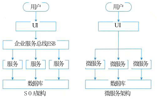
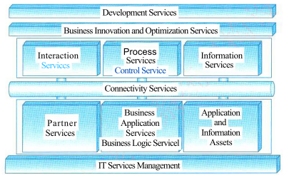
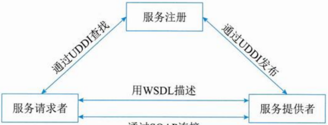
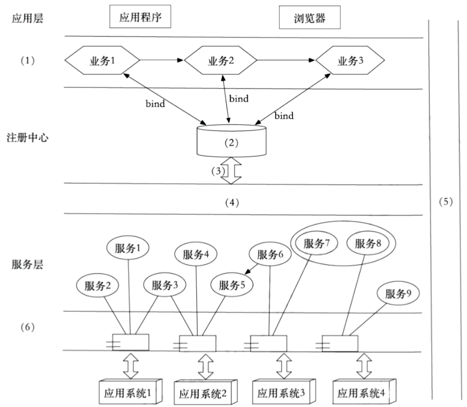

# 面向服务架构设计

## 最佳实践

### 考察问

1. 面向服务架构设计(Service Oriented Architecture, SOA)
    1. 定义: SOA(Service Oriented Architecture): 将应用`()`拆分成不同`()`, 通过这些服务之间定义良好的`()`联系起来。
    2. 流程组成: 服务`()`、服务`()` (或企业服务总线)、服务`()`。服务提供者将服务描述发布到服务注册中心，供服务请求者查找，查找到后，服务请求者将绑定查找结果。
    3. 设计模式组成:

        1. 服务`()`模式

        2. 服务`()`模式(Enterprise Service Bus, EBS)

            处于服务`()`和服务`()`之间，为不同服务间的通信、交互提供支撑. 主要包含: `()`, `()`, `()`

        3. `()`模式

    4. 设计原则组成

        1. 通过`()`的设计原则，应用被分解为多个服务，可分别选择不同的技术，单个服务模块很容易开发、理解和维护，无需协调其他服务对本服务的影响；
        2. 通过`()`的设计原则，微服务可以分布式云化部署，负载均衡管理请求的分发，避免单机失败对整体服务的影响，以及弹性调整资源容量；
        3. 通过`()`的设计原则，能够对系统进行健康检查、指标监控、日志管理和链路追踪，提高系统运维、管理和排错能力；
        4. 通过`()`的设计原则，可实现系统的自动化部署、自动化扩展伸缩、自动化运维、持续交付和集成，有效减少人工操作的工作量。

### 考察点

1. 面向服务架构设计(Service Oriented Architecture, SOA)
    1. 定义: SOA(Service Oriented Architecture): 将应用`程序`拆分成不同`服务`, 通过这些服务之间定义良好的`接口`联系起来。
    2. 流程组成: 服务`提供者`、服务`注册中心` (或企业服务总线)、服务`请求者`。服务提供者将服务描述发布到服务注册中心，供服务请求者查找，查找到后，服务请求者将绑定查找结果。
    3. 设计模式组成:

        1. 服务`注册表`模式

        2. 服务`总线`模式(Enterprise Service Bus, EBS)

            处于服务`提供者`和服务`消费者`之间，为不同服务间的通信、交互提供支撑. 主要包含: `协议转换`, `消息路由`, `服务注册`

        3. `微服务`模式

    4. 设计原则组成

        2. 通过`强韧性`的设计原则，微服务可以分布式云化部署，负载均衡管理请求的分发，避免单机失败对整体服务的影响，以及弹性调整资源容量；
        3. 通过`可观测性`的设计原则，能够对系统进行健康检查、指标监控、日志管理和链路追踪，提高系统运维、管理和排错能力；
        1. 通过`服务化`的设计原则，应用被分解为多个服务，可分别选择不同的技术，单个服务模块很容易开发、理解和维护，无需协调其他服务对本服务的影响；
        4. 通过`自动化`的设计原则，可实现系统的自动化部署、自动化扩展伸缩、自动化运维、持续交付和集成，有效减少人工操作的工作量。

        ✨强测浮动

2. 微服务
    1. 概念: 相较于SOA, 服务更加微小, 去除ESB
    2. 特点:
        1. 优点:
            1. 独立`开发测试部署`
            2. 复杂应用解耦, 每个服务专注一个功能(开发)
            3. 技术选型灵活(开发)
            4. 容错(运行)
            5. 容易拓展(迭代)
        2. 缺点:
            1. 复杂性：微服务架构涉及到分布式系统，需要处理分布式事务、服务发现、服务治理等复杂同题。
            2. 部署和测试: 由于微服务的数量增加，部署和测试变得更加复杂。
            3. 运维成本：微服务架构需要更多的运维工作，包括监控、日志收集、故障排查等。

## SOA的相关概念

在面向服务的体系结构（Service Oriented Architecture，SOA）中，服务的概念有了延伸，泛指系统对外提供的功能集。

1. SOA的定义

    从应用的角度定义，可以认为SOA是一种应用框架，它着眼于日常的业务应用，并将它们划分为单独的业务功能和流程，即所谓的服务。SOA使用户可以构建、部署和整合这些服务，且无需依赖应用程序及其运行平台，从而提高业务流程的灵活性。

    从软件的基本原理定义，可以认为SOA是一个组件模型，它将应用程序的不同功能单元（称为服务）通过这些服务之间定义良好的接口和契约联系起来。接口是采用中立的方式进行定义的，它应该独立于实现服务的硬件平台、操作系统和编程语言。

2. 业务流程与BPEL

    业务流程是指为了实现某种业务目的行为所进行的流程或一系列动作。

    业务流程执行语言 (Business Process Execution Language, BPEL)，即面向Web服务的业务流程执行语言，是一种使用Web服务定义和执行业务流程的语言。使用BPEL，用户可以通过组合、编排和协调Web服务自上而下地实现面向服务的体系结构。BPEL目前用于整合现有的Web Services，将现有的Web Services按照要求的业务流程整理成为一个新的Web Services，在这个基础上，形成一个从外界看来和单个Service一样的Service。

## SOA的发展历史

### SOA的微服务化发展

SOA架构向更细粒度、更通用化程度发展，就形成了所谓的微服务。SOA与微服务的区别在于以下几个方面：

1. 微服务相比于SOA更加精细，微服务更多地以独立的进程的方式存在，互相之间并无影响；
2. 微服务提供的接口方式更加通用化，例如HTTP RESTful方式，各种终端都可以调用，无关语言、平台限制；
3. 微服务更倾向于分布式去中心化的部署方式，在互联网业务场景下更适合。

SOA架构是一个面向服务的架构，可将其视为组件模型，其将系统整体拆分为多个独立的功能模块，模块之间通过调用接口进行交互，有效整合了应用系统的各项业务功能，系统各个模块之间是松耦合的。SOA架构以企业服务总线链接各个子系统，是集中式的技术架构，应用服务间相互依赖导致部署复杂，应用间交互使用远程通信，降低了响应速度。

微服务架构是SOA架构的进一步优化，去除了ESB企业服务总线，是一个真正意义上去中心化的分布式架构。其降低了微服务之间的耦合程度，不同的微服务采用不同的数据库技术，服务独立，数据源唯一，应用极易扩展和维护，同时降低了系统复杂性。

### SOA 的参考架构

典型的以服务为中心的企业集成架构如下图所示，采用“关注点分离”的方法规划企业集成中的各种架构元素，同时从服务视角规划每种架构元素提供的服务，以及服务如何被组合在一起完成某种类型的集成。可划分为六大类：

1. 连接服务——企业服务总线：通过提供企业服务总线提供分布在各种架构元素中服务间的连接性。

    企业服务总线（Enterprise Service Bus，ESB）的基本特征和能力包括：描述服务的元数据和服务注册管理；在服务请求者和提供者之间传递数据，以及对这些数据进行转换的能力，并支持由实践中总结出来的一些模式如同步模式、异步模式等；发现、路由、匹配和选择的能力，以支持服务之间的动态交互，解耦服务请求者和服务提供者。高级一些的能力，包括对安全的支持、服务质量保证、可管理性和负载平衡等。

2. 业务逻辑服务：包括用于实现业务逻辑的服务和执行业务逻辑的能力，其中包括业务应用服务、业务伙伴服务以及应用和信息资产。

    1. 整合已有应用——应用和信息访问服务：实现对已有应用和信息的集成，主要有两类访问服务：可接入服务、事件发现服务。
    2. 整合新开发的应用——业务应用服务：实现新应用集成，主要有三类业务应用服务：组件服务(可重用)、核心服务(运行时)、接口服务。
    3. 整合客户和业务伙伴(B2C/B2B)——伙伴服务：提供与企业外部的B2B的集成能力，包括：社区服务、文档服务、协议服务。

3. 控制服务：包括实现人、流程和信息集成的服务，以及执行这些集成逻辑的能力。

    1. 数据整合——信息服务：提供集成数据的能力，目前主要包括如下集中信息服务：联邦服务(不同类型数据聚合)、复制服务(远程数据本地访问)、转换服务(格式转换)、搜索服务。
    2. 流程整合——流程服务：完成业务流程集成，包括：编排服务(预定义流程顺序)、事务服务(保证ACID)、人工服务(人工活动集成到流程中)。
    3. 用户访问整合——交互服务：实现用户访问集成，包括：交付服务(运行时交互框架)、体验服务、资源服务(运行时交互组件的管理)。

4. 业务开发服务：贯彻整个软件开发生命周期的开发平台，从需求分析，到建模、设计、开发、测试和维护等全面的工具支持。

    开发环境和工具中为不同开发者的角色提供的功能被称为开发服务。根据开发过程中开发者角色和职责的不同，有如下 4 类服务：建模服务、设计服务、实现服务、测试服务。

5. 业务创新和优化服务：用于监控业务系统运行时服务的业务性能，并通过及时了解到的业务性能和变化，采取措施适应变化的市场。

    以业务性能管理 (BPM) 技术为核心提供业务事件发布、收集和关键业务指标监控能力。包括以下服务：
    1. 公共事件框架服务：通过一个公共事件框架提供 IT 和业务事件的激发、存储和分类等。
    2. 采集服务通过基于策略的过滤和相关性分析检测感兴趣的服务。
    3. 监控服务：通过事件与监控上下文间的映射，计算和管理业务流程的关键性能指标。

6. IT服务管理：支持业务系统运行的各种基础设施管理能力或服务，如安全服务、目录服务、系统管理和资源虚拟化。

    为业务流程和服务提供安全、高效和健康的运行环境，包括：安全和目录服务、系统管理和虚拟化服务。

## SOA 主要协议和规范

Web 服务最基本的协议包括 UDDI、WSDL 和 SOAP，通过它们，可以提供直接而又简单的 Web Service 支持，如图所示。

UDDI（统一描述、发现和集成协议）计划是一个广泛的、开放的行业计划，它使得商业实体能够彼此发现；定义它们怎样在Internet上互相作用，并在一个全球的注册体系架构中共享信息。

WSDL（Web服务描述语言），是一个用来描述Web服务和说明如何与Web服务通信的XML语言。可描述三个基本属性：服务做些什么、如何访问服务、服务位于何处。

SOAP是在分散或分布式的环境中交换信息的简单的协议，是一个基于XML的协议。它包括4个部分：SOAP封装，定义了一个描述消息中的内容是什么，是谁发送的，谁应当接收并处理它以及如何处理它们的框架；SOAP编码规则，用于表示应用程序需要使用的数据类型的实例；SOAP RPC表示是远程过程调用和应答的协定；SOAP绑定是使用底层协议交换信息。

虽然这4个部分都作为SOAP的一部分，作为一个整体定义的，但它们在功能上是相交的、彼此独立的。特别地，信封和编码规则是被定义在不同的XML命名空间（Namespace）中，这样使得定义更加简单。

REST（表述性状态转移）的设计不只是要适用于互联网环境，而是一个普遍的设计理念，目的是为了让不同的软件或者应用程序在任何网络环境下都可以进行信息的互相传递。包括四个要素：
资源：REST是以资源为中心构建，资源可以是一个订单，也可以是一幅图片。将互联网中一切暴露给客户端的事物都可以看作是一种资源，对资源相关数据和表述进行组合，借助URI（统一资源标识符）标识Web上的资源。
表述：用表述描述资源在Web中某一个时间的状态。
状态转移：分为应用状态（用户请求会话信息快照）和资源状态（时间资源请求表述的快照）。
超链接：在页面中嵌入链接和其他资源建立联系。

## SOA设计的标准要求

文档标准化：XML文档，Web描述语言。

通信协议标准：用消息进行通信，消息使用XML Schema来定义。

应用程序统一登记与集成：通过扮演目录列表角色的登记处来维护，UDDI是标准。

服务质量（QoS）：每项SOA服务都有一个与之相关的服务质量。QoS的一些关键元素有安全需求（例如认证和授权）、可靠通信以及谁能调用服务的策略等。其服务和标准包括：
可靠性：“仅且仅仅传送一次”“最多传送一次”“重复消息过滤”和“保证消息传送”等特性消息的发送和确认。
安全性：主要包括认证交换、消息完整性和消息保密。
策略：服务提供者有时候会要求服务消费者与某种策略通信。
控制：在SOA中，进程是使用一组离散的服务创建的。BPEL4WS或者WSBPEL是用来控制这些服务的语言。
管理：让系统管理员管理所有，运行在多种环境下的服务的管理系统。

## SOA的作用

SOA对于实现企业资源共享，打破“信息孤岛”的步骤如下。

1. 把应用和资源转换成服务。
2. 把这些服务变成标准的服务，形成资源的共享。

## SOA的设计原则

1. 无状态。以避免服务请求者依赖于服务提供者的状态。
2. 单一实例。避免功能冗余。
3. 明确定义的接口。使用者依赖服务规约调用服务，所以服务定义必须长时间稳定，一旦公布，不能随意更改；服务的定义应尽可能明确，减少使用者的不适当使用；不要让使用者看到服务内部的私有数据。
4. 自包含和模块化。服务封装了那些在业务上稳定、重复出现的活动和组件，实现服务的功能实体是完全独立自主的，独立进行部署、版本控制、自我管理和恢复。
5. 粗粒度。服务数量不应该太大，依靠消息交互而不是远程过程调用(RPC)，通常消息量比较大，但是服务之间的交互频度较低。
6. 服务之间的松耦合性。服务使用者看到的是服务的接口，其位置、实现技术和当前状态等对使用者是不可见的，服务私有数据对服务使用者是不可见的。
7. 重用能力。服务应该是可以重用的。
8. 互操作性、兼容和策略声明。为了确保服务规约的全面和明确，策略成为一个越来越重要的方面。这可以是技术相关的内容，例如一个服务对安全性方面的要求；也可以是跟业务有关的语义方面的内容，例如需要满足的费用或者服务级别方面的要求，这些策略对于服务在交互时是非常重要的。

## SOA的设计模式

### 服务注册表模式

服务注册表模式，支持如下SOA治理功能：

1. 服务注册：应用开发者，也叫服务提供者，向注册表公布他们的功能。他们公布服务合同，包括服务身份、位置、方法、绑定、配置、方案和策略等描述性属性。
2. 服务位置：也就是服务应用开发者，帮助他们查询注册服务，寻找符合自身要求的服务。注册表让服务的消费者检索服务合同。对谁可以访问注册表，以及什么服务属性通过注册表暴露的控制。
3. 服务绑定：服务的消费者利用检索到的服务合同来开发代码，开发的代码将与注册的服务绑定、调用注册的服务以及与它们实现互动。开发者常常利用集成的开发环境自动将新开发的服务与不同的新协议、方案和程序间通信所需的其他接口绑在一起。

### 企业服务总线模式(Enterprise Service Bus, ESB)

企业服务总线模式，由中间件技术实现的支持面向服务架构的基础软件平台，支持异构环境中的服务以基于消息和事件驱动模式的交互，并且具有适当的服务质量和可管理性。

一个典型的在ESB环境中组件之间的交互过程是：首先由服务请求者触发一次交互过程，产生一个服务请求消息，并将该消息按照ESB的要求标准化，然后标准化的消息被发送给服务总线。ESB根据请求消息中的服务名或者接口名进行目的组件查找，将消息转发至目的组件，并最终将处理结果逆向返回给服务请求者。这种交互过程不再是点对点的直接交互模式，而是由事件驱动的消息交互模式。

ESB的核心功能如下。
(1)提供位置透明性的消息路由和寻址服务。
(2)提供服务注册和命名的管理功能。
(3)支持多种消息传递范型(如请求/响应、发布/订阅等)。
(4)支持多种可以广泛使用的传输协议。
(5)支持多种数据格式及其相互转换。
(6)提供日志和监控功能。

### 微服务模式

微服务模式，不再强调传统SOA架构里较重的ESB企业服务总线，同时SOA的思想融入单个业务系统内部，实现真正的组件化。

微服务模式特点为：

1. 复杂应用解耦
2. 独立
3. 技术选型灵活
4. 容错
5. 松耦合易扩展

常见的微服务设计模式：

1. 聚合器微服务：聚合器调用多个微服务实现系统应用程序所需功能，具体有两种形式，一是将检索到的数据信息进行处理并直接展示；另一种是对获取到的数据信息增加业务逻辑处理后，再进一步发布成一个新的微服务，作为更高层次的组合微服务，相当于从服务消费者转换成服务提供者。
2. 链式微服务：客户端或服务在收到请求后，会返回一个经过合并处理的响应，服务之间形成一条调用链。
3. 数据共享微服务：当服务之间存在强耦合关系时，可能存在多个微服务共享缓存与数据库存储的现象。
4. 异步消息传递微服务：消息队列将消息写入一个消息队列中，实现业务逻辑以异步方式运行，从而加快系统响应速度。对于一些不必以同步方式运行的业务逻辑，可以使用消息队列代替REST实现请求、响应，加快服务调用的响应速度。

微服务架构的问题与挑战：

1. 微服务架构分布式特点带来的复杂性
2. 微服务架构的分区数据库体系，不同服务拥有不同数据库
3. 增加了测试的复杂性
4. 在大规模应用部署中，在监控、管理、分发及扩容等方面，微服务也存在着巨大挑战。

🔒问答题

1. (7分)简述微服务架构对比单体架构和微服务架构微服务架构的优缺点。(2024上)
    微服务架构是一种分布式系统架构，将一个应用程序拆分为一组小型、独立的服务，每个服务都围绕特定的业务功能构建，并通过轻量级通信机制进行通信。相比之下，单体架构将整个应用程序作为一个单一的单元构建和部署。

    微服务架构的优点：
    - 灵活性和可扩展性：每个微服务都是独立的，可以独立部署和扩展，使系统更具弹性。
    - 技术多样性：每个微服务可以使用不同的技术栈，使开发团队可以选择最适合其需求的技术。 
    - 易于理解和维护：微服务的小型化和聚焦性使得代码更易于理解、开发和维护。

    微服务架构的缺点：
    - 复杂性：微服务架构涉及到分布式系统，需要处理分布式事务、服务发现、服务治理等复杂问题。
    - 部署和测试：由于微服务的数量增加，部署和测试变得更加复杂。 
    - 运维成本：微服务架构需要更多的运维工作，包括监控、日志收集、故障排查等。 

## 构建SOA架构时应该注意的问题

### 原有系统架构中的集成需求

当SOA架构师遇到一个十分复杂的企业系统时，首先考虑的应该是如何重用已有的投资而不是替换遗留系统。集成类型包括：应用程序集成的需求，终端用户界面集成的需求，流程集成的需求以及已有系统信息集成的需求。

### 服务粒度的控制以及无状态服务的设计

SOA系统中服务的构建有两点需要特别注意的地方：首先是对于服务粒度的控制，另外就是对于无状态服务的设计。

SOA系统架构中的具体服务应该都是独立的、自包含的请求，在实现这些服务的时候不需要前一个请求的状态，也就是说服务不应该依赖于其他服务的上下文和状态，即SOA架构中的服务应该是无状态的服务。当某一个服务需要依赖时，最好把它定义成具体的业务流程(BPEL)。

## SOA实施的过程

### 选择SOA解决方案

从以下三个方面选择SOA最佳的解决方案：尽量选择能进行全局规划的方案、选择时充分考虑企业自身的需求、从平台实施等技术方面进行考查。

### 业务流程分析

1. 建立服务模型
    1. 自顶向下分解法：从业务着手进行分析，选择端到端的业务流程进行逐层分解至业务活动，并对其间涉及的业务活动和业务对象进行变化分析。
    2. 业务目标分析法：通过关键性能指标分析来验证已有服务候选者以及发现遗漏的服务候选者，这也可以称为“目标服务建模”。
    3. 自底向上分析法：利用已有资产来实现服务。

2. 建立业务流程

    1. 建立业务对象：业务对象是对数据进行检索和处理的组件，是简单的真实世界的软件抽象。业务对象的分类包括：实体、过程、事件。
    2. 建立服务接口。
    3. 建立业务流程：流程是指定的活动顺序，包含明确确定的用于提供业务值的输入和输出。

## 🔒题目

1. 某银行拟将以分行为主体的银行信息系统，全面整合为由总行统一管理维护的银行信息系统，实现统一的用户账户管理、转账汇款、自助缴费、理财投资、贷款管理、网上支付、财务报表分析等业务功能。但是，由于原有以分行为主体的银行信息系统中，多个业务系统采用异构平台、数据库和中间件，使用的报文交换标准和通信协议也不尽相同，使用传统的 EAI 解决方案根本无法实现新的业务模式下异构系统间灵活的交互和集成。因此，为了以最小的系统改进整合现有的基于不同技术实现的银行业务系统，该银行拟采用基于 ESB 的面向服务架构(SOA)集成方案实现业务整合。

1. (7 分)请分别用 200 字以内的文字说明什么是面向服务架构(SOA)以及 ESB 在 SOA 中的作用与特点。(2018下)

    面向服务的体系架构(SOA)是一种粗粒度、松耦合服务架构，服务之间通过简单、精确定义接口进行通信。它可以根据需求通过网络对松散耦合的粗粒度应用组件进行分布式部署、组合和使用。SOA能帮助企业系统架构设计者以更迅速、更可靠、更高重用性设计整个业务系统架构，基于SOA的系统能够更加从容地面对业务的急剧变化。

    企业服务总线(ESB)是由中间件技术实现的全面支持面向服务架构的基础软件平台，支持异构环境中的服务以及基于消息和事件驱动模式的交互，并且具有适当的服务质量和可管理性。 

2. (12 分)基于该信息系统整合的实际需求，项目组完成了基于 SOA 的银行信息系统架构设计方案。该系统架构图如图 5 - 1 所示。请从(a)~(j)中选择相应内容填入图 5 - 1 的(1)~(6)，补充完善架构设计图。(2018下)

    (a)数据层
    (b)界面层
    (c)业务层
    (d)bind
    (e)企业服务总线 ESB 
    (f)XML
    (g)安全验证和质量管理
    (h)publish
    (i)UDDI
    (j)组件层
    (k)BPEI 

    

3. (6 分)针对银行信息系统的数据交互安全性需求，列举 3 种可实现信息系统安全保障的措施。 

    XML加密模块、WS-Security、防火墙系统、安全检测、网络扫描

