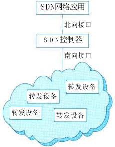

# 通信系统架构设计

## 最佳实践

### 考察点

1. SDN架构如图所示，由下至上分为`数据转发平面`、`控制平面`和`应用平面`。 

## 通信系统概述

通信系统（也称为通信网络）是利用各种通信线路将地理上分散的、具有独立功能的计算机系统和通信设备按不同的形式连接起来，依靠网络软件及通信协议实现资源共享和信息传递的系统。

## 通信系统网络架构

当今，通信网络从大的方面主要包括局域网、广域网、移动通信网等网络形式。不同的网络会采用不同的技术进行网络构建。

### 局域网网络架构

局域网，即计算机局部区域网络，是一种为单一机构所拥有的专用计算机网络。其特点是：覆盖地理范围小，通常限定在相对独立的范围内。低误码率，可靠性高；通常为单一部门或单位所有；支持多种传输介质支持实时应用。就网络拓扑而言，有总线型、环型、星型、树型等型式。从传输介质来说，包含有线局域网和无线局域网。

局域网已从早期只提供二层交换功能的简单网络发展到如今不仅提供二层交换功能，还提供三层路由功能的复杂网络。局域网，现代通常用在园区网络的构建中，某种意义上，局域网也称为园区网。以下给出局域网的几种典型架构风格。

1. 单核心架构

    单核心局域网通常由一台核心二层或三层交换设备充当网络的核心设备，通过若干台接入交换设备将用户设备(如用户计算机、智能设备等)连接到网络中。

    

    此类局域网可通过连接核心网交换设备与广域网之间的互连路由设备(边界路由器或防火墙)接入广域网，实现业务跨局域网的访问。单核心网具有如下特点：

    (1)核心交换设备通常采用二层、三层及以上交换机；
    (2)接入交换设备采用二层交换机，仅实现二层数据链路转发；
    (3)核心交换设备和接入设备之间可采用100M/GE/10GE等以太网连接。

    用单核心构建网络，其优点是：网络结构简单，可节省设备投资。需要使用局域网的部门接入较为方便，直接通过接入交换设备连接至核心交换设备空闲接口即可；

    其不足是网络地理范围受限，要求使用局域网的部门分布较为紧凑；核心网交换设备存在单点故障，容易导致网络整体或局部失效；网络扩展能力有限；在局域网接入交换设备较多的情况下，对核心交换设备的端口密度要求高。

2. 双核心架构

    双核心架构通常是指核心交换设备通常采用三层及以上交换机。核心交换设备和接入设备之间可采用100M/GE/10GE等以太网连接。

    

    网络内划分VLAN时，各VLAN之间访问需通过两台核心交换设备来完成。网络中仅核心交换设 备具备路由功能，接入设备仅提供二层转发功能。

    核心交换设备之间互联，实现网关保护或负载均衡。需要使用局域网的部门接入较为方便，直接通过接入交换设备连接至核心交换设备空闲接口即可。

3. 环型架构

    环型局域网是由多台核心交换设备连接成双RPR动态弹性分组环，构建网络的核心。核心交换设备通常采用三层或以上交换机提供业务转发功能。

    

    典型环型局域网网络内各VLAN之间通过RPR环实现互访。通过RPR组建大规模局域网时，多环之间只能通过业务接口互通，不能实现网络直接互通。环型局域网设备投资比单核心局域网的高。核心路由冗余设计实施难度较高，且容易形成环路。

    此网络通过与环上的交换设备互联的边界路由设备接入广域网。

4. 层次局域网架构

    层次局域网架构(或多层局域网)由核心层交换设备、汇聚层交换设备和接入层交换设备，以及用户设备等组成。 

    

### 广域网网络架构

广域网属于多级网络，通常由骨干网、分布网、接入网组成。在网络规模较小时，可仅由骨干网和接入网组成。通常，在大型网络构建中，通过广域网将分布在各地域的局域网互连起来，形成一个大的网络。以下给出不同形式的广域网构建模型以及各自的特点。

1. 单核心广域网

    通常由一台核心路由设备和各局域网组成。核心路由设备采用三层及以上交换机。网络内各局域网之间访问需要通过核心路由设备。 

    

2. 双核心广域网

    通常由两台核心路由设备和各局域网组成。其主要特征是核心路由设备通常采用三层及以上交换机。核心路由设备之间实现网关保护或负载均衡。各局域网访问核心局域网，以及它们相互访问可有多条路径选择，可靠性更高，路由层面可实现热切换，提供业务连续性访问能力。 

    

3. 环型广域网

    通常是采用三台以上核心路由器设备构成路由环路，用以连接各局域网，实现广域网业务互访。核心路由设备之间具备网关保护或负载均衡机制，同时具备环路控制功能。各局域网访问核心局域网，或互相访问，有多条路径可选择，可靠性更高，路由层面可实现无缝热切换，保证业务访问连续性。 

    

4. 半冗余广域网

    半冗余广域网是由多台核心路由设备连接各局域网而形成的。其中，任意核心路由设备至少存在两条以上连接至其他路由设备的链路。如果任何两个核心路由设备之间均存在链接，则属于半冗余广域网特例，即全冗余广域网。 

    

5. 对等子域广域网

    对等子域广域网是通过将广域网的路由设备划分成两个独立的子域，每个子域路由设备采用半冗余方式互连。两个子域之间通过一条或多条链路互连，对等子域中任何路由设备都可接入局域网络。

    对等子域广域网的主要特征是对等子域之间的互访是以对等子域之间互连链路为主。对等子域之间可做到路由汇总或明细路由条目匹配，路由控制灵活。通常，子域之间链路带宽应高于子域内链路带宽。

7. 层次子域广域网

    层次子域广域网是将大型广域网络路由设备划分成多个较为独立的子域，每个子域内路由设备采用半冗余方式互连，多个子域之间存在层次关系，高层次子域连接多个低层次子域。层次子域中任何路由设备都可以接入局域网。 

### 移动通信网网络架构

1. 5GS与DN互连

    5GS（5G System）在为移动终端用户（UE）提供服务时通常需要DN（Data Network）网络，各式各样的上网、语音、AR/VR、工业控制和无人驾驶等5GS中UPF网元作为DN的接入点。5GS和DN之间通过5GS定义的N6接口互连。5GS和DN之间是一种路由关系。

    

    此外，从UE通过5GS接入DN的方式来说，存在两种模式，即透明模式和非透明模式。

    1)透明模式：5GS通过UPF的N6接口直接连至运营商特定的IP网络，然后通过防火墙或代理服务器连至DN(即外部IP网络)，如Internet等。

    在此模式下，5GS至少为UE提供一个基本ISP服务。对于5GS而言，它只须提供基本的隧道QoS流服务即可。UE访问某个Intranet网络时，UE级别的配置仅在UE和Intranet网络之间独立完成，这对5GS而言是透明的。 

    

    2)非透明模式：5GS可直接接入Intranet/ISP，或通过其他IP网络(如Internet)接入Intranet/ISP。如5GS通过Internet方式接入Intranet/ISP，通常需要在UPF和Intranet/ISP之间建立专用隧道来转发UE访问Intranet/ISP的业务。UE被指派属于Intranet/ISP地址空间的IP地址。此地址用于UE业务在UPF、Intranet/ISP中转发。 

    

2. 5G网络边缘计算

    5G网络的边缘计算(MEC)架构如图所示，支持在靠近终端用户UE的移动网络边缘部署5G UPF网元，结合在移动网络边缘部署边缘计算平台(MEP)，为垂直行业提供诸如以时间敏感、高带宽为特征的业务就近分流服务。

    运营商自有应用或第三方应用AF通过5GS提供的能力开放功能网元NEF，触发5G网络为边缘应用动态地生成本地分流策略，由PCF将这些策略配置给相关SMF，SMF根据终端用户位置信息或用户移动后发生的位置变化信息动态实现UPF(即移动边缘云中部署的UPF)在用户会话中插入或移除，以及对这些UPF分流规则的动态配置，达到用户访问所需业务的极佳效果。 

### 存储网络架构
一般来说，计算机访问磁盘存储有3种方式：

- 直连式存储（Direct-Attached Storage，DAS）：是指将存储设备通过SCSI接口直接连接到一台服务器上使用，其本身是硬件的堆叠，存储操作依赖于服务器，不带有任何存储操作系统。
存在问题：在传递距离、连接数量、传输速率等方面都受到限制。容量难以扩展升级；数据处理和传输能力较低；服务器异常会波及存储器。

- 网络连接存储（Network-Attached Storage，NAS）：是通过网络接口与网络直接相连，由用户通过网络访问（支持多种TCP/IP协议），有独立的存储系统。NAS设备有自己的OS，类似于一个专用的文件服务器，一般存储信息采用RAID进行管理，即插即用。不仅响应速度快，而且数据传输速率也很高。NAS的性能特点是进行小文件级的共享存取；支持即插即用；可以很经济的解决存储容量不足的问题，但难以获得满意的性能。 

- 存储区域网络（Storage Area Network，SAN）：是通过专用交换机将磁盘阵列与服务器连接起来的高速专用子网。它没有采用文件共享存取方式，而是采用块（block）级别存储。SAN是通过专用高速网将一个或多个网络存储设备和服务器连接起来的专用存储系统，其最大特点是将存储设备从传统的以太网中分离了出来，成为独立的存储区域网络SAN的系统结构。目前主要使用以太网（IP SAN）和光纤（FC SAN）两类环境。 

### 软件定义网络架构

1. 软件定义网络

    软件定义网络（Software Defined Network，SDN）：核心思想是通过对网络设备的控制面与数据面进行分离，控制面集中化管控，同时对外提供开放的可编程接口，为网络应用创新提供极佳的能力开放平台；而数据面则通用化、轻量化，高效转发，以提升网络的整体运行效能。

    具体来说，SDN利用分层的思想，将网络分为控制层和数据层。
    - 控制层包括可编程控制器，具有网络控制逻辑的中心，掌握网络的全局信息，方便运营商或网络管理人员配置网络和部署新协议等。
    - 数据层包括哑交换机（与传统的二层交换机不同，专指用于转发数据的设备），仅提供简单的数据转发功能，可以快速处理匹配的数据包。

    两层之间采用开放的统一接口(如OpenFlow等)进行交互。通过此接口控制器向转发设备(如交换机等)下发统一标准的转发规则，转发设备仅需按照这些规则执行相应动作即可。

2. SDN网络架构

    SDN架构如图所示，由下至上分为`数据转发平面`、`控制平面`和`应用平面`。 

    

    数据平面由网络转发设备(如通常由通用硬件构成)组成，网络转发设备之间通过由不同规则形成的SDN数据通路连接起来；
    
    控制平面包含了逻辑上为中心的SDN控制器，它掌握着网络全局信息，负责转发设备的各种转发规则的下发；
    应用平面包含各种基于SDN的网络应用，应用无须关心网络底层细节就可以编程、部署新应用。
    
    以控制器为逻辑中心，南向接口负责与数据平面进行通信，北向接口负责与应用平面进行通信，东西向接口负责多控制器之间的通信。 

## 网络构建关键技术

网络的高可用性是一个系统级的概念。对于一个网络来说，它由网络元素(或网络部件)，按照一定的连接模型连接在一起而构成。因此，网络可用性包括网络部件、网络连接模型以及有关网络协议等方面的可靠性。

1)网络部件：是组成网络的基本要素，典型代表有各种交换机、路由器等网络设备。网络部件的高可用性是网络高可用性的关键。包括硬件结构和软件系统。硬件可用性通过冗余、热备等保证；软件可用性通过异常保护、数据冗余等保证。
2)网络连接模型：除了网络部件本身的高可用性外，网络物理拓扑连接形式也影响网络的可用性程度。这就涉及到串并联系统的可靠性计算。 
3)网络协议及配置：高可用性离不开运行于网络中的路由、链路检测等协议，可以部署链路检测协议发现故障。

IPV4和IPV6三种过渡技术、SDN等不再赘述。 

## 网络构建和设计方法

### 网络需求分析

网络需求分析是网络构建及开发过程的起始环节，也是极其重要的阶段。在该阶段，可尽早明确客户使用网络的真实用途或痛点，以便为后续能够构建和设计出更贴近客户真实诉求的网络打下坚实基础。需求分析过程，主要围绕以下几个方面来开展：业务需求、用户需求、应用需求、计算机平台需求和网络需求。最终形成约束后续网络设计的网络需求规格说明书。

### 网络技术遴选及设计

网络技术遴选及设计：网络遴选工作是通信系统设计中关键的一项工作，根据计划实施的网络建设要求，遴选工作通常分为局域网、广域网和路由协议的选择。
（1）局域网技术遴选：生成树协议(STP)、虚拟局域网、无线局域网、线路冗余设计、交换设备功能的合理使用、服务器冗余设计。
（2）广域网技术遴选：远程接入技术、广域网互联技术。 
（3）地址规划模型：地址分配应遵循以下原则：
①使用结构化网络层编址模型，即对地址进行层次化的规划。
②通过中心授权机构管理地址，比如由组织的IT部门为网络层编址提供一个全局模型。根据网络的核心、汇聚、接入层次化结构，为组织的各个区域、分支机构等进行地址规划。 
③编址授权下发。即由地址授权管理中心，将编址授权给分支机构来进行地址规划。 
④为终端用户设备指派动态地址，即对于频繁变更位置、移动性角度的用户分配动态地址。 
⑤私有的地址合理使用。使用私有地址的用户在访问外部网络，需要进行地址转换(NAT)。
（4）路由协议选择包括以下内容：
①路由协议类型的选择：路由协议选择主要包括距离矢量协议和链路状态协议。
②路由选择协议度量值的合理设置。
③路由选择协议顺序的合理指定。
④层次化与非层次化路由选择协议。
⑤内部与外部路由选择协议。
⑥分类与无类路由选择协议。
⑦静态路由指定。
（5）层次化网络模型设计：核心层、汇聚层、接入层。
（6）网络高可用设计方法：提高网络可靠性、缩短网络恢复时间。 

### 网络安全

（1）防火墙。
（2）VPN：虚拟专用网。
（3）访问控制技术：主体依据控制策略或权限对客体本身或其资源实施的不同授权访问。
（4）网络安全隔离：是在网络运行过程中将网络攻击隔离在可信网络之外，同时保证可信网络内信息不被外泄。 
（5）网络安全协议：SSL、SET、HTTPS等。 
（6）网络安全审计：是对网络的脆弱性进行测试评估和分析，最大限度保障业务的安全正常运行的切行为和手段。

### 绿色网络设计方法

绿色网络设计原则：

1)标准化：在设计之初就应考虑解决方案标准化，整体架构标准化可大幅减少转换设备，从而大大降低了能耗。
2)集成化：可使得整个网络系统的通信设备数量尽可能降低，通过减少设备总量、降低设备使用所需资源(空间、机架、线缆、人力等)，来实现节能减排目标。 
3)虚拟化：是一种网络资源可以灵活调配、按需使用的重要途径。 
4)智能化：一方面可以降低人力投入从而降低TCO，达到绿色环保目的；另一方面智能化方案可以通过智能处理直接降低资源的占用，实现绿色设计。 

## 通信网络构建案例
### 高可用网络构建分析

（1）网络接入层高可用性设计
高可用接入层具有下述特征：
(1)使用冗余引擎和冗余电源获得系统级冗余，为关键用户群提供高可靠性；
(2)与具备冗余系统的汇聚层采用双归属连接，获得默认网关冗余，支持在汇聚层的主备交换机间快速实现故障切换； 
(3)通过链路汇聚提供带宽利用率，同时降低复杂度； 
(4)通过配置802.1x，动态ARP检查及IP源地址保护等功能增加安全性，有效防止非法访问。 

接入层到汇聚层有4种连接方式，对比如下：

|拓扑|优点|缺点|
| ---- | ---- | ---- |
|模型一（倒U形）|（1）无环路，不启用STP，网络管理简单 （2）VLAN可以跨汇聚层交换机，用户设备二层扩展灵活|汇聚交换机故障会造成其同侧接入交换机所连用户设备不可达，无法实现高可用接入|
|模型二（U形）|（1）无环路，不启用STP，网络管理简单 （2）接入交换机与汇聚交换机之间有冗余链路保护|（1）VLAN不能跨汇聚交换机，用户设备部署不灵活 （2）接入交换机间链路故障时，VRRP心跳报文无法传递，网络处于不稳定状态|
|模型三（矩形）|（1）接入交换机与汇聚交换机之间有冗余链路保护 （2）VLAN可以跨汇聚层交换机|（1）存在环路，启用STP （2）当接入交换机上行链路故障时，所有流量将从另一侧交换机上行，网络收敛比变小，网络易拥塞，降低了网络可用性|
|模型四（三角形）|（1）接入交换机与汇聚交换机之间有冗余链路、冗余路径保护 （2）VLAN可以跨汇聚层交换机，用户设备部署灵活|存在环路，启用STP，生成树计算较矩形拓扑的复杂| 

（2）网络汇聚层高可用设计
汇聚层到核心层间采用OSPF等动态路由协议实现路由层面高可用保障。典型连接方式有两种：
- 组网模型一为三角形连接方式，从汇聚层到核心层具有全冗余链路和转发路径。
- 组网模型二为矩形连接方式，从汇聚层到核心层为非全冗余链路，当主链路发生故障时，需要通过路由协议计算获得从汇聚到核心的其他路径。

可见，组网模型一（即三角形连接方式）的故障收敛时间较小，不足的是，三角形连接方式要占用更多设备端口，建网成本较高。 

（3）网络核心层高可用设计
从系统冗余性角度，应考虑部署双核心或多核心设备，以主备或负荷分担方式工作。 

### 网络应用

5G网络在智能电网中的应用如图所示，通过5G网络将种类繁多、数据巨大的设备，如电网智能感知设备（传统电源、新能源电源等），电网中的输变电网设备、配电设备等，用户电表、电动汽车等连接到物联网（IoT）平台中，由IoT平台进行电网各个环节的数据采集和智能分析，从而为电网的高级应用（输电业务、配电业务、综合能源管理等业务部门）的科学决策提供有力的支撑。 

