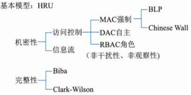
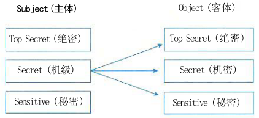
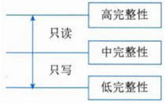
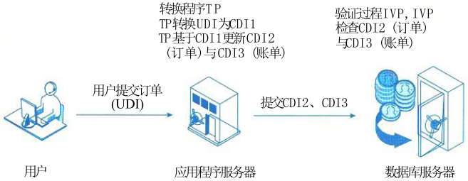
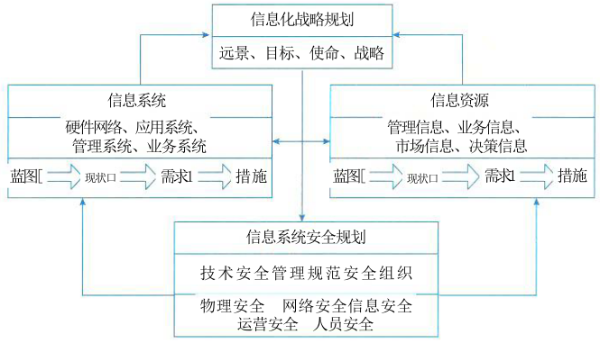
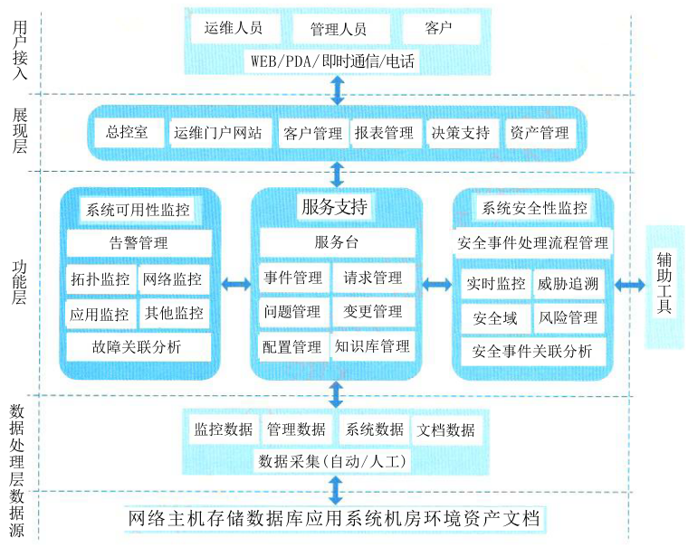
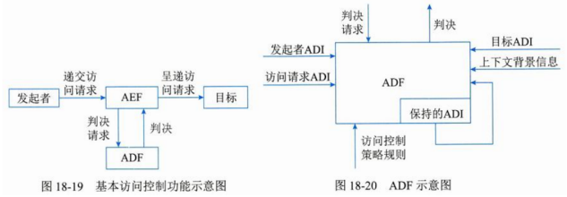
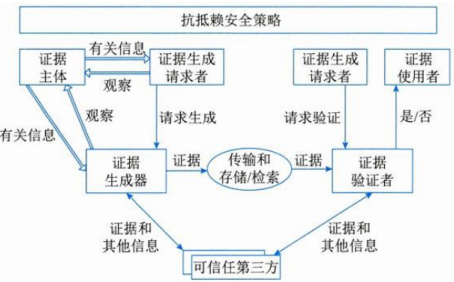
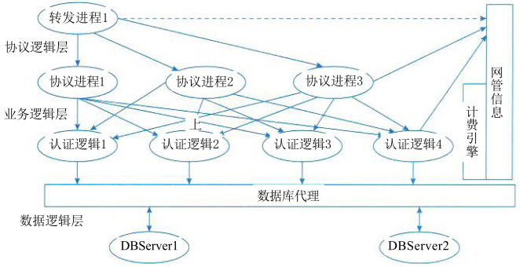
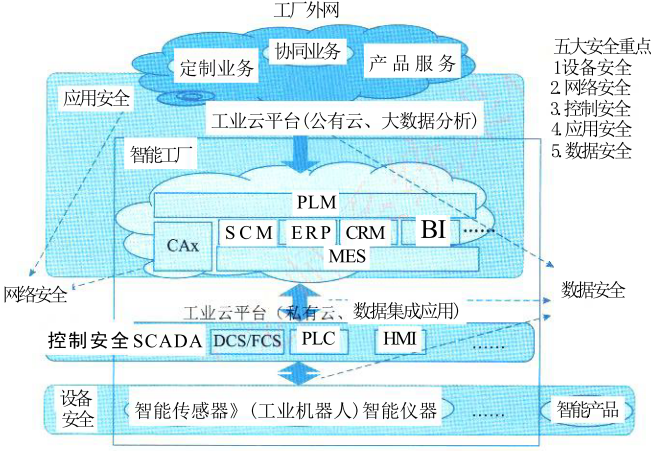

# 安全架构设计

## 安全架构概述

### 信息安全面临的威胁

对于信息系统来说，威胁可以是针对物理环境、通信链路、网络系统、操作系统、应用系统以及管理系统等方面。
- 物理安全威胁是指对系统所用设备的威胁，如自然灾害、电源故障、操作系统引导失败或数据库信息丢失、设备被盗/被毁造成数据丢失或信息泄露；
- 通信链路安全威胁是指在传输线路上安装窃听装置或对通信链路进行干扰；
- 网络安全威胁是指由于互联网的开放性、国际化的特点，人们很容易通过技术手段窃取互联网信息，对网络形成严重的安全威胁；
操作系统安全威胁是指对系统平台中的软件或硬件芯片中植入威胁，如“木马”和“陷阱门”、BIOS的万能密码；
应用系统安全威胁是指对于网络服务或用户业务系统安全的威胁，也受到“木马”和“陷阱门”的威胁；
管理系统安全威胁是指由于人员管理上疏忽而引发人为的安全漏洞，如人为的通过拷贝、拍照、抄录等手段盗取计算机信息。

具体来讲，常见的安全威胁有以下几种。
(1)信息泄露：信息被泄露或透露给某个非授权的实体。
(2)破坏信息的完整性：数据被非授权地进行增删、修改或破坏而受到损失。
(3)拒绝服务：对信息或其他资源的合法访问被无条件地阻止。
(4)非法使用(非授权访问)：某一资源被某个非授权的人或以非授权的方式使用。
(5)窃听：用各种可能的合法或非法的手段窃取系统中的信息资源和敏感信息。
(6)业务流分析：通过对系统进行长期监听，利用统计分析方法对诸如通信频度、通信的信息流向、通信总量的变化等态势进行研究，从而发现有价值的信息和规律。
(7)假冒：通过欺骗通信系统(或用户)达到非法用户冒充成为合法用户，或者特权小的用户冒充成为特权大的用户的目的。黑客大多是采用假冒进行攻击。
(8)旁路控制：攻击者利用系统的安全缺陷或安全性上的脆弱之处获得非授权的权利或特权。
(9)授权侵犯：被授权以某一目的使用某一系统或资源的某个人，却将此权限用于其他非授权的  
(10)特洛伊木马：软件中含有一个察觉不出的或者无害的程序段，当它被执行时，会破坏用户的安全。
(11)陷阱门：在某个系统或某个部件中设置了“机关”，使得当提供特定的输入数据时，允许违反安全策略。
(12)抵赖：这是一种来自用户的攻击，例如，否认自己曾经发布过的某条消息、伪造一份对方来信等。
(13)重放：所截获的某次合法的通信数据备份，出于非法的目的而被重新发送。 
(14)计算机病毒：所谓计算机病毒，是一种在计算机系统运行过程中能够实现传染和侵害的功能程序。一种病毒通常含有两个功能：一种功能是对其他程序产生“感染”；另外一种或者是引发损坏功能或者是一种植入攻击的能力。 
(15)人员渎职：一个授权的人为了钱或利益、或由于粗心，将信息泄露给一个非授权的人。
(16)媒体废弃：信息被从废弃的磁盘或打印过的存储介质中获得。
(17)物理侵入：侵入者通过绕过物理控制而获得对系统的访问。
(18)窃取：重要的安全物品，如令牌或身份卡被盗。
(19)业务欺骗：某一伪系统或系统部件欺骗合法的用户或系统自愿地放弃敏感信息。
### 安全架构的定义和范围
安全架构是架构面向安全性方向上的一种细分，通常的产品安全架构、安全技术体系架构和审计架构可组成三道安全防线。
(1)产品安全架构：构建产品安全质量属性的主要组成部分以及它们之间的关系。产品安全架构的目标是如何在不依赖外部防御系统的情况下，从源头打造自身安全的产品。
(2)安全技术体系架构：构建安全技术体系的主要组成部分以及它们之间的关系。安全技术体系架构的任务是构建通用的安全技术基础设施，包括安全基础设施、安全工具和技术、安全组件与支持系统等，系统性地增强各产品的安全防御能力。
(3)审计架构：独立的审计部门或其所能提供的风险发现能力，审计的范围主要包括安全风险在内的所有风险。

### 安全模型
信息系统的安全目标是控制和管理主体(含用户和进程)对客体(含数据和程序)的访问。
安全模型是准确地描述安全的重要方面及其与系统行为的关系，安全策略是从安全角度为系统整体和构成它的组件提出基本的目标。安全模型提供了实现目标应该做什么，不应该做什么，具有实践指导意义，它给出了策略的形式。如下图是模型的分类：

注：

- HRU：访问控制矩阵模型（Harrison Ruzzo Ullman）；
- MAC：强制访问控制模型（Mandatory Access Control）； 
- DAC：自主访问控制模型（Discretionary Access Control）； 
- RBAC：基于角色的访问控制模型（Role - Based Access Control） 

1. 状态机模型

    状态机模型描述了一种无论处于何种状态都是安全的系统。它是用状态语言将安全系统描述成 抽象的状态机，用状态变量表述系统的状态，用转换规则描述变量变化的过程。

    状态机模型中一个状态是处于系统在特定时刻的一个快照。如果该状态所有方面满足安全策略的要求，则称此状态是安全的；一个安全状态模型系统，总是从一个安全状态启动，并且在所有迁移中保持安全状态，只允许主体以和安全策略相一致的安全方式访问资源。

2. Bell - LaPadula 模型

    Bell - LaPadula 模型使用主体、客体、访问操作 (读、写、读 / 写) 以及安全级别这些概念，当主体和客体位于不同的安全级别时，主体对客体就存在一定的访问限制。通过该模型可保证信息不被不安全主体访问。

    

    Bell - LaPadula模型的安全规则如下：
    (1)简单安全规则：安全级别低的主体不能读安全级别高的客体(No Read Up)；只能下读。
    (2)星属性安全规则：安全级别高的主体不能往低级别 的客体写(No Write Down)；只能上写。 
    (3)强星属性安全规则：不允许对另一级别进行读写； 
    (4)自主安全规则：使用访问控制矩阵来定义说明自由存取控制。其存取控制体现在内容相关和上下文相关。 

3. Biba模型

    Biba模型不关心信息机密性的安全级别，因此它的访问控制不是建立在安全级别上，而是建立在完整性级别上。

    完整性的三个目标：保护数据不被未授权用户更改；保护数据不被授权用户越权修改(未授权更改)；维持数据内部和外部的一致性。 

    

    Biba模型能够防止数据从低完整性级别流向高完整性级别，其安全规则如下：
    (1)星完整性规则：表示完整性级别低的主体不能对完整性级别高的客体写数据；只能下写。
    (2)简单完整性规则：表示完整性级别高的主体不能从完整性级别低的客体读取数据；只能上读。 
    (3)调用属性规则：表示一个完整性级别低的主体不能从级别高的客体调用程序或服务。 

4. Clark - Wilson模型

    Clark - Wilson模型是一种将完整性目标、策略和机制融为一体的模型。为了体现用户完整性，CWM提出了职责隔离目标；为了保证数据完整性，CWM提出了应用相关的完整性验证进程；为了建立过程完整性，CWM定义了对于变换过程的应用相关验证。 

    

    (1)需要进行完整性保护的客体称之为CDI，不需要进行完整性保护的客体称之为UDI；
    (2)完整性验证过程(IVP)：确认限制数据项处于一种有效状态，如果IVP检验CDI符合完整性约束，则系统处于一个有效状态；
    (3)转换过程(TP)：将数据项从一种有效状态改变至另一种有效状态；
    (4)为了确保对CDI的TP是有效的，则需要授权User做TP的认证；
    (5)为了防止合法用户对CDI做非法或错误操作，将TP过程分为多个子过程，将每个子过程授权给不同的User； 
    (6)但是如果TP的每个子过程被授权的User之间存在某种利益同盟，则可能存在欺骗。从而使得CDI的完整性得不到保护。

    CWM的主要特征是：
    (1)采用Subject/Program/Object三元素的组成方式。Subject要访问Object只能通过Program进行； 
    (2)权限分离原则：将要害功能分为有2个或多个Subject完成，防止已授权用户进行未授权的修改； 
    (3)要求具有审计能力。 

5. Chinese Wall模型

    Chinese Wall模型（又名Brew and Nash模型）是应用在多边安全系统中的安全模型。也就是说，是指通过行政规定和划分、内部监控、IT系统等手段防止各部门之间出现有损客户利益的利益冲突事件。
    Chinese Wall模型的安全策略的基础是客户访问的信息不会与当前他们可支配的信息产生冲突。在投资银行中，一个银行会同时拥有多个互为竞争者的客户，一个银行家可能为一个客户工作，但他可以访问所有客户的信息。因此，应当制止该银行家访问其他客户的数据。银行家可以选择为谁工作（DAC），一旦选定，他就只能为该客户工作（MAC）。
    Chinese Wall模型的访问客体控制的安全规则如下：
    (1)与主体曾经访问过的信息属于同一公司数据集的信息，即墙内信息可以访问；
    (2)属于一个完全不同的利益冲突组的可以访问；
    (3)主体能够对一个客体进行写的前提是主体未对任何属于其他公司数据集进行过访问。
    定理1：一个主体一旦访问过一个客体，则该主体只能访问位于同一公司数据集的客体或在不同利益组的客体。
    定理2：在一个利益冲突组中，一个主体最多只能访问一个公司数据集。
    比如，假设Chinese Wall安全策略包括三个信息存储模块：某家企业的单位信息（C）、该家企业的所有信息集合（CD）和该家企业与互为竞争关系企业的全部信息集合（COI）。那么，Chinese Wall模型规定：
    (1)每个C只能唯一对应一个CD；
    (2)每个CD只能唯一对应一个利益冲突类COI；
    (3)一个COI类却可以同时包含多个CD。 

## 系统安全体系架构规划框架

安全技术体系架构是对组织机构信息技术系统的安全体系结构的整体描述。安全技术体系架构的目标是建立可持续改进的安全技术体系架构的能力。

### 安全技术体系架构

根据网络中风险威胁的存在实体划分出5个层次的实体对象：应用、存储、主机、网络和物理。

### 信息系统安全体系规划

信息系统安全体系主要是由技术体系、组织机构体系和管理体系三部分共同构成的。 

技术体系是全面提供信息系统安全保护的技术保障系统，该体系由物理安全技术和系统安全技术两大类构成。
组织体系是信息系统的组织保障系统，由机构、岗位和人事三个模块构成。
管理体系由法律管理、制度管理和培训管理三部分组成。

## 信息系统安全规划框架 

（1）信息系统安全规划依托企业信息化战略规划
信息系统安全规划依托企业信息化战略规划，对信息化战略的实施起到保驾护航的作用。信息系统安全规划的目标应该与企业信息化的目标是一致的，而且应该比企业信息化的目标更具体明确、更贴近安全。

（2）信息系统安全规划需要围绕技术安全、管理安全、组织安全考虑
规划的内容基本上应涵盖：确定信息系统安全的任务、目标、战略以及战略部门和战略人员，并在此基础上制定出物理安全、网络安全、系统安全、运营安全、人员安全的信息系统安全的总体规划。

（3）信息系统安全规划以信息系统与信息资源的安全保护为核心

规划工作需要围绕着信息系统与信息资源的开发、利用和保护工作进行，要包括蓝图、现状、需求和措施4个方面。

(1)对信息系统与信息资源的规划需要从信息化建设的蓝图入手，知道企业信息化发展策略的总体目标和各阶段的实施目标，制定出信息系统安全的发展目标。
(2)对企业的信息化工作现状进行整体的、综合、全面的分析，找出过去工作中的优势与不足。 
(3)根据信息化建设的目标提出未来几年的需求，这个需求最好可以分解成若干个小的方面，以便于今后的实施与落实。
(4)要明确在实施工作阶段的具体措施与方法，提高规划工作的执行力度。 

## 信息安全整体架构设计（WPDDRRC模型）

人、管理和技术手段是信息安全架构设计的三大要素，而构成动态的信息与网络安全保障体系框架是实现系统的安全保障。

### WPDDRRC信息安全体系架构模型
WPDDRRC（Waring/Protect/Detect/React/Restore/Counterattack）模型有6个环节和3大要素。
6个环节包括：预警、保护、检测、响应、恢复和反击，它们具有较强的时序性和动态性，能够较好地反映出信息系统安全保障体系的预警能力、保护能力、检测能力、响应能力、恢复能力和反击能力。
3大要素包括：人员、策略和技术。人员是核心，策略是桥梁，技术是保证，落实在WPDDRRC的6个环节的各个方面，将安全策预警略变为安全现实。 

- **W（预警）**：主要是指利用远程安全评估系统提供的模拟攻击技术来检查系统存在的、可能被利用的薄弱环节，收集和测试网络与信息的安全风险所在，并以直观的方式进行报告，提供解决方案的建议，在经过分析后，分解网络的风险变化趋势和严重风险点，从而有效降低网络的总体风险，保护关键业务和数据。
- **P（防护）**：通常是通过采用成熟的信息安全技术及方法来实现网络与信息的安全。主要内容有加密机制，数字签名机制，访问控制机制，认证机制，信息隐藏和防火墙技术等。 
- **D（检测）**：通过检测和监控网络以及系统，来发现新的威胁和弱点，强制执行安全策略。在这个过程中采用入侵检测、恶意代码过滤等技术，形成动态检测的制度，奖励报告协调机制，提高检测的实时性。主要内容有入侵检测，系统脆弱性检测，数据完整性检测和攻击性检测等。
- **R（响应）**：是指在检测到安全漏洞和安全事件之后必须及时做出正确的响应，从而把系统调整到安全状态。为此需要相应的报警、跟踪、处理系统，其中处理包括了封堵、隔离、报告等能力。主要内容有应急策略、应急机制、应急手段、入侵过程分析和安全状态评估等。
- **R（恢复）**：灾难恢复系统是当前网络、数据、服务受到黑客攻击并遭到破坏或影响后，通过必要技术手段，在尽可能短的时间内使系统恢复正常。主要内容有容错、冗余、备份、替换、修复和恢复等。 
- **C（反击）**：是指采用一切可能的高新技术手段，侦察、提取计算机犯罪分子的作案线索与犯罪证据，形成强有力的取证能力和依法打击手段。  

### 信息安全体系架构设计
信息系统安全设计重点考虑两个方面：其一是系统安全保障体系；其二是信息安全体系架构。

1. 系统安全保障体系
系统安全保障体系是由安全服务、协议层次和系统单元等三个层面组成，且每个层都涵盖了安全管理的内容。系统安全保障体系设计工作主要考虑以下几点：
①安全区域策略的确定：根据安全区域的划分，主管部门应制定针对性的安全策略。如定时审计评估、安装入侵检测系统、统一授权、认证等；
②统一配置和管理防病毒系统：主管部门应当建立整体防御策略，以实现统一的配置和管理。网络防病毒的策略应满足全面性、易用性、实时性和可扩展性等方面要求； 
③网络安全管理：在网络安全中，除了采用一些技术措施之外，加强网络安全管理，制定有关规章制度。

2. 信息安全体系架构
具体在安全控制系统，我们可以从物理安全、系统安全、网络安全、应用安全和管理安全等5个方面开展分析和设计工作。
1)物理安全：保证计算机信息系统各种设备的物理安全是保障整个网络系统安全的前提。包括：环境安全、设备安全、媒体安全等。
2)系统安全：主要是指对信息系统组成中各个部件的安全要求。系统安全是系统整体安全的基础。它主要包括：网络结构安全、操作系统安全和应用系统安全。 
3)网络安全：是整个安全解决方案的关键。它主要包括：访问控制、通信保密、入侵检测、网络安全扫描系统和防病毒等。 
4)应用安全：主要是指多个用户使用网络系统时，对共享资源和信息存储操作所带来的安全问题。它主要包括资源共享和信息存储两个方面。
5)安全管理：主要体现在三个方面。其一是制定健全的安全管理体制；其二是构建安全管理平台；其三是增强人员的安全防范意识。
一种面向企业的安全控制系统安全架构：  

## 网络安全体系架构设计

### OSI的安全体系架构概述

OSI定义了7层协议，其中除第5层(会话层)外，每一层均能提供相应的安全服务。实际上，最适合配置安全服务的是在物理层、网络层、运输层及应用层上，其他层都不宜配置安全服务。
OSI开放系统互联安全体系的5类安全服务包括鉴别、访问控制、数据机密性、数据完整性和抗抵赖性。
OSI定义分层多点安全技术体系架构，也称为深度防御安全技术体系架构，它通过以下三种方式将防御能力分布至整个信息系统中。
1)多点技术防御：在对手可以从内部或外部多点攻击一个目标的前提下，多点技术防御通过对网络和基础设施、边界、计算环境这三个防御核心区域的防御达到抵御所有方式的攻击目的。
2)分层技术防御：即使最好的可得到的信息保障产品也有弱点，其最终结果将使对手能找到一个可探查的脆弱性，一个有效的措施是在对手和目标间使用多个防御机制。 
3)支撑性基础设施：为网络、边界和计算环境中信息保障机制运行基础的支撑性基础设施，包括公钥基础设施以及检测和响应基础设施。 

### 认证框架
鉴别（Authentication）的基本目的是防止其他实体占用和独立操作被鉴别实体的身份。鉴别有两种重要的关系背景：一是实体由申请者来代表，申请者与验证者之间存在着特定的通信关系（如实体鉴别）；二是实体为验证者提供数据项来源。
鉴别服务分为以下阶段：
- 在安装阶段，定义申请鉴别信息和验证鉴别信息。
- 修改鉴别信息阶段，实体或管理者申请鉴别信息和验证鉴别信息变更（如修改口令）。 
- 在分发阶段，为了验证交换鉴别信息，把验证鉴别信息分发到各实体（如申请者或验证者）以供使用。
- 在获取阶段，申请者或验证者可得到为鉴别实例生成特定交换鉴别信息所需的信息，通过与可信第三方进行交互或鉴别实体间的信息交换可得到交换鉴别信息。 
- 在传送阶段，在申请者与验证者之间传送交换鉴别信息。 
- 在验证阶段，用验证鉴别信息核对交换鉴别信息。 
- 在停活阶段，将建立一种状态，使得以前能被鉴别的实体暂时不能被鉴别。 
- 在重新激活阶段，使在停活阶段建立的状态将被终止。 
- 在取消安装阶段，实体从实体集合中被拆除。 

### 访问控制框架

访问控制（Access Control）决定开放系统环境中允许使用哪些资源、在什么地方适合阻止未授权访问的过程。
ACI（访问控制信息）是用于访问控制目的的任何信息，其中包括上下文信息。ADI（访问控制判决信息）是在做出一个特定的访问控制判决时可供ADF使用的部分（或全部）ACI。
ADF（访问控制判决功能）是一种特定功能，它通过对访问请求、ADI以及该访问请求的上下文使用访问控制策略规则而做出访问控制判决。AEF（访问控制实施功能）确保只有对目标允许的访问才由发起者执行。
涉及访问控制的有发起者、AEF、ADF和目标。 

### 机密性框架
数据的机密性可以依赖于所驻留和传输的媒体。因此，存储数据的机密性能通过使用隐藏数据语义（如加密）或将数据分片的机制来保证。数据在传输中的机密性能通过禁止访问的机制、通过隐藏数据语义的机制或通过分散数据的机制得以保证（如跳频等）。这些机制类型能被单独使用或者组合使用。具体机制包括：通过禁止访问提供机密性、通过加密提供机密性、通过数据填充、虚假事件等。
### 完整性框架
对于不同的媒体，数据完整性保护机制是有区别的，可概括为以下两种情况。
(1)阻止对媒体访问的机制。包括物理隔离的不受干扰的信道、路由控制、访问控制。 
(2)用以探测对数据或数据项序列的非授权修改的机制。未授权修改包括未授权数据创建、数据删除以及数据重复。而相应的完整性机制包括密封、数字签名、数据重复（作为对抗其他类型违规的手段）、与密码变换相结合的数字指纹和消息序列号。
### 抗抵赖框架
抗抵赖服务包括证据的生成、验证和记录，以及在解决纠纷时随即进行的证据恢复和再次验证。
框架所描述的抗抵赖服务的目的是提供有关特定事件或行为的证据。
抗抵赖由4个独立的阶段组成：证据生成；证据传输、存储及恢复；证据验证和解决纠纷。如图所示。 

## 数据库系统的安全设计
按照TCSEC标准，D类产品是基本没有安全保护措施的产品，C类产品只提供了安全保护措施，一般不称为安全产品。B类以上产品是实行强制存取控制的产品，也是真正意义上的安全产品。所谓安全产品均是指安全级别在B1以上的产品，而安全数据库研究原型一般是指安全级别在B1级以上的以科研为目的，尚未产品化的数据库管理系统原型。
数据库完整性是指数据库中数据的正确性和相容性。数据库完整性由各种各样的完整性约束来保证，因此可以说数据库完整性设计就是数据库完整性约束的设计。数据库完整性约束可以通过DBMS或应用程序来实现，基于DBMS的完整性约束作为模式的一部分存入数据库中。
在实施数据库完整性设计时，需要把握以下基本原则：
(1)根据数据库完整性约束的类型确定其实现的系统层次和方式，并提前考虑对系统性能的影响。一般情况下，静态约束应尽量包含在数据库模式中，而动态约束由应用程序实现。 
(2)实体完整性约束、引用完整性约束是关系数据库最重要的完整性约束，在不影响系统关键性能的前提下需尽量应用。用一定的时间和空间来换取系统的易用性是值得的。 
(3)要慎用目前主流DBMS都支持的触发器功能，一方面由于触发器的性能开销较大；另一方面，触发器的多级触发难以控制，容易发生错误，非用不可时，最好使用Before型语句级触发器。 
(4)在需求分析阶段就必须制定完整性约束的命名规范，尽量使用有意义的英文单词、缩写词、表名、列名及下画线等组合，使其易于识别和记忆。 
(5)要根据业务规则对数据库完整性进行细致的测试，以尽早排除隐含的完整性约束间的冲突和对性能的影响。
(6)要有专职的数据库设计小组，自始至终负责数据库的分析、设计、测试、实施及早期维护。 
(7)应采用合适的CASE工具来降低数据库设计各阶段的工作量。

数据库完整性的作用：
(1)数据库完整性约束能够防止合法用户使用数据库时向数据库中添加不合语义的数据。 
(2)利用基于DBMS的完整性控制机制来实现业务规则，易于定义，容易理解，而且可以降低应用程序的复杂性，提高应用程序的运行效率。 
(3)合理的数据库完整性设计，能够同时兼顾数据库的完整性和系统的效能。 
(4)在应用软件的功能测试中，完善的数据库完整性有助于尽早发现应用软件的错误。 
(5)数据库完整性约束可分为6类：列级静态约束、元组级静态约束、关系级静态约束、列级动态约束、元组级动态约束和关系级动态约束。 

一个好的数据库完整性设计，首先需要在需求分析阶段确定要通过数据库完整性约束实现的业务规则。然后在充分了解特定DBMS提供的完整性控制机制的基础上，依据整个系统的体系结构和性能要求，遵照数据库设计方法和应用软件设计方法，合理选择每个业务规则的实现方式。最后，认真测试，排除隐含的约束冲突和性能问题。 

## 系统架构的脆弱性分析
### 概述
脆弱性分析主要是分析信息系统中产生脆弱性的根源、脆弱性可能造成的影响、如何利用脆弱性进行攻击、如何修补脆弱性、如何防止脆弱性被利用、如何探测目标系统的脆弱性、如何预测新的脆弱性的存在等一系列问题。
从技术角度而言，漏洞的来源主要有以下几个方面：软件设计时的瑕疵、软件实现中的弱点、软件本身的瑕疵、系统和网络的错误配置。
### 软件脆弱性
（1）软件脆弱性定义
软件脆弱性是指由软件缺陷的客观存在所形成的一个可以被攻击者利用的实例，每个脆弱性都由至少一个软件缺陷引起，但是一个软件缺陷也可能不产生任何脆弱性，而且不同的软件缺陷可能导致相同的脆弱性。软件脆弱性就是软件规范、开发或配置中错误的实例，其执行结果将会违反安全策略。
（2）软件脆弱性的特点和分类
软件脆弱性有其自身的特点，主要包括4个方面：
(1)脆弱性是软件系统中隐藏的一个弱点，本身不会引起危害，但被利用后会产生严重的安全后果； 

(2)在软件开发过程中，自觉或不自觉引入的逻辑错误是大多数脆弱性的根本来源；
(3)与具体的系统环境密切相关，系统环境的任何差异都有可能导致不同的脆弱性问题；
(4)旧的脆弱性得到修补或纠正的同时可能引入新的脆弱性，因此脆弱性问题会长期存在。

软件脆弱性的生命周期

脆弱性的引入阶段：引入软件脆弱性的原因有：
(1)输入验证错误；(2)权限检查错误；(3)操作序列化错误；(4)边界检出错误；(5)软件设计时的缺陷；(6)其他错误。 

产生破坏效果阶段：主要包括：
(1)非法执行代码；(2)非法修改目标对象；(3)访问数据对象；(4)拒绝服务攻击。

修补阶段：主要包括：
(1)删除伪造实体(如IP伪造、名字伪造等)；(2)增加新的实体；(3)写该实体不正确的位置；(4)其他情况。

（4）软件脆弱性的分析方法
软件脆弱性分析可从三个方面考虑：
(1)分析软件故障现象，分析故障的技术本质、总结脆弱性模式；
(2)分析软件开发，发现安全管理和技术的薄弱环节，提高软件安全性； 
(3)分析软件使用，发现其脆弱性，采取相应措施，避免脆弱性转化为安全故障。
软件脆弱性分析首先要明确分析对象，脆弱性分析对象可以分为两类：脆弱性数据和软件系统。
由于软件本身具有自身的性质和特点，针对软件的脆弱性分析，我们也需要考虑软件本身的各种特点。主要考虑软件结构和实现技术两个方面。 

### 典型软件架构的脆弱性分析

1. 分层架构
    分层架构的脆弱性主要表现在两个方面：
    1. 层间的脆弱性。一旦某个底层发生错误，那么整个程序将会无法正常运行。 
    2. 层间通信的脆弱性。将系统隔离为多个相对独立的层，这就要求在层与层之间引入通信机制。本来“直来直去”的操作现在要层层传递，势必造成性能下降。

2. C/S架构

    C/S架构的脆弱性主要表现在以下几个方面：
    1. 客户端软件的脆弱性。因为在用户计算机上安装了客户端软件，所以这个系统就面临着程序被分析、数据被截取的安全隐患。 
    2. 网络开放性的脆弱性。目前很多传统的C/S系统还是采用二层结构，也就是说所有客户端直接读取服务器端中的数据，在客户端包括了数据的用户名，密码等致命的信息，这样会给系统带来安全隐患。 
    3. 网络协议的脆弱性。C/S架构不便于随时与用户交流(主要是不便于数据包共享)，并且C/S架构软件在保护数据的安全性方面有着先天的弊端。由于C/S架构软件的数据分布特性，客户端所发生的火灾、盗抢、地震、病毒等都将成为可怕的数据杀手。 

3. B/S架构 
    B/S架构的脆弱性主要表现在：系统如果使用HTTP协议，B/S架构相对C/S架构而言更容易被病毒入侵，虽然最新的HTTP协议在安全性方面有所提升，但还是弱于C/S。

4. 事件驱动架构

    事件驱动架构的脆弱性主要表现在：
    1. 组件的脆弱性。组件削弱了自身对系统的控制能力，一个组件触发事件，并不能确定响应该事件的其他组件及各组建的执行顺序。 
    2. 组件间交换数据的脆弱性。组件不能很好地解决数据交换问题，事件触发时，一个组件有可能需要将参数传递给另一个组件，而数据量很大的时候，如何有效传递是一个脆弱性问题。 
    3. 组件间逻辑关系的脆弱性。事件架构使系统中各组件的逻辑关系变得更加复杂。 
    4. 事件驱动容易进入死循环，这是由编程逻辑决定的。 
    5. 高并发的脆弱性。虽然事件驱动可实现有效利用CPU资源，但是存在高并发事件处理造成的系统响应问题，而且，高并发容易导致系统数据不正确、丢失数据等现象。 
    6. 固定流程的脆弱性。因为事件驱动的可响应流程基本都是固定的，如果操作不当，容易引发安全问题。 

5. MVC架构

    MVC架构的脆弱性主要表现在：
    1. MVC架构的复杂性带来脆弱性。MVC架构增加了系统结构和实现的复杂性。比如说一个简单的界面，如果严格遵循MVC方式，使得模型、视图与控制器分离，会增加结构的复杂性，并可能产生过多的更新操作，降低运行效率。 
    2. 视图与控制器间紧密连接的脆弱性。视图与控制器是相互分离但确是联系紧密的部件，没有控制器的存在，视图应用是很有限的。反之亦然，这样就妨碍了它们的独立重用。 
    3. 视图对模型数据的低效率访问的脆弱性。依据模型操作接口的不同，视图可能需要多次调用才能获得足够的显示数据。对未变化数据的不必要的频繁访问也将损害操作性能。

6. 微内核架构

    微内核架构的脆弱性主要表现在：
    1. 微内核架构难以进行良好的整体化优化。由于微内核系统的核心态只实现了最基本的系统操作，这样内核以外的外部程序之间的独立运行使得系统难以进行良好的整体优化。 
    2. 微内核系统的进程间通信开销也较单一内核系统要大得多。从整体上看，在当前硬件条件下，微内核在效率上的损失小于其在结构上获得的收益。 
    3. 通信损失率高。微内核把系统分为各个小的功能块，从而降低了设计难度，系统的维护与修改也容易，但通信带来的效率损失是一个问题。

7. 微服务架构

    微服务架构的脆弱性主要表现在：
    1. 开发人员需要处理分布式系统的复杂结构。 
    2. 开发人员要设计服务之间的通信机制，通过写代码来处理消息传递中速度过慢或者不可用等局部实效问题。 
    3. 服务管理的复杂性，在生产环境中要管理多个不同的服务实例，这意味着开发团队需要全局统筹。  

🔒题目
1. ❤️软件脆弱性是软件中存在的弱点（或缺陷），利用它可以危害系统安全策略，导致信息丢失、系统价值和可用性降低。嵌入式系统软件架构通常采用分层架构，它可以将问题分解为一系列相对独立的子问题，局部化在每一层中，从而有效地降低单个问题的规模和复杂性，实现复杂系统的分解。但是，分层架构仍然存在脆弱性。常见的分层架构的脆弱性包括 （ ） 等两个方面。 

    - A.底层发生错误会导致整个系统无法正常运行、层与层之间功能引用可能导致功能失效 
    - B.底层发生错误会导致整个系统无法正常运行、层与层之间引入通信机制势必造成性能下降 
    - C.上层发生错误会导致整个系统无法正常运行、层与层之间引入通信机制势必造成性能下降 
    - D.上层发生错误会导致整个系统无法正常运行、层与层之间功能引用可能导致功能失效 

    答案: B

## 安全架构设计案例分析

### 电子商务系统的安全性设计

认证、授权和审计(AAA)是运行于宽带网络接入服务器上的客户端程序。AAA提供了一个用来对认证、授权和审计三种安全功能进行配置的一致的框架，实际上是对网络安全的一种管理。
RADIUS服务器负责接收用户的连接请求，完成验证并把用户所需的配置信息返回给BAS建立连接，从而可以获得访问其他网络的权限时，BAS就起到了认证用户的作用。BAS负责把用户之间的验证信息传递通过密钥的参与来完成。用户的密码加密以后才能在网上传递，以避免用户的密码在不安全的网络上被窃取。
高性能的RADIUS软件架构核心如图所示。 

RADIUS软件架构分为三个层面：协议逻辑层、业务逻辑层和数据逻辑层。
协议逻辑层主要实现RFC框架中的内容，处理网络通信协议的建立、通信和停止方面的工作。在软件功能上，这个部分主要相当于一个转发引擎，起到分发处理的内容分发到不同的协议处理过程中，这一层的功能起到了协议与业务处理的分层处理的作用。
业务逻辑层的设计是RADIUS软件架构设计的核心部分，协议处理进程主要是对转发引擎发来的包进行初步分析，并根据包的内容进一步分发到不同的业务逻辑处理进程。业务逻辑进程分为认证、计费和授权三种类型，不同的业务逻辑进程可以接收不同协议进程之间的信息并进行处理。转发进程与协议进程之间采用共享内存的方法，实现进程之间的通信。协议进程与业务逻辑处理进程之间采用进程加线程的实现方法。 
数据逻辑层需要对来自业务逻辑处理线程统一管理与处理数据库代理池的数据，由数据库代理池统一连接数据库，以减少对数据库系统的压力。 

### 基于混合云的工业安全架构设计
下图给出了大型企业采用混合云技术的安全生产管理系统的架构，企业由多个跨区域的智能工厂和公司总部组成，公司总部负责相关业务的管理、协调和统计分析，而每个智能工厂负责智能产品的设计与生产制造。智能工厂内部采用私有云实现产品设计、数据共享和生产集成等，公司总部与智能工厂间采用公有云实现智能工厂间、智能工厂与公司总部间的业务管理、协调和统计分析等。 

整个安全生产管理系统架构由四层组成，设备层、控制层、设计管理层和应用层。设备层主要是指用于智能工厂生产产品所需的相关设备；
控制层主要是指智能工厂生产产品所需要建立的一套自动控制系统，控制智能设备完成生产工作；
设计/管理层是指智能工厂各种开发、业务控制和数据管理功能的集合，实现数据集成与应用；
应用层主要是指在云计算平台上进行信息处理，主要涵盖两个核心功能，一是“数据”，应用层需要完成数据的管理和数据的处理，二是“应用”，仅仅管理和处理数据还远远不够，必须将这些数据与行业应用相结合，本系统主要包括定制业务、协同业务和产品服务等。
在设计基于混合云的安全生产管理系统中，需要重点考虑5个方面的安全问题。设备安全、网络安全、控制安全、应用安全和数据安全。 
