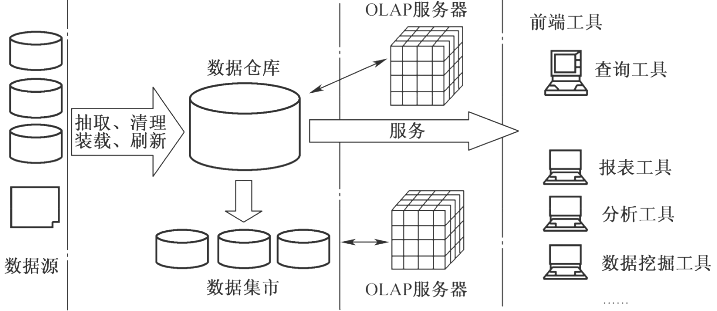
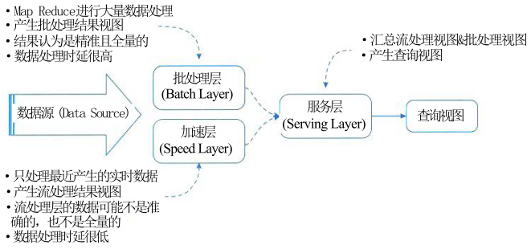
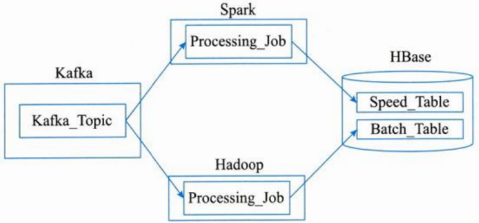
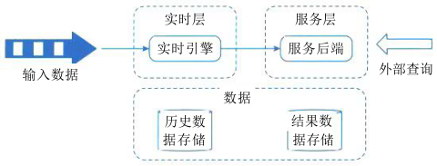
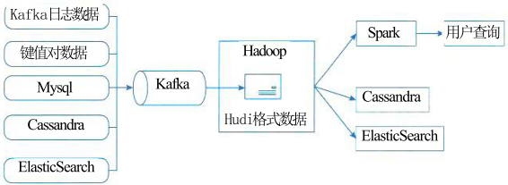
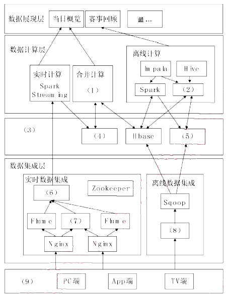

# 大数据架构设计

## 最佳实践

### 考察问

1. Lambda架构: 
    1. 组成: 
        1. `()`层(hadoop, hdfs)
        2. `()`层(spark)
        3. `()`层(hbase)
2. Kappa架构
    1. 组成: 放弃`()`层, 仅保留`()`层(加速层)

3. Lambda和Kappa的特点

    |对比内容|Lambda架构|Kappa架构|
    | ---- | ---- | ---- |
    |复杂度与开发、维护成本|需要维护两套系统，复杂度`()`，开发、维护成本`()`|只需要维护一套系统（引擎），复杂度`()`，开发、维护成本`()`|
    |计算开销|需要一直运行批处理和实时计算，计算开销`()`|必要时进行全量计算，计算开销相对较`()`|
    |实时性|满足实时性|满足实时性|
    |历史数据处理能力|批式全量处理，吞吐量`()`，历史数据处理能力`()`|流式全量处理，吞吐量相对较`()`，历史数据处理能力相对较`()`|

4. 数据分层

    1. `()`(Application Data Service, ADS): 存在业务数据库中, 如MySQL, ES、Redis, 用于业务查询, 形成`()`
    2. `()`(Data Warehouse Service, DWS), 整合成`()`的数据服务层, 用于OLAP、数据分发, 形成`()`
    3. `()`(Data Warehouse Middle, DWM): 在DWD的基础上进行聚合操作，算出相应的`()`, 形成`()`
    4. 数据细节层(Data Warehouse Details, DWD): 业务层和数据仓库层的`()`, 清洗数据, 保持`()`, 形成`()`
    5. 贴源层(Operation Data Store, ODS)直接接入数据的：业务库、埋点日志、消息队列等, 形成`()`

### 考察点

1. Lambda架构: 
    1. 组成: 
        1. `批处`层(hadoop, hdfs)
        2. `加速`层(spark)
        3. `服务`层(hbase)
2. Kappa架构
    1. 组成: 放弃`批处理`层, 仅保留`实时`层(加速层)

3. Lambda和Kappa的特点

    |对比内容|Lambda架构|Kappa架构|
    | ---- | ---- | ---- |
    |复杂度与开发、维护成本|需要维护两套系统，复杂度`高`，开发、维护成本`高`|只需要维护一套系统（引擎），复杂度`低`，开发、维护成本`低`|
    |计算开销|需要一直运行批处理和实时计算，计算开销`大`|必要时进行全量计算，计算开销相对较`小`|
    |实时性|满足实时性|满足实时性|
    |历史数据处理能力|批式全量处理，吞吐量`大`，历史数据处理能力`强`|流式全量处理，吞吐量相对较`低`，历史数据处理能力相对较`弱`|

4. 数据分层

    1. `应用服务层`(Application Data Service, ADS): 存在业务数据库中, 如MySQL, ES、Redis, 用于业务查询, 形成`报表`
    2. `数仓服务层`(Data Warehouse Service, DWS), 整合成`主题`的数据服务层, 用于OLAP、数据分发, 形成`宽表`
    3. `数仓中间层`(Data Warehouse Middle, DWM): 在DWD的基础上进行聚合操作，算出相应的`统计指标`, 形成`指标表`
    4. 数据细节层(Data Warehouse Details, DWD): 业务层和数据仓库层的`隔离层`, 清洗数据, 保持`和ODS层相同颗粒度`, 形成`清洗表`
    5. 贴源层(Operation Data Store, ODS)直接接入数据的：业务库、埋点日志、消息队列等, 形成`原始表`

## 传统数据处理系统存在的问题

传统数据库的数据过载问题：传统应用的数据系统架构设计时，应用直接访问数据库系统。当用户访问量增加时，数据库无法支撑日益增长的用户请求的负载，从而导致数据库服务器无法及时响应用户请求，出现超时的错误。常用解决方法有：

1. 增加异步处理队列
2. 建立数据库水平分区
3. 建立数据库分片或重新分片
4. 引入读写分离技术
5. 引入分库分表技术

✨分区侧重单数据库内性能优化和管理；分库分表从库和表维度拆分，缓解单库单表压力；分片是分布式场景下提升数据库扩展性和性能的手段 。

1. 分区: 逻辑上仍是一张表，底层由多个物理区块组成。
2. 分库分表: 逻辑上拆分
3. 分片: 分布式

现代大数据处理技术主要有：

1. 基于分布式文件系统Hadoop
2. 使用Map/Reduce或Spark数据处理技术
3. 使用Kafka数据传输消息队列及Avro二进制格式

大数据的利用过程分为：采集、清洗、统计和挖掘4个过程。

## 数据仓库概念

数据仓库是一个面向主题的、集成的、相对稳定的、反映历史变化的数据集合，用于支持管理决策。

OLAP服务器：联机分析处理服务器，快速汇总大量数据并进行高效查询分析，为分析人员提供决策支持。

## 数据仓库的结构

四个层次:

1. 数据源：是数据仓库系统的基础，是整个系统的数据源泉。
2. 数据的存储与管理：是整个数据仓库系统的核心。
3. OLAP(联机分析处理)服务器：对分析需要的数据进行有效集成，按多维模型组织，以便进行多角度、多层次的分析，并发现趋势。
4. 前端工具：主要包括各种报表工具、查询工具、数据分析工具、数据挖掘工具以及各种基于数据仓库或数据集市的应用开发工具。

## 数据仓库与数据库的对比

|对比项|数据仓库|数据库|
| ---- | ---- | ---- |
|面向对象|面向主题的|面向事务的|
|数据结构|数据结构是集成的，具有一致性|数据结构更为复杂|
|数据状态|是静态的历史数据，只能定期添加、刷新|是动态变化的，业务发生，数据就更新|
|数据类型|存储历史数据|存储实时、在线数据|
|设计冗余|设计需要引入冗余|设计尽量避免冗余|

## 数据分层

1. `应用服务层`(Application Data Service, ADS): 存在业务数据库中, 如MySQL, ES、Redis, 用于业务查询, 形成`报表`
2. `数仓服务层`(Data Warehouse Service, DWS), 整合成`主题`的数据服务层, 用于OLAP、数据分发, 形成`宽表`
3. `数仓中间层`(Data Warehouse Middle, DWM): 在DWD的基础上进行聚合操作，算出相应的`统计指标`, 形成`指标表`
4. 数据细节层(Data Warehouse Details, DWD): 业务层和数据仓库层的`隔离层`, 清洗数据, 保持`和ODS层相同颗粒度`, 形成`清洗表`
5. 贴源层(Operation Data Store, ODS)直接接入数据的：业务库、埋点日志、消息队列等, 形成`原始表`

## 大数据处理系统架构分析

大数据带来的三大挑战：

1. 如何利用信息技术等手段处理非结构化和半结构化数据。
2. 如何探索大数据复杂性、不确定性特征描述的刻画方法及大数据的系统建模。
3. 数据异构性与决策异构性的关系对大数据知识发现与管理决策的影响。

大数据处理系统架构特征：

1. 鲁棒性和容错性
2. 低延迟读取和更新能力
3. 横向扩容
4. 通用性
5. 延展性
6. 即席查询能力
7. 最少维护能力
8. 可调试性

## Lambda 架构

Lambda 架构设计目的在于提供一个能满足大数据系统关键特性的架构，包括高容错、低延迟、可扩展等。其整合离线计算与实时计算，融合不可变性、读写分离和复杂性隔离等原则。Lambda 是用于同时处理离线和实时数据的，可容错的，可扩展的分布式系统。它具备强鲁棒性，提供低延迟和持续更新。

Lambda 架构应用场景：机器学习、物联网、流处理。

### Lambda 架构介绍

如图所示，Lambda 架构可分解为三层，即批处理层、加速层和服务层。

1. 批处理层(Batch Layer)：存储数据集，Batch Layer在数据集上预先计算查询函数，并构建查询所对应的View。Batch Layer可以很好地处理离线数据，但有很多场景数据不断实时生成，并且需要实时查询处理。Speed Layer正是用来处理增量的实时数据。
2. 加速层(Speed Layer)：Batch Layer处理的是全体数据集，而Speed Layer处理的是最近的增量数据流。Speed Layer为了效率，在接收到新的数据后会不断更新Real-time View，而Batch Layer是根据全体离线数据集直接得到Batch View。
3. 服务层(Serving Layer)：Serving Layer用于合并Batch View和Real-time View中的结果数据集到最终数据集。用于响应用户的查询请求。

### Lambda 架构实现

如图所示，在这种Lambda架构实现中，Hadoop(HDFS)用于存储主数据集，Spark(或Storm)可构成速度层(Speed Layer)，HBase(或Cassandra)作为服务层，由Hive创建可查询的视图。

Hadoop是被设计成适合运行在通用硬件上的分布式文件系统。HDFS是一个具有高度容错性的系统，能提供高吞吐量的数据访问，非常适合大规模数据集上的应用。HDFS放宽了一些约束，以达到流式读取文件系统数据的目的。

Apache Spark是专为大规模数据处理而设计的快速通用的计算引擎。Spark中间输出结果可以保存在内存中，从而不再需要读写HDFS，因此Spark能更好地适用于数据挖掘与机器学习等需要迭代的Map Reduce算法。

HBase - Hadoop Database，是一个高可靠性、高性能、面向列、可伸缩的分布式存储系统，利用HBase技术可在廉价PCServer上搭建起大规模结构化存储集群。

### Lambda架构的优缺点

Lambda架构的优点：容错性好、查询灵活度高、易伸缩、易扩展。
Lambda架构的缺点：全场景覆盖带来的编码开销。针对具体场景重新离线训练一遍益处不大。重新部署和迁移成本很高。

### Lambda与其他架构模式对比

1. 事件溯源(Event Sourcing)与Lambda架构
    Event Sourcing本质上是一种数据持久化的方式，其由三个核心观点构成：

    1. 整个系统以事件为驱动，所有业务都由事件驱动来完成。
    2. 事件是核心，系统的数据以事件为基础，事件要保存在某种存储上。
    3. 业务数据只是一些由事件产生的视图，不一定要保存到数据库中。

    Lambda架构中数据集的存储使用的概念与Event Sourcing中的思想完全一致，二者都是在使用统一的数据模型对数据处理事件本身进行定义。这样在发生错误的时候，能够通过模型找到错误发生的原因，对这一事件进行重新计算以丢弃错误信息，恢复到系统应该的正确状态，以此实现了系统的容错性。

2. CQRS与Lambda架构

    CQRS架构分离了对于数据进行的读操作(查询)和写(修改)操作。其将能够改变数据模型状态的命令和对于模型状态的查询操作实现了分离。这是领域驱动设计的一个架构模式，主要用来解决数据库报表的输出处理方式。

    Lambda架构中，数据的修改通过批处理和流处理实现，通过写操作将数据转换成查询时所对应的View。在Lambda架构中，对数据进行查询时，实际上是通过读取View直接得到结果，读出所需的内容。这实际上是一种形式的读写分离。

## Kappa架构

### Kappa架构介绍

Kappa架构的原理就是：在Lambda的基础上进行了优化，删除了Batch Layer的架构，将数据通道以消息队列进行替代。因此对于Kappa架构来说，依旧以流处理为主，但是数据却在数据湖层面进行了存储，当需要进行离线分析或者再次计算的时候，则将数据湖的数据再次经过消息队列重播一次则可。

如图所示，输入数据直接由实时层的实时数据处理引擎对源源不断的源数据进行处理，再由服务层的服务后端进一步处理以提供上层的业务查询。而中间结果的数据都是需要存储的，这些数据包括历史数据与结果数据，统一存储在存储介质中。

从使用场景上来看，Kappa架构与Lambda相比，主要有两点区别：

1. Kappa不是Lambda的替代架构，而是其简化版本，Kappa放弃了对批处理的支持，更擅长业务本身为增量数据写入场景的分析需求；
2. Lambda直接支持批处理，因此更适合对历史数据分析查询的场景。

### Kappa架构的优缺点

Kappa架构的优点在于将实时和离线代码统一起来，方便维护而且统一了数据口径的问题，避免了Lambda架构中与离线数据合并的问题，查询历史数据的时候只需要重放存储的历史数据即可。

Kappa的缺点：
1. 消息中间件缓存的数据量和回溯数据有性能瓶颈。通常算法需要过去180天的数据，如果都存在消息中间件，无疑有非常大的压力。同时，一次性回溯订正180天级别的数据，对实时计算的资源消耗也非常大。
2. 在实时数据处理时，遇到大量不同的实时流进行关联时，非常依赖实时计算系统的能力，很可能因为数据流先后顺序问题，导致数据丢失。
3. Kappa在抛弃了离线数据处理模块的时候，同时抛弃了离线计算更加稳定可靠的特点。Lambda虽然保证了离线计算的稳定性，但双系统的维护成本高且两套代码带来后期运维困难。

### 常见Kappa架构变形

1. Kappa+架构

    Kappa+是流式数据处理架构，它的核心思想是让流计算框架直接读HDFS里的数据仓库数据，一并实现实时计算和历史数据backfill计算，不需要为backfill作业长期保存日志或者把数据拷贝回消息队列。开发了Apache hudi框架来存储数据仓库数据，hudi支持更新、删除已有parquet数据，也支持增量消费数据更新部分。

    如图所示，将不同来源的数据通过Kafka导入到Hadoop中，通过HDFS来存储中间数据，再通过spark对数据进行分析处理，最后交由上层业务进行查询。

    

2. 混合分析系统的Kappa架构

    混合分析系统的Kappa架构：Lambda和Kappa架构都还有展示层的困难点，结果视图如何支持热点数据查询分析，一个解决方案是在Kappa基础上衍生数据分析流程。

    在基于使用Kafka+Flink构建Kappa流计算数据架构，针对Kappa架构分析能力不足的问题，再利用Kafka对接组合Elastic-Search实时分析引擎，部分弥补其数据分析能力。但是Elastic Search也只适合对合理数据量级的热点数据进行索引，无法覆盖所有批处理相关的分析需求，这种混合架构某种意义上属于Kappa和Lambda间的折中方案。

## Lambda架构与Kappa架构的对比和设计选择

### Lambda架构与Kappa架构的特性对比

|对比内容|Lambda架构|Kappa架构|
| ---- | ---- | ---- |
|复杂度与开发、维护成本|需要维护两套系统，复杂度高，开发、维护成本高|只需要维护一套系统（引擎），复杂度低，开发、维护成本低|
|计算开销|需要一直运行批处理和实时计算，计算开销大|必要时进行全量计算，计算开销相对较小|
|实时性|满足实时性|满足实时性|
|历史数据处理能力|批式全量处理，吞吐量大，历史数据处理能力强|流式全量处理，吞吐量相对较低，历史数据处理能力相对较弱|

### Lambda架构与Kappa架构的设计选择

根据两种架构对比分析，将业务需求、技术要求、系统复杂度、开发维护成本和历史数据处理能力作为选择考虑因素。而计算开销虽然存在一定差别，但是相差不是很大，所以不作为考虑因素。

1. 业务需求与技术要求：如果业务对于Hadoop、Spark、Strom等关键技术有强制性依赖，选择Lambda架构可能较为合适；如果处理数据偏好于流式计算，又依赖Flink计算引擎，那么选择Kappa架构可能更为合适。
2. 复杂度：如果项目中需要频繁地对算法模型参数进行修改，Lambda架构需要反复修改两套代码，则显然不如Kappa架构简单方便。同时，如果算法模型支持同时执行批处理和流式计算，或者希望用一份代码进行数据处理，那么可以选择Kappa架构。
3. 开发维护成本：Lambda架构需要有一定程度的开发维护成本，包括两套系统的开发、部署、测试、维护，适合有足够经济、技术和人力资源的开发者。而Kappa架构只需要维护一套系统，适合不希望在开发维护上投入过多成本的开发者。
4. 历史数据处理能力：有些情况下，项目会频繁接触海量数据集进行分析，比如过往十年内的地区降水数据等，这种数据适合批处理系统进行分析，应该选择Lambda架构。如果始终使用小规模数据集，流处理系统完全可以使用，则应该选择Kappa架构。

🔒问题

1. 某网作为某电视台在互联网上的大型门户入口，某一年成为某奥运会中国大陆地区的特权转播商，独家全程直播了某奥运会全部的赛事，积累了庞大稳定的用户群，这些用户在使用各类服务过程中产生了大量数据，对这些海量数据进行分析与挖掘，将会对节目的传播及商业模式变现起到重要的作用。

    该奥运期间需要对增量数据在当日概览和赛事回顾两个层面上进行分析。

    其中，当日概览模块需要秒级刷新直播在线人数、网站的综合浏览量、页面停留时间、视频的播放次数和平均播放时间等干万级数据量的实时信息，而传统的分布式架构采用重新计算的方式分析实时数据，在不扩充以往集群规模的情况下，无法在几秒内分析出重要的信息。

    赛事回顾模块需要展现自定义时间段内的历史最高在线人数、逐日播放走势、直播最高在线人数和点播视频排行等海量数据的统计信息，由于该奥运期间产生的数据通常不需要被经常索引、更新，因此要求采用不可变方式存储所有的历史数据，以保证历史数据的准确性。

    1. (8分)请根据Lambda架构和Kappa架构特点，填写以下表格(2023下)

        |对比内容|Lambda架构|Kappa架构|
        | ---- | ---- | ---- |
        |复杂度与开发、维护成本|需要维护(1)套系统(引擎)，复杂度(高)，开发、维护成本(高)|只需要维护(1)套系统(引擎)，复杂度(低)，开发、维护成本(低)|
        |计算开销|需要一直运行批处理和实时计算，计算开销大|主要是流式计算，计算开销相对小|
        |实时性|满足实时性|满足实时性且更侧重实时处理|
        |历史数据处理能力|批式全量处理，吞吐量(高)，历史数据处理能力强|流式全量处理，吞吐量相对较低，历史数据处理能力(弱)|

        1.两, 2.一, 3.高, 4.低, 5.必要时全量计算, 计算开销小, 6.满足, 7.大, 8.弱

    2. (9分)下图1给出了某网奥运的大数据架构图，请根据下面的(a)~(n)的相关技术，判断这些技术属于架构图的哪个部分，补充完善下图的(1)-(9)的空白处。(2023下)

        (a)Nginx；(b)HBase；(c)Spark Streaming；(d)Spark；(e)MapReduce；(f)ETL；(g)MemSQL；(h)HDFS；(i)Sqoop；(j)Flume；(k)数据存储层；(l)Kafka数据采集层；(m)业务逻辑层；

        

        (1)d (2)e (3)k (4)g (5)h (6)l (7)j (8)f (9)m

    3. (8分)大数据的架构包括了Lambda架构和Kappa架构，Lambda架构分解为三层：即(1)、(2)和(3)；Kappa架构不同于Lambda同时计算流计算和批计算并合并视图，Kappa只会通过流计算一条的数据链路计算并产生视图。请问该系统的大数据架构是基于哪种架构搭建的大数据平台处理奥运会大规模视频网络观看数据。(2023下)

        1. (1)批处理层 (2)加速层 (3)服务层
        2. Lambda架构。

2. (11分)HDFS和HBASE(2024上)

    1. 栅格瓦片(RasterTiles)：
        - 描述：栅格瓦片是由像素组成的图像数据，通常用于地图、卫星图像等。
        - 适用场景：适合存储在HDFS(Hadoop Distributed File System)中，因为HDFS擅长处理`大文件和顺序读取`。栅格瓦片通常是大文件，HDFS的设计优化了这种类型的数据存储和处理。
        - 存储建议：使用HDFS存储栅格瓦片数据，因为HDFS提供了高吞吐量的读写性能，并且能够很好地扩展来处理大量的数据。
    2. 矢量瓦片(Vector Tiles)：
        - 描述：矢量瓦片是基于矢量数据的瓦片格式，通常以JSON、MVT(Mapbox Vector Tiles)等格式存储，包含点、线、多边形等地理信息。
        - 适用场景：适合使用HBase存储，因为HBase是一个分布式、面向列的数据库，擅长处理`大量的小文件和随机读写操作`。矢量瓦片的数据结构(如JSON)可以很好地映射到HBase的列族和列中。
        - 存储建议：使用HBase存储矢量瓦片数据，因为HBase提供了低延迟的随机读写性能，并且可以高效地存储和查询结构化和半结构化数据。
    总结：
        - 格瓦片：优先使用HDFS存储，以利用其高吞吐量和`大文件`处理能力。
        - 矢量瓦片：优先使用HBase存储，以利用其高效的`小文件`处理和`低延迟`随机读写能力。

