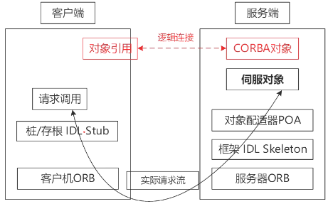
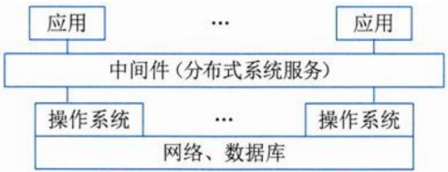

# 构件与中间件

## 最佳实践

### 考察问

1. 零碎知识
    1. 构件是`()`部署单元, `()`外部可见状态
    2. `()`是CORBA对象的真正实现，负责完成客户端请求
    3. 中间件提供的支持通常包括两方面：`()`, `()`
    4. 在构件的定义中， `(接口/模块)`是一个已命名的一组操作的集合。
    5. 在`()`重用形式下，一个外部对象拥有指向一个内部对象的唯一引用，外部对象只是把请求转发给内部对象：在`()`重用形式下，直接把内部对象的接口引用传给外部对象的客户，而不再转发请求。

### 考察点

1. 容错技术
    1. `防卫式程序设计`：通过在程序中包含错误检查代码和错误恢复代码，使得一旦发生错误，程序就能撤销错误状态，恢复到一个已知的正确状态中去。
    1. `冗余技术`: 冗余是指在正常系统运行所需的基础上加上一定数量的资源，包括信息、时间、硬件和软件。
    2. `N版本程序设计`：是一种静态的故障屏蔽技术，其设计思想是用N个具有相同功能的程序同时执行一项计算，结果通过多数表决来选择
    3. `双机容错`技术: 一旦心跳信号表明主机系统发生故障，或者备用系统无法收到主系统的心跳信号，则系统的高可用性管理软件认为主系统发生故障，立即将系统资源转移到备用系统上，备用系统替代主系统工作，以保证系统正常运行和网络服务不间断

1. 零碎知识
    1. 构件是`独立`部署单元, `没有`外部可见状态
    2. `伺服对象（Servant）`是CORBA对象的真正实现，负责完成客户端请求
    3. 中间件提供的支持通常包括两方面：`交互支持`, `提供公共服务`
    4. 在构件的定义中， `(接口)`是一个已命名的一组操作的集合。
    5. 在`包含`重用形式下，一个外部对象拥有指向一个内部对象的唯一引用，外部对象只是把请求转发给内部对象：在`聚集`重用形式下，直接把内部对象的接口引用传给外部对象的客户，而不再转发请求。

## 构件

### 构件定义

定义1：软件构件是一种组装单元，它具有规范的接口规约和显式的语境依赖。软件构件可以被独立地部署并由第三方任意地组装。

定义2：构件是某系统中有价值的、几乎独立的并可替换的一个部分，它在良好定义的体系结构语境内满足某清晰的功能。可以通过其接口访问它的服务。

定义3：构件是一个独立发布的功能部分，可以通过其接口访问它的服务。

|  | 模块的特性 | 对象的特性 | 构件的特性 |
| --- | --- | --- | --- |
|  | 结构化开发的产物 | 1. 一个实例单元，具有唯一的标志； 2. 可能具有状态，此状态外部可见； 3. 封装了自己的状态和行为。 | 1. 独立部署单元； 2. 作为第三方的组装单元； 3. 没有（外部的）可见状态。 | 

### 构件接口

接口标准化是对接口中消息的格式、模式和协议的标准化。它不是要将接口格式化为参数化操作的集合，而是关注输入输出的消息的标准化，它强调当机器在网络中互连时，标准的消息模式、格式、协议的重要性。

### 面向构件的编程（COP）

关注于如何支持建立面向构件的解决方案。面向构件的编程需要下列基本的支持：

- 多态性（可替代性）
- 模块封装性（高层次信息的隐藏）
- 后期的绑定和装载（部署独立性）
- 安全性（类型和模块安全性）

构件技术就是利用某种编程手段，将一些人们所关心的，但又不便于让最终用户去直接操作的细节进行了封装，同时对各种业务逻辑规则进行了实现，用于处理用户的内部操作细节。目前，国际上常用的构件标准主要有三大流派：

- EJB（Enterprise Java Bean）规范由Sun公司制定，有三种类型的EJB，分别是会话Bean（Session Bean）、实体Bean（Entity Bean）和消息驱动Bean（Message - driven Bean）。EJB实现应用中关键的业务逻辑，创建基于构件的企业级应用程序。 

- COM、DCOM、COM+：组件对象模型，COM是微软公司的。DCOM是COM的进一步扩展，具有位置独立性和语言无关性。COM+并不是COM的新版本，是COM的新发展或是更高层次的应用。 

- COBRA标准，是由OMG制定的一种面向对象分布式应用程序体系规范。主要分为三个层次：对象请求代理、公共对象服务和公共设施。最底层是对象请求代理ORB，规定了分布对象的定义（接口）和语言映射，实现对象间的通讯和互操作，是分布对象系统中的“软总线”；在ORB之上定义了很多公共对象服务，可以提供诸如并发服务、名字服务、事务(交易)服务、安全服务等各种各样的服务；最上层的公共设施则定义了组件框架，提供可直接为业务对象使用的服务，规定业务对象有效协作所需的协定规则。 

    

🔒题目:

1. 💚以下有关构件特征的的描述，说法不正确的是(  )。

    - A. 构件是独立的部署单元
    - B. 构件可作为第三方的组装单元
    - C. 构件没有外部的可见状态
    - D. 构件作为部署单元是可拆分的

    答案: D

2. CORBA服务端构件模型中，（  ）是CORBA对象的真正实现，负责完成客户端请求。
    - A. 伺服对象（Servant）
    - B. 对象适配器（Object Adapter）
    - C. 对象请求代理（Object Request Broker）
    - D. 适配器激活器（Adapter Activator） 

    答案: A

## 中间件

中间件是指在一个分布式系统环境中处于操作系统和应用程序之间的系统级软件，可以在不同的技术之间共享资源，将不同的操作系统、数据库、异构的网络环境以及若干应用结合成一个有机的协同工作整体。

中间件位于客户机/服务器的操作系统之上，管理计算机资源和网络通信，有如下特点：

1. 中间件是一类软件，而非一种软件
2. 中间件不仅仅实现互连，还要实现应用之间的互操作
3. 中间件是基于分布式处理的软件，最突出的特点是其网络通信功能

中间件的任务是使应用程序开发变得更容易，通过提供统一的程序抽象，隐藏异构系统和分布式系统下低级别编程的复杂度。

中间件提供的支持通常包括两方面：

- 交互支持：协调系统中不同组件之间的通信和数据交换。中间件可以提供消息队列、远程过程调用（RPC）、对象请求代理（ORB）等机制，以实现分布式环境中的进程间通信（IPC）。这些机制使得应用程序不必关心底层网络细节，能够更专注于业务逻辑。 
- 提供公共服务：中间件提供对服务的可复用的实现，如事务管理、安全服务、命名和目录服务、持久化服务、负载均衡、故障恢复和容错能力等。这些服务有助于解决分布式系统中常见的问题，如一致性、可用性和伸缩性。 

中间件的功能：

- 负责客户机与服务器之间的连接和通信，以及客户机与应用层之间的高效率通信机制。
- 提供应用层不同服务之间的互操作机制，以及应用层与数据库之间的连接和控制机制。 
- 提供多层架构的应用开发和运行的平台，以及应用开发框架，支持模块化的应用开发。 
- 屏蔽硬件、操作系统、网络和数据库的差异。 
- 提供应用的负载均衡和高可用性、安全机制与管理功能，以及交易管理机制，保证交易的一致性。 
- 提供一组通用的服务去执行不同的功能，避免重复的工作和使应用之间可以协作。 

中间件的分类：

1. 通信处理（消息）中间件：保证系统能在不同平台之间通信，利用消息传递机制实现分布式系统中可靠的、高效的、实时的跨平台数据传输。例如IBM的MQSeries。
2. 事务处理（交易）中间件：实现协调处理顺序、监视和调度、负载均衡等功能。例如BEA的Tuxedo。
3. 数据存取管理中间件：为不同种类数据的读写和加解密提供统一的接口。例如Windows平台的ODBC和Java平台的JDBC等。
4. Web服务器中间件：提供Web程序执行的运行时容器。例如Tomcat、JBOSS等。
5. 安全中间件：用中间件屏蔽操作系统的缺陷，提升安全等级。例如Kerberos、SSL/TLS。
6. 跨平台和架构的中间件：用于开发大型应用软件。例如CORBA、JavaBeans、COM+模型。
7. 专用平台中间件：为解决特定应用领域的开发设计问题提供构件库。例如Android SDK、iOS SDK。
8. 网络中间件：包括网管、接入、网络测试、虚拟社区和虚拟缓冲等，也是当前最热门的研发项目。例如TCP/IP协议栈、HTTP服务器。

🔒题目:

1. ❤️在分布式系统中，中间件通常提供两种不同类型的支持，即______。
    - A. 数据支持和交互支持 
    - B. 交互支持和提供公共服务
    - C. 安全支持和提供公共服务 
    - D. 数据支持和提供公共服务

    - 答案: B 

2. ❤️在构件的定义中， （ ） 是一个已命名的一组操作的集合。

    - A. 接口
    - B. 对象
    - C. 函数
    - D. 模块

    - 答案：A 

3. ❤️为实现对象重用，COM支持两种形式的对象组装。在 （  ） 重用形式下，一个外部对象拥有指向一个内部对象的唯一引用，外部对象只是把请求转发给内部对象：在 （  ） 重用形式下，直接把内部对象的接口引用传给外部对象的客户，而不再转发请求。

    - A. 聚集
    - B. 包含
    - C. 链接
    - D. 多态

    - A. 引用
    - B. 转发
    - C. 包含
    - D. 聚集

    - 答案：B  D 

