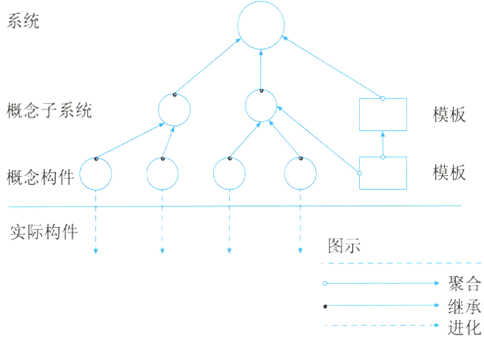
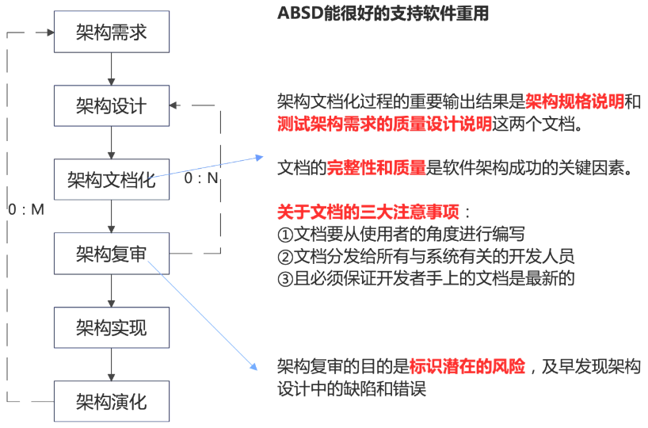
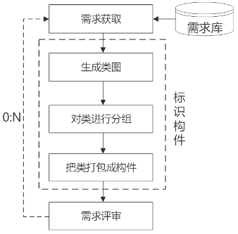
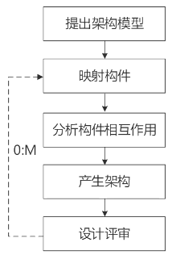
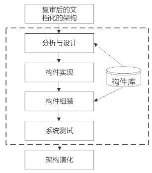
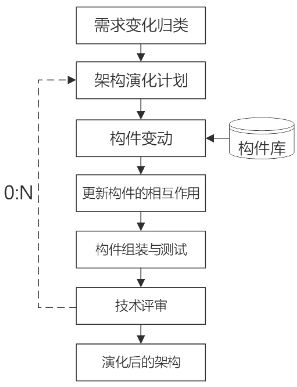

# 基于架构的软件设计

## 最佳实践

### 考察问

1. 基于架构的软件设计(Architecture-Based Software Design，ABSD)
2. ABSD由`()`、`()`和`()`需求驱动架构设计
3. ABSD方法有三个基础: `()`, `()`, `()`
4. ABSD方法是一个自顶向下, 在最顶层，系统被分解为若干`()`和一个或若干个`()`。在第2层，概念子系统又被分解成`()`和一个或若干个`()`。直到能产生`()`.
5. 在基于体系结构的软件设计方法中，采用`()`来描述软件架构，采用`()`来描述功能需求，采用 `()`来描述质量需求。
6. ABSD分成六个部分: `()`，`()`，`()`，`()`，`()`, `()`
7. ABSD架构需求的三个方面: 分别是系统的`()`、系统的`()`和系统`()`

### 考察点

1. 基于架构的软件设计(Architecture-Based Software Design，ABSD)
2. ABSD由`商业`、`质量`和`功能`需求驱动架构设计
3. ABSD方法有三个基础: `功能`的分解, 选择`架构风格`, `软件模板`的使用
4. ABSD方法是一个自顶向下, 在最顶层，系统被分解为若干`概念子系统`和一个或若干个`软件模板`。在第2层，概念子系统又被分解成`概念构件`和一个或若干个`附加软件模板`。直到能产生`软件构件和类`.
5. 在基于体系结构的软件设计方法中，采用`视角与视图`来描述软件架构，采用`用例`来描述功能需求，采用 `质量场景`来描述质量需求。
6. ABSD分成六个部分: `架构需求`，`架构设计`，`架构文档化`，`架构复审`，`架构实现`, `架构演化`
7. ABSD架构需求的三个方面: 分别是系统的`质量目标`、系统的`商业目标`和系统`开发人员的业务目标`

## 概述

基于架构的软件设计（Architecture-Based Software Design，ABSD）方法是由架构驱动，即由构成架构的商业、质量和功能需求的组合驱动架构设计。它强调采用视角和视图来描述软件架构，采用用例和质量属性场景来描述需求。进一步来说，用例描述的是功能需求，质量属性场景描述的是质量需求(或侧重于非功能需求)。

使用ABSD方法，设计活动可以从项目总体功能框架明确就开始，这意味着需求获取和分析还没有完成，就开始了软件设计。

ABSD方法有三个基础。

1. 第一个基础是功能的分解，使用已有的基于模块的内聚和耦合技术
2. 第二个基础是通过选择架构风格来实现质量和商业需求
3. 第三个基础是软件模板的使用，软件模板利用了一些软件系统的结构。

ABSD方法是递归的，且迭代的每一个步骤都是清晰定义的。因此，不管设计是否完成，架构总是清晰的，有助于降低架构设计的随意性。 

🔒题目:

1. ❤️基于架构的软件设计(Architecture-Based Software Design，ABSD)方法进行软件设计与开发。ABSD方法有三个基础，分别是对系统进行______分解、采用合适的架构风格实现质量属性与商业需求、采用软件模板设计软件结构。

    - A. 系统 
    - B. 模块 
    - C. 子系统 
    - D. 功能

    答案: D

### 设计元素

ABSD方法是一个自顶向下，递归细化的方法，软件系统的体系结构通过该方法得到细化，直到能产生软件构件和类。

ABSD方法中使用的设计元素如下所示。在最顶层，系统被分解为若干概念子系统和一个或若干个软件模板。在第2层，概念子系统又被分解成概念构件和一个或若干个附加软件模板。 

🔒题目:

1. 💛ABSD方法是一个自顶向下，递归细化的方法，ABSD方法在最顶层，系统被分解为若干______和一个或者多个软件模板。

    - A. 系统
    - B. 构件
    - C. 模块
    - D. 概念子系统

    答案: D

2. ❤️基于体系结构的软件设计（Architecture-Based Software Design，ABSD）方法是体系结构驱动，是指构成体系结构的(  )的组合驱动的。ABSD方法是一个自顶向下、递归细化的方法，软件系统的体系结构通过该方法得到细化，直到能产生(  )。

    - A. 产品、功能需求和设计活动 
    - B. 商业、质量和功能需求 
    - C. 商业、产品和功能需求 
    - D. 商业、质量和设计活动

    - A. 软件产品和代码 
    - B. 软件构件和类 
    - C. 软件构件和连接件 
    - D. 类和软件代码

    答案: B B

### 视角与视图

考虑体系结构时，要从不同的视角（Perspective）来观察对架构的描述，这需要软件设计师考虑体系结构的不同属性。例如，展示功能组织的静态视角能判断质量特性，展示并发行为的动态视角能判断系统行为特性，因此，选择的特定视角或视图（如`逻辑视图`、`进程视图`、`实现视图`和`配置视图` ）可以全方位的考虑体系结构设计。使用逻辑视图来记录设计元素的功能和概念接口，设计元素的功能定义了它本身在系统中的角色，这些角色包括功能、性能等。

### 用例和质量场景

用例已经成为推测系统在一个具体设置中的行为的重要技术，用例被用在很多不同的场合，用例是系统的一个给予用户一个结果值的功能点，用例用来捕获功能需求。

在使用用例捕获功能需求的同时，人们通过定义特定场景来捕获质量需求，并称这些场景为质量场景。 

🔒题目

2. 🔴在基于体系结构的软件设计方法中，采用 (  ) 来描述软件架构，采用 (  ) 来描述功能需求，采用 (  ) 来描述质量需求。

    - A. 类图和序列图  B. 视角与视图  C. 构件和类图  D. 构件与功能  
    - A. 类图  B. 视角  C. 用例  D. 质量场景  
    - A. 连接件  B. 用例  C. 质量场景  D. 质量属性

    答案: BCC

## 基于架构的软件设计模型

传统的软件开发过程是问题定义，需求分析，软件设计，实现，测试。ABSD把整个软件过程分成六个部分，架构需求，架构设计，架构文档化，架构复审，架构实现和架构演化六个步骤。

1. 架构需求：重在掌握标识构件的三步，如下图。架构需求一般来自3个方面，分别是系统的质量目标、系统的商业目标和系统开发人员的业务目标。

    

2. 架构设计：将需求阶段的标识构件映射成构件，进行分析，如下图。 

    

3. 架构文档化：主要产出两种文档，即架构规格说明和测试架构需求的质量设计说明书。

    关于文档，有三大注意事项：
    - 要从使用者的角度编写文档。
    - 必须将文档分发给所有与系统相关的开发人员。
    - 必须确保开发者手中的文档为最新版本。

4. 架构复审：由外部人员（独立于开发组织之外的人，如用户代表和领域专家等）参加的复审，复审架构能否满足需求、质量需求是否在设计中得到体现、构件的划分是否合理等。若复审不过，则返回架构设计阶段重新进行架构设计、文档化和复审。

5. 架构实现：用实体来显示出架构。实现构件，构件组装成系统，如下图。 

    

6. 架构演化：对架构进行改变，按需求增删构件，使架构可复用，如下图。 

    

🔒题目:

1. 🟡架构需求一般来自三个方面，分别是系统的质量目标、系统的业务目标和(  )。

    - A. 系统开发人员的业务目标
    - B. 公司的经济目标
    - C. 公司的业务目标
    - D. 需求人员的业务目标

    答案: A

2. 🔴ABSDM（Architecture-Based Software Design Model）把整个基于体系结构的软件过程划分为体系结构需求、体系结构设计、体系结构文档化、(  ) 、(  ) 和体系结构演化等6个子过程。其中，(  ) 过程的主要输出结果是体系结构规格说明和测试体系结构需求的质量设计说明书。

    - A. 体系结构复审  B. 体系结构测试  C. 体系结构变更  D. 体系结构管理  
    - A. 体系结构实现  B. 体系结构测试  C. 体系结构建模  D. 体系结构管理  
    - A. 体系结构设计  B. 体系结构需求  C. 体系结构文档化  D. 体系结构测试

    答案: AAC

2. ❤️基于架构的软件设计(Architecture-Based Software Design，ABSD)方法进行软件设计与开发。ABSD方法有三个基础，分别是对系统进行 （ ） 分解、采用合适的架构风格实现质量属性与商业需求、采用软件模板设计软件结构。

    - A. 系统
    - B. 模块
    - C. 子系统
    - D. 功能

    - 答案：D 

3. ❤️基于体系结构的软件设计（Architecture-Based Software Design，ABSD）方法是体系结构驱动，是指构成体系结构的 （ ） 的组合驱动的。ABSD方法是一个自顶向下、递归细化的方法，软件系统的体系结构通过该方法得到细化，直到能产生 （ ） 。

    - A. 产品、功能需求和设计活动
    - B. 商业、质量和功能需求
    - C. 商业、产品和功能需求
    - D. 商业、质量和设计活动

    - A. 软件产品和代码
    - B. 软件构件和类
    - C. 软件构件和连接件
    - D. 类和软件代码

    - 答案：B  B
