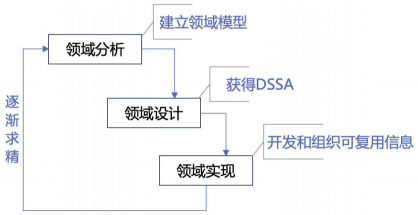
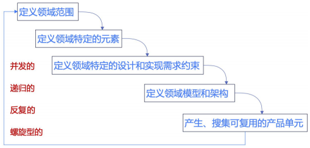
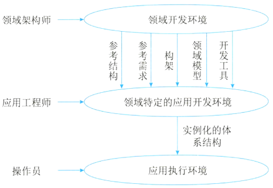

# 特定领域软件体系结构

## 最佳实践

### 考察问

1. DSSA功能覆盖范围:
    1. 垂直域：`()`领域中的通用软件架构
    2. 水平域: `()`领域中的通用软件架构
2. DSSA的基本活动: 领域`()`, 领域`()`, 领域`()`
3. DSSA的参与人员: 领域`()`, 领域`()`, 领域`()`, 领域`()`
4. 在特定应用领域软件体系结构的设计中，`(领域分析/领域设计)`阶段的主要目标是获得领域模型。

### 考察点

1. DSSA功能覆盖范围:
    1. 垂直域：`特定`领域中的通用软件架构
    2. 水平域: `多个`领域中的通用软件架构
2. DSSA的基本活动: 领域`分析`, 领域`设计`, 领域`实现`
3. DSSA的参与人员: 领域`专家`, 领域`分析人员`, 领域`设计人员`, 领域`实现人员`
4. 在特定应用领域软件体系结构的设计中，`领域分析`阶段的主要目标是获得领域模型。

## DSSA的定义

DSSA（Domain Specific Software Architecture，DSSA）就是在一个特定应用领域中为一组应用提供组织结构参考的标准软件体系结构，即用于某一类特定领域的标准软件构件的集合。

DSSA就是一个特定的问题领域中支持一组应用的领域模型、参考需求、参考架构等组成的开发基础，其目标就是支持在一个特定领域中多个应用的生成。

从功能覆盖的范围的角度有两种理解DSSA中领域的含义的方式。

1. 垂直域：定义了一个特定的系统族，包含整个系统族内的多个系统，结果是在该领域中可作为系统的可行解决方案的一个通用软件体系结构。即在一个特定领域中的通用软件架构。
2. 水平域：定义了在多个系统和多个系统族中功能区域的共有部分。在子系统级上涵盖多个系统族的特定部分功能。（如购物和教育都有收费系统，收费系统即是水平域）。 

## DSSA的基本活动

### 领域分析

这个阶段的主要目标是获得领域模型（领域需求）。识别信息源，即整个领域工程过程中信息的来源，可能的信息源包括现存系统、技术文献、问题域和系统开发的专家、用户调查和市场分析、领域演化的历史记录等，在此基础上就可以分析领域中系统的需求，确定哪些需求是领域中的系统广泛共享的，从而建立领域模型。

### 领域设计

这个阶段的主要目标是获得DSSA。DSSA描述在领域模型中表示的需求的解决方案，它不是单个系统的表示，而是能够适应领域中多个系统的需求的一个高层次的设计。建立了领域模型之后，就可以派生出满足这些被建模的领域需求DSSA。

### 领域实现

这个阶段的主要目标是依据领域模型和DSSA开发和组织可重用信息。这些可重用信息可能是从现有系统中提取得到，也可能需要通过新的开发得到。 

## 参与DSSA的人员

参与DSSA的人员可以划分为4种角色：

1. 领域专家：包括该领域中系统的有经验的用户、从事该领域中系统的需求分析、设计、实现以及项目管理的有经验的软件工程师等。主要任务包括提供关于领域中系统的需求规约和实现的知识，帮助组织规范的、一致的领域字典，帮助选择样本系统作为领域工程的依据，复审领域模型、DSSA等领域工程产品等。
2. 领域分析人员：由具有知识工程背景的有经验的系统分析员来担任。主要任务包括控制整个领域分析过程，进行知识获取，将获取的知识组织到领域模型中。 
3. 领域设计人员：由有经验的软件设计人员来担任。主要任务包括根据领域模型和现有系统开发出DSSA，并对DSSA的准确性和一致性进行验证。 
4. 领域实现人员：由有经验的程序设计人员来担任。主要任务包括根据领域模型和DSSA，开发可重用的构件。

## DSSA的建立过程

DSSA的建立过程分为5个阶段：

1. 定义领域范围：领域中的应用要满足用户一系列的需求。
2. 定义领域特定的元素：建立领域的字典，归纳领域中的术语，识别出领域中相同和不相同的元素。
3. 定义领域特定的设计和实现需求的约束：识别领域中的约束，记录这些约束对领域的设计和实现会造成什么后果。 
4. 定义领域模型和架构：产生一般的架构，并描述其构件说明。 
5. 产生、搜集可复用的产品单元：为DSSA增加复用构件，使其可用于新的应用系统。

DSSA的三层次系统模型：

1. 领域开发环境：领域架构师决定核心架构，产出参考结构、参考需求、架构、领域模型、开发工具。
2. 领域特定的应用开发环境：应用工程师根据具体环境来将核心架构实例化。
3. 应用执行环境：操作员实现实例化后的架构。 

🔒题目: 

1. 💚特定领域软件架构（Domam Specifie Sottware Architecture，DSSA）是指特定应用领域中为一组应用提供组织结构参考的标准软件架构。从功能覆盖的范围角度，______定义了一个特定的系统族，包含整个系统族内的多个系统，可作为该领域系统的可行解决方案的一个通用软件架构；______定义了在多个系统和多个系统族中功能区域的共有部分，在子系统级上涵盖多个系统族的特定部分功能。

    - A. 垂直域
    - B. 水平域
    - C. 功能域
    - D. 属性域
    
    - A. 垂直域
    - B. 水平域
    - C. 功能域
    - D. 属性域

    答案：A B 

2. 💚在特定应用领域软件体系结构的设计中，______阶段的主要目标是获得领域模型。

    - A.领域实现 
    - B.领域设计 
    - C.领域建模 
    - D.领域分析

    答案：D 

3. ❤️DSSA（特定领域软件体系结构）是在一个特定应用领域中为一组应用提供组织结构参考的软件体系结构，参与DSSA的人员可以划分为4种角色，包括领域专家、领域设计人员、领域实现人员和（  ），其基本活动包括领域分析、领域设计和（  ）。

    - A. 领域测试人员  B. 领域顾问  C. 领域分析师  D. 领域经理
    - A. 领域建模  B. 架构设计  C. 领域实现  D. 领域评估

    答案: CC