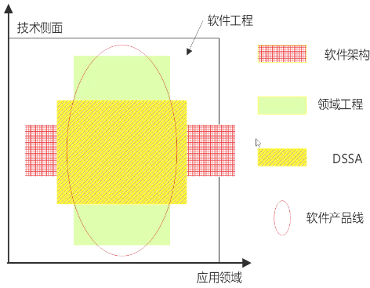
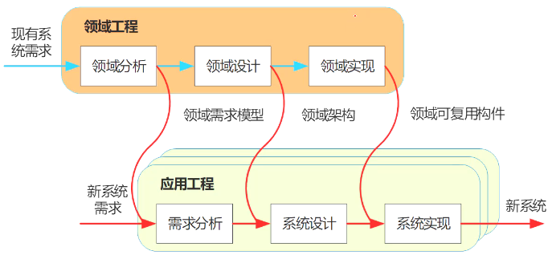

# 软件产品线

## 基本概念

## 双生命周期模型

|  | 演化方式 | 革命方式 |
| --- | --- | --- |
| 基于现有产品 | 基于现有产品架构设计产品线的架构，经演化现有构件，开发产品线构件 | 核心资源的开发基于现有产品集的需求和可预测的、将来需求的超集 |
| 全新产品线 | 产品线核心资源随产品新成员的需求而演化 | 开发满足所有预期产品线成员的需求的核心资源 | 

## 组织结构类型

1. 设立独立的核心资源小组
2. 不设立独立的核心资源小组
3. 动态的组织结构

## 要成功实施产品线，主要取决于以下因素

1. 对该领域具备长期和深厚的经验
2. 一个用于构建产品的好的核心资源库
3. 好的产品线架构
4. 好的管理（软件资源、人员组织、过程）支持 
