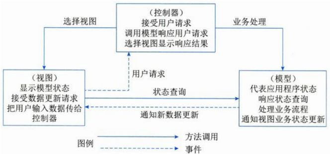
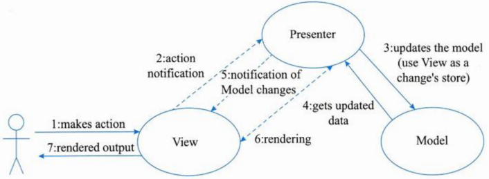
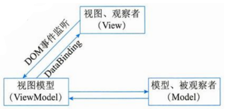
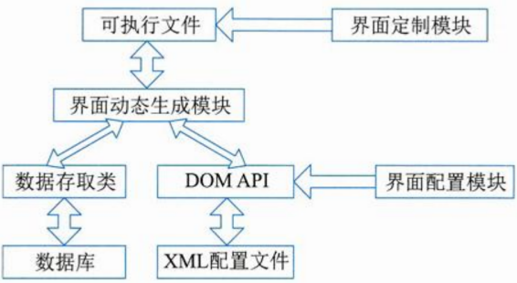
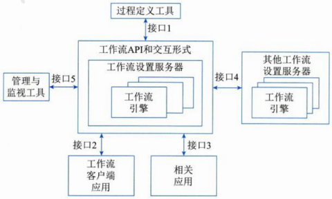
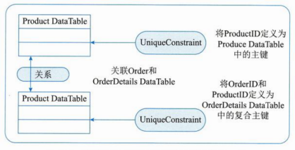
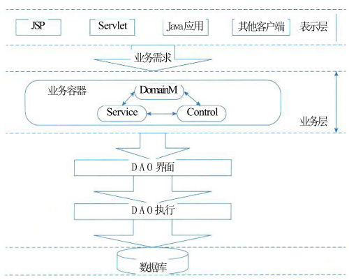

# 层次式架构设计


## 最佳实践

### 考察问

应用会分成

1. `()`(或称为展示层)
2. `()`(或称为中间层)
3. `()`层(或称为数据访问)
4. `()`


### 考察点


应用会分成

1. `表现层`(或称为展示层)
2. `业务层`(或称为中间层)
3. `持久层`层(或称为数据访问)
4. `数据层`


## 概述

软件体系结构贯穿于软件研发的整个生命周期内，具有重要的影响，表现为三个方面：利益相关人员之间的交流、系统设计的前期决策、可传递的系统级抽象。

层次式体系结构设计是将系统组成一个层次结构，每一层为上层服务，并作为下层客户。在一些层次系统中，除了一些精心挑选的输出函数外，内部的层接口只对相邻的层可见。连接件通过决定层间如何交互的协议来定义，拓扑约束包括对相邻层间交互的约束。

软件层次式体系结构是最通用的架构，也被叫作N层架构模式。大部分的应用会分成表现层(或称为展示层)、中间层(或称为业务层)、数据访问层(或称为持久层)和数据层。

分层架构的一个特性就是关注分离。该层中的组件只负责本层的逻辑，组件的划分很容易明确组件的角色和职责，也比较容易开发、测试、管理和维护。 


## 表现层框架设计


### 表现层设计模式

1. MVC模式

    MVC强制性地把一个应用的输入、处理、输出流程按照视图、控制、模型的方式进行分离，形成了控制器、模型、视图三个核心模块。

    1. 模型（Model）：是应用程序中用于处理应用程序数据逻辑的部分。通常模型对象负责在数据库中存取数据。模型表示业务数据和业务逻辑。
    2. 视图（View）：是应用程序中处理数据显示的部分。通常视图是依据模型数据创建的。是用户看到并与之交互的界面。视图向用户显示相关的数据，并能接收用户的输入数据，但是它并不进行任何实际的业务处理。 
    3. 控制器（Controller）：是应用程序中处理用户交互的部分。通常控制器负责从视图读取数据，控制用户输入，并向模型发送数据。 

    

    使用MVC模式来设计表现层，可以有以下的优点。

    1. 允许多种用户界面的扩展。在MVC模式中，视图与模型没有必然的联系，都是通过控制器发生关系，这样如果要增加新类型的用户界面，只需要改动相应的视图和控制器即可，而模型则无须发生改动。
    2. 易于维护。控制器和视图可以随着模型的扩展而进行相应的扩展，只要保持一种公共的接口，控制器和视图的旧版本也可以继续使用。 
    3. 功能强大的用户界面。用户界面与模型方法调用组合起来，使程序的使用更清晰，可将友好的界面发布给用户。 
    4. 将业务处理与显示分离，增加了应用的可拓展性、强壮性及灵活性。基于MVC的优点，目前比较先进的Web应用框架都是基于MVC设计模式的。


2. MVP模式

    MVP是把MVC中的Controller换成了Presenter(呈现)，目的就是为了完全切断View跟Model之间的联系，由Presenter充当桥梁，做到View-Model之间通信的完全隔离。Controller/Presenter负责逻辑的处理，Model提供数据，View负责显示。

    MVP模式的优点：

    1. View与Model完全分离，可以修改视图而不影响模型。
    2. View与Model不通信，都通过Presenter传递。Presenter完全把Model和View进行了分离，主要的程序逻辑在Presenter里实现。 
    3. 可以将一个Presenter用于多个视图，而不需要改变Presenter的逻辑。这个特性非常的有用，因为视图的变化总是比模型的变化频繁。 
    4. 如果把逻辑放在Presenter中，就可以脱离用户接口来测试这些逻辑（单元测试）。

    目前，MVP模式被更多地用在Android开发当中。 


    


3. MVVM模式

    MVVM模式正是为解决MVP中UI种类变多，接口也会不断增加的问题而提出的。

    MVVM模式全称是模型-视图-视图模型(Model-View-ViewModel)，它和MVC、MVP类似，主要目的都是为了实现视图和模型的分离，不同的是MVVM中，View与Model的交互通过ViewModel来实现。ViewModel是MVVM的核心，它通过DataBinding实现View与Model之间的双向绑定，其内容包括数据状态处理、数据绑定及数据转换。例如，View中某处的状态和Model中某部分数据绑定在一起，这部分数据一旦变更将会反映到View层，而这个机制通过ViewModel来实现。

    View和ViewModel之间使用DataBinding及其事件进行通信。ViewModel通常要实现一个观察者，当数据发生变化，ViewModel能够监听到数据的变化，然后通知对应的视图做自动更新；而当用户操作视图，ViewModel也能监听到视图的变化，再通知数据做改动，从而形成数据的双向绑定。这使得MVVM更适用于数据驱动的场景，尤其是数据操作特别频繁的场景。 

    


### 使用XML设计表现层，统一Web Form与Windows Form的外观

由于XML的设计目标是描述数据并集中于数据的内容，所以虽然XML和HTML类似，但是业内很少采用XML作为表现层技术，表现层技术仍然是HTML唱主角。但是，由于Web应用程序对特定浏览器的局限以及性能问题，基于窗体表现形式的胖客户端应用程序又开始有了卷土重来的趋势。这两种应用程序各有优势，在未来很长一段时间这两种技术架构都会并存。

因此，许多开发厂商在开发新产品时提出了既要支持胖客户端的表现形式，又要支持Web的表现形式。于是，有人提出将用一个标准的形式描述，对于不同的表现形式，提供特定形式的转换器，根据GUI的描述转换成相应的表现形式。这就要求描述语言有非常好的通用性和扩展性，XML恰恰是这种描述语言理想的载体。


### 表现层中UIP设计思想

UIP提供了一个扩展的框架，用于简化用户界面与商业逻辑代码的分离的方法，可以用它来写复杂的用户界面导航和工作流处理，并且它能够复用在不同的场景、并可以随着应用的增加而进行扩展。

使用UIP框架的应用程序把表现层分为了以下几层。

- User Interface Components：这个组件就是原来的表现层，用户看到的和进行交互都是这个组件，它负责获取用户的数据并且返回结果。
- User Interface Process Components：这个组件用于协调用户界面的各部分，使其配合后台的活动，例如导航和工作流控制，以及状态和视图的管理。用户看不到这一组件，但是这些组件为User Interface Components提供了重要的支持功能。

UIP的组件主要负责的功能是：管理经过User Interface Components的信息流；管理UIP中各个事件之间的事务；修改用户过程的流程以响应异常；将概念上的用户交互流程从实现或者涉及的设备上分离出来；保持内部的事务关联状态，通常是持有一个或者多个的与用户交互的事务实体。

因此，这些组件也能从UI组件收集数据，执行服务器的成组的升级或是跟踪UIP中的任务过程的管理。 


### 表现层动态生成设计思想

基于XML的界面管理技术可实现灵活的界面配置、界面动态生成和界面定制。其思路是用XML生成配置文件及界面所需的元数据，按不同需求生成界面元素及软件界面。基于XML界面管理技术，包括界面配置(静态)、界面动态生成和界面定制(动态)三部分。 




## 中间层架构设计

### 业务逻辑层组件设计

业务逻辑组件分为接口和实现类两个部分。接口用于定义业务逻辑组件，定义业务逻辑组件必须实现的方法是整个系统运行的核心。增加业务逻辑组件的接口，是为了提供更好的解耦，控制器无须与具体的业务逻辑组件耦合，而是面向接口编程。

### 业务逻辑层工作流设计

工作流定义为：业务流程的全部或部分自动化，在此过程中，文档、信息或任务按照一定的过程规则流转，实现组织成员间的协调工作以达到业务的整体目标。工作流参考模型见图：其包含6个基本模块，分别是工作流执行服务、工作流引擎、流程定义工具、客户端应用、调用应用和管理监控工具。



1. interface1：过程定义导入/导出接口。这个接口的特点是：转换格式和API调用，从而支持过程定义信息间的互相转换。
2. interface2：客户端应用程序接口。通过这个接口工作流机可以与任务表处理器交互，代表用户资源来组织任务。然后由任务表处理器负责，从任务表中选择、推进任务项。由任务表处理器或者终端用户来控制应用工具的活动。 
3. interface3：应用程序调用接口。允许工作流机直接激活一个应用工具，来执行一个活动。典型的是调用以后台服务为主的应用程序，没有用户接口。当执行活动要用到的工具，需要与终端用户交互，通常是使用客户端应用程序接口来调用那个工具，这样可以为用户安排任务时间表提供更多的灵活性。 
4. interface 4：工作流机协作接口。其目标是定义相关标准，以使不同开发商的工作流系统产品相互间能够进行无缝的任务项传递。 
5. interface 5：管理和监视接口。提供的功能包括用户管理、角色管理、审查管理、资源控制、过程管理和过程状态处理器等。 


### 业务逻辑层实体设计

业务逻辑层实体提供对业务数据及相关功能(在某些设计中)的状态编程访问。业务逻辑层实体可以使用具有复杂架构的数据来构建，这种数据通常来自数据库中的多个相关表。

在应用程序中表示业务逻辑层实体的方法有很多(从以数据为中心的模型到更加面向对象的表示法)，如XML、通用DataSet、有类型的DataSet等。 

如下所示是业务实体用XML表示，右图所示为用于Order业务逻辑层实体的通用DataSet对象。此DataSet对象具有两个DataTable对象，分别保存订单信息和订单详细信息。每个DataTable具有一个对应的UniqueConstraint对象，用于标识表中的主键。此外，该DataSet还有一个Relation对象，用于将订单详细信息与订单相关联。 

```xml
<?xml version="1.0"?>
<Product xmlns="urn: aUniqueNamespace">
<ProductID>1</ProductID>
<ProductName>Chai</ProductName>
<QuantityPerUnit>10 boxes x 20 bags</QuantityPerUnit>
<UnitPrice>18.00</UnitPrice>
<UnitsInStock>39</UnitsInStock>
<UnitsOnOrder>0</UnitsOnOrder>
<ReorderLevel>10</ReorderLevel>
</Product> 
```



### 业务逻辑层框架

业务框架位于系统架构的中间层，是实现系统功能的核心组件。采用容器的形式，便于系统功能的开发、代码重用和管理。下图便是在吸收了SOA思想之后的一个三层体系结构的简图。 



业务层采用业务容器的方式存在于整个系统当中，采用此方式可以大大降低业务层和相邻各层的耦合，表示层代码只需要将业务参数传递给业务容器，而不需要业务层多余的干预。如此一来，可以有效地防止业务层代码渗透到表示层。

在业务容器中，业务逻辑是按照Domain Model—Service—Control思想来实现的。
(1)Domain Model是领域层业务对象，它仅仅包含业务相关的属性。
(2)Service是业务过程实现的组成部分，是应用程序的不同功能单元，通过在这些服务之间定义良好的接口和契约联系起来。 
(3)Control服务控制器，是服务之间的纽带，不同服务之间的切换就是通过它来实现的。 


### 数据访问层设计

1. 种数据访问模式

    1. 在线访问：会占用一个数据库连接，读取数据，每个数据库操作都会通过这个连接不断地与后台的数据源进行交互。
    2. DataAccess Object：是标准J2EE设计模式之一，开发人员常常用这种模式将底层数据访问操作与高层业务逻辑分离开。 
    3. Data Transfer Object：是经典EJB设计模式之一。DTO本身是这样一组对象或是数据的容器，它需要跨不同的进程或是网络的边界来传输数据。这类对象本身应该不包含具体的业务逻辑，并且通常这些对象内部只能进行一些诸如内部一致性检查和基本验证之类的方法，而且这些方法最好不要再调用其他的对象行为。 
    4. 离线数据模式：以数据为中心，数据从数据源获取之后，将按照某种预定义的结构(这种结构可以是SDO中的Data图表结构，也同样可以是ADO.NET中的关系结构)存放在系统中，成为应用的中心。离线，对数据的各种操作独立于各种与后台数据源之间的连接或是事务。 
    5. 对象/关系映射(Object/Relation Mapping，O/R Mapping)：大多数应用中的数据都是依据关系模型存储在关系型数据库中；而很多应用程序中的数据在开发或是运行时则是以对象的形式组织起来的。那么，对象/关系映射就提供了这样一种工具或是平台，能够帮助将应用程序中的数据转换成关系型数据库中的记录；或是将关系数据库中的记录转换成应用程序中代码便于操作的对象。 

2. 工厂模式在数据库访问层的应用

    首先定义一个操纵数据库的接口DataAccess，然后根据数据库的不同，由类工厂决定实例化哪个类。

    因为DataAccess的具体实现类有一些共同的方法，所以先从DataAccess实现一个抽象的AbstractDataAccess类，包含一些公用方法。然后，分别为SQL Server、Oracle和OleDb数据库编写三个数据访问的具体实现类。

    现在已经完成了所要的功能，下面需要创建一个Factory类，来实现自动数据库切换的管理。这个类很简单，主要的功能就是根据数据库类型，返回适当的数据库操纵类。

3. 事务处理设计

    JavaBean中使用JDBC方式进行事务处理：在JDBC中，打开一个连接对象Connection时，默认是auto-commit模式，每个SQL语句都被当作一个事务，即每次执行一个语句，都会自动地得到事务确认。为了能将多个SQL语句组合成一个事务，要将auto-commit模式屏蔽掉。在auto-commit 模式屏蔽掉之后，如果不调用commit()方法，SQL语句不会得到事务确认。在最近一次commit()方法调用之后的所有SQL会在方法commit()调用时得到确认。

4. 连接对象管理设计

    通过资源池解决资源频繁分配、释放所造成的问题。

    建立连接池的第一步，就是要建立一个静态的连接池。所谓静态，是指池中的连接是在系统初始化时就分配好的，并且不能够随意关闭。Java中给我们提供了很多容器类，可以方便地用来构建连接池，如Vector、Stack等。在系统初始化时，根据配置创建连接并放置在连接池中，以后所使用的连接都是从该连接池中获取的，这样就可以避免连接随意建立、关闭造成的开销。

    有了这个连接池，下面就可以提供一套自定义的分配、释放策略。当客户请求数据库连接时，首先看连接池中是否有未分配出去的连接。如果存在空闲连接则把连接分配给客户，并标记该连接为已分配。若连接池中没有空闲连接，就在已经分配出去的连接中，寻找一个合适的连接给客户，此时该连接在多个客户间复用。

    当客户释放数据库连接时，可以根据该连接是否被复用，进行不同的处理。如果连接没有使用者，就放入到连接池中，而不是被关闭。 


## 数据架构规划与设计

XML文档分为两类：一类是以数据为中心的文档，这种文档在结构上是规则的，在内容上是同构的，具有较少的混合内容和嵌套层次，人们关心文档中的数据而并不关心数据元素的存放顺序，这种文档简称为数据文档，它常用来存储和传输Web数据。

另一类是以文档为中心的文档，这种文档的结构不规则，内容比较零散，具有较多的混合内容，并且元素之间的顺序是有关的，这种文档常用来在网页上发布描述性信息、产品性能介绍和E-mail信息等。

经提出的XML文档的存储方式有两种：基于文件的存储方式和数据库存储方式。

(1)基于文件的存储方式。基于文件的存储方式是指将XML文档按其原始文本形式存储，主要存储技术包括操作系统文件库、通用文档管理系统和传统数据库的列。这种存储方式需维护某种类型的附加索引，以建立文件之间的层次结构。基于文件的存储方式的特点：无法获取XML文档中的结构化数据；通过附加索引可以定位具有某些关键字的XML文档，一旦关键字不确定，将很难定位；查询时，只能以原始文档的形式返回，即不能获取文档内部信息；文件管理存在容量大、管理难的缺点。 

(2)数据库存储方式。数据库在数据管理方面具有管理方便、存储占用空间小、检索速度快、修改效率高和安全性好等优点。一种比较自然的想法是采用数据库对XML文档进行存取和操作，这样可以利用相对成熟的数据库技术处理XML文档内部的数据。数据库存储方式的特点：能够管理结构化和半结构化数据；具有管理和控制整个文档集合本身的能力；可以对文档内部的数据进行操作；具有数据库技术的特性，如多用户、并发控制和一致性约束等；管理方便，易于操作。 


## 物联网架构设计

物联网可以分为三个层次，底层是用来感知数据的感知层，即利用传感器、二维码、RFID等设备随时随地获取物体的信息。第二层是数据传输处理的网络层，即通过各种传感网络与互联网的融合，将对象当前的信息实时准确地传递出去。第三层则是与行业需求结合的应用层，即通过智能计算、云计算等将对象进行智能化控制。

感知层用于识别物体、采集信息。感知层包括二维码标签和识读器、RFID标签和读写器、摄像头、GPS、传感器、M2M终端、传感器网关等，主要功能是识别对象、采集信息，与人体结构中皮肤和五官的作用类似。感知层解决的是人类世界和物理世界的数据获取问题。

网络层用于传递信息和处理信息。网络层包括通信网与互联网的融合网络、网络管理中心、信息中心和智能处理中心等。网络层将感知层获取的信息进行传递和处理，类似于人体结构中的神经中枢和大脑。网络层解决的是传输和预处理感知层所获得数据的问题。

应用层实现广泛智能化。应用层是物联网与行业专业技术的深度融合，结合行业需求实现行业智能化，这类似于人们的社会分工。

物联网应用层利用经过分析处理的感知数据，为用户提供丰富的特定服务。应用层解决的是信息处理和人机交互的问题。 

