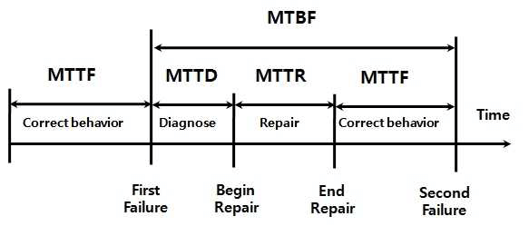

# 软件系统质量属性

## 最佳实践

### 题目总结

1. 系统架构评估的质量属性(性靠用安, 改变作功, 易重伸):
    1. 性能
    2. 可靠性
    3. 可用性
    4. 安全性(整机可控审)
        1. 完整性
        2. 机密性
        3. 不可否认性
        4. 可控性
    5. 可修改性(展护移重)
        1. 可拓展性
        2. 可维护性
        3. 可移植性
        4. 结构重组
    6. 可变性
    7. 互操作性
    8. 功能性

2. 质量属性场景描述

    1. 环境(Environment) :该刺激在某些条件内发生。当激励发生时，系统可能处于过载、运行或者其他情况。
    2. 刺激源(Source):这是某个生成该剌激的实体(人、计算机系统或者任何其他刺激器)。
    3. 刺激(Stimulus):该刺激是当刺激到达系统时需要考虑的条件。
    4. 制品(Artifact):某个制品被激励。这可能是整个系统，也可能是系统的一部分。
    5. 响应(Response):该响应是在激励到达后所采取的行动。
    6. 响应度量(Measurement):当响应发生时，应当能够以某种方式对其进行度量，以对需求进行测试。

### 考察问

1. 系统架构评估的质量属性:
    - 性靠用安, 改变作功, 易重伸 
    - 整机可控审
    - 展护移重

2. 质量属性6要素
    - `()`：
    - `()`：产生刺激的人, 物, 事件
    - `()`：
    - `()`：被刺激的
    - `()`：制品收到刺激后的行动
    - `()`：量化该行动

### 考察点

1. 系统架构评估的质量属性:
    1. `性能`(performance): 事件响应的平均时间, 如`响应时间`, `吞吐量`. 设计策略: 增加计算资源, 减少计算开销, 引入并发, 资源调度策略
    2. `可靠性`(reliability): `意外或错误使用的`情况下维持功能的能力. 设计策略: 冗余, 心跳, 选举, Ping/Echo.
        1. `容错性`: 处理错误, 并修噶. if
        2. `健壮性`: 不处理错误, 忽略错误. try
    3. 易用性: 
    4. `可用性`(availability): `正常运行时间`的`比例`. 设计策略: 冗余, 心跳, 选举, Ping/Echo.
        1. 系统可用性 = MTTF/MTBF = MTTF/(MTTF + MTTR)
    5. `安全性`(security): `拒绝``非授权用户使用的能力`. 设计策略: 用户认证、用户授权、追踪审计
        1. `完整性`: `不被篡改`
        2. `机密性`: `不泄露`给未授权的用户
        3. `不可否认性`: 双方不能否认发送或接收的信息
        4. `可控性`: 对信息的`内容`有控制力
        5. `可审计性`: 
    6. 可重用性: 
    7. 可伸缩性: 关注的是当用户数和数据量增加时，软件系统维持高服务质量的能力。
    8. `可修改性`(modifiablility): 较高性价比对系统修改的能力. 设计策略: 接口, 抽象, 多态, 配置文件
        - `可扩展性`：软件因适应`新需求`或需求变化而增加`新功能`的能力。
        - `可维护性`：在`错误`发生后`修复`软件系统的`难易程度`。
        - `可移植性`：将软件系统从`一个运行环境`转移到`另一个`不同的`运行环境`的难易程度。
        - `可重构性`：`重新组织`软件系统的`构件`及构件之间的关系。
    10. `互操作性`(interoperability): 作为系统组成部分的软件不是独立存在的，通常与`其他系统或自身环境`相互作用。
    11. `功能性`(functionality)：是系统所能完成所`期望的工作`的能力。
    9.  `可变性`(mutability)：指架构经`扩充或变更`而成为`新架构`的能力。

    ✨易重伸, 性靠用安, 改变作功
    ✨整机可控审
    ✨展护移重

2.  质量属性6要素
    - `环境`(Environment)：
    - `刺激源`(Source)：产生刺激的人, 物, 事件
    - `刺激`(Stimulus)：
    - `制品`(Artifact)：被刺激的
    - `响应`(Response)：制品收到刺激后的行动
    - `响应度量`(Measurement)：量化该行动

3.  零碎知识
    1. 基于软件系统的生命周期，可以将软件系统的质量属性分为`开发期`质量属性和`运行期`质量属性两个部分
    2. 在架构评估中，场景是从`风险承担者`的角度对与系统交互的描述，一般采用`刺激、环境、响应`三方面来对场景进行描述。

## 质釐属性概念

软件系统属性包括`功能`属性和`质量`属性，架构的基本需求是在满足`功能`属性的`前提`下，关注软件系统质量属性。

根据 GB/T 16260.1 定义，从管理角度对软件系统质量进行度量，可将影响软件质量的主要因素划分为 6 种维度特性：功能性、可靠性、易用性、效率、维护性与可移植性。其中

- 功能性包括适合性、准确性、互操作性、依从性、安全性
- 可靠性包括容错性、易恢复性、成熟性
- 易用性包括易学性、易理解性、易操作性
- 效率包括资源特性和时间特性
- 维护性包括可测试性、可修改性、稳定性和易分析性
- 可移植性包括适应性、易安装性、一致性和可替换性

基于软件系统的生命周期，可以将软件系统的质量属性分为开发期质量属性和运行期质量属性2个部分。

1. 开发期质量属性

    - 易理解性：指设计被开发人员理解的难易程度。
    - 可扩展性：软件因适应新需求或需求变化而增加新功能的能力，也称为灵活性。
    - 可重用性：指重用软件系统或某一部分的难易程度。
    - 可测试性：对软件测试以证明其满足需求规范的难易程度。
    - 可维护性：当需要修改缺陷、增加功能、提高质量属性时，识别修改点并实施修改的难易程度。
    - 可移植性：将软件系统从一个运行环境转移到另一个不同的运行环境的难易程度。

2. 运行期质量属性

    - 性能：性能是指软件系统及时提供相应服务的能力，如速度、吞吐量和容量等的要求。
    - 安全性：指软件系统同时兼顾向合法用户提供服务，以及阻止非授权使用的能力。
    - 可伸缩性：指当用户数和数据量增加时，软件系统维持高服务质量的能力。例如，通过增加服务器来提高能力。
    - 互操作性：指本软件系统与其他系统交换数据和相互调用服务的难易程度。
    - 可靠性：软件系统在一定的时间内待续无故障运行的能力。
    - 可用性：指系统在一定时间内正常工作的时间所占的比例。可用性会受到系统错误，恶意攻击，高负载等问题的影响。
    - 鲁棒性：是指软件系统在非正常情况(如用户进行了非法操作、相关的软硬件系统发生了故障等)下仍能够正常运行的能力，也称健壮性或容错性。

🔒题目:

- (✨2025上)44.智慧教育系统应保护用户的数据隐私，对敏感数据采用密文方式存储。这一需求属于( )需求。
    - A.可用性
    - B.可靠性
    - C.安全性
    - D.性能

    答案: C

1. 基于软件系统的生命周期，可以将软件系统的质量属性分为(  )两个部分。

    - A.需求分析期质量属性和设计期质量属性
    - B.开发期质量属性和运行期质量属性
    - C.设计期质量属性和开发期质量属性
    - D.设计期质量属性和运行期质量属性

    答案：B

2. 在软件系统质量属性(Quality Atribute)中，(  )关注系统在一定时间内正常工作的时间所占的比例；(  )关注软件系统与其他系统交换数据和相互调用服务的难易程度。

    - A.可用性 B.可修改性 C.性能 D.安全性
    - A.可靠性 B.可伸缩性 C.互操作性 D.易用性

    答案：A C

## 面向架构评估的质量属性

在架构评估过程中，评估人员所关注的是系统的质量属性。

1. 性能(Performance)

    系统的响应能力，即要经过多长时间才能对某个事件做出响应，或者在某段事件内系统所能处理的事件的个数。经常用单位时间内所处理事务的数量或系统完成某个事务处理所需的时间来对性能进行定量表示。性能测试经常要使用基准测试程序。

2. 可靠性(Reliability)

    软件系统在应用或系统错误面前，在意外或错误使用的情况下维持软件系统的功能特性的基本能力。

    可靠性通常用平均失效等待时间(Mean Time To Failure, MTTF)和平均失效间隔时间(Mean Time Between Failure,  MTBF)来衡量。在失效率为常数和修复时间很短的情况下，MTTF和MTBF几乎相等。

    `可靠性 = MTTF/(MTTF + MTTR)*100%`。

    1. 平均失效等待时间(Mean Time To Failure，MTTF)错误修复开始到下一次错误发生(正常运行)
    2. 平均恢复时间(Mean Time To Repair, MTTR)：平均修复时间，从出现故障到修复成功的时间
    3. 平均失效间隔时间(Mean Time Between Failure，MTBF)错误发生到下一次错误发生。MTBF = MTTF + MTTR。

    

    ✨在失效率为常数和修复时间很短的情况下，MTTF和MTBF几乎相等。

    可靠性可以分为两个方面。

    1. 容错。容错的目的是在错误发生时确保系统正确的行为，并进行内部“修复“。例如在一个分布式软件系统中失去了一个与远程构件的连接，接下来恢复了连接。(主动修复)

    2. 健壮性。这里说的是保护应用程序不受错误使用和错误输入的影响，在发生意外错误事件时确保应用系统处于预先定义好的状态。值得注意的是，和容错相比，健壮性并不是说在错误发生时软件可以继续运行，它只能保证软件按照某种已经定义好的方式终止执行。例如，软件架构设计上通过在应用程序内部采用冗余机制，或集成监控构件和异常处理，以提升系统可靠性。(被动修复)

    🔒题目:

    1. 平均失效等待时间(mean time to failure，MTTF)和平均失效间隔时间(mcan time between failure，MTBF)是进行系统可靠性分析时的重要指标，在失效率为常数和修复时间很短的情况下，_____。

        - A.MTTF远远小于MTBF
        - B.MTTF和MTBF无法计算
        - C.MTTF远远大于MTBF
        - D.MTTF和MTBF几乎相等

        答案：D

3. 可用性(Availability)

    系统能够正常运行的时间比例。经常用两次故障之间的时间长度或在出现故障时系统能够恢复正常的速度来表示。

    可用性 =（正常运行时间 ÷ 总时间）× 100, 示例：8756小时正常运行时间 ÷ 8760小时总时间 = 99.95%的系统可用性

    - 正常运行时间(Uptime)：指系统、设备或服务处于正常工作状态、可正常使用的总时长，不包含因故障、维护等导致的停机时间。  
    - 总时间(Total Time)：指统计周期内的完整时长，常见周期如1天（24小时）、1年（非闰年8760小时）、1个月（约

4. 安全性 (Security)

    系统在向合法用户提供服务的同时能够阻止非授权用户使用的企图或拒绝服务的能力。安全性可根据系统可能受到的安全威胁类型来分类。安全性又可划分为机密性、完整性、不可否认性及可控性等特性。

    1. `机密性`保证信息不泄露给未授权的用户、实体或过程；
    2. `完整性`保证信息的完整和准确，防止信息被非法修改；
    3. `不可否认性`是指信息交换的双方不能否认其在交换过程中发送信息或接收信息的行为；
    4. `可控性`保证对信息的传播及内容具有控制的能力，防止为非法者所用。

5. 可修改性 (Modifiabilit)

    能够快速地以较高的性价比对系统进行变更的能力。通常以某些具体的变更为基准，通过考查这些变更的代价来衡量可修改性。可修改性包含以下4个方面。

    1. `可维护性`(Maintainabi lity)。这主要体现在问题的修复上，在错误发生后“修复“软件系统。可维护性好的软件架构往往能做局部性的修改并能使对其他构件的负面影响最小化。
    2. `可扩展性`(Extendibility)。这一点关注的是使用新特性来扩展软件系统，以及使用改进版本方式替换构件并删除不需要或不必要的特性和构件。为了实现可扩展性，软件系统需要松散耦合的构件。其目标是实现一种架构，能使开发人员在不影响构件客户的情况下替换构件。支持把新构件集成到现有的架构中也是必要的。
    3. `结构重组`(Reassemble) 。这一点处理的是重新组织软件系统的构件及构件间的关系，例如通过将构件移动到一个不同的子系统而改变它的位置。为了支待结构重组，软件系统需要精心设计构件之间的关系。理想情况下，它们允许开发人员在不影响实现的主体部分的情况下灵活地配置构件。
    4. `可移植性`(Portability)。可移植性使软件系统适用于多种硬件平台、用户界面、操作系统、编程语言或编译器。为了实现可移植，需要按照硬件、软件无关的方式组织软件系统。可移植性是系统能够在不同计算环境下运行的能力，这些环境可能是硬件、软件，也可能是两者的结合。如果移植到新的系统需要做适当更改，则该可移植性就是一种特殊的可修改性。

6. 功能性(Functionality)

    系统能完成所期望的工作的能力。一项任务的完成需要系统中许多或大多数构件的相互协作。

7. 可变性 (Changeability)

    架构经扩充或变更而成为新架构的能力。这种新架构应该符合预先定义的规则，在某些具体方面不同于原有的架构。当要将某个架构作为一系列相关产品(例如，软件产品线)的基础时，可变性是很重要的。

8. 互操作性(interoperability)

    作为系统组成部分的软件不是独立存在的，通常与其他系统或自身环境相互作用。为了支持互操作性，软件架构必须为外部可视的功能特性和数据结构提供精心设计的软件入口。程序和用其他编程语言编写的软件系统的交互作用就是互操作性的问题，这种互操作性也影响应用的软件架构。

🔒题目

1. 安全性(Security)是指系统在向合法用户提供服务的同时能够阻止非授权用户使用的企图或拒绝服务的能力。安全性可根据系统可能受到的安全威胁类型来分类。其中，_____保证信息不泄露给未授权的用户、实体或过程；_____是指信息交换的双方不能否认其在交换过程中发送信息或接收信息的行为。

    - A.可控性 B.完整性 C.不可否认性 D.机密性
    - A.完整性 B.机密性 C.不可否认性 D.可控性

    答案：D C

3. 某服务器软件系统对可用性(Availability)、性能(Performance)和可修改性(Modification)的要求较高，(  )设计策略能提高该系统的可用性，(  )设计策略能够提高该系统的性能，(  )设计策略能够提高该系统的可修改性。

    - A Ping/Echo  B 限制访问  C 运行时注册  D 接口-实现分离
    - A 分层结构  B 事务机制  C 主动冗余  D 队列调度
    - A 信息隐藏  B 记录/回放  C 任务模型  D 回滚

    答案: ADA

4. 某公司欲开发一个电子交易清算系统，在架构设计阶段，公司的架构师识别出3个核心质量属性场景。其中“数据传递时延不大于1s，并提供相应的优先级管理”主要与(  )质量属性相关，通常可采用(  )架构策略实现该属性；“系统采用双机热备，主机必须实时监测对方状态，以便完成系统的实时切换”主要与(  )质量属性相关，通常可采用(  )架构策略实现该属性；“系统应能够防止99%的黑客攻击”主要与(  )质量属性相关，通常可采用(  )架构策略实现该属性。

    - A 可用性 B 性能 C 安全性 D 可修改性
    - A 限制资源 B 引入并发 C 资源仲裁 D 限制访问
    - A 可用性 B 性能 C 安全性 D 可修改性
    - A 记录/回放 B 操作串行化 C 心跳 D 资源调度
    - A 可用性 B 性能 C 安全性 D 可修改性
    - A 检测攻击 B Ping /Echo C 选举 D 权限控制

    答案: BCACCA

5. 质量属性都包含哪些?

## 质量属性场景描述

为了精确描述软件系统的质量属性，通常采用质量属性场景(Quality Attribute Scenario) 作为描述质量属性的手段。

质量属性场景是一种面向特定质量属性的需求。它由 6 部分组成：

1. 刺激源(Source):这是某个生成该剌激的实体(人、计算机系统或者任何其他刺激器)。
2. 刺激(Stimulus):该刺激是当刺激到达系统时需要考虑的条件。
3. 环境(Environment) :该刺激在某些条件内发生。当激励发生时，系统可能处于过载、运行或者其他情况。
4. 制品(Artifact):某个制品被激励。这可能是整个系统，也可能是系统的一部分。
5. 响应(Response):该响应是在激励到达后所采取的行动。
6. 响应度量(Measurement):当响应发生时，应当能够以某种方式对其进行度量，以对需求进行测试。

质量属性场景主要关注可用性、可修改性、性能、可测试性、易用性和安全性等6类质量属性，下面分别列表进行介绍。

### 可用性质量属性场景

|场景要素|可能的情况|
| ---- | ---- |
|刺激源|系统内部、系统外部|
|刺激|疏忽、错误、崩溃、时间|
|环境|正常操作、降级模式|
|制品|系统处理器、通信信道、持久存储器、进程|
|响应|系统应该检测事件、并进行如下一个或多个活动： 将其记录下来通知适当的各方，包括用户和其他系统；根据已定义的规则禁止导致错误或故障的事件源 在一段预先指定的时间间隔内不可用，其中，时间间隔取决于系统的关键程度在正常或降级模式下运行|
|响应度量|系统必须可用的时间间隔 可用时间 系统可以在降级模式下运行的时间间隔 故障修复时间|

### 可修改性质量属性场景

|场景要素|可能的情况|
| ---- | ---- |
|刺激源|最终用户、开发人员、系统管理员|
|刺激|希望增加、删除、修改、改变功能、质量属性、容量等|
|环境|系统设计时、编译时、构建时、运行时|
|制品|系统用户界面、平台、环境或与目标系统交互的系统|
|响应|查找架构中需要修改的位置，进行修改且不会影响其他功能，对所做的修改进行测试，部署所做的修改|
|响应度量|根据所影响元素的数量度量的成本、努力、资金；该修改对其他功能或质量属性所造成影响的程度|

### 性能质量属性场景

|场景要素|可能的情况|
| ---- | ---- |
|刺激源|用户请求，其他系统触发等|
|刺激|定期事件到达、随机事件到达、偶然事件到达|
|环境|正常模式、超载(Overload)模式|
|制品|系统|
|响应|处理刺激、改变服务级别|
|响应度量|等待时间、期限、吞吐量、抖动、缺失率、数据丢失率|

### 可测试性质量属性场景

|场景要素|可能的情况|
| ---- | ---- |
|刺激源|开发人员、增量开发人员、系统验证人员、客户验收测试人员、系统用户|
|刺激|已完成的分析、架构、设计、类和子系统集成；所交付的系统|
|环境|设计时、开发时、编译时、部署时|
|制品|设计、代码段、完整的应用|
|响应|提供对状态值的访问，提供所计算的值，准备测试环境|
|响应度量|已执行的可执行语句的百分比 如果存在缺陷出现故障的概率 执行测试的时间 测试中最长依赖的长度 准备测试环境的时间|

### 易用性质量属性场景描述

|场景要素|可能的情况|
| ---- | ---- |
|刺激源|最终用户|
|刺激|想要学习系统特性、有效使用系统、使错误的影响最低、适配系统、对系统满意|
|环境|系统运行时或配置时|
|制品|系统|
|响应|(1)系统提供以下一个或多个响应来支持“学习系统特性”： 帮助系统与环境联系紧密；界面为用户所熟悉；在不熟悉的环境中，界面是可以使用的 (2)系统提供以下一个或多个响应来支持“有效使用系统”： 数据和(或)命令的聚合；已输入的数据和(或)命令的重用；支持在界面中的有效导航； 具有一致操作的不同视图；全面搜索；多个同时进行的活动 (3)系统提供以下一个或多个响应来“使错误的影响最低”： 撤销；取消；从系统故障中恢复；识别并纠正用户错误；检索忘记的密码；验证系统资源 (4)系统提供以下一个或多个响应来“适配系统”： 定制能力；国际化 (5)系统提供以下一个或多个响应来使客户“对系统的满意”： 显示系统状态；与客户的节奏合拍|
|响应度量|任务时间、错误数量、解决问题的数量、用户满意度、用户知识的获得、成功操作在总操作中所占的比例、损失的时间/丢失的数据量|

### 安全性质量属性场景

|场景要素|可能的情况|
| ---- | ---- |
|刺激源|正确识别、非正确识别身份未知的来自内部/外部的个人或系统；经过了授权/未授权它访问了有限的资源/大量资源|
|刺激|试图显示数据，改变/删除数据，访问系统服务，降低系统服务的可用性|
|环境|在线或离线、联网或断网、连接有防火墙或者直接连到了网络|
|制品|系统服务、系统中的数据|
|响应|对用户身份进行认证；隐藏用户的身份；阻止对数据或服务的访问；允许访问数据或服务；授予或收回对访问数据或服务的许可；根据身份记录访问、修改或试图访问、修改数据、服务；以一种不可读的格式存储数据；识别无法解释的对服务的高需求；通知用户或另外一个系统，并限制服务的可用性|
|响应度量|用成功的概率表示，避开安全防范措施所需要的时间、努力、资源；检测到攻击的可能性；确定攻击或访问、修改数据或服务的个人的可能性；在拒绝服务攻击的情况下仍然获得服务的百分比；恢复数据、服务；被破坏的数据、服务和(或)被拒绝的合法访问的范围|

质量属性场景举例：

- 性能场景：
    - 1. 数据传递时延不大于1S，并提供相应的优先级管理。
    - 2. 网站在并发用户数量10万的负载情况下，用户请求的平均响应时间应小于3秒。
- 可用性场景：
    - 1. 系统采用双机热备，主备机必须实时监测对方状态，以便完成系统的实时切换。
    - 2. 主站宕机后，系统能够在10秒内自动切换至备用站点并恢复正常运行。
- 安全性场景：系统应能够防止99%的黑客攻击。
- 可修改性场景：系统完成上线后，少量的外围业务功能和界面的调整与修改不超过10人·月。

质量属性场景主要关注可用性、可修改性、性能、可测试性、易用性和安全性等6类质量属性。

- 可用性：质量属性场景所关注的方面包括系统故障发生的频率、出现故障时会发生什么情况、允许系统有多长时间是非正常运行、什么时候可以安全地出现故障、如何防止故障的发生以及发生故障时要求进行哪种通知。
- 可修改性：质量属性场景主要关注系统在改变功能、质量属性时需要付出的成本和难度，可修改性质量属性场景可能发生在系统设计、编译、构建、运行等多种情况和环境下。
- 性能：质量属性场景主要关注系统的响应速度，可以通过效率、响应时间、吞吐量、负载来客观评价性能的好坏。
- 可测试性：质量属性场景主要关注系统测试过程中的效率，发现系统缺陷或故障的难易程度等。
- 易用性：质量属性场景主要关注用户在使用系统时的容易程度，包括系统的学习曲线、完成操作的效率、对系统使用过程的满意程度等。
- 安全性：质量属性场景主要关注系统在安全性方面的要素，衡量系统在向合法用户提供服务的同时，阻止非授权用户使用的能力。

🔒题目

1. 为了精确描述软件系统的质量属性，通常采用______作为描述质量属性的手段。其中，______描述在激励到达后所采取的行动。

    - A. 质量属性场景
    - B. 质量属性环境分析
    - C. 质量属性效用树
    - D. 质量属性需求

    - A. 响应度量
    - B. 制品
    - C. 响应
    - D. 刺激

    答案: A C

2. 为了精确描述软件系统的质量属性，通常采用质量属性场景(Quality Attribute Scenario)作为描述质量属性的手段。质量属性场景是一个具体的质量属性需求，是利益相关者与系统的交互的简短陈述，它由刺激源、刺激、环境、制品、______六部分组成。其中，想要学习系统特性、有效使用系统、使错误的影响最低、适配系统、对系统满意属于______质量属性场景的刺激。

- A. 响应和响应度量
- B. 系统和系统响应
- C. 依赖和响
- D. 响应和优先

- A. 可用性
- B. 性能
- C. 易用性
- D. 安全性

答案: A C

3. (12分)用质量属性6要素描述✨2024上真题

    可连续运行时间不少于240h，断电或故障后10s内应重启

    - 刺激源：断电或故障
    - 刺激：系统故障或断电
    - 制品：系统
    - 环境：运行环境
    - 响应：重启
    - 响应度量：10秒内

    网络失效后，10s内应发起重新连接
    - 刺激源：网络失效
    - 刺激：网络失效
    - 制品：系统
    - 环境：网络环境
    - 响应：重新连接
    - 响应度量：10秒内

2. 在架构评估中，场景是从______的角度对与系统交互的描述，一般采用______三方面来对场景进行描述。

    - A. 系统设计者
    - B. 系统开发者
    - C. 风险承担者
    - D. 系统测试者

    - A. 刺激源、制品、响应
    - B. 刺激、制品、响应
    - C. 刺激、环境、响应
    - D. 刺激、制品、环境

    答案: C C

3. 信息隐蔽是开发整体程序结构时使用的法则，通过信息隐蔽可以提高软件的()、可测试性和()。
    - A. 可修改性
    - B. 可扩充性
    - C. 可靠性
    - D. 糊合性

    - A. 封装性
    - B. 安全性
    - C. 可移植性
    - D. 可交互性

    参考答案：A C
    答案解析：信息隐蔽是开发整体程序结构时使用的法则，即将每个程序的成分隐蔽或封装在一个单一的设计模块中，定义每一个模块时尽可能少地显露其内部的处理。在设计时首先列出一些可能发生变化的因素，在划分模块时将一个可能发生变化的因素隐蔽在某个模块的内部，使其他模块与这个因素无关。在这个因素发生变化时，只需修改含有这个因素的模块，而与其他模块无关。信息隐蔽原则对提高软件的可修改性、可测试性和可移植性都有重要的作用。 