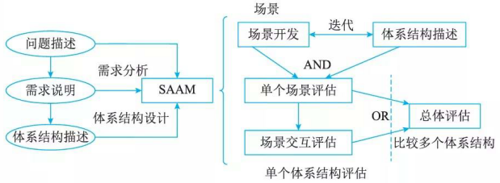
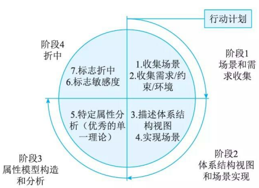

# 系统架构评估

系统架构评估是在对架构分析、评估的基础上，对架构策略的选取进行决策。

系统架构评估的方法通常可以分为3类：基于调查问卷或检查表的方式、基于场景的方式和基于度量的方式。

1. 基于调查问卷或检查表的方法。该方法的关键是要设计好问卷或检查表，充分利用系统相关人员的经验和知识，获得对架构的评估。该方法的缺点是在很大程度上依赖于评估人员的主观推断。

2. 基于场景的评估方法。基于场景的方式由卡耐基梅隆大学软件工程研究所首先提出并应用在架构权衡分析法 (Architecture Tradeoff Analysis Method, ATAM) 和软件架构分析方法(Software ArchitectureAnalysis Method, SAAM) 中。它是通过分析软件架构对场景(也就是对系统的使用或修改活动)的支持程度，从而判断该架构对这一场景所代表的质量需求的满足程度。

3. 基于度量的评估方法。它是建立在软件架构度量的基础上的，涉及3个基本活动，首先需要建立质量属性和度量之间的映射原则，然后从软件架构文档中获取度量信息，最后根据映射原则分析推导出系统的质量属性。

## 系统架构评估中的重要概念

1. 敏感点(Sensitivity Point)和权衡点(Tradeoff Point)。敏感点和权衡点是关键的架构决策。

    - 敏感点是一个或多个构件的特性。研究敏感点可使设计人员或分析员明确在搞清楚如何实现质量目标时应注意什么。
    - 权衡点是影响多个质量属性的特性，是多个质量属性的敏感点。例如，改变加密级别可能会对安全性和性能产生非常重要的影响。提高加密级别可以提高安全性，但可能要耗费更多的处理时间，影响系统性能。如果某个机密消息的处理有严格的时间延迟要求，则加密级别可能就会成为一个权衡点。

2. 风险承担者(Stakeholders) 或者称为利益相关人。系统的架构涉及很多人的利益，这些人都对架构施加各种影响，以保证自己的目标能够实现。

3. 场景(scenarios) 。在进行架构评估时，一般首先要精确地得出具体的质量目标，并以之作为判定该架构优劣的标准。为得出这些目标而采用的机制称之为场景。场景是从风险承担者的角度对与系统的交互的简短描述。在架构评估中，一般采用刺激(Stimulus) 、环境(Environment)和响应 (Response) 三方面来对场景进行描述。

## 系统架构评估方法

### SAAM 方法

SAAM(Scenarios-based Architecture Analysis Method) 是卡耐基梅隆大学软件工程研究所(SEI at CMU)的Kazman等人于1983年提出的一种非功能质量属性的架构分析方法，是最早形成文档并得到广泛使用的软件架构分析方法。

1. 特定目标。SAAM的目标是对描述应用程序属性的文档，验证基本的架构假设和原则。此外，该分析方法有利于评估架构固有的风险。SAAM 指导对架构的检查，使其主要关注潜在的问题点，如需求冲突，或仅从某一参与者观点出发得出的不全面的系统设计。SAAM 不仅能够评估架构对千特定系统需求的使用能力，也能被用来比较不同的架构。
2. 评估技术。SAAM 所使用的评估技术是场景技术。场景代表了描述架构属性的基础，描述了各种系统必须支持的活动和可能存在的状态变化。
3. 质量属性。这一方法的基本特点是把任何形式的质量属性都具体化为场景，但可修改性是SAAM分析的主要质量属性。
4. 风险承担者。SAAM协调不同参与者之间感兴趣的共同方面，作为后续决策的基础，达成对架构的共识。
5. 架构描述。SAAM用于架构的最后版本，但早千详细设计。架构的描述形式应当被所有参与者理解。功能、结构和分配被定义为描述架构的3个主要方面。
6. 方法活动。SAAM的主要输入是问题描述、需求声明和架构描述。图8-1描绘了SAAM分析活动的相关输入及评估过程。

    SAAM分析评估架构的过程包括5个步骤，即场景开发、架构描述、单个场景评估、场景交互和总体评估。

    用一种易于理解的、合乎语法规则的架构描述软件架构，体现系统的计算构件、数据构件以及构件之间的关系(数据和控制)。对场景(直接场景和间接场景)生成一个关于特定架构的场景描述列表。通过对场景交互的分析，能得出系统中所有场景对系统中的构件所产生影响的列表。最后，对场景和场景间的交互作一个总体的权衡和评价。

7. 已有知识库的可重用性：SAAM不考虑这个问题。
8. 方法验证：SAAM 是一种成熟的方法，已被应用到众多系统中，这些系统包括空中交通管制、嵌入式音频系统、WRCS (修正控制系统)、 KWIC(根据上下文查找关键词系统)等。

### ATAM方法

架构权衡分析方法 (Architecture Tradeoff Analysis Method,  ATAM) 是在 SAAM 的基础上发展起来的，主要针对性能、实用性、安全性和可修改性，在系统开发之前，对这些质量属性进行评价和折中。

1. 特定目标。ATAM的目标是在考虑多个相互影响的质量属性的情况下，从原则上提供一种理解软件架构的能力的方法。对于特定的软件架构，在系统开发之前，可以使用ATAM方法确定在多个质量属性之间折中的必要性。
2. 质量属性。ATAM方法分析多个相互竞争的质量属性。开始时考虑的是系统的可修改性、安全性、性能和可用性。
3. 风险承担者。在场景、需求收集相关活动中，ATAM方法需要所有系统相关人员的参与。
4. 架构描述。架构空间受到历史遗留系统、互操作性和以前失败的项目约束。架构描述基于5种基本结构来进行，这5种结构是从Kruchten的4+1视图派生而来的。其中逻辑视图被分为功能结构和代码结构。这些结构加上它们之间适当的映射可以完整地描述一个架构。

    用一组消息顺序图表示运行时的交互和场景，对架构描述加以注解。 ATAM 方法被用于架构设计中，或被另一组分析人员用于检查最终版本的架构。

5. 评估技术。可以把ATAM方法视为一个框架，该框架依赖于质量属性，可以使用不同的分析技术。它集成了多种优秀的单一理论模型，其中每种都能够高效、实用地处理属性。该方法使用了场景技术。从不同的架构角度，有3种不同类型的场景，分别是用例(包括对系统典型的使用、引出信息)、增长场景(用于涵盖那些对它的系统的修改)、探测场景(用于涵盖那些可能会对系统造成过载的极端修改)。

    ATAM 还使用定性的启发式分析方法(Qualitative Analysis Heuristics), 在对一个质量属性构造了一个精确分析模型时要进行分析，定性的启发式分析方法就是这种分析的粗粒度版本。

6. 方法的活动。ATAM被分为4个主要的活动领域(或阶段)，分别是场景和需求收集、架构视图和场景实现、属性模型构造和分析、折中。图 8-2 描述了与每个阶段相关的步骤，还描述了架构设计和分析改进中可能存在的迭代。

    

    属性专家独立地创建和分析他们的模型，然后交换信息(澄清和创建新的需求)。属性分析是相互依赖的，因为每个属性都会涉及其他属性。获得属性关联的方法有两种，即使用敏感度分析来发现折中点和通过检查假设。

    在架构设计中，ATAM提供了迭代的改进。除了通常从场景派生而来的需求，还有很多对行为模式和执行环境的假设。由千属性之间存在着折中，每一个假设都要被检查、验证和询问，以此作为 ATAM 方法的结果。在完成所有这些操作之后，把分析的结果和需求进行比较；如果系统预期的行为大多接近千需求，设计者就可以继续进行下一步更为详细的设计或实现。

7. 领域知识库的可重用性。领域知识库通过基于属性的架构风格 (Attribute Based Architecture Style) 维护。 ABAS 有助于从架构风格的概念转向基于特定质量属性模型的推理能力。获取一组基千属性的架构风格的目标在于要把架构设计变得更为惯例化和更可预测，并得到一个基千属性的架构分析的标准问题集合，使设计与分析之间的联系更为紧密。

8. 方法验证。该方法已经应用到多个软件系统，但仍处在研究之中。虽然软件架构分析与评价已经取得了很大的进步，但是在某些方面也存在一些问题。例如，架构的描述、质量特征的分析、场景不确定性的处理、度量的应用架构分析和评价支持工具等，这些都影响和制约着分析评估技术的发展。 Clement认为在未来的 5~10 年内，架构的分析是架构发展的 5 个方向之一。

ATAM 方法采用效用树 (Utility tree) 这一工具来对质量属性进行分类和优先级排序。效用树的结构包括：树根—质量属性—属性分类—质量属性场景(叶子节点)。需要注意的是，ATAM 主要关注 4 类质量属性：性能、安全性、可修改性和可用性，这是因为这 4 个质量属性是利益相关者最为关心的。

得到初始的效用树后，需要修剪这棵树，保留重要场景(通常不超过 50 个)，再对场景按重要性给定优先级(用 HIM儿的形式)，再按场景实现的难易度来确定优先级(用 H /M/ L 的形式)，这样对所选定的每个场景就有一个优先级对(重要度、难易度)，如 (H 、 L) 表示该场景重要且易实现。

### CBAM 方法

CBAM方法分为以下8个步骤。

1. 整理场景。整理 ATAM 中获取的场景，根据商业目标确定这些场景的优先级，并选取优先级最高的1/3 的场景进行分析。
2. 对场景进行求精。为每个场景获取最坏情况、当前情况、期望情况和最好情况的质量属性响应级别。
3. 确定场景的优先级。项目关系人对场景进行投票，其投票是基千每个场景”所期望的＂响应值，根据投票结果和票的权值，生成一个分值(场景的权值)。
4. 分配效用。对场景的响应级别(最坏情况、当前情况、期望情况和最好情况)确定效用表。
5. 架构策略涉及哪些质量属性及响应级别，形成相关的“策略—场景—响应级别”的对应关系。
6. 使用内插法确定”期望的“质量属性响应级别的效用。即根据第 4 步的效用表以及第5 步的对应关系，确定架构策略及其对应场景的效用表。
7. 计算各架构策略的总收益。根据第 3 步的场景的权值及第 6 步的架构策略效用表，计算出架构策略的总收益得分。
8. 根据受成本限制影响的 ROI 选择架构策略。根据开发经验估算架构策略的成本，结合第 7 步的收益，计算出架构策略的 ROI,按 ROI 排序，从而确定选取策略的优先级。
