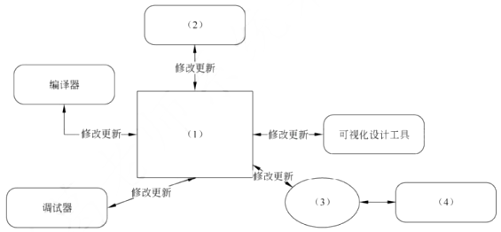

# 系统架构评估

## 最佳实践

### 考察问

1. ATAM方法的效用树:

    1. `()`
    2. `()`(性能, 可用性, 安全性, 可修改性)
    3. `()`
        1. 性能: 响应延迟, 吞吐量
        2. 可用性: 软硬件故障
        3. 安全性: 机密性, 完整性
        4. 可修改行: 新产品, 业务改变
    4. `()`

2. 敏感点, 权衡点, 风险点和非风险点
    1. 敏感点: 为实现`()`, `()`
    2. 权衡点: 多个质量属性的权衡
    3. 风险点: 
    4. 非风险点:
3. 零碎知识
    1. ATAM`()`一种精确的评估工具
    2. ATAM包含4个活动领域: `()`、`()`、`()`、`()`
    3. 场景的架构分析方法(SAAM)主要输入是`()`、`()`和`()`

### 考察点

1. ATAM方法的效用树:

    1. `树根`
    2. `质量属性`(性能, 可用性, 安全性, 可修改性)
    3. `评估指标`
        1. 性能: 响应延迟, 吞吐量
        2. 可用性: 软硬件故障
        3. 安全性: 机密性, 完整性
        4. 可修改行: 新产品, 业务改变
    4. `场景`

2. 敏感点, 权衡点, 风险点和非风险点
    1. 敏感点: 为实现`质量属性`, `构件的特性`
    2. 权衡点: 多个质量属性的权衡
    3. 风险点: 
    4. 非风险点:
3. 零碎知识
    1. ATAM`不是`一种精确的评估工具
    2. ATAM包含4个活动领域: `场景和需求收集`、`体系结构视图和场景实现`、`属性模型构造和分析`、`折中`
    3. 场景的架构分析方法(SAAM)主要输入是`问题描述`、`需求声明`和`体系结构描述`

## 系统架构评估中的重要概念

系统架构评估是在对架构分析、评估的基础上，对架构策略的选取进行决策。

系统架构评估中的重要概念：

1. 敏感点和权衡点是关键的架构决策。

    1. 敏感点：是指为了实现某种特定的质量属性，一个或多个构件所具有的特性。
    2. 权衡点：是影响多个质量属性的特性，是多个质量属性的敏感点。改变加密级别可能会对安全性和性能产生非常重要的影响。提高加密级别可以提高安全性，但可能要耗费更多的处理时间，影响系统性能。如果某个机密消息的处理有严格的时间延迟要求，则加密级别可能就会成为一个权衡点。
    3. `风险点`是指架构设计中潜在的、存在问题的架构决策所带来的隐患。
    4. `非风险点`是指不会带来隐患，一般以“XXX要求是可以实现（或接受）的”方式表达。

    

    例如：
    5. 对交易请求处理时间的要求将影响系统的数据传输协议和处理过程的设计(敏感点)
    6. 假设每秒中用户交易请求的数量是10个，处理请求的时间为30毫秒，则“在1秒内完成用户的交易请求”这一要求是可以实现的(非风险点)
    7. 目前对系统信用卡支付业务逻辑的描述尚未达成共识，这可能导致部分业务功能模块的重复，影响系统的可修改性(风险点)
    8. 更改加密的级别将对安全性和性能产生影响(权衡点)

2. 风险承担者或者称为利益相关人

    系统的架构涉及很多人的利益，这些人都对架构施加各种影响，以保证自己的目标能够实现。例如，风险承担者是软件系统架构师，职责是负责软件架构的质量需求间进行权衡的人，所关心的问题是对其他风险承担者提出的质量需求的折中和调停。

3. 场景

    在进行架构评估时，一般首先要精确地得出具体的质量目标，并以之作为判定该架构优劣的标准。为得出这些目标而采用的机制称之为场景。场景是从风险承担者的角度对与系统的交互的简短描述。在架构评估中，一般采用刺激、环境和响应三方面来对场景进行描述。

    

系统架构评估在架构设计之后，系统设计之前，因此与设计、实现、测试都没有关系。评估的目的是为了评估所采用的架构是否能解决软件系统需求。

系统架构评估的方法有3种：

- 基于调查问卷或检查表的方法：类似于需求获取中的问卷调查方式，只不过是架构方面的问卷，要求评估人员对领域熟悉。
- 基于场景的评估方法：主要方法。它是通过分析软件架构对场景（也就是对系统的使用或修改活动）的支持程度，从而判断该架构对这一场景所代表的质量需求的满足程度。从三个方面对场景进行设计：刺激（事件）；环境（事件发生的环境）；响应（架构响应刺激的过程）。应用在架构权衡分析方法（Architecture Tradeoff Analysis Method，ATAM）和软件架构分析方法（Software Architecture Analysis Method，SAAM）中。
- 基于度量的评估方法：制定一些定量指标来度量架构，如代码行数等。要制定质量属性和度量结果之间的映射，要求评估人员对架构熟悉。它是建立在软件架构度量的基础上的，涉及3个基本活动，首先需要建立质量属性和度量之间的映射原则，然后从软件架构文档中获取度量信息，最后根据映射原则分析推导出系统的质量属性。

🔒问题

1. ❤️改变加密级别可能会对安全性和性能产生非常重要的影响，因此在软件架构评估中，该设计决策是一个______。

    - A. 敏感点
    - B. 风险点
    - C. 权衡点
    - D. 非风险点

    答案: C

3. ❤️识别风险、非风险、敏感点和权衡点是进行软件架构评估的重要过程。“改变业务数据编码方式会对系统的性能和安全性产生影响”是对（  ）的描述，“假设用户请求的频率为每秒1个，业务处理时间小于30毫秒，则将请求响应时间设定为1秒钟是可以接受的”是对（  ）的描述。

    - A 风险点
    - B 非风险
    - C 敏感点
    - D 权衡点

    - A 风险点
    - B 非风险
    - C 敏感点
    - D 权衡点

    答案: DB

4. 💛Architecture Tradeoff Analysis Method（ATAM）是一种软件架构的评估方法，以下关于该方法的叙述中，正确的是（  ）。

    - A ATAM是一种代码评估方法
    - B ATAM需要评估软件的需求是否准确
    - C ATAM需要对软件系统进行测试
    - D ATAM不是一种精确的评估工具

    答案: D

5. 🟡体系结构权衡分析方法（Architecture Tradeoff Analysis Method，ATAM）包含4个主要的活动领域，分别是场景和需求收集、体系结构视图和场景实现、（  ）、折中。基于场景的架构分析方法（Scenarios-based Architecture Analysis Method，SAAM）的主要输入是问题描述、需求声明和（  ）。

- A 架构设计
- B 问题分析与建模
- C 属性模型构造和分析
- D 质量建模

- A 问题说明
- B 问题建模
- C 体系结构描述
- D 需求建模

答案: CC

|  | 性能 | 安全性 | 可用性 | 易用性 | 可测试性 | 可维护性 |
| --- | --- | --- | --- | --- | --- | --- |
| 性能 |  | - |  | - | - | - |
| 安全性 | - |  |  | - | - |  |
| 可用性 |  |  |  |  |  |  |
| 易用性 | - |  | - |  | - |  |
| 可测试性 | - |  |  |  |  | + |
| 可维护性 | - |  | + |  | + |  |

## 系统架构评估方法

### 基于场景的架构分析方法SAAM

SAAM是一种非功能质量属性的架构分析方法，是最早形成文档并得到广泛使用的软件架构分析方法。最初关注可修改性，后扩充到可移植性、可扩充性等。

1. 特定目标：SAAM的目标是对描述应用程序属性的文档，验证基本的架构假设和原则。
2. 评估技术：SAAM所使用的评估技术是场景技术。场景代表了描述架构属性的基础，描述了各种系统必须支持的活动和可能存在的状态变化。
3. 质量属性：这一方法的基本特点是把任何形式的质量属性都具体化为场景，但可修改性是SAAM分析的主要质量属性。
4. 风险承担者：SAAM协调不同参与者之间感兴趣的共同方面，作为后续决策的基础，达成对架构的共识。
5. 架构描述：SAAM用于架构的最后版本，但早于详细设计。架构的描述形式应当被所有参与者理解。功能、结构和分配被定义为描述架构的3个主要方面。
6. 方法活动：SAAM的主要输入是问题描述、需求声明和架构描述。下图描绘了SAAM分析活动的相关输入及评估过程。SAAM分析评估架构的过程包括5个步骤，即场景开发、架构描述、单个场景评估、场景交互评估和总体评估。

    

7. 已有知识库的可重用性：SAAM不考虑这个问题。
8. 方法验证：SAAM是一种成熟的方法，已被应用到众多系统中，这些系统包括空中交通管制、嵌入式音频系统、WRCS（修正控制系统）、KWIC（根据上下文查找关键词系统）等。

### 架构权衡分析方法ATAM

1. 基本概念

    架构权衡分析方法(Architecture Tradeoff Analysis Method, ATAM)是在SAAM的基础上发展起来的，主要针对性能、安全性、可修改性和可用性，在系统开发之前，对这些质量属性进行评价和折中。

    架构权衡分析法ATAM，让架构师明确如何权衡多个质量目标，参与者有评估小组、项目决策者和其他项目相关人。

    ATAM被分为四个主要的活动领域，分别是场景和需求收集、体系结构视图和场景实现、属性模型构造和分析、折中。整个评估过程强调以质量属性作为架构评估的核心。

    

    用ATAM方法评估软件架构，其工作分为4个基本阶段，即演示、调查和分析、测试和报告，如图所示。

    

2. 阶段

    1. 阶段1: 演示

        这是使用ATAM评估软件体系结构的初始阶段。

        1. 介绍ATAM**：描述ATAM的评估过程。
        2. 介绍业务驱动因素**：着重业务视角，提供有关系统功能、主要利益相关方、业务目标和其他限制等信息。
        3. 介绍要评估的体系结构**：侧重可用性以及体系结构的质量要求。

    2. 阶段2: 调查和分析

        在这个阶段，人们对评估期间需要重点关注的一些关键问题进行彻底调查。

        1. 确定架构方法：涉及能够理解系统关键需求的关键架构方法。
        2. 生成质量属性效用树：确定最重要的质量属性，并确定有限次序。
        3. 分析体系结构方法：彻底调查和分析，找出处理相应质量属性架构的方法。包括4个主要阶段：调查架构方法->创建分析问题->分析问题的答案->找出风险、非风险、敏感点和权衡点。

    3. 阶段3: 测试

        1. 头脑风暴和优先场景：将头脑风暴的优先列表与生成质量属性效用树中所获取的优先方案进行比较。
        2. 分析架构方法。

    4. 阶段4: 报告ATAM

        提供评估期间收集的所有信息，呈现给利益相关者。

3. 质量属性效用树

    ATAM方法采用效用树（Utility tree）这一工具来对质量属性进行分类和优先级排序。效用树的结构包括：树根--质量属性--属性分类--质量属性场景（叶子节点）。需要注意的是，ATAM主要关注4类质量属性：`性能`、`安全性`、`可修改性`和`可用性`，这是因为这4个质量属性是利益相关者最为关心的。

    

    🔒题目

    1. 💚在ATAM评估方法设计之初，其主要关注的4种质量属性，分别为______。

        - A. 性能、安全性、可修改性和可测试性
        - B. 性能、安全性、可修改性和可用性
        - C. 性能、可修改性、可用性和可测试性
        - D. 安全性、可测试性、可用性和可测试性

        答案: B

    2. 💛效用树是采用架构权衡分析方法（Architecture Trade off Analysis Method，ATAM）进行架构评估的工具之一，其树形结构从根部到叶子节点依次为______。

        - A. 树根、属性分类、优先级、质量属性场景
        - B. 树根、质量属性、属性分类、质量属性场景
        - C. 树根、优先级、质量属性、质量属性场景
        - D. 树根、质量属性、属性分类、优先级

    答案: B

### 成本效益分析法CBAM

成本效益分析法CBAM是在ATAM上构建，用来对架构设计决策的成本和收益进行建模，让决策者根据投资回报率ROI来选择合适的架构，在ATAM确定质量合理的基础上，再对效益进行分析。有以下8个步骤：

1. 整理场景：确定场景，并确定优先级，选择优先级最高的1/3场景进行分析；
2. 对场景进行细化：对每个场景详细分析，确定最好、最坏的情况；
3. 确定场景的优先级：项目干系人对场景投票，根据投票结果生成场景的权值；
4. 分配效用：对场景响应级别确定效用表，建立策略、场景、响应级别的表格；
5. 形成对应关系：形成“策略-场景-响应级别”的对应关系；
6. 确定效用：使用内插法确定期望的质量属性响应级别的效用（根据效用表确定所对应的具体场景的效用表）；
7. 计算总收益：计算各架构策略的总收益；
8. 选择架构策略：根据受成本限制影响的投资回报率ROI选择架构策略（估算成本，用上一步的收益减去成本，计算ROI并排序，从而选择收益最高的架构策略）。

## 🔒题目

1. (6分)质量属性及其场景(质量效用树)，填空6个。(2024上)

    答：考查质量效用树，如安全性，可用性，功能性，可修改性等。 

1. 某网上购物电子商务公司拟升级正在使用的在线交易系统，以提升用户网上购物在线支付环节的效率和安全性。在系统的需求分析与架构设计阶段，公司提出了以下需求和关键质量属性场景：

    1. 正常负载情况下，系统必须在0.5秒内对用户的交易请求进行响应；（性能）
    2. 信用卡支付必须保证99.999%的安全性；（安全性）
    3. 对交易请求处理时间的要求将影响系统的数据传输协议和处理过程的设计；（敏感点）
    4. 网络失效后，系统需要在1.5分钟内发现错误并启用备用系统；（可用性）
    5. 需要在20人月内为系统添加一个新的CORBA中间件；（可修改性）
    6. 交易过程中涉及到的产品介绍视频传输必须保证画面具有600*480的分辨率，20帧/秒的速率；（性能）
    7. 更改加密的级别将对安全性和性能产生影响；（权衡点）
    8. 主站点断电后，需要在3秒内将访问请求重定向到备用站点；（可用性）
    9. 假设每秒用户交易请求的数量是10个，处理请求的时间为30毫秒，则“在1秒内完成用户的交易请求”这一要求是可以实现的；
    10. 用户信息数据库授权必须保证99.999%可用；（安全性）
    11. 目前对系统信用卡支付业务逻辑的描述尚未达成共识，这可能导致部分业务功能模块的重复，影响系统的可修改性；（风险点）
    12. 更改Web界面接口必须在4人周内完成；（可修改性）
    13. 系统需要提供远程调试接口，并支持系统的远程调试。（可测试性）

2. 在对系统需求和质量属性场景进行分析的基础上，系统架构师给出了三个候选的架构设计方案，公司目前正在组织系统开发的相关人员对系统架构进行评估。

    1. (12分)在架构评估过程中，质量属性效用树（utility tree）是对系统质量属性进行识别和优先级排序的重要工具。请给出合适的质量属性，填入下图中（1）、（2）空白处；并选择题干描述的（a）～（m），填入（3）～（6）空白处，完成该系统的效用树。

        

    2. 在架构评估过程中，需要正确识别系统的架构风险、敏感点和权衡点，并进行合理的架构决策。请用300字以内的文字给出系统架构风险、敏感点和权衡点的定义，并从题干（a）～（m）中各选出1个对系统架构风险、敏感点和权衡点最为恰当的描述。

2. 在需求分析与架构设计阶段， 公司提出的需求和质量属性描述如下：

    (a)管理员能够在页面上灵活设置折扣力度规则和促销活动逻辑，设置后即可生效；
    (b)系统应该具备完整的安全防护措施，支持对恶意攻击行为进行检测与报警；
    (c)在正常负载情况下，系统应在0.3秒内对用户的界面操作请求进行响应；
    (d)用户名是系统唯一标识，要求以字母开头，由数字和字母组合而成，长度不少于6个字符；
    (e)在正常负载情况下，用户支付商品费用后在3秒内确认订单支付信息；
    (f)系统主站点电力中断后，应在5秒内将请求重定向到备用站点；
    (g)系统支持横向存储扩展，要求在2人天内完成所有的扩展与测试工作；
    (h)系统宕机后，需要在10秒内感知错误，并自动启动热备份系统；
    (i)系统需要内置接口函数，支持开发团队进行功能调试与系统诊断；
    (j)系统需要为所有的用户操作行为进行详细记录，便于后期查阅与审计；
    (k)支持对系统的外观进行调整和配置，调整工作需要在4人天内完成。

    在架构评估过程中，质量属性效用树 (utility tree)是对系统质量属性进行识别和优先级排序的重要工具。请将合适的质量属性名称填入图1 - 1中(1)、(2)空白处，并选择题干描述的(a)~(k)填入(3)~(6)空白处，完成该系统的效用树。(2022下)

    

    （1）安全性 （2）可修改性 （3）e （4）j （5）h （6）k 

3. 在需求分析与架构设计阶段，公司提出的需求和质量属性描述如下：

    （a）平台用户分为算法工程师、软件工程师和管理员等三种角色，不同角色的功能界面有所不同；
    （b）平台应该具备数据库保护措施，能够预防核心数据库被非授权用户访问；
    （c）平台支持分布式部署，当主站点断电后，应在20秒内将请求重定向到备用站点；
    （d）平台支持初学者和高级用户两种界面操作模式，用户可以根据自己的情况灵活选择合适的模式；
    （e）平台主站点宕机后，需要在15秒内发现错误并启用备用系统；
    （f）在正常负载情况下，机器学习流程从提交到开始执行，时间间隔不大于5秒；
    （g）平台支持硬件扩容与升级，能够在3人天内完成所有部署与测试工作；
    （h）平台需要对用户的所有操作过程进行详细记录，便于审计工作；
    （i）平台部署后，针对界面风格的修改需要在3人天内完成；
    （j）在正常负载情况下，平台应在0.5秒内对用户的界面操作请求进行响应；
    （k）平台应该与目前国内外主流的机器学习应用开发平台的界面风格保持一致；
    （l）平台提供机器学习算法的远程调试功能，支持算法工程师进行远程调试。 

    

    1. （9分）在架构评估过程中，质量属性效用树(utility tree)是对系统质量属性进行识别和优先级排序的重要工具。请将合适的质量属性名称填入图1-1中(1)、(2)空白处，并从题干中的(a)-(l)选择合适的质量属性描述，填入(3)-(6)空白处，完成该平台的效用树。(2021下) 

        （1）性能
        （2）可修改性
        （3）e
        （4）j
        （5）h
        （6）i 

在需求分析与架构设计阶段，公司提出的需求和质量属性描述如下：
（a）根据用户的付费情况对用户进行分类，并根据类别提供相应的开发功能；
（b）在正常负载情况下，系统应在0.2秒内对用户的界面操作请求进行响应；
（c）系统应该具备完善的安全防护措施，能够对黑客的攻击行为进行检测与防御；
（d）系统主站点断电后，应在3秒内将请求重定向到备用站点；
（e）系统支持中文昵称，但用户名必须以字母开头，长度不少于8个字符；
（f）系统宕机后，需要在15秒内发现错误并启用备用系统；
（g）在正常负载情况下，用户的代码提交请求应该在0.5秒内完成；
（h）系统支持硬件设备灵活扩容，应保证在2人·天内完成所有的部署与测试工作；
（i）系统需要为针对代码仓库的所有操作情况进行详细记录，便于后期查阅与审计；
（j）更改系统的web界面风格需要在4人·天内完成；
（k）系统本身需要提供远程调试接口，支持开发团队进行远程排错。 

1. （12分）在架构评估过程中，质量属性效用树（utility tree）是对系统质量属性进行识别和优先级排序的重要工具。请将合适的质量属性名称填入图1 - 1中（l）、（2）空白处，并选择题干描述的（a）～（k）填入（3）～（6）空白处，完成该系统的效用树。(2020下) 

    

    参考答案：（1）安全性（2）可修改性（3）g（4）i（5）f（6）j

某电子商务公司为了更好地管理用户，提升企业销售业绩，拟开发一套用户管理系统。该系统的基本功能是根据用户的消费级别、消费历史、信用情况等指标将用户划分为不同的等级，并针对不同等级的用户提供相应的折扣方案。在需求分析与架构设计阶段，电子商务公司提出的需求、质量属性描述和架构特性如下：
（a）用户目前分为普通用户、银卡用户、金卡用户和白金用户四个等级，后续需要能够根据消费情况进行动态调整；
（b）系统应该具备完善的安全防护措施，能够对黑客的攻击行为进行检测与防御； 
（c）在正常负载情况下，系统应在0.5秒内对用户的商品查询请求进行响应； 
（d）在各种节假日或公司活动中，针对所有级别用户，系统均能够根据用户实时的消费情况动态调整折扣力度； 
（e）系统主站点断电后，应在5秒内将请求重定向到备用站点； 
（f）系统支持中文昵称，但用户名要求必须以字母开头，长度不少于8个字符； 
（g）当系统发生网络失效后，需要在15秒内发现错误并启用备用网络； 
（h）系统在展示商品的实时视频时，需要保证视频画面具有1024×768像素的分辨率，40帧/秒的速率； 
（i）系统要扩容时，应保证在10人·月内完成所有的部署与测试工作； 
（j）系统应对用户信息数据库的所有操作都进行完整记录； 

1. （8分）针对该系统的需求，在面向对象和基于规则的两种架构风格中，哪种架构风格更适合？请从灵活性、可扩展性和性能三个方面对这两种架构风格进行比较与分析，并简要说明选择理由。(2019下)

    |架构风格名称|灵活性|可扩展性|性能|
    | ---- | ---- | ---- | ---- |
    |面向对象|将用户级别,折扣规则等封装为对象，在系统启动时加载|(2)|(3)|
    |基于规则|(1)|加入新的用户级别和折扣规则时只需要定义新的规则，解释规则即可进行扩展|需要对用户级别与折扣规则进行实时解释、性能较差|

    该系统更适合采用基于规则的虚拟机架构风格。
    1. 根据用户级别建立用户级别 - 折扣规则矩阵，在系统启动时加载并支持运行过程中动态更新，灵活性好；
    2. 加入新的用户级别和折扣规则时需要增加相应的类来扩展，可通过系统重启、动态反射或动态加载扩展，扩展性较差；
    3. 可根据类型判断或策略模式直接获得用户级别对应的折扣规则对象实时计算，性能很好。

2. 在架构评估过程中，质量属性效用树（Utility Tree）是对系统质量属性进行识别和优先级排序的重要工具。请将合适的质量属性名称填入图1 - 1中（1）、（2）空白处，并选择题干描述的（a）~（l）填入（3）~（6）空白处，完成该系统的效用树。(2019下) 

    

    （1）安全性（2）可修改性（3）h（4）j（5）e（6）k

某文化产业集团委托软件公司开发一套文化用品商城系统，业务涉及文化用品销售、定制、竞拍和点评等板块，以提升商城的信息化建设水平。该软件公司组织项目组完成了需求调研，现已进入到系统架构设计阶段。考虑到系统需求对架构设计决策的影响，项目组先列出了可能影响系统架构设计的部分需求如下：

(a)用户界面支持用户的个性化定制；
(b)系统需要支持当前主流的标准和服务，特别是通信协议和平台接口；
(c)用户操作的响应时间应不大于3秒，竞拍板块不大于1秒；
(d)系统具有故障诊断和快速恢复能力；
(e)用户密码需要加密传输；
(f)系统需要支持不低于2GB的数据缓存；
(g)用户操作停滞时间超过一定时限需要重新登录验证；
(h)系统支持用户选择汉语、英语或法语三种语言之一进行操作。

项目组提出了两种系统架构设计方案：瘦客户端C/S架构和胖客户端C/S架构，经过对上述需求逐条分析和讨论，最终决定采用瘦客户端C/S架构进行设计。 

1. (8 分)在系统架构设计中，决定系统架构设计的非功能性需求主要有四类：操作性需求、性能需求、安全性需求和文化需求。请简要说明四类需求的含义。(2018下)

    1. 操作性需求：指系统完成任务所需的操作环境要求及如何满足系统将来可能的需求变更的要求。
    2. 性能需求：针对系统性能要求的指标，如吞吐率、响应时间和容量等。 
    3. 安全性需求：指为防止系统崩溃和保证数据安全所需要采取的保护措施的要求，为系统提供合理的预防措施。 
    4. 文化需求：指使用本系统的不同用户群体对系统提出的特有要求。 

2. (8 分)根据表 1 - 1 的分类，将题干所给出的系统需求(a)~(h)分别填入(1)(4)。

    |需求类别|系统需求|
    | ---- | ---- |
    |操作性需求|（1）|
    |性能需求|（2）|
    |安全性需求|（3）|
    |文化需求|（4）|

    1. (b)、(d)
    2. (c)、(f)
    3. (e)、(g)
    4. (a)、(h)

3. (9 分)请用 100 字以内文字说明瘦客户端 C/S 架构能够满足题干中给出的哪些系统需求。 

    瘦客户端C/S架构能够更好地满足系统需求中的(a)、(b)、(d)和(h)。

某单位为了建设健全的公路桥梁养护管理档案，拟开发一套公路桥梁在线管理系统。在系统的需求分析与架构设计阶段，用户提出的需求、质量属性描述和架构特性如下：
(a)系统用户分为高级管理员、数据管理员和数据维护员等三类；
(b)系统应该具备完善的安全防护措施，能够对黑客的攻击行为进行检测与防御； 
(c)正常负载情况下，系统必须在 0.5 秒内对用户的查询请求进行响应；
(d)对查询请求处理时间的要求将影响系统的数据传输协议和处理过程的设计；
(e)系统的用户名不能为中文，要求必须以字母开头，长度不少于 5 个字符；
(f)更改系统加密的级别将对安全性和性能产生影响；
(g)网络失效后，系统需要在 10 秒内发现错误并启用备用系统；
(h)查询过程中涉及的桥梁与公路的实时状态视频传输必须保证画面具有 1024×768 的分辨率，40 帧/秒的速率；
(i)在系统升级时，必须保证在 10 人月内可添加一个新的消息处理中间件；
(k)系统主站点断电后，必须在 3 秒内将请求重定向到备用站点；
(h)如果每秒钟用户查询请求的数量是 10 个，处理单个请求的时间为 30 毫秒，则系统应保证在 1 秒内完成用户的查询请求；
(l)对桥梁信息数据库的所有操作都必须进行完整记录；
(m)更改系统的 Web 界面接口必须在 4 人周内完成；
(n)如果“养护报告生成”业务逻辑的描述尚未达成共识，可能导致部分业务功能模块规则的矛盾，影响系统的可修改性；
(o)系统必须提供远程调试接口，并支持系统的远程调试。在对系统需求、质量属性描述和架构特性进行分析的基础上，系统的架构师给出了三个候选的架构设计方案，公司目前正在组织系统开发的相关人员对系统架构进行评估。 

1. (12 分)在架构评估过程中，质量属性效用树(utility tree)是对系统质量属性进行识别和优先级排序的重要工具。请给出合适的质量属性，填入图 1 - 1 中(1)、(2)空白处；并选择题干描述的(a)~(o)，填入(3)~(6)空白处，完成该系统的效用树。(2017下)

    

    | 编号 | 答案 |
    | ---- | ---- |
    | （1） | 安全性 |
    | （2） | 可修改性 |
    | （3） | （h） |
    | （4） | （l） |
    | （5） | （j） |
    | （6） | （m） | 

2. (13 分)在架构评估过程中，需要正确识别系统的架构风险、敏感点和权衡点，并进行合理的架构决策。请用 300 字以内的文字给出系统架构风险、敏感点和权衡点的定义，并从题干(a)~(o)中分别选出 1 个对系统架构风险、敏感点和权衡点最为恰当的描述。(2017下) 

    系统架构风险是指架构设计中潜在的、存在问题的架构决策所带来的隐患。敏感点是指为了实现某种特定的质量属性，一个或多个系统组件所具有的特性。权衡点是指影响多个质量属性，并对多个质量属性来说都是敏感点的系统属性。题干描述中，
    (n)描述的是系统架构风险；
    (d)描述的是敏感点；
    (f)描述的是权衡点。 

某软件公司为某品牌手机厂商开发一套手机应用程序集成开发环境，以提高开发手机应用程序的质量和效率。在项目之初，公司的系统分析师对该集成开发环境的需求进行了调研和分析，具体描述如下：
1. 需要同时支持该厂商自行定义的应用编程语言的编辑、界面可视化设计、编译、调试等模块，这些模块产生的模型或数据格式差异较大，集成环境应提供数据集成能力。集成开发环境还要支持以适配方式集成公司现有的应用模拟器工具。
2. 经过调研，手机应用开发人员更倾向于使用 Windows 系统，因此集成开发环境的界面需要与 Windows 平台上的主流开发工具的界面风格保持一致。 
3. 支持相关开发数据在云端存储，需要保证在云端存储数据的机密性和完整性。 
4. 支持用户通过配置界面依据自己的喜好修改界面风格，包括颜色、布局、代码高亮方式等，配置完成后无须重启环境。 
5. 支持不同模型的自动转换。在初始需求中定义的机器性能条件下，对于一个包含 50 个对象的设计模型，将其转换为相应代码框架时所消耗时间不超过 5 秒。 
6. 能够连续运行的时间不小于 240 小时，意外退出后能够在 10 秒之内自动重启。 
7. 集成开发环境具有模块化结构，支持以模块为单位进行调试、测试与发布。 
8. 支持应用开发过程中的代码调试功能：开发人员可以设置断点，启动调试，编辑器可以自动卷屏并命中断点，能通过变量监视器查看当前变量取值。

在对需求进行分析后，公司的架构师小张查阅了相关的资料，认为该集成开发环境应该采用管道 - 过滤器(Pipe - Filter)的架构风格，公司的资深架构师王工在仔细分析后，认为应该采用数据仓储(Data Repository)的架构风格。公司经过评审，最终采用了王工的方案。

1. (10 分)识别软件架构质量属性是进行架构设计的重要步骤。请分析题干中的需求描述，填写表 1 - 1 中(1)~(5)处的空白。(2016下)

    |质量属性名称|需求描述编号|
    | ---- | ---- |
    |可用性|（1）|
    |（2）|e|
    |可修改性|（3）|
    |可测试性|（4）| 
    |安全性|c|
    |易用性|（5）|

    (1)f(2)性能(3)d(4)g(5)b

2. (7 分)请在阅读题干需求描述的基础上，从交互方式、数据结构、控制结构和扩展方法 4 个方面对两种架构风格进行比较，填写表 1 - 2 中(1)~(4)处的空白。

    |比较因素|管道 - 过滤器风格|数据仓储风格|
    | ---- | ---- | ---- |
    |交互方式|顺序结构或有限的循环结构|（1）|
    |数据结构|（2）|文件或模型|
    |控制结构|（3）|业务功能驱动|
    |扩展方法|接口适配|（4）|

    (1)工具之间无直接交互，通过数据仓储间接交互
    (2)流式数据
    (3)数据驱动
    (4)与数据仓储进行数据适配 

3. (8 分)在确定采用数据仓库架构风格后，王工给出了集成开发环境的架构图。请填写图 1 - 1 中(1)~(4)处的空白，完成该集成开发环境的架构图。 

    

    (1)模型/数据库
    (2)代码编辑工具
    (3)数据格式转换器
    (4)模拟器 

4. 该系统还需满足以下非功能性需求：
        
    - （a）系统应支持大于100个工业设备的并行监测；
    - （b）设备数据从制造现场传输到系统后台的传输时间小于1s；
    - （c）系统应7×24小时工作；
    - （d）可抵御常见XSS攻击；
    - （e）系统在故障情况下，应在0.5小时内恢复；
    - （f）支持数据审计。

    问题:
    
    1. 💚（6分）请按照性能、安全性和可用性等三类非功能性需求分类，选择题干描述的（a）~（f）填入（1）~（3）。(2020下)

        |非功能性需求类别|非功能性需求|
        | ---- | ---- |
        |性能|（1）|
        |安全性|（2）|
        |可用性|（3）| 

        (1)a、b(2)d、f(3)c、e

5. 其非功能性需求如下：

    - （1）系统应支持大于50个终端设备的并发请求；
    - （2）系统应能够实时识别车牌，识别时间应小于1s；
    - （3）系统应7×24小时工作；
    - （4）具有友好的用户界面；
    - （5）可抵御常见SQL注入攻击； 
    - （6）独立事务操作响应时间应小于3s；
    - （7）系统在故障情况下，应在1小时内恢复；
    - （8）新用户学习使用系统的时间少于1小时。

    1. （4分）请将上述非功能性需求（1）~（8）归类到性能、安全性、可用性、易用性这四类非功能性需求。(2019下)

        性能：（1）、（2）、（6）
        安全性：（5）
        可用性：（3）、（7）
        易用性：（4）、（8）