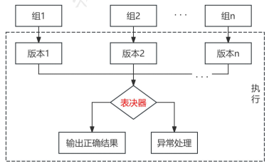
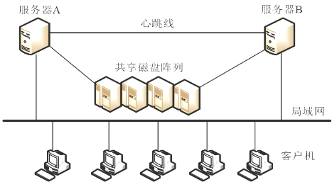

# 软件可靠性设计

## 最佳实践

### 题目

1. 论软件可靠性设计

1. 采用检错设计技术要着重考虑4个要素：检测对象、______、实现方法和处理方式。

    - A.检测延时
    - B.测试结果
    - C.性能测试
    - D.功能测试

    答案：A

2. (  )是通常所说的Active/Standby方式，Active服务器处于工作状态，Standby服务器处于监控准备状态，服务器数据包括数据库数据同时往两台或多台服务器写入，保证数据的即时同步。

    - A.双机热备
    - B.双机互备
    - C.双机双工
    - D.服务器集群

    - 答案：A

### 考察问

1. 检错设计技术要着重考虑4个要素: `()`、`()`、`()`和`()`
2. `()`是一台服务器处于`()`状态，一台服务器处于`()`状态，服务器数据包括数据库数据同时往两台写入。
3. `()`不同的应用在两台机器同时运行
4. `()`相同的应用在两台机器同时运行

### 考察点

1. 检错设计技术要着重考虑4个要素: `检测对象`、`检测延时`、`实现方法`和`处理方式`
2. `双机热备`是一台服务器处于`工作`状态，一台服务器处于`准备`状态，服务器数据包括数据库数据同时往两台写入。
3. `双机互备`不同的应用在两台机器同时运行
4. `双机双工`相同的应用在两台机器同时运行

## 软件可靠性设计

实践证明，保障软件可靠性最有效、最经济、最重要的手段是在软件设计阶段采取措施进行可靠性控制。为了从根本上提高软件的可靠性，降低软件后期修改的成本和难度，人们提出了可靠性设计的概念。

可靠性设计其实就是在常规的软件设计中，应用各种方法和技术，使程序设计在兼顾用户的功能和性能需求的同时，全面满足软件的可靠性要求，即采用一些技术手段，把可靠性”设计”到软件中去。

## 容错设计技术

常用的软件容错技术主要有恢复块设计、 N 版本程序设计和冗余设计 3 种方法。

1. 恢复块设计

    程序的执行过程可以看成是由一系列操作构成的，这些操作又可由更小的操作构成。恢复块设计就是选择一组操作作为容错设计单元，从而把普通的程序块变成恢复块。被选择用来构造恢复块的程序块可以是模块、过程、子程序和程序段等。

    一个恢复块包含有若干个功能相同、设计差异的程序块文本，每一时刻有一个文本处千运行状态。一旦该文本出现故障，则用备份文本加以替换，从而构成“动态冗余＂。软件容错的恢复块方法就是使软件包含有一系列恢复块。

    

2. N版本程序设计

    N 版本程序的核心是通过设计出多个模块或不同版本，对于相同初始条件和相同输入的操作结果，实行多数表决，防止其中某一软件模块／版本的故障提供错误的服务，以实现软件容错。为使此种容错技术具有良好的结果，必须注意以下两个方面。

    

3. 冗余设计

    改善软件可靠性的一个重要技术是冗余设计。在硬件系统中，在主运行的系统之外备用额外的元件或系统，如果出现一个元件故障或系统故障，则立即更换冗余的元件或切换到冗余的系统，则该硬件系统仍可以维待运行。在软件系统中，冗余技术的运用有所区别。如果采用相同两套软件系统互为备份，其意义不大，因为在相同的运行环境中，一套软件出故障的地方，另外一套也一定会出现故障。软件的冗余设计技术实现的原理是在一套完整的软件系统之外，设计一种不同路径、不同算法或不同实现方法的模块或系统作为备份，在出现故障时可以使用冗余的部分进行替换，从而维持软件系统的正常运行。

拓展： 恢复块和N版本程序设计区别

|对比|恢复块方法|N版本程序设计|
| ---- | ---- | ---- |
|硬件运行环境|单机|多机|
|错误检测方法|验证测试程序|表决|
|恢复策略|后向恢复|前向恢复|
|实时性|差|好|

## 检错技术

在软件系统中，对无须在线容错的地方或不能采用冗余设计技术的部分，如果对可靠性要求较高，故障有可能导致严重的后果。一般采用检错技术，在软件出现故障后能及时发现并报警，提醒维护人员进行处理。检错技术实现的代价一般低千容错技术和冗余技术，但它有一个明显的缺点，就是不能自动解决故障，出现故障后如果不进行人工干预，将最终导致软件系统不能正常运行。

## 降低复杂度设计

软件复杂性常分为模块复杂性和结构复杂性。模块复杂性主要包含模块内部数据流向和程序长度两个方面，结构复杂性用不同模块之间的关联程度来表示。

降低复杂度设计的思想就是在保证实现软件功能的基础上，简化软件结构，缩短程序代码长度，优化软件数据流向，降低软件复杂度，从而提高软件可靠性。

## 系统配置技术

通常在系统配置中可以采用相应的容错技术，通过系统的整体来提供相应的可靠性，主要有双机热备技术和服务器集群技术。

### 双机热备技术

双机热备技术是一种软硬件结合的较高容错应用方案。该方案是由两台服务器系统和一个外接共享磁盘阵列柜和相应的双机热备份软件组成。

在这个容错方案中，操作系统和应用程序安装在两台服务器的本地系统盘上，整个网络系统的数据是通过磁盘阵列集中管理和数据备份的。用户的数据存放在外接共享磁盘阵列中，在一台服务器出现故障时，备机主动替代主机工作，保证网络服务不间断。

双机热备系统采用“心跳”方法保证主系统与备用系统的联系。所谓“心跳＂，指的是主从系统之间相互按照一定的时间间隔发送通信信号，表明各自系统当前的运行状态。一旦“心跳”信号表明主机系统发生故障，或者备用系统无法收到主机系统的“心跳“信号，则系统的高可用性管理软件认为主机系统发生故障，立即将系统资源转移到备用系统上，备用系统替代主机工作，以保证系统正常运行和网络服务不间断。

双机热备方案中，根据两台服务器的工作方式可以有 3 种不同的工作模式，即：双机热备模式、双机互备模式和双机双工模式。

1. 双机热备模式，即通常所说的 Acti ve/Standby方式， Active 服务器处于工作状态；而Standby服务器处于监控准备状态，服务器数据包括数据库数据同时往两台或多台服务器写入(通常各服务器采用 RAID 磁盘阵列卡)，保证数据的即时同步。当 Active 服务器出现故障的时候，通过软件诊测或手工方式将 Standby机器激活，保证应用在短时间内完全恢复正常使用。这是目前采用较多的一种模式，但由于另外一台服务器长期处于后备的状态，就存在一定的计算资源浪费。

2. 双机互备模式，是两个相对独立的应用在两台机器同时运行，但彼此均设为备机，当某一台服务器出现故障时，另一台服务器可以在短时间内将故障服务器的应用接管过来，从而保证了应用的持续性，但对服务器的性能要求比较高。

3. 双机双工模式是集群的一种形式，两台服务器均处千活动状态，同时运行相同的应用，以保证整体系统的性能，也实现了负载均衡和互为备份，通常使用磁盘柜存储技术。 Web 服务器或 FTP 服务器等用此种方式比较多。

### 服务器集群技术

集群技术是指一组相互独立的服务器在网络中组合成为单一的系统工作，并以单一系统的模式加以管理。此单一系统为客户工作站提供高可靠性的服务。

集群内各结点服务器通过内部局域网相互通信，当某结点服务器发生故障时，这台服务器上所运行的应用程序将在另一结点服务器上被自动接管。当一个应用服务发生故障时，应用服务将被重新启动或被另一台服务器接管。当以上的任一故障发生时，客户都将能很快连接到其他应用服务器上。

