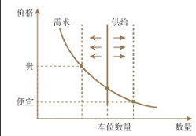
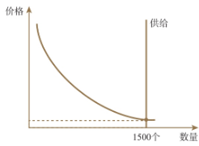

# 应用

## 车位
第一个案例，当你买完房子之后，要不要买车位呢？

首先，马上在脑子里开始画供需曲线。需求曲线是一条向下倾斜的曲线，供给曲线是一条向上倾斜的曲线。

然而，小区一旦建好后，车库数量就固定了，无法随着价格而变动。所以在要不要买车位的例子里，小区车位的供给是一条竖直的线。我们在讲供给的时候也提过，需求曲线是向下倾斜的，几乎没有例外。而供给曲线的向上倾斜却有很多例外的情况，这就是一种例外的情况。

那么车位的价格是怎么决定的呢？基于我们想象出来的向下倾斜的需求曲线和竖直的供给曲线，我们会发现，车位价格主要取决于供给，供给曲线越往左，车位价格就越贵；供给曲线越往右，价格就越便宜。

假设这是一个1000户的小区，先考虑一种极端情况——整个小区里只有一个车位，会是什么结果？供给曲线会极度向左，卡在数量为1的位置上。此时，价格应该是多少呢？这就取决于整个小区里最有意愿和最有能力购买唯一车位的人，他能够接受多高的价格。

在这个小区里，每个人的购买能力和购买意愿也是不同的，张三愿意出5万，李四愿意出10万，王五愿意出15万……一直排到茅十八，愿意出50万。这群人里所有的人按出价高低排一条长队，排第一的人决定了车位的价格。

继续把条件放宽，假设这个千户小区里，有100个车位呢？我觉得比较有可能的状态是，1000户人按出价高低排队，排到第100户的时候，由排名第100位的人来决定车位价格。

那再继续放宽条件，假设这个小区里，车位配比是1∶1，即全小区有1000个车位会是什么样呢？会是全小区最穷的那人决定吗？不一定，因为未必规定每户只能购买1个车位，当价格降低到一定程度时，有些人会愿意买多个车位。假设全小区最富的300户人家，每户买了2个车位，总共消耗掉600个车位，然后中间的400户人家，每户买了1个车位，那么前700户就可以把整个小区的1000个车位消耗掉，小区车位价格就是由第700户来决定的，跟最后300户没关系。

那么我们把条件再放宽一些，小区车位配比是1∶1.5，意味着总共有1500个车位的时候，会是什么样子呢？假设前400户人家，每家买2个车位，消耗掉800个车位，然后剩下600户每家买1个车位，加起来消耗了1400个车位，还剩100个。到这个时候，说明车位价格就基本要由整个小区里排名倒数第一的人来决定了……甚至有可能要继续降价，降到最富的那100人愿意买3个车位。

如果继续放宽条件，假设小区车位配比是1∶2，总共有2000个车位。我相信大家心里已经有数了，这种小区的车位是不可能值钱的。

学完原理，再来看要不要买车位。首先，要放弃成本思维。网上有人教算成本，称一个车位配上公摊面积要三四十平方米，建筑成本每平方几千块，折算下来车位是亏钱卖，买了是赚钱。还有人称车位的建筑成本已经包含进房价，再卖车位是二次销售，买了是亏钱。还有人按租车位的价格除以车位售价，来计算车位的租售比，得出便宜与否的结果。现在大家学了经济学，就会发现这些计算方法都是错的。

其次，我们在估算车位值不值得买的时候，脑子里要有一个供需曲线，去从供、需两个角度来分析。从供给方的角度来看，供给曲线越靠左，则车位就越有价值；如果供给曲线越靠右，则越没价值。那供给曲线的位置由谁决定呢？由小区的车位配比来决定。20世纪90年代建设的小区里，车位配比往往只有1∶0.3，就是每10户才配3个车位。那么这个小区的车位价格就是由10户里最有钱的那3户来决定。上海东方曼哈顿是经常因为天价车位而上新闻的一个小区，早些年是因为车位涨到了60万，这几年是因为车位涨过了100万。这个小区2000年交付，执行的是旧标准，户数是1750，车位500个，大家可以自己算一下车位配比，当年车位规划得太少。

2000年到2017年的小区，一般被叫作次新房小区。这一时期建的房子，基本已经是板楼结构的电梯房，但当时停车位规划较为落后，有地下停车场的小区依然较少，很多小区车位配比在1∶0.6以下，基本等于车位由前50%的人来决定价格，车位也不会太便宜。

最后，如果让我给出建议的话，我的建议是先看车位配比，如果低于1∶1，大部分情况下值得买，低得越多越值得早买，除非这个小区人均收入太低。相反，如果高于1∶1.5，大部分情况下是不值得买的，因为价格基本涨不上去，而且可以租到车位。如果是1到1.5呢？那就取决于你自己的意愿了。

## 商业计划书/企业战略/研究报告
关于商业计划书、企业战略、研究报告。因为经常有朋友想要创业、吸引投资，需要写商业计划书给投资人。还有一些朋友成为大公司高管，参与了制定企业战略的过程。又或者有些朋友需要对某个行业进行调研，要做研究报告，这些都是属于比较高端的，有一点难度的技能，所以本节是我的经验之谈，希望未来的某一刻能够帮助到大家。

这就是本节的重点。一个人想要做多大的事，必须先处在一个什么样的高度。高度自上而下应该是全球—国家—地区/行业—企业—部门—个人，这是一个由高到低、由大到小的顺序。如果你想的只是个人或者部门的事情，那最多只能做基层员工。只有站在整个企业的角度思考，你才有可能成为部门经理、中层管理者。当你能想到地区和行业的高度时，就有可能成为企业高管。而你能否站在更高的高度，则代表着你管理的这个企业到底能做多大。

所以再看本节的主题：商业计划书、企业战略、研究报告。这些东西要怎么写？首先，逻辑上，要有自上而下的顺序。可以按照前面供给和需求两节中提到的影响因素来思考。

在投资领域常常有一句话——“站在风口上，猪也能飞起来。”风口，用术语来解释，就是需求曲线大幅右移，而供给还没有跟上，市场上的竞争对手非常少，自己的企业只要能占得先机，就能顺势抢占大量的市场份额，这就是风口。所以关于风口的分析，必须先从需求的影响因素着手，然后再从供给的竞争对手方面来分析。如果你的商业计划书清晰地做出了以上各种影响因素变化的分析，能够让投资人看到，这是一个需求快速增长的市场，投资人就会意识到：第一，这是一个风口上的行业，非常有吸引力；第二，你的创始团队是一个有着较高视野和大格局的团队，你们不是基层员工，有能够领导一个企业的潜力。

假设你在做这些的时候，发现这个行业比较凄惨，并没有处在风口上，需求在逐渐萎缩，需求曲线大幅左移，未来大家的日子不会好过。如果是这样，那你也要在分析中把这些现状清晰地描述出来。只有能意识到问题，才有可能应对问题。毕竟行业不好换，身处其中，就要想办法克服困难，而办法总比困难多。

所以王漫妮如果学过经济学的话，她在引起高管注意之后，就应该这么说：“我认为奢侈品市场受到影响，第一是因为近两年来全球经济不景气，奢侈品销量与经济增长高度相关，经济不景气会造成人们收入增速下降，影响奢侈品市场。”这第一句话，就指出了造成需求变化的原因是收入因素，等同于指出了问题。指出问题之后，就要想对策解决，解决不了就韬光养晦。

她接下来可以说：“但经济下行具有周期性，全球经济早晚会回暖，奢侈品市场有望继续增长。在这段时间里，我认为总公司一方面应该考虑蛰伏期对一线销售人员加强培训，增强品牌历史文化认知，强化销售人员素质，提前为市场回暖做准备；另一方面，中国作为全球经济增长的主要国家，建议总部可以考虑在国内多个城市举办品牌历史巡回展，强化消费者的认知，增强对消费者的影响力。”这段话就是站在行业层面分析问题，站在公司层面解决问题，基于上层的思考，做出下层的对策。对策准不准、管不管用没有关系，因为面试不是真解决问题，而是为了让自己在面试的过程中，留下更好的印象。

所以对策说完，可以继续强化自己的印象。她可以继续说：“我在公司已经工作有N年了，N次当选店内销售冠军，我对我们品牌有较深的认识，如果公司需要，我愿意在各个岗位上服务于公司的规划。”大家感觉出这三段话的视野高低了吗？首先站在大的视角下思考行业的整体问题；然后站在低一层的视角，以公司的角度去想对策；最后才是站在更低一层，以个人的角度，去说我能够做什么。三段话分属于三个不同的层次。

这种自上而下、逐步分析的思路，只要面试时间足够，王漫妮还可以再来一套，继续说：“全球奢侈品行业不景气，在我看来，第二个原因是全球人口增长陷入缓慢阶段，用户基数增长乏力，各个品牌想要扩大用户基数，就需要从年轻一代中找突破，下一阶段谁家能够把握年轻一代，谁家就能够走得长远。我认为，公司各门店销售人员的年龄结构也需要做出分配，比如每个门店搭配两名00后销售人员，以便更好地服务年轻用户。我是门店最优秀的销售员，过去三年里共N个月达到明星销售的标准，曾经开出过百万珠宝大单，有比较好的销售技巧和销售经验，如果总部有需要，我愿意去承担培训新人销售的任务。”这又是一套自上而下的分析思路。

看完这个例子，现在如果让你写商业计划书、做企业战略规划，或者写研究报告，你脑海中有一个大的框架了吗？

我们的分析思路一定要自上而下，先分析全局，看整个行业现状以及趋势的变化，最后再把落脚点缩小到公司身上。在分析全局的时候，最重要的，其实是对整个行业的总需求现状，及未来需求变化的趋势做分析。具体的做法，第12课“需求”中有很多信息，我们可以做收入分析、用户人数分析、用户结构分析、消费者喜好的变化分析、替代品和互补品的分析等很多内容，总需求其实就是市场分析。

其次是对整个行业的总供给现状，以及未来供给变化的趋势做分析。具体内容就在第13课“供给”之中，比如关于外界资源变化的分析、技术变化的分析、竞争企业数量和体量的分析、政策环境的分析等，总供给其实就是竞争分析。

在市场分析和竞争分析做完之后，再开始针对外界现状，给出企业运营的规划、战略的规划等方面的内容。

举例来说，如果竞争对手体量大，自己体量小，那我们就要走差异化竞争的路线，避免跟对手同渠道下竞争。相反，如果我们体量比对方大，就要想办法跟人家正面对决。再比如，如果我们预计整个行业的需求曲线即将要大幅右移，这个市场是一个风口，那当然是全部身家都押进去。相反，如果整个行业的需求曲线预计要左移，外界环境不妙，首先要想到的就是活下去。恰好，“全押进去”和“活下去”，就曾是两家大企业提出过的口号，大家有兴趣可以自行搜索，看是哪两家企业在什么环境下，提出过这样的口号。

所谓金融，金是指资金、金钱，融是指融通，意思就是周转。在转移的过程中，伴随着钱的转移，背后还有风险在转移，以及钱的时空转移。
比如保险，尤其是保险中的车险、意外险等，它们在转移钱的过程中，更注重风险的转移。又如期货，1月花钱买一笔9月的大豆合约，最后到9月时，才把大豆交付给你。这是在钱的转移过程中，更注重时间的转移。

## 买房

1. 单价
2. 地铁
3. 户型: 方正 面宽和进深
4. 容积率
5. 绿化
6. 停车位