# level1

## 第一章
### 数据分析的基本流程
业务理解-数据获取-数据处理-数据分析-结果展现
### 数据挖局的基本流程
CRISP-DM(cross-industry standard process for data mining)跨行业数据挖掘标准流程:
1. 业务理解(business understanding)
2. 数据理解(data understanding)
3. 数据准备(data preparation)
4. 建立模型(modeling)
5. 模型评估(evaluation)
6. 模型部署(deployment)
   
### EDIT数字化模型(10)
探索(Exploration):指标体系
诊断(Diagnosis):数据分析
指导(Instruction):分析结果
工具(tool):算法模型


## 第二章
表格结构数据: 以单元格为基本单位, 比如excel
表结构数据: 以字段为基本单位, 如mysql

### 表格结构数据
表格结构数据处理工具:numbers(苹果), excel(微软), wps(金山)
单元格, 单元格区域, 工作表, 工作簿
单元格引用:
1. =号表引用
2. !前是工作表名
3. A1，A表示列名，1表示行名
4. ：表示范围，可以理解为数组

### 表结构数据
维度(字段)和度量(字段):
    维度字段是记录业务行为的属性, 度量字段是记录业务行为的结果. 比如订单表的`付费时间`字段是以时间视角观察交易行为, `订单额`就是交易行为的结果.

维度表和事实表：
    维度表只包含维度字段, 事实表既包含维度字段又包含度量字段. 比如`商品信息表`只包含商品的属性所以是维度表, 而`订单表`既包含维度信息(`付费时间`等), 又包含度量信息(`订单额`)所以称为事实表.

筛选器:
    方向: 出发是维度字段(维度表,副表,一表), 指向是度量字段(事实表,主表,多表)
    对应关系: 
        一对多:
        一对一: 含有相同的主键, 一般遇不到, 遇到可以合并成一张表
        多对多: 会有出现重复计算
    汇总:
        类型一规则(一对多): 用维度筛选度量, 相同维度去重, 并汇总相同维度的度量
        类型二规则(多对一): 用度量筛选维度, 通过维度找出包含的不同的公共字段, 再用这些公共字段对度量字段进行筛选.
    跨表:
        跨表筛选无论完整路径中各表的对应关系如何, 都将按照类型二规则进行计算.
        影响筛选结果的路径是有效路径(实线), 不影响的是无效路径(虚线)
        交叉连接: 两表之间形成不同的筛选路径

### 主键
技术理解:非空不重复
业务理解:一个表的业务记录单位
可以由多个字段组成
### BI
ETL:
DB: 保存业务系统生成的信息
DW: 不仅引用DB数据还需要其他数据源数据
OLAP: 联机分析处理, 对应数据仓库: DW
OLTP: 联机事务处理, 对应数据库: DB
BI: ETL+DW+OLAP+数据可视化


### E-R图: 
    Entity Relationship diagram, 实体关系图, 标识多表的连接关系.


###  连接模型:
    星型模型: 1个事实表n个维度表, 想象一下1个事实表在中间, 4个维度表在上下左右, 像一个星星
    雪花模型: 1个事实表$n^n$个维度表, 想象一下维度表在维度表上拓展, 形成树状. 这样整体看起来就像雪花一样.
    星座模型: 由n个星型模型构成, n张事实表共享某些维度表.


## 业务分析方法（6）
### 通用指标计算
1. 求和类，常规求和+累计求和
2. 计数类，常规计数+去重计数
3. 比较类，均比+基准比（标准比+目标比）+同环比


### 场景指标
#### 客户分析类指标
##### 客户生命周期类指标
1. 新增阶段
    新增注册会员数，新增访客数，新增下载用户
    新增活跃用户数，新增注册用户数
2. 留存阶段
留存定义：单位时间内用户是否发生过浏览，登录，购买，到店，咨询等行为为准判断是否为留存
单位时间留存人数：单位时间仍处于留存状态的客户人数，如次日留存，30日留存， 年留存人数
单位时间留存率：留存人数/客户总人数，其中留存人数与客户总人数可以根据场景不同而进行替换，比如新增用户留存率=新增客户留存人数/新增客户总人数
DAU/MAU（Daily/Monthly Active User）日活月活用户
3. 流失阶段
单位时间内流失客户人数，流失人数在总客户人数中的占比情况，流失客户的召回人数，以及流失客户召回人数在总客户人数中的占比。
流失人数与留存人数的是相反的概念。
单位时间召回人数：单位时间内重新触发特定行为，由流失状态重返留存状态的客户数
单位时间流失召回率：流失召回人数/流失总人数


##### 客户行为类指标
PV：页面浏览次数
UV：用户和网站的一次回话（session）
平均访问深度：PV/UV, 即一次回话访问页面的次数
跳失次数：用户点开平台平面，没有任何点击行为直接关闭平台页面的行为称为跳失，跳失次数是单位时间内发生跳失行为的总次数
跳失率：跳失次数/UV
其他的指标有：跳转次数、停留时长、访问间隔、搜搜量、评论量、分享量、点击量、收藏量、付费转化率、退货率


##### 客户价值类指标
1. 客户收入类指标
客单价：客户单笔消费时贡献的价值，客单价高的客户群体会拥有较高的消费实力水平。以售卖类似家用电器这样高价值长使用周期类产品为主的商家，因为客户很难产品高频次的购买行为，所以会更关注客单价而不是用户生命周期价值。
用户生命周期价值（life time value）：用户在整个生命周期内创造的总价值。如果是以提供持续性服务或消耗性产品为主的商家，如游戏公司售卖点卡，因为客户会在长时间内持续高频次地消费，所以商家 会更加注重用户生命周期价值，而不是客单价。
用户平均收入（average revenue per user,ARPU):单位时间内每名用户给企业带来的平均收入，用户平均收入=总收入/总用户数
2. 客户成本类指标
用户获取成本（customer acquisition cost，CAC）：企业为获取客户支付的成本
流量：获取到的访客人群称为流量
引流：将企业付费给其他平台打广告吸引流量的整个过程称为引流。引流支付费用主要有以下三种方式：
CPM（cost per mille）：千次曝光收费
CPS（cost per sales）：广告平台的用户点击了广告并发生了购买行为，广告平台将根据购买数量或购买金额收取费用
CPC（cost per click）：点击次数收费

用户运营成本：为了延长用户生命周期，提高客户贡献价值而采取的运营行为所产生的成本

#### 产品分析类指标（进销存）
1. 进货类指标
进货额
进货量
订单平均进货量：单笔订单的平均进货数量
订单平均进货额：单笔订单的平均进货金额
缺货量：未能按照预期采购到的产品数量的合计值
缺货率：去货量/预期采购数量
到货平均时长：从给供应商下订单到收到货品的平均时长
准时交货率：单位时间内，准时交货次数/接单总次数
其他进货相关指标：到货损毁率，订单满足率、订单执行率、待发货数、已发货数、已签收数

2. 库存率指标
期初库存：单位时间的起点处的库存量
期末库存：单位时间的终点处的库存量
库存分析中使用的单位时间跨度一般以天，周，月为主。
库存数量与库存金额：
    计算方法一：单位时间内库存总数量或库存总金额/单位时间天数，表示单位时间内的库存平均水平，常用于计算业务库存类指标，比如库销比
    计算方法二：单位时间内，（期初库存数量或金额+期末库存数量或金额）/2,代表整段单位时间内的库存平均水平，常用于计算财务库存类指标，如存货周转率，存货周转天数

存货周转率（库存周转率）：单位时间内，存货运营效率的好坏程度。
    存货周转率：主营业务收入或成本/存货平均余额
    存货平均余额：（期初存货金额+期末存货金额）/2
存货的财务意义是企业在日常活动中持有以备出售的产品或商品、出资按生产过程中的产品、在生产过程或提供劳务过程中耗用的材料或物料的总称。
存货周转率计算公式的分子是使用主营业务收入还是主营业务成本主要根据分析目的决定，若分析目的是判断企业短期偿债能力的强弱，则分子部分应使用主营业务收入；若分析目的是平均存货管理水平的高低，则分子部分应使用主营业务成本。
从企业经营角度来看，存货周转率
从企业经营角度来看，存货周转率越高，说明存货的销售情况越好，存货的周转速度越快，流动性越强，单位时间内能够带来的收益越大

存货周转天数（库存周转天数）：存货周转天数也是一个财务指标，存货周转天数=单位时间天数/存货周转次数。单位时间天数一般以365天为一个周期。存货周转天数是指企业从取得存货开始至消耗、销售存货为止所经历的天数。存货周转天数越少，说明存货周转率越高，存货占用资金时间越短，存货变现速度快，存货能够带来的企业收益越大。存货周转天数是存货周转率的辅助指标，存货周转率越高越好，而存货周转天数越少越好。

库销比（库存比）：单位时间内，平均困金额或期末库存金额/总销售金额。库销比越高，说明库存量越大，有可能出现销售不畅或过度进货的情况。

其他库存类指标：库存天数（Days of Store），安全库存量，库存商品数量等。

3. 销售类指标
售前阶段：
产品曝光人数：单位时间内，不同产品投放渠道被用户搜索或者看到的总人数
产品曝光次数：单位时间内，在不同产品投放渠道被用户搜索或看到的总次数
产品搜索次数：单位时间内，产品被搜索的总次数
产品点击次数：单位时间内，产品链接被用户点击的总次数
其他售前阶段产品销售类指标：产品点击率，点击人数，收藏次数

售中阶段：
产品销量、销售额：单位时间内产品的销售数量与销售金额
售罄率：单位时间内，销售件数/进货件数
产品毛利额：单位时间内，销售产品获得的总毛利额
产品毛利率：毛利额/销售额
产品浏览付费转化率：产品付费次数/产品浏览次数，如果较低可能说明产品价格偏高，页面不美观，介绍信息不完整，付费跳转不通畅
产品询价购买率：产品销售次数/产品被询价次数
其他售中指标：点击付费转化率、产品询价次数、库销比、产品支持率、交叉比率、复购率

售后阶段：
发货数量
退货数量
其他售后指标：损毁率、退货率、投诉率


#### 营销行为分析类指标
客户拜访次数：
接通率：单位时间内，有效接通次数/打电话总次数
回访次数：单位时间内，回访客户的总次数

#### 绩效类相关指标
销售目标完成率
连带率：单位时间内，产品销售数量/成交单数，连带率越高，说明店员向客户推荐连带产品的能力越高


### 业务模型分析
#### 分类模型
1. 用户表分类模型-RFM模型
衡量客户价值和客户创利能力,
Recency: 统计客户最近一次消费的时间与当前时间的差值
Frequency: 指定时间区间内统计用户的购买次数
Money: 指定时间区间内统计用户的消费总金额

用户类别|R值|F值|M值|运营策略
--|--|--|--|--
重要价值用户|高|高|高|保持现状
重要发展用户|高|低|高|提升频次
重要保持用户|低|高|高|用户回流
重要挽留用户|低|低|高|重点召回
一般价值用户|高|高|低|刺激消费
一般发展用户|高|低|低|挖掘需求
一般保持用户|低|高|低|流失召回
一般挽留用户|低|低|低|不再尝试挽回

2. 产品分类模型
波士顿矩阵（Boston Consulting Group，BCG）：销售增长率和市场占有率
明星型业务（Stars，指高增长、高市场份额）：这个领域中的产品处于快速增长的市场中并且占有支配地位的市场份额，但也许会或也许不会产生正现金流量，它将成为公司未来的现金牛业务
问题型业务（Question Marks，指高增长、低市场份额）：这些产品可能利润率很高，但占有的市场份额很小。
现金牛业务（Cash cows，指低增长、高市场份额）：处在这个领域中的产品产生大量的现金，但未来的增长前景是有限的。
瘦狗型业务（Dogs，指低增长、低市场份额）：这类业务常常是微利甚至是亏损的，瘦狗型业务存在的原因更多的是由于感情上的因素，虽然一直微利经营，但象人养了多年的狗一样恋恋不舍而不忍放弃。


#### 漏斗模型
CRM漏斗
购物漏斗
AARRR漏斗

### 业务分析方法论
1. 帕累托分析法（二八）
2. A/B分析法
3. 同期群分析法
4. 因果分析法


## 表格结构数据(13-14)
### excel
#### 单元格引用
同一工作表内单元格值:`=列号行号`, 比如`=A1`指第一列第一行(列用`ABC...`来表示)
不同工作表内单元格值:`=表名列号行号`, 比如`=Sheet3!A1`指`Sheet3`表第一列第一行
#### 区域引用
同一工作表内区域:`=左上单元格:右下单元格`, 比如`=A1:B2`, 指的是四个单元格
同一工作表多行:`=上行号:下行号`, 比如`=1:2`, 表格第一行和第二行
同一工作表多列:`=左列号:右列号`, 比如`=A:B`, 表格第一列和第二列
不同工作表只需在前面加上`SheetName!`即可
#### 函数
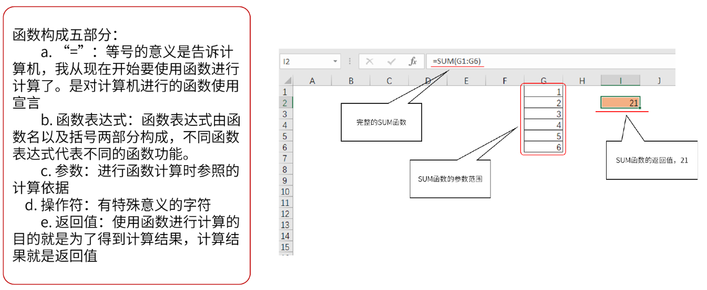
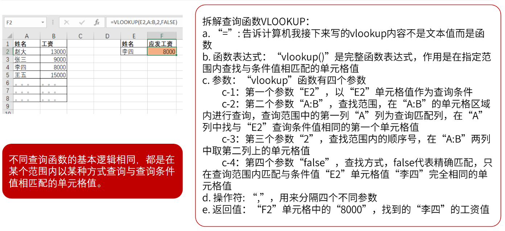

### 表结构数据分类
维度: 业务角度(文本型), 可以单独作为维度表
维度表: 包含维度信息, 比如产品表(产品的名称, 编号等), 品牌表(品牌编号,名称), 客户表(客户编号,名称)
度量: 业务行为结果(数值型),可以单独作为,事实表,流水表(度量表)
事实表: 既包含维度信息, 又包含事实信息, 比如销售表(订单号, 时间, 客户ID, 金额), 采购表(进货号, 进货日期, 进货金额), 库存表(库存编码, 库存日期, 库存金额)

### 数据透视
维度: 业务观测角度(来源维度表)
度量: 业务行为结果(来源事实表)
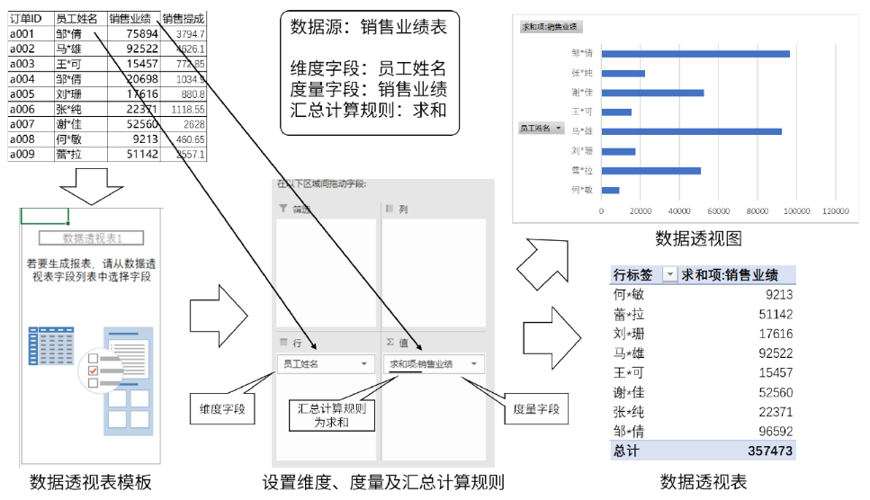


## 数据库(15-16)
### DDL
对数据库管理系统中的对象进行CRUD
#### 创建数据库
1. 创建名为db_name的数据库 `create database db_name`
2. 查看创建好的数据库 `show create database db_name`
3. 查看所有数据库 `show databases`
4. 使用数据库 `use db_name`
5. 删除数据库 `drop database test`
   
#### 创建数据表
1. 创建表
```
create table tb_name(
    id char(3),
    name varchar(20)
);
```
2. 查看所有表 `show tables`
3. 删除表 `drop tables`

#### 约束条件
约束条件|描述|语法
--|--|--
PRIMARY KEY|主键约束|`字段名 数据类型 PRIMARY KEY`
NOT NULL|非空约束|`字段名 数据类型 NOT NULL`
UNIQUE|唯一约束|`字段名 数据类型 UNIQUE`
AUTO_INCREMENT|自增字段|`字段名 数据类型 AUTO_INCREMENT`
DEFAULT|默认值|`字段名 数据类型 DEFAULT 默认值`

1. 主键约束
唯一, 非空, 可以多字段
```sql
-- 单字段主键
create table emp(
    id char(3) primary key,
    name varchar(20)
)
-- 多字段主键
create table emp(
    id char(3),
    name varchar(20),
    salary int,
    primary key(id,name)
)
```
2. 非空约束
字段值不能为空
```sql
create table emp(
    id char(3),
    name varchar(20) not null
)
```

3. 唯一约束
可以为空(只能一个空值)
```sql
create table emp(
    id char(3),
    name varchar(20) unique
)
```

4. 默认约束
```sql
create table emp(
    id char(3),
    name varchar(20) default '-'
)
```

5. 自增约束
一个表只能一个自增字段, 必须是主键的一部分, 默认从1开始
```sql
create table emp(
    id int primary key auto_increment,
    name varchar(20)
)

```

#### 修改数据表
1. 更改表名 `alter table tb_name rename new_name`
2. 更改字段类型 `alter table tb_name modify col_name INT`
3. 更改字段名称 `alter table tb_name col_name new_name INT`
4. 添加新字段 `alter table tb_name add col_name INT not null`
5. 将字段放在第一位 `alter table tb_name modify col_name INT first`
6. 将字段放在另一字段后 `alter table tb_name modify col_name after anotherCol_name`
7. 删除字段 `alter table tb_name drop col_name`

### DML
对表中记录进行操作, 比如添加(insert), 修改(update), 删除(delete).
1. 插入数据 `insert into tb_name(col1, col2, ...) values(val1,val2,...)`
2. 更新数据 `update tb_name set col_name = concat('fruit_',col_name)`
3. 删除数据 `delete from tb_name where col_name = 'xxx'`
4. 导入外部文件
```sql
load data local infile file_path 
into table tb_name
fields terminated by '\t'
ignore 1 lines;
```

### DQL
#### 单表查询
`select * from tb_name where ... group by ... having ... order by...`

#### 多表查询
`select * from tb_name1 inner|left|right join tb_name2 on tb_name1.col = tb_name2.col`
1. 内联 `inner join on`
2. 左连 `left join on`
3. 右连 `right join on`
4. 全连 `left join on  union right join on`(`union`合并多个select结果, 去除重复行, `union all`合并多个select结果, 保留重复行)

#### 操作符
where
1. `and` 且 `or` 或 `select * from fruits where f_name = 'apple'`
2. `in` `not in` 判断是否在列表中 `select * from fruits where f_name in ('apple','orange')`
3. `between ... and ...` 判断数值是否在范围内 `select * from fruits where price between 10 and 20`
4. `like %x%` 判断是否包含字符, 以字符开头, 或以字符结尾. `%`代表多个字符, `_`代表单个字符.
5. `is null` 判断是否为`null`
6. `distinct` 删除重复记录


#### 子查询

1. `any` 满足任一条件, `where id = any(list)` 只要`id`等于`list`中任一值即可
2. `all` 满足所有条件, `where age = all(list)` `age`要大于`list`中所有值
3. `exists` 扫描外表每一行, 然后进入内表
```sql
SELECT department_name
FROM departments d
WHERE EXISTS(
	SELECT * 
	FROM employees e
	WHERE e.department_id = d.department_id
);
```


### 函数
#### 常用函数
#### 逻辑函数
1. 判断空值函数`ifnull(expr,alt_value)`
`base`是基本工资, `bonus`是奖金, 如果有奖金就加上奖金, 如果没有加0.
```sql
select name,base+ifnull(bonus,0) as 'all_salary' from emp;
```
2. 判断函数`if(condition, true_result, false_result)`
```sql
select name, sal, if(sal>=3000,'high','low') as 'salary_level' from emp;
```
2. `case when then end`
```sql
select 
    name, 
    sal,
    case when sal>=3000 then 'high' else 'low' end as 'salry_level'
from emp; 
```
#### 开窗函数
对数据的每一行, 都返回聚合后的结果
##### `over()`
`over()`的意思就是将聚合的结果应用在每一行
查看每位员工的薪水,平均薪水,以及二者的比值
```sql
select sal, avg(sal) over() as mean_sal, sal/avg(sal) from emp;
```

##### `partition by`
类似于`group by`语句, 开窗函数在不同组内分别聚合运算, 并聚合结果显示在每组的每条记录里
- 聚合函数, 查询各个部门的工资
```sql
select dept_name, avg(sal) from emp group by dept_name;
```
- 开窗函数, 查询每位员工和所属部门平均工资之间的情况
```sql
select *, avg(sal) over(partition by dept_name) as mean_deptSalary from emp;
```


## 参数估计(17)
估计量: 如样本均值就是总体均值的的一个估计量, 参数用$\theta$表示, 估计量用$\hat{\theta}$表示
估计值: 估计量的具体值, 比如样本均值$\overline{x}=80$, 80就是总体$\mu$的估计值

### 估算分类
1. 总体均值的估计: 
   1. 单总体均值($\mu$), 两总体均值之差($\mu_1-\mu_2$)
   2. 单样本均值($\overline{x}$), 两样本均值之差($\overline{x}_1-\overline{x}_2$)
2. 总体比例的估计: 
   1. 单总体比例($\pi$), 两总体比例之差($\pi_1-\pi_2$)
   2. 单样本比例($p$), 两样本比例之差($p_1-p_2$)
3. 总体方差的估计: 
   1. 单总体方差($\sigma^2$), 两总体方差之比($\sigma_1^2/\sigma_2^2$)
   2. 单样本方差($S^2$), 两样本方差之比($S_1^2/S_2^2$)

#### 总体均值估计
1. 单总体均值估计
当总体$X\sim N(\mu,\sigma^2)$时, 则样本$\overline{X} \sim N(\mu,\sigma^2/n)$(中心极限定理)
2. 两总体均值之差估计
两个独立正态总体$N(\mu_1,\sigma_1^2),N(\mu_2,\sigma^2)$的样本, 容量分别为$n_1,n_2$,均值分别为$\overline{x}_1,\overline{x}_2$, 则$\overline{x}_1-\overline{x}_2$满足$\overline{x}_1-\overline{x}_2 \sim N(\mu_1-\mu_2,\frac{\sigma_1^2}{n_1}+\frac{\sigma_2^2}{n_2})$

#### 总体比例的估计
1. 单总体比例估计
当n充分大时(np>=5且n(1-p)/=5),p的分为满足$p\sim N(\pi,\frac{\pi(1-\pi)}{n})$
2. 两总体比例之差的估计
当n充分大时(np>=5且n(1-p)/=5),p的分为满足$(p_1-p_2)\sim N(\pi_1-\pi_2, \frac{\pi_1(1-\pi_1)}{n_1}+\frac{\pi_2(1-\pi_2)}{n_2})$

#### 总体方差估计
1. 单总体方差估计
$x_1,x_2...x_n$是总体$N(u,\sigma^2)$的样本, 则样本方差$s^2$满足
$$
\frac{(n-1)S^2}{\sigma^2} \sim \chi^2(n-1)
$$
2. 两总体方差之比
$x_1,...,x_n$来自总体$N(\mu_1,\sigma_1^2)$, $y_1,...,y_2$来自总体$N(\mu_2,\sigma_2^2)$,两组样本相互独立, 则满足:
$$
\frac{s_1^2/s_2^2}{\sigma_2^2/\sigma_2^2} \sim F(n_1-1,n_2-2)
$$

#### 可以估计的前提
1. 无偏性(unbiasedness): 抽样分布和总体分布一致
2. 有效性(efficiency): 最小方差, 估计量方差越小越好
3. 一致性(consistency): 样本容量越大越好


### 点估计(point estimate)
定义: 样本估计量直接作为总体参数的估计值

#### 矩估计
利用样本矩估计总体中的相应参数
样本k阶原点矩: $\frac{\sum x_i^k}{n}=\hat{\mu}$
样本k阶中心矩: $\frac{(x_i-\overline{x}^k)}{n}=\hat{\sigma^2}$

##### 例题1:
从总体$N(\mu,\sigma^2)$抽取样本$x_1,...,x_n$, 求$\mu,\sigma$的矩估计量:
$$
\hat{\mu}=\frac{\sum x_i}{n} \\
\hat{\sigma^2}=\frac{\sum(x_i-\overline{x})^2}{n}
$$

##### 例题2:
从定义在$[a,b]$的均匀分布中抽取$x_1,...,x_n$, 求$a,b$的矩估计量.
$$
总体的均值\mu=\frac{a+b}{2}  \\
矩估计量\overline{x}=\frac{\sum x_i}{n}=\hat{\mu}= \frac{a+b}{2} \\
总体的方法\sigma^2 = \frac{(b-a)^2}{12}  \\
矩估计量s^2=\frac{\sum(x_i-\overline{x})^2}{n}=\hat{\sigma}^2 = \frac{(b-a)^2}{12}
联立可求\hat{a},\hat{b}
$$

#### 最大似然
定义:通过样本$x_1,...,x_n$出现可能性最大的总体参数.
方法: 若概率密度函数f(x)
 1. 写出似然函数$L(\theta)=\prod_{i=1}^n f(x_i)$
 2. 取似然对数$lnL(\theta)=\sum_{i=1}^n lnf(x_i)$(这一步是为了方便计算)
 3. 找出最大值点: 令$\frac{\partial lnL(\theta)}{\partial\theta_i}=0$, 得到$\theta$就是最大似然的估计结果

##### 例子1
参数为$\lambda$的泊松分布抽取$x_1,...,x_2$求$\lambda$的最大似然估计值
$$
泊松分布的概率密度函数为:
P(X=x)=\frac{e^{-\lambda}\lambda^x}{x!}
$$
1. 写出似然函数:
$$
L(\lambda)=\prod_{i=1}^n \frac{e^{-\lambda}\lambda^{x_i}}{x_i!}=\frac{e^{-n\lambda}\lambda^{\sum_{i=1}^n x_i}}{\prod_{i=1}^n x_i!}
$$
2. 取似然函数的对数
$$
lnL(\lambda)=-n\lambda+ln\lambda\sum_{i=1}^n x_i-ln(\prod_{i=1}^n(x_i!))
$$
3. 找最大值点
令
$$
\frac{\partial lnL(\lambda)}{\partial \lambda}=0
$$
得到
$$
\hat{\lambda}=\frac{\sum x_i}{n}
$$

### 区间估计(interval estimate)
定义: 在点估计的基础上, 给总体参数一个区间范围, 该区间由样本统计量加减抽样误差得到, 称为置信区间
置信水平(confidence level): 表示方法$(1-\alpha)$
置信区间(confidence interval): 
Z值: 在标准正态分布中, 右侧编辑为$\alpha$的值, 记为$Z_\alpha$, 同理在t分布, $\chi^2$分布和F分布中,对应的是t值,$\chi$值和F值.
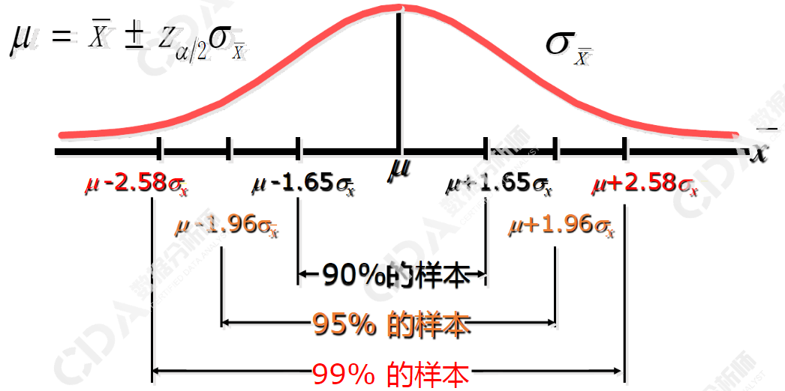

总体均值的估计:
单总体均值:
1. $\overline{x}\pm Z_{\alpha/2}\frac{\sigma}{\sqrt{n}}$, 已知总体$\sigma$
2. $\overline{x}\pm Z_{\alpha/2}\frac{S}{\sqrt{n}}$, 总体$\sigma$未知, 且是大样本
3. $\overline{x}\pm t_{\alpha/2}\frac{S}{\sqrt{n}}$, 总体$\sigma$未知, 且是小样本

两总体均值差
1. $(\overline{x}_1-\overline{x}_2)\pm z_{\alpha/2}\sqrt{\frac{\sigma_1^2}{n_1}+\frac{\sigma_2^2}{n_2}}$, 已知总体$\sigma$
2. $(\overline{x}_1-\overline{x}_2)\pm z_{\alpha/2}\sqrt{\frac{s_1^2}{n_1}+\frac{s_2^2}{n_2}}$, 总体$\sigma$未知, 且是大样本
3. $(\overline{x}_1-\overline{x}_2)\pm t_{\alpha/2}\sqrt{\frac{s_1^2}{n_1}+\frac{s_2^2}{n_2}}$, 总体$\sigma$未知, 且是小样本


总体比例的估计:
单总体比例:
1. $p\pm z_{\alpha/2}\sqrt{\frac{\pi(1-\pi)}{n}}$
2. $p\pm z_{\alpha/2}\sqrt{\frac{p(1-p)}{n}}$

两总体比例之差
1. $(p_1-p_2)\pm z_{\alpha/2}\sqrt{\frac{p_1(1-p_1)}{n_1}+\frac{p_2(1-p_2)}{n_2}}$

总体方差的估计:
单总体方差:
$\frac{(n-1)s^2}{(\chi^2_{\alpha/2})^(n-1)} \leq \sigma^2 \leq \frac{(n-1)s^2}{(\chi^2_{1-\alpha/2})^(n-1)}$
两总体方差比:
$\frac{s_1^2/s_2^2}{F_{\alpha/2}^{(n_1-1,n_2-1)} } \leq \frac{\sigma_1^2}{\sigma_2^2} \leq \frac{s_1^2/s_2^2}{F_{1-\alpha/2}^{(n_1-1,n_2-1)} }$

#### 例题
已知n=36, $1-\alpha=90\%$, $z_{\alpha/2}=1.645$. 样本$\overline{x}=39.5$, $s=7.77$, 求在$1-\alpha$置信水平的$\mu$的置信区间.
$$
\overline{x} \pm Z_{\alpha/2} \frac{s}{\sqrt{n}}=39.5 \pm 1.645 \times \frac{7.77}{\sqrt{26}}=(37.37,41.63)
$$


## 描述性统计分析(18)
描述性分析: 总体规模, 对比关系, 集中趋势, 离散程度, 偏态, 峰态
推断性分析: 估计, 假设检验, 相关分析

数据分类:
分类型数据
顺序型数据
数值型数据


基本概念: 总体和样本
总体(polulation): 研究的所有元素的集合, 每个元素称为个体. 比如研究全校学生的平均年龄, 总体是全校学生.
样本(sample):从总体中抽取的一部分元素的集合.比如研究全校学生的平均年龄, 由于总体太大, 从中抽取100人进行研究, 该研究的样本是100个学生
参数(parameter):总体的某种特征值. 比如总体均值($\mu$), 总体标准差($\sigma$), 总体比例($\pi$)等
统计量(statistic):样本的特征值. 比如样本均值($\overline{X}$), 样本标准差($S$), 样本比例($P$)等
变量:(variable):用于描述某种特征的概念. 比如销售额, 受教育程度. 可分为:分类变量(categorical), 顺序变量(rank), 数值变量(metric)


描述统计:
### 总体规模的描述(总量指标)
:总营业额, 总利润等
### 对比关系的描述(相对指标):
目标完成率=实际完成/计划完成
### 集中趋势的描述(平均指标):
集中趋势(Central tendency): 向中心值靠拢的趋势
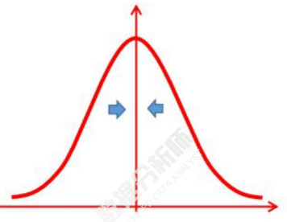
分类型数据: 众数
顺序性数据: 众数, 分位数
数值型数据: 众数, 分位数, 均值

#### 众数
出现最多的变量值, $M_0$
#### 分位数
对数据排序, 然后按位置进行划分, 常用的有二分位数(中位数), 四分位数等, $M_e$
中位数: 数据的个数为n, 则中位数的位置为$\frac{n+1}{2}$
四分位数: 下四分位数$Q_L=\frac{n}{4}$, 上四分位数$Q_U=\frac{3n}{4}$
#### 均值
算数平均数 >= 几何平均数 >= 调和平均数
##### 算数平均数
数据的和与数据个数的比
简单算数平均数:
加权算数平均数:

##### 几何平均数
n个变量值乘积的n次方根
简单几何平均数: $G=\sqrt[n]{x_1x_2...x_n}$
加权几何平均数:
##### 调和平均数
变量值倒数的算数平均数的倒数, $H$
简单调和平均数: $H=\frac{n}{\frac{1}{x_1}+...+\frac{1}{x_n}}$
加权调和平均数:

### 离散程度的描述(变异指标)
反映变量值原理其中心值的程度
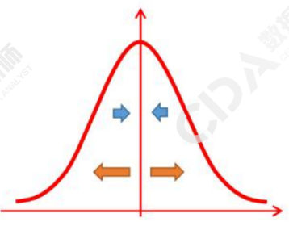

#### 极差(range)
各组数据最大值和最小值的差,符号$R$, 公式:$R=max(X)-min(X)$
极差也可以用于衡量中位数的代表性。极差，是一组数据的最大值与最小值之差，也称全距。
#### 四分位差(quartiledeviation)
中位数能不能代表一组数据？我们要看极差和四分位差。
四分位差也称为内距或四分间距，它是上四分位数与下四分位数之差，用Q表示。
四分位差反映了中间50％的数据的离散程度，数值越小，说明中间的数据越集中；数值越大，说明中间的数据越分散。
四分位差不受极值的影响。此外，由于中位数处于数据的中间位置，因此，四分位差的大小在一定程度上说明了中位数对一组数据的代表程度。

#### 平均差(mean deviation)
各变量值与其均值差的绝对值的平均数, 符号$M_d$, 公式:$M_d = \frac{\sum_{i=1}^n |x_i-x|}{n}$
#### 方差与标准差
变量值与算数平均数的差的平方的算数平均数.
符号:
总体方差: $\sigma^2$
样本方差: $S^2$

#### 离散系数
定义: 标准差与均值比
符号: $V_s$
公式: $V_s=\frac{s}{x}$

#### 异众比率
众数能不能代表一组数据？我们要看异众比率。
异众比率主要用于衡量众数对一组数据的代表程度，是指非众数组的频数占总频数的比例。
- 异众比率越大，说明非众数组的频数占总频数的比重越大，众数的代表性越差；
- 异众比率越小，说明非众数组的频数占总频数的比重越小，众数的代表性越好。


### 标准化值
定义: 也称标准分数, 对某一个数据在全体中相对位置的度量, 可以判断是否有离群值
符号: $z_i$
公式: $z_i = \frac{x_i-x}{S}$

标准化值只是将原始数据进行线性变换, 并没有改变一个数据在该组数据中的位置, 也没有改变该组数据分布的形状, 只是将均值变成0, 标准差变成1

经验法则表明: 当一组数据对称分布时
1. 约68%数据在1个标准差范围内
2. 约95%数据在2个标准差范围内
3. 约99%数据在3个标准差范围内

切比雪夫不等式: 对于任意分布形态的数据, 至少有$1-\frac{1}{k^2}$的数据落在平均数加减k个标准差之内.k是大于1的非整型的任意值.

### 分布形态的描述(偏态与峰态)
#### 偏态(skewness)
定义: 描述的是某总体取值分布的对称性的特征统计量。
符号: SK
公式: $$

定义上偏度是样本的标准三阶中心矩（standardized 3rd central moment)。
这个统计量同样需要与正态分布（也叫常态分布）相比较，
1. 偏度 = 0表示其数据分布形态与正态分布的偏斜程度相同；
2. 偏度 > 0表示其数据分布形态与正态分布相比为`正偏（右偏）`，即有一条长`尾巴拖在右边`，数据`右端有较多的极端值`，数据均值右侧的离散程度强；
3. 偏度 < 0表示其数据分布形态与正态分布相比为`负偏（左偏）`，即有一条`长尾拖在左边`，数据`左端有较多的极端值`，数据均值左侧的离散程度强
记忆技巧:
偏态说的是有一边的尾巴更厚，相当于某一边加了异常值。异常值对均值影响大，对中位数影响微小，对众数无影响，由此判断三者大小。


#### 峰态(kurtosis)
定义: 分布的扁平程度
符号: $K$
公式: $$

峰态判断:
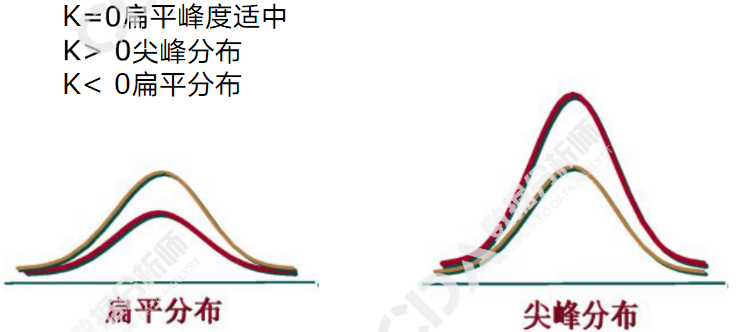

### 描述性统计图表
#### 直方图
定义: 横轴按组距分类, 纵轴表示频数.
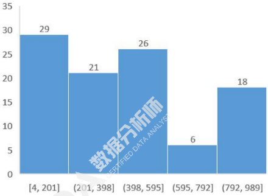
#### 散点图
定义: 表示因变量随自变量变化的趋势
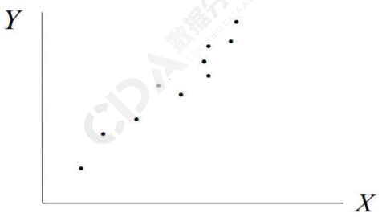
#### 箱型图
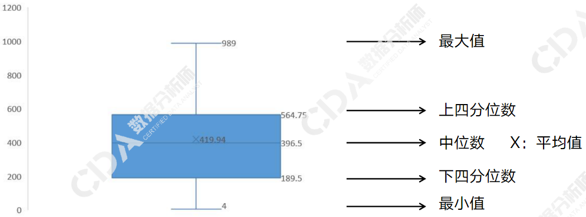


### 统计分布
#### 离散分布
1. 二项分布
定义: $X \sim B(n,p)$
期望: $E(X)=np$
方差: $D(X)=np(1-p)$
2. 两点分布
定义: n=1时的二项分布, 又称伯努利分布
期望: $E(X)=p$
方差: $D(X)=p(1-p)$

#### 连续分布
1. 正态分布
定义: $X \sim N(\mu,\sigma^2)$
期望: $\mu$
方差: $\sigma^2$

#### 抽样分布
1. 卡方分布
定义1: 设$X \sim N(\mu,\sigma^2), 则Z=\frac{X-\mu}{\sigma}\sim N(0,1), 则Z^2 \sim \chi^2(1)$
定义2: 当$X \sim N(\mu,\sigma^2), 则Z=\frac{X-\mu}{\sigma}\sim N(0,1), 从中抽取n个样本, 则Z_1^2+...+Z_n^2 \sim \chi^2(n-1)$
2. t分布
定义: $设随机变量 X\sim N(0,1), Y \sim \chi^2(n), 且X与Y独立, 则 t=\frac{X}{\sqrt{\frac{Y}{n}}}, 其分布称为自由度为n的t分布, 记做t(n)$
3. f分布
定义: $若U服从自由度为m的\chi^2分布,即U \sim \chi^2(m),V服从自由度为n的\chi^2分布, 即V\sim \chi^2(n),且U和V独立, 则F=\frac{U/m}{V/m}服从自由度为m和n的F分布, 记做F\sim F(m,n)$


### 相关分析

#### 协方差
$$
Cov(X,Y)=\frac{\sum_{i=1}^n(x_i-\overline{x})(y_i-\overline{y})}{n-1}
$$

#### 相关系数
$$
Cor(X,Y)=\frac{Cov(X,Y)}{S_yS_x}
$$


## 假设检验(19)
### 什么是假设(hypothesis)
定义: 对总体参数的值(均值,方差)做的一种陈述
实现对总体参数或分布做出的假设, 利用样本信息, 采用反证法, 依据统计上的小概率原理, 判断原假设是否成立.

### 原假设
定义: 待检验的假设, 又称0假设(null hypothesis, 符号$H_0$)
例子: $H_0:\mu=3190(克)$

### 备选假设
定义: 与原假设对立的假设(alternative hypothesis, 符号$H_1$)
例子: $H_1: \mu \neq 3190(克)$

### 假设检验的流程
1. 提出假设
2. 确定检验统计量
3. 确定显著水平$\alpha$
4. 计算统计量的值
5. 做出统计决策

### p值
双侧检验

左侧检验
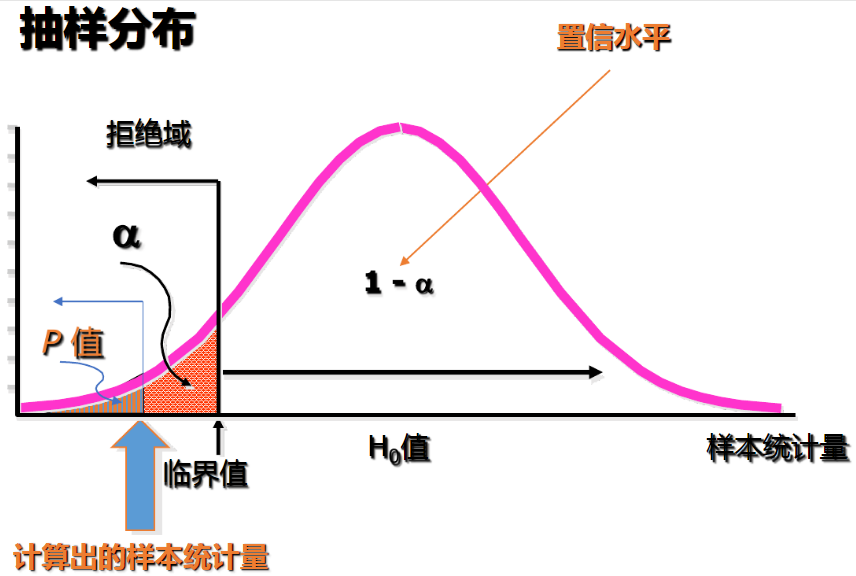
右侧检验
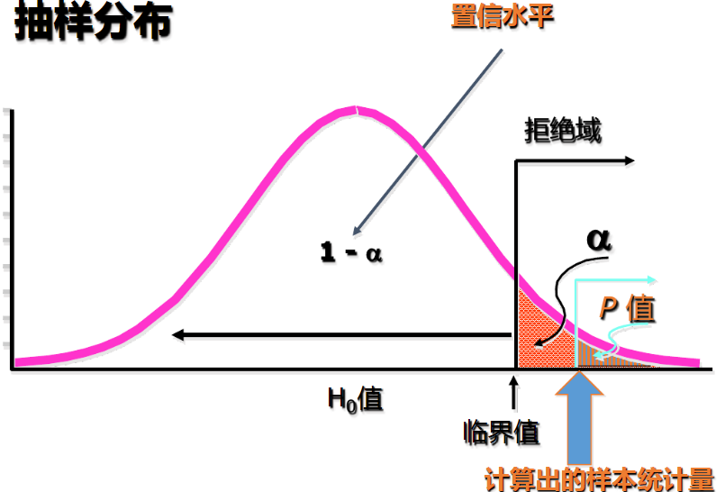

1. 单侧检验
   1. $若p>\alpha, 不拒绝H_0$
   2. $若p<\alpha, 拒绝H_0$
2. 双侧检验
   1. $若p>\alpha/2, 不拒绝H_0$
   2. $若p<\alpha/2, 拒绝H_0$

### 一个总体的检验
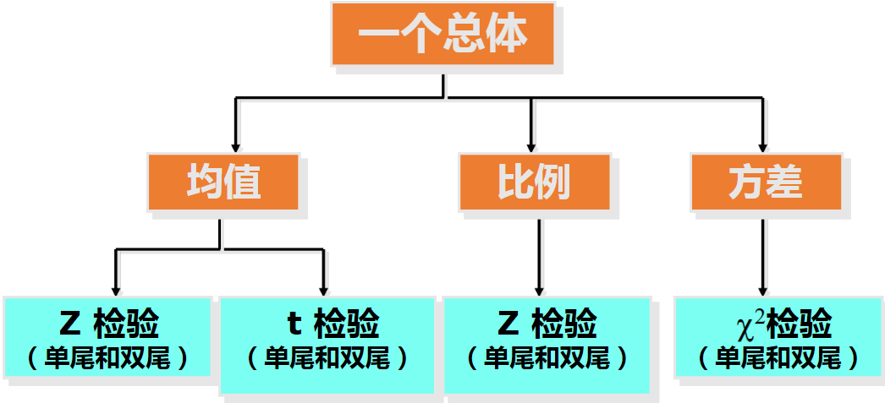
#### 总体均值的检验


随机抽取32块肥皂, 平均厚度为705cm, 标准差为205cm, 已知整体厚度为7cm
### 两个正态总体的检验
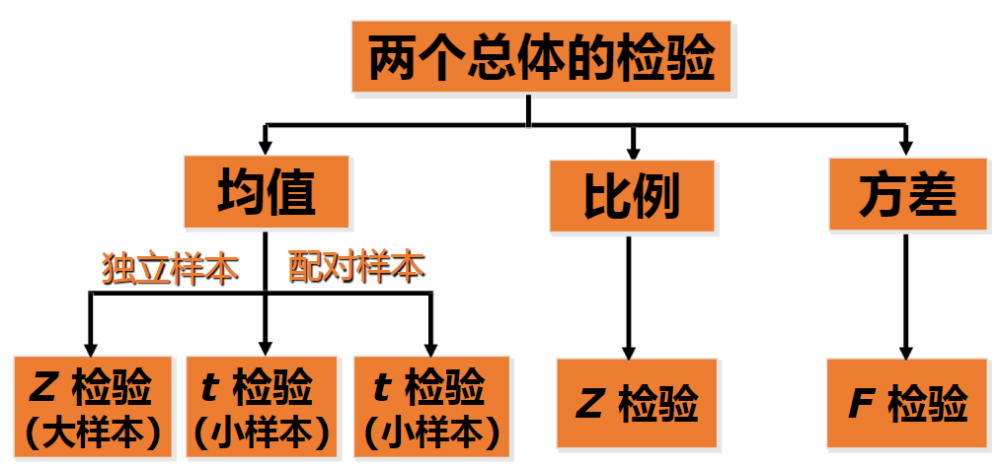


## 多维数据透视分析EXCEL(20-21)
多维数据模型又叫多维数据集, 立方体.
通过公共字段连接两表, 选择不同字段作为维度和度量, 以及汇总规则.

### 度量表与维度表连接
OLAP连接汇总时, 提供度量的表为主表, 也就是说将度量表(流水表)放在左边. 表连接的箭头指向度量表.
下面的SQL中, 订单表为主表. 其中订单表中没有出现销售员`S4(李四)`, 最终结果将不会显示`S4(李四)`
```sql
select 销售人员姓名, sum(销售金额) as 销售金额
from 订单表 left join 销售人员表 on 订单表.销售人员ID = 销售人员表.销售人员ID
group by 销售人员姓名
```
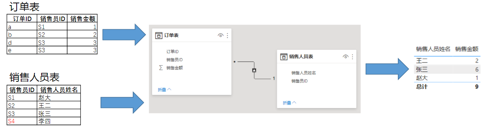

下面SQL中, 以订单表为主表. 其中订单表中有`S5`, 而销售人员表中没有对应的, 将以空字符串显示. 另外`S4`的处理同上.

```sql
select 销售人员姓名, sum(销售金额) as 销售金额
from 订单表 left join 销售人员表 on 订单表.销售人员ID = 销售人员表.销售人员ID
group by 销售人员姓名
```
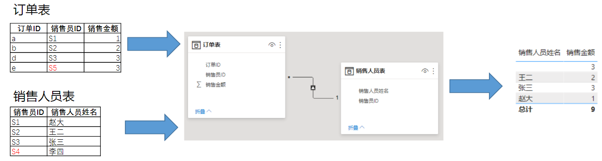


### 两表连接的对应关系
1. 一对一 两表具有相同主键, 几乎不会出现(错误)
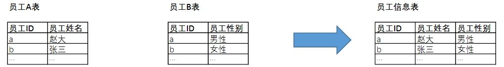
2. 多对多 非主键连接非主键, 尽量避免(错误), 和sql中的多对多不是一个概念
下`销售人员表`中`销售员ID`出现了两次`S3`, `订单表`中`销售员ID`也出现了两次`S3`. 明显有问题.
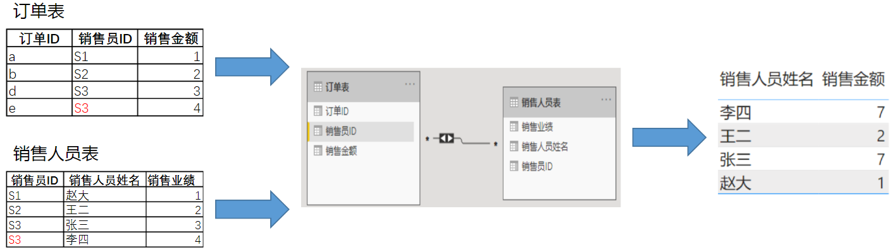
3. 多对一 单向
以`订单表`(`度量表`)为主表, 合并维度(`销售人员姓名`), 汇总度量(`销售金额`). 维度筛选度量
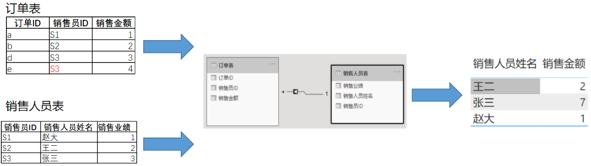
4. 多对一 双向
以`订单表`(`度量表`)为主表, 合并维度(`产品ID`), 汇总度量(`订单金额`). 和上一小节相同.
以`产品表`(`度量表`)为主表, 合并维度(`订单表`的`区域ID`), 汇总度量(`产品表`的`产品销售总量`)
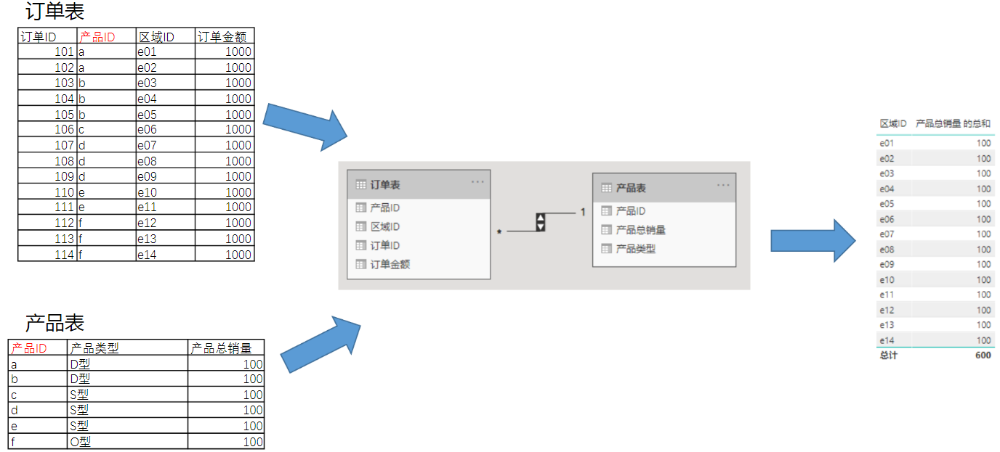
5. 跨表筛选
注意筛选方向是双向的, 不知道这时什么软件, 没有用到`产品表`, 和sql中的多对多不是一个概念
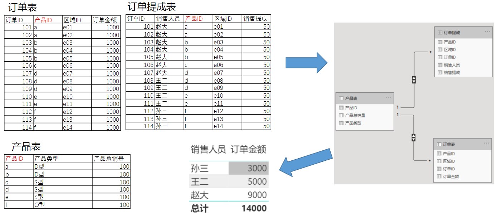

### 三种模式
星型模式: 一个度量表(事实表)和多个维度表相连
星座模式: 多个度量表(事实表)和一个维度表相连
雪花模式: 维度表和维度表相连, 进行维度的拓展

### 5W2H
5w2h|含义|例子
--|--|--
what|分析对象是什么|优化进销存各环节流程
why|为什么分析|实现一体化管理,加快资金运转, 实现销售利润最大化
where|空间维度|进货来源,库存地,卖场
who|参与角色|厂商,经销商,卖场
when|时间维度|进货时间, 在库时间, 销售时间, 退货时间
how much|分析的度量|进货金额,进货量,库存量,销售金额,销货量
how to do|该如何做|如何优化进销存各环节流程行为

## 数据驱动型业务管理方法(22)

### 销售漏斗模型
将发现潜在商业机会开始到现今回收为止的整个销售过程分为不同的销售阶段, 再对每一个销售阶段进行有针对性的管理, 最终达到发现并规避商机风险的目的.
销售漏斗管理本质是对销售过程的风险控制
潜在-接触-意向-明确-投入-成交


## 指标的应用与设计(23-25)
### 基本指标
1. 求和类: 
    - 常规求和(销售额,销售量) 累计求和(累计销量)
    - 时间维度下: 具体可分YTD(year to date), QTD(quarter to date), MTD(month to date), wtd(week to date)
2. 计数类:
3. 比较类:
    - 差异百分比: 同比(去年同期比较), 环比(上一周期比较), 均比(平均值比较), 定基比(自定义值比较)

### 常用场景指标
1. 流量指标
    - 广告计费方式:
      - CPM(Cost per Mille, 千次曝光收费)
      - CPS(cost per sales,实际销售收费)
      - CPC(cost per click, 点击次数收费)
    - 网页访问
      - 数量相关
        - 访客数(UV, user view):浏览页面不重复的用户数 
        - 浏览量(PV, page view):浏览页面次数
        - 访问次数(Visit, session): 会话数(一个用户一次回话可访问多个页面)
        - 新访客数
      - 质量相关
        - 平均访问深度(浏览量/访问次数, pv/visit)
        - 跳失率(跳出次数/访问次数, /visit)
        - 新访客占比(新访客数/访客数,)
2. 转化指标: 根据业务流程观察相邻阶段的留存率
    - 转化率(当前阶段/上一阶段), 比如 浏览详情页/加购/下单/支付
3. 营运, 销售类指标
    - 成交额(GMV,实际销售额,税后销售额,退款额)
    - 成交量(实际订单量,销量,退款订单量,上架数量) 
    - 完成情况(目标达成率, 退货率)
    - 效果(屏效, 商品关联性)
4. 库存指标
    - 库存周转天数=库存量/最近n天平均销量>=安全库存天数
    - 库龄(存放仓库的时长)
    - 库存周转次数=平均库存量/出库总量
    - 订货满足率=按合理需求正常供货次数/产品被要求供货的总次数
    - 缺货率=缺货次数/总订货次数
    - 售罄率=1-库存金额/进货金额
5. 绩效类指标
    - 
6. 客户指标
    - 量: 注册用户数, 浏览用户数, 登录用户数
    - 质: 活跃用户数, 留存率, 复购, 在线时长


## 业务分析模型(27)
1. RFM模型
衡量客户价值和客户创利能力,
Recency: 统计客户最近一次消费的时间与当前时间的差值
Frequency: 指定时间区间内统计用户的购买次数
Money: 指定时间区间内统计用户的消费总金额

用户类别|R值|F值|M值|运营策略
--|--|--|--|--
重要价值用户|高|高|高|保持现状
重要发展用户|高|低|高|提升频次
重要保持用户|低|高|高|用户回流
重要挽留用户|低|低|高|重点找回

2. 用户忠诚度模型(选择消费额度, 消费次数对用户分类)
3. 漏斗模型

## 业务分析方法(28)
1. 树状结构分析 从总体指标入手, 逐层分解总体指标
2. 二八分析 二八法则, 找出核心问题
3. 两个核心要素下的表显, 比如波士顿矩阵: 销售增长率和时长占有率
4. 同期群分析 特定对象特定时间


## 可视化分析图表(29)
业务图表决策树(可视化图形)分为四类(比较,构成,序列,描述)

### 比较类图表
1. 展示项目进度: 油量表, 圆环百分比进度图
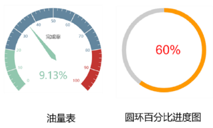
2. 相对大小对比: 柱状图, 条形图
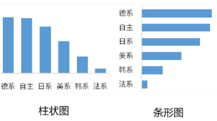
3. 不同类别项目多个维度差异: 雷达图

4. 层次结构不同级别的值: 树状图
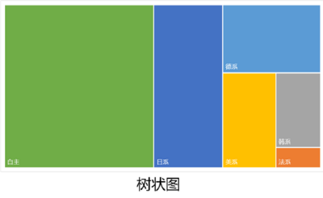
5. 地域间的数据比较: 地图
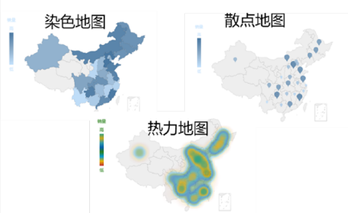
### 序列类图表
1. 数据趋势, 随时间变化: 折线图, 面积图, 柱状图
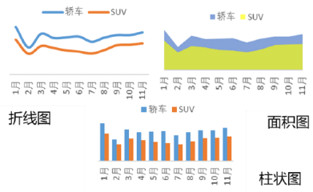
2. 阶段: 漏斗图
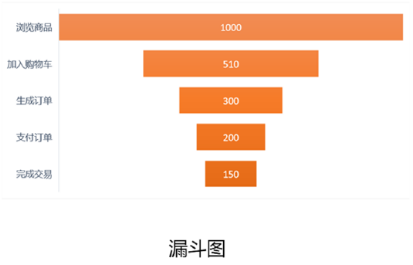

### 构成类图表
1. 不同类别相较于总体: 饼图/环形图/南丁格尔玫瑰图
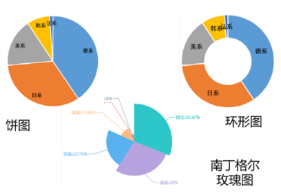
2. 多个部分到整体关系: 堆积图
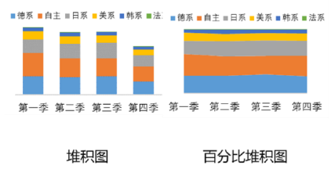
3. 两个数据点演变过程: 瀑布图
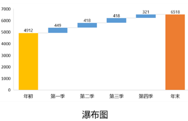

### 描述类图表
1. 分组数据差异: 直方图
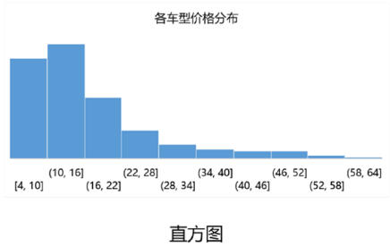
2. 变量之间相关性: 散点图, 气泡图
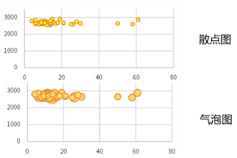

## 业务分析报告(30-31)
综合性时间评估, 比如工作周期报告, 人口普查报告

### 撰写流程
1. 业务理解: 抓问题核心
    - 报告类型(日常?周期?专题?), 阅读者(那个部门, 关注点是什么)
2. 数据搜集: 
3. 数据处理:
4. 数据分析
5. 图表制作
6. 报告绘制