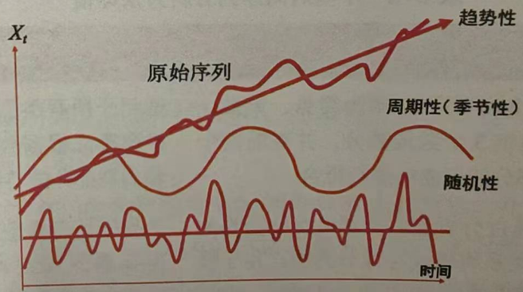
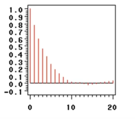

# 第8章使用时间序列分析方法做预报

## 效应分解法

时间序列的影响因素❤️

- 趋势性:是指序列朝着一定的方向持续上升或下降，或者停留在某个水平上的倾向。比如随着企业近段时间拓展业务，销售额稳步上升的趋势。
- 周期性|季节性变动:周期性通常是指经济周期，由非季节因素引起的波形相似的波动，比如GDP增长率随经济周期的变化而变化。季节性变动是指季度、月度、周度、日度的周期变化，比如啤酒的销量在春季、夏季较高而在秋季、冬季较低。
- 随机性:随机变动是指由随机因素导致的时间序列的小幅度波动。
- 还有节日效应，比如“双11”促销引起的网上商品销量骤然上升等现象。

时间序列3种效应的组合方式❤️
- 加法模型，即三种效应是累加的。

    $$
    x_t=T_t+S_t+I_t, 
    $$

其中，$T_t$代表趋势效应，$S_t$代表季节效应，$I_t$代表随机效应。

- 乘积模型，即三种效应是累计的。
    $$
    x_t=T_t * S_t * I_t, 
    $$

## 平稳时间序列分析ARMA模型

平稳时间序列模型主要有以下3种: ❤️
1. 自回归模型(Auto Regression Model),即AR模型。
1. 移动平均模型(Moving Average Model),即MA模型。
1. 自回归移动平均模型(Auto Regression Moving Average Model),即ARMA模型。

### AR模型❤️
AR模型(自回归模型, Auto Regression)，认为时间序列当期观测值与前$p$期有线性关系，而与前$p+1$期无线性关系。
$$
X_t = \alpha_0 + \alpha_1X_{t-1}+\alpha_2X_{t-2}+...+\alpha_pX_{t-p}+\epsilon_t, \epsilon_t \sim N(0,\sigma^2)
$$

其中, $X_t$表示第$t$的值, $\alpha$是回归系数,  $\epsilon_t$是一个独立于$X_t$的白噪声. 上式表示$X_t$与$X_{t-1},X_{t-2},...,X_{t-p}$有线性关系，

$AR(p)$模型有以下重要质。
- 某期观测值$X_t$的期望与系数序列$\alpha$有关，方差有界。
- 自相关系数(ACF)拖尾，且值呈现指数衰减(时间越近的往期观测对当期观测的影响越大)。
- 偏自相关系数(PACF)$p$阶截尾。

其中，ACF与PACF的性质可以用于识别该平稳时间序列是适合滞后多少期的AR模型。

### MA模型❤️

MA模型(移动平均模型, Moving Average)认为时间序列当期观测值与前时刻$t-1,t-2,...,t-q$进入系统的扰动项$\epsilon_{t-1}, \epsilon_{t-2},...,\epsilon_{t-q}$有相关关系

$$
X_t = \mu + \epsilon_t + \beta_1 \epsilon_{t-1} + ... + \beta_q \epsilon_{t-q}
$$

其中，$X_t$表示第$t$时刻的值, $\beta_q$是前$q$期的回归系数, $\epsilon$是白噪声过程。

$MA(g)$模型有以下重要性质。
- 1期系统扰动项e，的期望为常数，方差为常数。
- 自相关系数(ACF)g阶截尾。
- 偏自相关系数(PACF)拖尾。

其中，ACF与PACF的性质可以用于识别该平稳时间序列是适合滞后多少期的MA模型。

### ARMA模型
ARMA模型即自回归移动平均模型，该模型结合了AR模型与MA模型的特点，认为序列受前期观测数据与系统扰动的共同影响。

具体来说，一个系统，如果它在时刻$t$的响应$X_t$，不仅与其以前时刻的自身值有关，而且还与其以前时刻进入系统的扰动项存在一定的依存关系，那么这个系统就是自回归移动平均模型。

$ARMA(p,q)$模型如下:
$$
X_t = \alpha_0 + \alpha_1 X_{t-1} + \alpha_2 X_{t-2} + ... + \alpha_p X_{t-p} + \epsilon + \beta_1 \epsilon_{t-1}+...+\beta_q \epsilon_{t-q}
$$

对于平稳时间序列来说，$AR(p)$模型、$MA(q)$模型、$ARMA(p,q)$模型都属于ARMA(p,q)模型的特例。
ARMA(p,q)模型的性质有以下几点。
- $X_t$的期望与系数序列$\alpha$有关，方差有界。
- 自相关系数(ACF)拖尾。
- 偏相关系数(PACF)拖尾。

## ARMA模型的定阶与识别(ACF和PACF)❤️

ACF(自相关系数函数, Autocorrelation Coefficient Function): 描述任意两个时间间隔为k的时间序列的相关系数。
$$
ACF(k)=P_k= \frac{Cov(y_t,y_{t-k})}{Var(y_t)}
$$

PACF(偏自相关函数, Partial Autocorrelation Function):  描述时间序列任意两个时间间隔$k$的时刻，去除1至$k-1$这个时间段中的其他数据的相关系数, 可理解为, $x_{t-k}$影响着$x_t$, 同时也影响着$x_{t-k+1}$. 影响着$x_{t-k+1}$的力量传导到$x_t$, 形成了$x_{t-k}$对$x_t$的间接影响, 偏函数就是为了去除这个间接影响.

$$
p_k^* = Corr[y_t - E^*(y_t|y_{t-1},...,y_{t-k+1}),y_{t-k}]
$$

模型|ACF|PACF
--|--|--
AR|拖尾|p阶截尾
MA|q阶截尾|拖尾
ARMA|拖尾|拖尾

> 记忆方法: 只记AR, 左拖右截, p阶截尾和PACF的p正好对应. 其他的按矩阵对称记忆.

以AR模型, 根据模型($X_T = 0.8 X_{t-1} + \epsilon_t$)生成数据，并画出样本自相关图:

- 拖尾： 自相关系数按负指数单调收敛至零。

- 截尾： 偏自相关系数迅速降低到0附近(没有完全为0是因为该数据有扰动项$\varepsilon_t$)
的存在。

(./第8章使用时间序列分析方法做预报/3.png)

## 非平稳时间序列分析ARIMA模型

### 差分与ARIMA模型

一般差分 ❤️
通过差分等手段，将非平稳时间序列转换成平稳时间序列，再使用ARIMA模型建模。

1阶差分即当期观测减前一期的观测构成差分项，其数学表达式为: 
$$
\Delta x_t^{(1)} = x_t - x_{t-1}(t=2,3,...)
$$

2阶差分是在1阶差分的基础上，对1阶差分的结果再进行差分，其数学表达式为: 
$$
\Delta x_t^{(2)} = \Delta x_t ^ {(1)} - \Delta x_{t-1}^{(1)}
$$

以此类推，d阶差分是在d-1阶差分的基础上，对d-1阶差分的结果再进行差分，其数学表达式为: 
$$
\Delta x_t ^{(d)} = \Delta(\Delta x_t ^{(d-1)})
$$

一般来说，若序列蕴含着显著的线性趋势，1阶差分就可以实现趋势平稳:若序列蕴含着曲线趋势，通常高阶(2阶)差分就可以提取曲线趋势的影响。

季节差分

对于有季节性的数据，可以采用一定周期的差分运算(季节差分)提取季节信息，季节差分数学表达式如下，$s$表示周期: 
$$
\Delta_s x_t = x_t - x_{t-1}, (t=2,3,...)
$$
在季节差分的基础上再进行一般的差分就可以同时提取季节性与周期性，S期d阶的差分表达式如下: 
$$
\Delta_s^d x_t=\Delta_s(\Delta_s ^{(d-1)}x_t), (t=2,3,...)
$$

2.ARIMA模型的建模步骤
ARIMA模型适用于非平稳时间序列数据，其中的I表示差分的阶数，使用适当的差分处理将原始序列转换为平稳序列后，再进行ARIMA建模。ARIMA建模步骤与ARMA建模步骤类似，分为以下5步。
1. 平稳化:通过差分的手段，对非平稳时间序列数据进行平稳化处理。
2. 定阶:确定ARIMA模型的阶数p,q。
3. 估计:估计未知参数。
4. 检验:检验残差是否是白噪声序列。
5. 预测:利用模型预测。

参考:
- [AR、MA、ARMA和ARIMA](https://blog.csdn.net/kidchildcsdn/article/details/105434898)
- [PACF](https://zhuanlan.zhihu.com/p/430514606)
- [怎么看拖尾和截尾](https://blog.csdn.net/Caiqiudan/article/details/118059325)