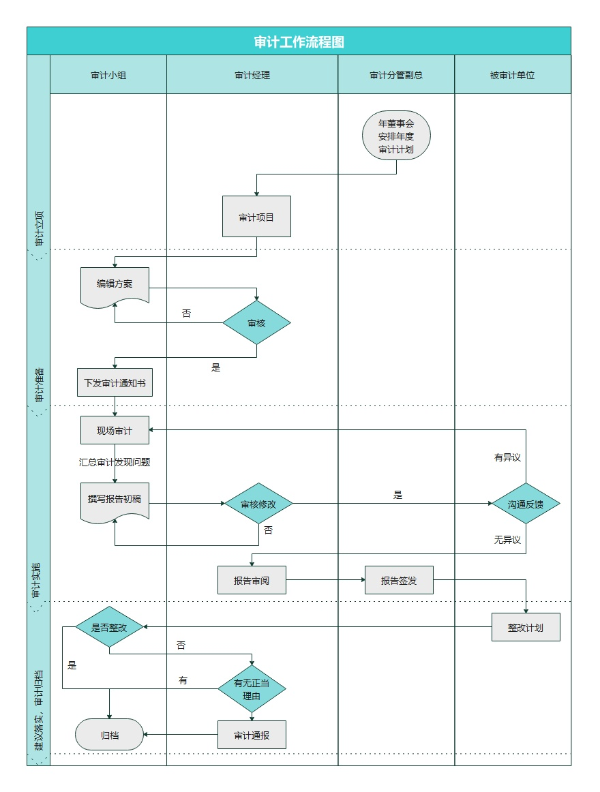
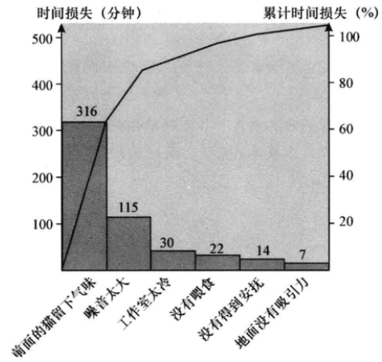
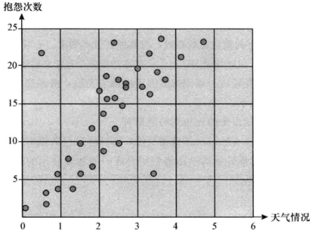
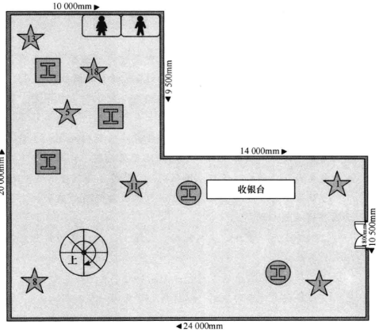
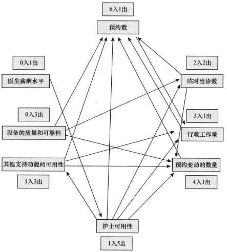
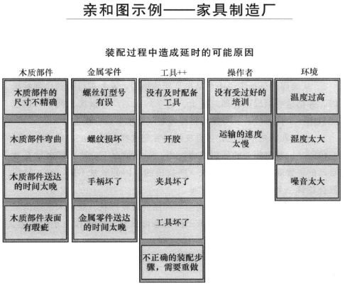
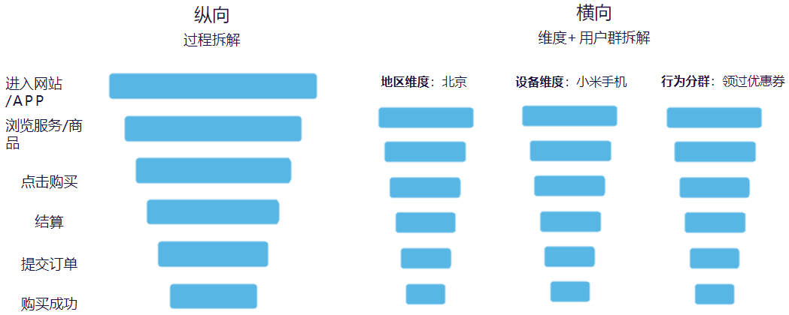

# ppt业务探查与问题定位

根本原因分析(Root Cause Analysis,RCA)是一项结构化的问题处理法，逐步找出问题的根本原因并加以解决，而不是仅仅关注问题的表征。参考书籍《根原因分析-简化的工具和技术(Root Cause Analysis Simplified Tools and Techniques)》第二版

## 根本原因分析法进行步骤

第一阶段RCA前的准备(Exploration)
- 证实发生了不良事件
- 组织RCA小组
- 定义要解决的问题
- 资料收集

第二阶段找到近端原因(Diagnosis)
- 寻找所有和事件可能的原因
- 测量、收集、获得最可能的影响因素的证据

第三阶段确定根本原因(Diagnosis)
- 找出涉及到哪些系统
- 将根本原因列成表
- 形成系统性的因果链

第四阶段制定和执行改进计划(Instruction)
- 提出改善行动/措施

## 业务探查与问题定位

### 启动程序阶段

### 业务事件还原工具

业务流程图

流程图的主要目的就是描绘一个过程中所有活动的顺序。作为根原因分析的第一步，流程图能用于：
·将过程绘制成图，以展示问题发生的地方（或位置）和应该解决什么问题。
·提供对包含或影响问题的过程的深人理解，奠定后续的根原因分析的基础。

关键事件

关键事件方法的主要目的是用于理解在问题复杂的情况下最棘手的表征是什么。关键事件分析帮助你：
·理解问题的哪些方面需要解决。
·认识问题的本质及其结果。

### 业务流程图

在实际业务分析中，最常见的就是`跨职能流程图`，也就是`泳道图`. 泳道流程图可以展示出一个商业过程之间的关系，能够清晰体现出某个动作发生在哪个部门。

泳道图每一列是一个泳道, 对应了部门名称, 每一行对应业务流程。绘图元素与传统流程图类似，但在业务流程主体上，通过泳道（纵向条）区分出执行主体，即部门和岗位来。

## 问题诊断

### 图形分析(近因分析)

1. 帕累托分析: 关键的少数, 帕累托图

   帕累托原理强调，大多数的结果(大约80%的结果)，都只是由一部分少数原因(大约20%的原因)引起的。因此，根原因分析的最有效做法就是对这20%的原因，也称为“关键的少数”，进行诊断。

   

2. 关联分析: 
   1. 散点图: 两个变量之间的关系
   
      
   
   
   2. 问题集中图: 问题和物理位置关系

      

   3. 关联图: 复杂问题情境下识别逻辑关系

      
   
   4. 亲和图: 定性数据, 先将数据分组, 然后找到结果群中的潜在关系

      

3. 差异分析:
   1. 漏斗图: 计算每个阶段的转化率, 再按产品渠道拆分, 进行横向分析
   
      

   
   2. 用户画像: 通过用户的标签, 描绘不同产品渠道的客群轮廓, 寻找客群的特性.

### 根本原因分析

根因分析(Root Cause Analysis, RCA)结构化的问题处理方法, 逐步找出问题的根本原因并加以解决, 而不是仅仅关注问题的表征.

1. 头脑风暴

   1. 结构化头脑风暴: 每个参与者轮流提出一个想法.
   2. 非结构化头脑风暴: 每个参与者自由提出想法.

1. 5why法

   五问法也称为"为什么-为什么图"(why-why chart)和根因分析.

   5why分析法，从三个层面来实施：

   - 为什么会发生？从“制造”的角度。
   - 为什么没有发现？从“检验”的角度。
   - 为什么没有从系统上预防事故？从“体系”或“流程”的角度

2. 因果图(鱼骨图)

   1. `原因型`: 鱼头在右, 特性值通常以"为什么"来写
   2. `对策性`: 鱼头在左, 特性值通常以"怎么办"来写

   (./ppt业务探查与问题定位/8.png)

   作图过程:

   1. 画鱼头, 标明主题
   2. 画大骨，一般画六条大骨，与主骨呈60度角。这六条大骨就是分析问题的六个方面，“人(man)、机(machine)、料(material)、法(method)、测(Measurement)、环(environment)”，即“5M1E”(5why)

      - 人（Man）：　操作者对质量的认识、技术熟练程度、身体状况等；
      - 机器（Machine）：　机器设备、工夹具的精度和维护保养状况等；
      - 材料（Material）：　材料的成分、物理性能和化学性能等；
      - 方法（Method）：　这里包括加工工艺、工装选择、操作规程等；
      - 测量（Measurement）：测量时采取的方法是否标准、正确；
      - 环境（Environment）　工作地的温度、湿度、照明和清洁条件等；

   3. 画小骨, 头脑风暴, 然后再逐一讨论“人、机、料、法、环、测”分类，找出最可能的原因，进行标注。
   4. 可以将`现状`写在鱼尾

