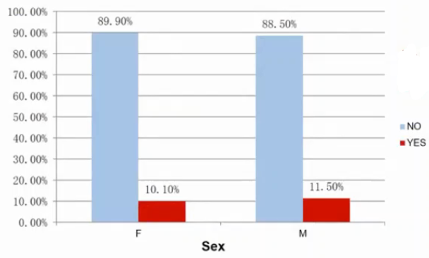
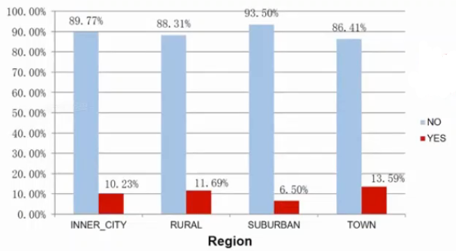
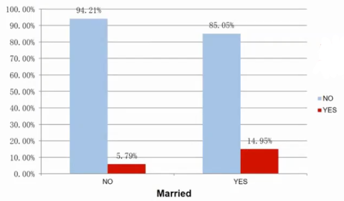
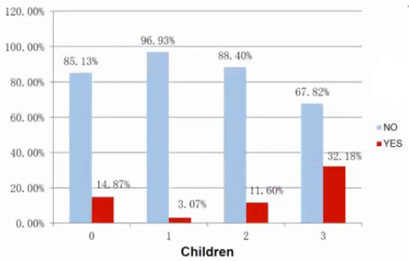
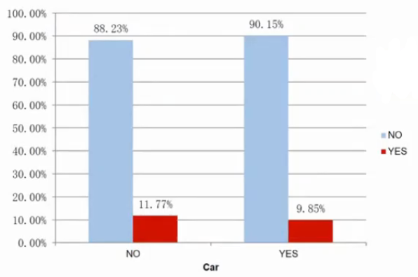
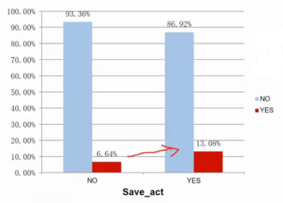
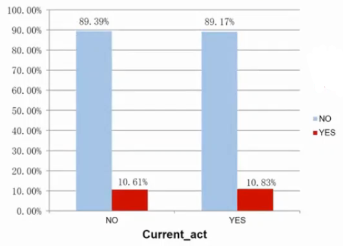
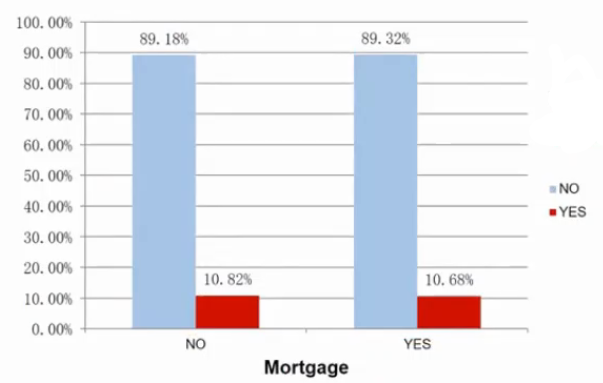
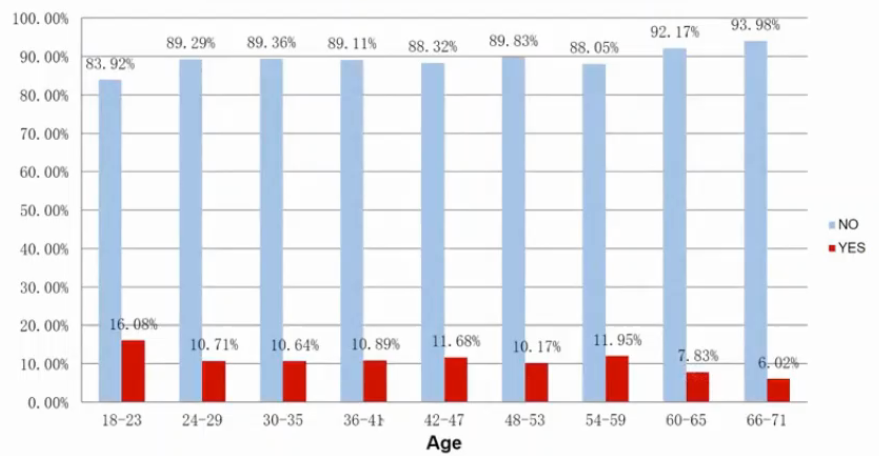
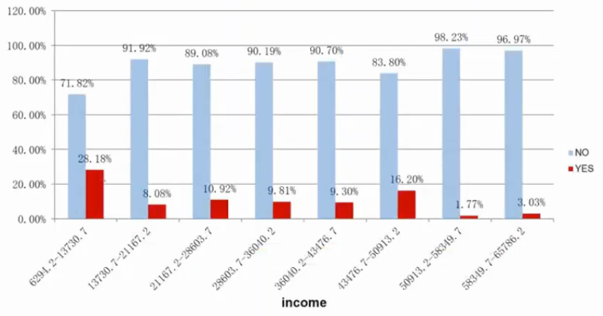

特征工程的评估步骤

先建立机器学习模型的Baseline Model
应用一种或多种特征工程技术在原始数据中
重新建立机器学习模型并与Baseline Model比较
若效能的增量大于某个临界值的话，代表它是有益的

在进行主要的特征工程处理之前，我们必须要先进行

生特征理解:了解我的数据集里面有什么字段
特征改进:对字段进行数据预处理

## 特征理解

1. 数据是结构还是非结构数据: art3会说明非结构文本数据的处理方法
2. 字段的类型: 数值型、类别型、顺序型、二元型
3. 探索式数据分析(ExploratoryDataAnalysis): 
    描述性统计(Descriptive Statistics): 不同值个数、空值个数、类别值的分布、最大值、最小值、平均值、标准差、离群值等
4. 数据可视化(DataVisualization): 各种图表的搭配(圆饼图、长条图、直方图、散点图等)

### 小额信用贷款数据集

1. 小额信贷数据包含1,551笔客户数据
2. 每笔客户数据含1个目标字段(TargetAttribute)和10个输入字段(Input Attributes): 8个为类别型字段，2个为数值型字段
3. 本项目将顾客分为两类
    1. 会来小额信贷(会响应)的客户: 167笔数据
    2. 不会来小额信贷(不会响应)的客户: 有1,384笔数据

字段解释:

1. 字段01：age(数值字段)：年龄
2. 字段02：sex(类别字段)：性别
3. 字段03：region(类别字段)：居住区域
4. 字段04:income(数值字段)：：月收人
5. 字段05：married(类别字段)：是否已婚
6. 字段06：children(类别字段)：家中小孩数
7. 字段07：car(类别字段)：是否有车
8. 字段08：save_act(类别字段)：是否有活储账户
9. 字段09：current_act(类别字段)：是否有支存账户
10. 字段10：：mortgage(类别字段)：是否为房贷户

| id | age | sex | region | income | married | children | car | save_act | current_act | mortgage | response |
| --- | --- | --- | --- | --- | --- | --- | --- | --- | --- | --- | --- |
| ID13791 | 21 | M | TOWN | 12409.6 | YES | 0 | NO | YES | YES | YES | YES |
| ID13792 | 42 | M | INNER_CITY | 31832.4 | YES | 3 | YES | NO | NO | NO | YES |
| ID13793 | 61 | M | INNER_CITY | 33173.4 | NO | 1 | YES | NO | NO | NO | NO |
| ID13794 | 49 | F | SUBURBAN | 33218.3 | YES | 0 | YES | NO | YES | YES | NO |
| ID13795 | 53 | F | INNER_CITY | 41635.6 | NO | 1 | NO | YES | YES | NO | NO |
| ID13796 | 66 | M | RURAL | 53180.7 | YES | 1 | YES | YES | NO | NO | NO |
| ID13797 | 26 | F | INNER_CITY | 18170.4 | YES | 0 | YES | NO | YES | NO | NO |
| ID13798 | 22 | F | SUBURBAN | 12754.9 | NO | 0 | YES | YES | YES | NO | NO |

## 描述性统计-数据质量报告

| 字段 | 数据型态 | 不同值个数 | 空值个数 | 空值比例 | 有值个数 | 有值比例 |
| ---- | ---- | ---- | ---- | ---- | ---- | ---- |
| id | C | 1551 | 0 | 0.00% | 1551 | 100.00% |
| age | N | 50 | 2 | 0.13% | 1549 | 99.87% |
| sex | C | 3 | 0 | 0.00% | 1551 | 100.00% |
| income | N | 374 | 0 | 0.00% | 1551 | 100.00% |
| married | C | 2 | 0 | 0.00% | 1551 | 100.00% |
| children | C | 4 | 2 | 0.13% | 1549 | 99.87% |
| response | C | 2 | 0 | 0.00% | 1551 | 100.00% |

✨C是Category, N是Numeric

连续型:

| Numeric | Min | Max | Mean | StDev | M-3 | M+3 |
| ---- | ---- | ---- | ---- | ---- | ---- | ---- |
| age | 18.0 | 67.0 | 44.0 | 14.3 | 1.0 | 86.9 |
| income | 6294.2 | 65786.1 | 29885.1 | 13112.6 | -9452.9 | 69223.0 |

分类型:

| Categorical | F | M | X | F（%） | M（%） | X（%） |
| ---- | ---- | ---- | ---- | ---- | ---- | ---- |
| sex | 811 | 738 | 2 | 52.29% | 47.58% | 0.13% |

| Categorical | 0 | 1 | 2 | 3 | (空白) | 0（%） | 1（%） | 2（%） | 3（%） | (空白)(%) |
| ---- | ---- | ---- | ---- | ---- | ---- | ---- | ---- | ---- | ---- | ---- |
| children | 585 | 585 | 292 | 87 | 2 | 37.72% | 37.72% | 18.83% | 5.61% | 0.13% |

| Categorical | YES | NO | YES（%） | NO（%） |
| ---- | ---- | ---- | ---- | ---- |
| car | 812 | 739 | 52.35% | 47.65% |

| Categorical | YES | NO | YES（%） | NO（%） |
| ---- | ---- | ---- | ---- | ---- |
| save act | 994 | 557 | 64.09% | 35.91% |

| Categorical | YES | NO | YES（%） | NO（%） |
| ---- | ---- | ---- | ---- | ---- |
| current_act | 1127 | 424 | 72.66% | 27.34% |

## 数据可视化-Sex

| Sex | NO | YES | 总计 |
| ---- | ---- | ---- | ---- |
| F | 730 | 82 | 812 |
| M | 654 | 85 | 739 |
| 总计 | 1384 | 167 | 1551 |

性别和贷款无相关性

## 数据可视化-Region

| Region | NO | YES | 总计 |
| ---- | ---- | ---- | ---- |
| INNER CITY 都市 | 579 | 66 | 645 |
| RURAL 乡村 | 219 | 29 | 248 |
| SUBURBAN 郊区 | 230 | 16 | 246 |
| TOWN 市区 | 356 | 56 | 412 |
| 总计 | 1384 | 167 | 1551 |

住在城市的人有更多贷款

## 数据可视化-Married

| Married | NO | YES | 总计 |
| ---- | ---- | ---- | ---- |
| NO | 667 | 41 | 708 |
| YES | 717 | 126 | 843 |
| 总计 | 1384 | 167 | 1551 |

已婚的人有更多贷款

## 数据可视化-Children

| Children | NO | YES | 总计 |
| ---- | ---- | ---- | ---- |
| 0 | 498 | 87 | 585 |
| 1 | 568 | 18 | 586 |
| 2 | 259 | 34 | 293 |
| 3 | 59 | 28 | 87 |
| 总计 | 1384 | 167 | 1551 |

有三个小孩或者没有小孩有更多的贷款.

## 数据可视化-Car

| Car | NO | YES | 总计 |
| ---- | ---- | ---- | ---- |
| NO | 652 | 87 | 739 |
| YES | 732 | 80 | 812 |
| 总计 | 1384 | 167 | 1551 |

有没有车和贷款关系不大

## 数据可视化-Save_act

| Save_act | NO | YES | 总计 |
| ---- | ---- | ---- | ---- |
| NO | 520 | 37 | 557 |
| YES | 864 | 130 | 994 |
| 总计 | 1384 | 167 | 1551 |

有活期储蓄的用户更容易贷款

## 数据可视化-Current_act

| Current_act | NO | YES | 总计 |
| ---- | ---- | ---- | ---- |
| NO | 379 | 45 | 424 |
| YES | 1005 | 122 | 1127 |
| 总计 | 1384 | 167 | 1551 |

有没有往来账户和贷款关系不大

## 数据可视化-Mortgage

| Mortgage | NO | YES | 总计 |
| ---- | ---- | ---- | ---- |
| NO | 874 | 106 | 980 |
| YES | 510 | 61 | 571 |
| 总计 | 1384 | 167 | 1551 |

有没有房贷和贷款关系不大

## 数据可视化-Age

随年龄增加有下降趋势

## 数据可视化-*Income

随收入增加有下降趋势

## 特征改进

1. 数据清洗: 错误值、空值、离群值的处理，之前已有说明
2. 数据编码
    1. 数据的标准化(DataStandardization)及类型的转换: -score,Min-Max，类别型及顺序型字段的编码，之前的课程已有说明
    2. 数据的一般化(DataGeneralization)及离散化(DataDiscretization): 一章已有说明
    3. 数据的归一化(DataNormalization): 让向量长度为1，常用于文本分析，Part3会说明
3. 非结构数据结构化: part3会说明非结构文本数据结构化的方法

### 数据归一化

原始数据|L2|L1
--|--|--
0.5, 0.5|0.70710678, 0.70710678|0.5, 0.5
1.1, 3.4|0.30782029, 0.95144452|0.24444444, 0.75555556
1.5, 20.2|0.07405353, 0.99725427|0.06912442, 0.93087558
1.63, 34.4|0.04733062, 0.99887928|0.04524008, 0.95475992
10.9, 3.3|0.95709822, 0.28976368|0.76760563, 0.23239437

L2归一化:$||x||_2 = \sqrt{x_1^2 + x_2^2 + ... + x_n^2}$

L1归一化:$||x||_1 = \sqrt{\sum_{i=1}^n|x_i|}$

### 特征步骤
1. 特征建构(Feature Construction)：建构新的特征，探索特征间的关联

    1. 运用外部数据的特征建构方法
    2. 运用数据探索的特征建构方法
    3. 运用专家经验的特征建构方法
    4. 运用数据分析的特征建构方法

2. 特征选择(Feature Selection)：选择一部分有用的特征，对坏特征说不

    1. 统计方式的特征选择
    2. 高度相关特征的选择
    3. 模型方式的特征选择
    4. 递归式的特征选择

3. 特征转换(Feature Transformation)：运用数学方法，合并旧字段，产生新特征，以提取隐藏在数据中的潜在结构

    1. 线性的特征转换(PCA,矩阵分解NMF,SVD,TSVD,LDA)
    2. 非线性的特征转换(Kernel PCA,t-SNE,神经网络)

4. 特征学习(Feature Learning)：运用深度学习，自动学习新特征
    1. 关联规则为基础的特征学习
    2. 神经网络为基础的特征学习
    3. 深度学习为基础的特征学习
    4. 词嵌入为基础的文本特征学习

