## 运用外部数据的特征建构方法

爬虫抓取相关数据

## 运用数据探索的特征建构方法

不同病人使用不同药的康复的数据

| Age | Sex | BP | Cholesterol | Na | K | Drug |
| ---- | ---- | ---- | ---- | ---- | ---- | ---- |
| 23 | F | HIGH | HIGH | 0.7925 | 0.0313 | drugY |
| 47 | M | LOW | HIGH | 0.7393 | 0.0565 | drugC |
| 47 | M | LOW | HIGH | 0.6973 | 0.0689 | drugC |
| 28 | F | NORMAL | HIGH | 0.5637 | 0.0723 | drugX |
| 61 | F | LOW | HIGH | 0.5593 | 0.031 | drugY |
| 22 | F | NORMAL | HIGH | 0.6769 | 0.0786 | drugX |
| 49 | F | NORMAL | HIGH | 0.7896 | 0.0485 | drugY |
| 41 | M | LOW | HIGH | 0.7666 | 0.0695 | drugC |
| 60 | M | NORMAL | HIGH | 0.7772 | 0.0512 | drugY |
| 43 | M | LOW | NORMAL | 0.5261 | 0.0272 | drugY |
| 47 | F | LOW | HIGH | 0.8961 | 0.0761 | drugC |
| 34 | F | HIGH | NORMAL | 0.6678 | 0.0348 | drugY |
| 43 | M | LOW | HIGH | 0.6265 | 0.0407 | drugY |
| 74 | F | LOW | HIGH | 0.7927 | 0.0379 | drugY |
| 50 | F | NORMAL | HIGH | 0.8278 | 0.0652 | drugX |
| 16 | F | HIGH | NORMAL | 0.8338 | 0.0537 | drugY |
| 69 | M | LOW | NORMAL | 0.8489 | 0.0741 | drugX |
| 43 | M | HIGH | HIGH | 0.6564 | 0.047 | drugA |
| 23 | M | LOW | HIGH | 0.5591 | 0.0766 | drugC |
| 32 | F | HIGH | NORMAL | 0.6435 | 0.0248 | drugY |

### Attribute:性别

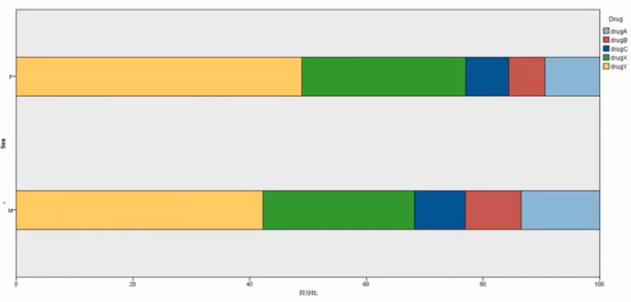

没有特别的相关性

### Attribute:血压

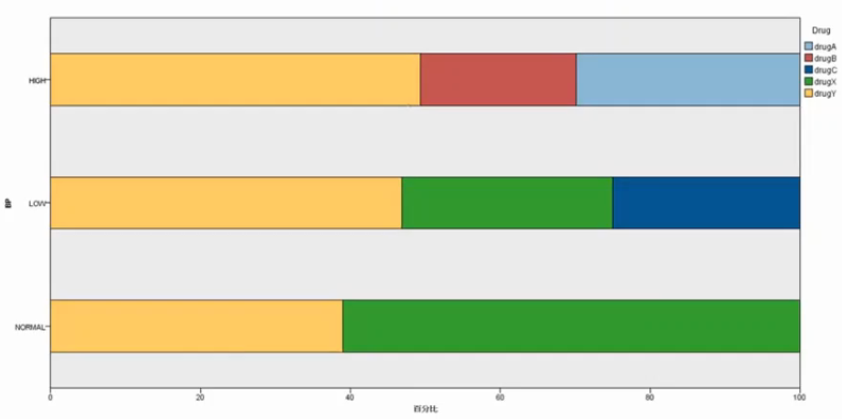

高血压使用AB
正常和低血压使用X
低血压还使用了C

### Attribute:胆固醇

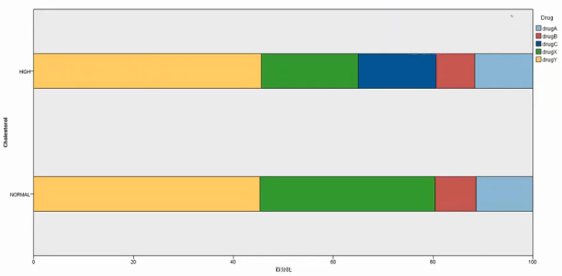

高胆固醇使用了C

### Attribute:年龄

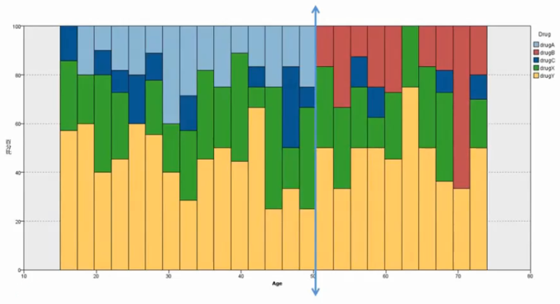

50岁以上的人开始使用B

### Attribute:血液中的Na含量

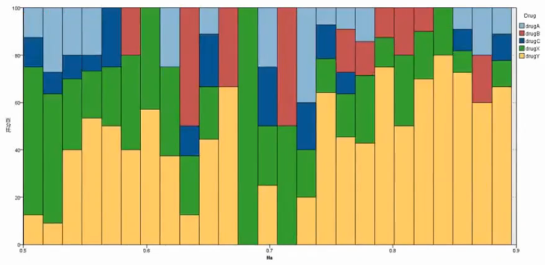

没有特别的相关性

### Attribute:血液中的K含量

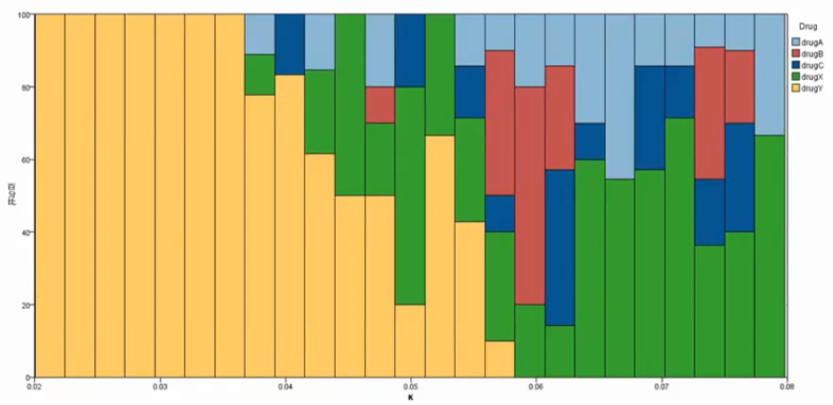

含量低的基本都是Y
含量升高X的使用量增大

### 创建决策树模型

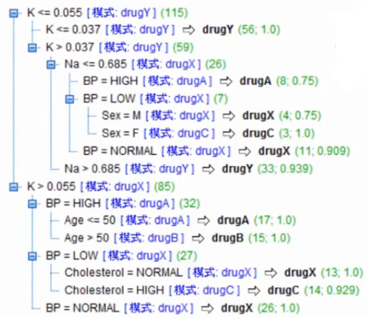

正确率: 96.5%

### Attribute:：血液中的Na vs.K

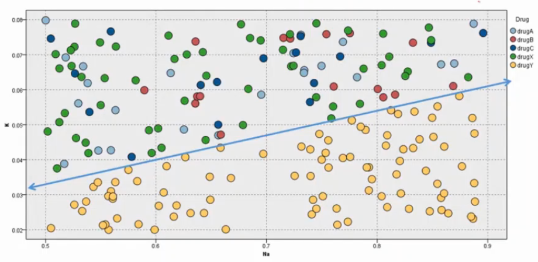

直线下方的使用Y, 构建Na-K的关系`Na/K`
### Attribute:产生衍生变量NatoK

将Na和K特征删除, 加入Na-K变量

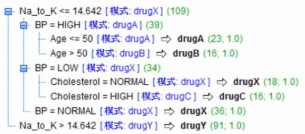

正确率: 100%

## 运用专家经验的特征建构方法

专家的建议后, 需要用数据进行验证

1. 属性1：Avg_BILL_AMT（数值属性）：平均账单金额，是 AVERAGE (BILL_AMTI~BILL_AMT6)，若 PAY_1~PAY_6（前 1 月缴费状态至前 6 月状态）中的值为 N，代表为新客户，不加入平均。
1. 属性2：Avg_PAY_AMT（数值属性）：平均缴款金额，是 AVERAGE (PAY_AMT1~PAY_AMT6)，若 PAY_1~PAY_6（前 1 月缴款状态至前 6 月缴款状态）中的值为 N，代表为新客户，不加入平均。
1. 属性3：B_Ratio（数值属性）：平均额度使用率（余额 / 额度比），是 Avg_BILL_AMT / LIMIT_BAL（平均账单金额 / 户额度）。
1. 属性4：P_Ratio（数值属性）：平均还款率，是 Avg_PAY_AMT / Avg_BILL_AMT（平均全额 / 平均账单金额）。
1. 属性5：OverAmt（类别属性）：是否溢缴，若 BILL_AMTI~BILL_AMT6（前 1 月账单金额至前 6 月账单金额）之中有出现值则代表有溢缴，表示有经济能力，则该位设为 1，反之设为 0。
1. 属性6：Histry（数值属性）：过去缴费历史记录。

其中1和2数据验证后无效, 而3456则非常有效

## 运用数据分析的特征建构方法
股票买卖数据集

| ID | Price on Day T | Forecast Price on Day T+1 | Target:Decision |
| ---- | ---- | ---- | ---- |
| 101 | 17.60 | 17.72 | Buy |
| 02 | 17.70 | 17.60 | Sel1 |
| 03 | 17.70 | 17.71 | Buy |
| 04 | 17.71 | 17.94 | Buy |
| 05 | 17.72 | 17.70 | Sell |
| 06 | 17.75 | 17.84 | Buy |
| 07 | 17.84 | 17.97 | Buy |
| 08 | 17.90 | 17.75 | Sell |
| 09 | 17.92 | 18.09 | Buy |
| 10 | 17.94 | 18.08 | Buy |
| 11 | 17.97 | 18.08 | Buy |
| 12 | 18.02 | 17.92 | Sell |
| 13 | 18.08 | 17.90 | Sel1 |
| 14 | 18.08 | 18.10 | Buy |
| 15 | 18.08 | 18.16 | Buy |
| 16 | 18.09 | 18.08 | Sel1 |
| 17 | 18.10 | 18.11 | Buy |
| 18 | 18.16 | 18.02 | Sel1 |

交通工具数据集

| ID | Gender | Income | Distance | Target: Vehicle |
| ---- | ---- | ---- | ---- | ---- |
| 01 | Male | Low | Far | Car |
| 02 | Male | Low | Far | Car |
| 03 | Female | High | Far | Car |
| 04 | Female | High | Near | Car |
| 05 | Male | High | Near | Bike |
| 06 | Male | High | Near | Bike |
| 07 | Female | Low | Near | Bike |
| 08 | Female | Low | Far | Bike |

决策树一次只能处理一个特征, 所以做出来的规则非常复杂, 如下图左. 手动将特征进行组合后, 可以简化决策树的生成规则.

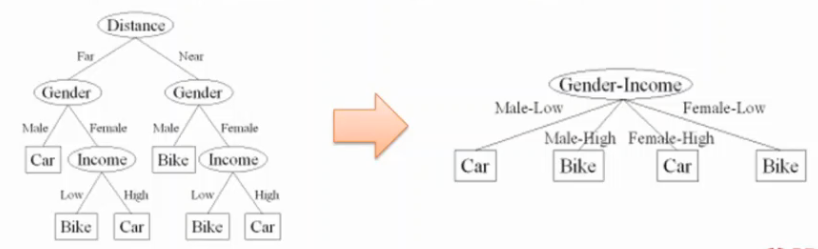

单变量决策树的决策过程:

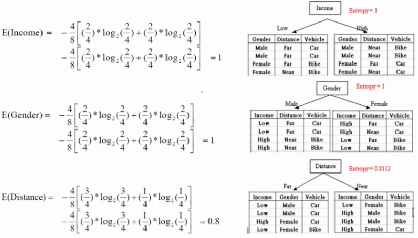

投票数据集

| First Voter | Second Voter | Third Voter | Unanimous? |
| ---- | ---- | ---- | ---- |
| Nay | Nay | Nay | TRUE |
| Nay | Nay | Aye | FALSE |
| Nay | Aye | Nay | FALSE |
| Nay | Aye | Aye | FALSE |
| Aye | Nay | Nay | FALSE |
| Aye | Nay | Aye | FALSE |
| Aye | Aye | Nay | FALSE |
| Aye | Aye | Aye | TRUE |

规则很简单, 三者投票相同, 则是True. 其他是False

直接建立决策树, 规则复杂, 没有抓到核心规则.
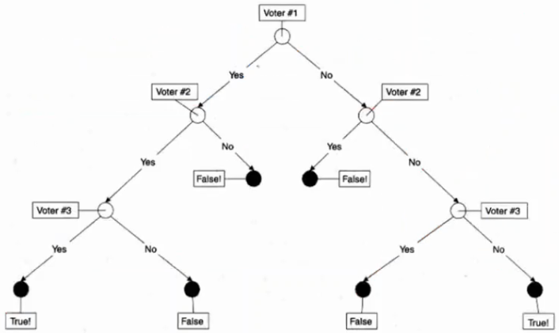

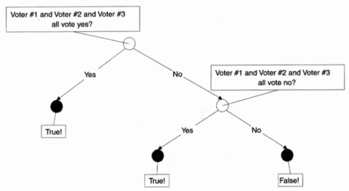

## 数据分析的特征建构方法：建构多项式特征及交互特征

原始数据|多项式特征|交互式特征
--|--
2, 3|4, 6|9

多项式特征(Polynomial): $x^2$
交互式特征(Interaction): $x_1x_2$ 

