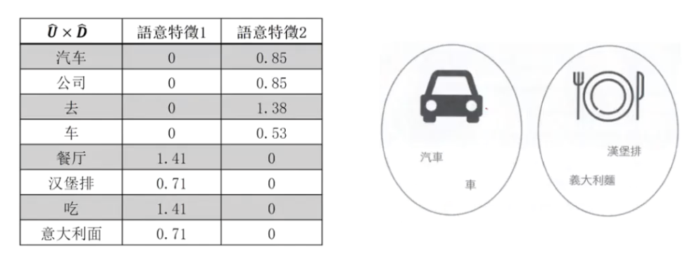

1. 线性的特征转换
    1. 与目标字段无关的转换: PCA，SVD，TSVD,矩阵分解NMF
    2. 与目标字段有关的转换: LDA
2. 非线性的特征转换
    1. 与目标字段无关的转换: Kernel PCA,t-SNE
    2. 与目标字段有关的转换: 神经网络

转换出来的新特征, 不好解释. 如果想要好解释性, 最好做特征选择.

## PCA

Principal component analysis (PCA) is a popular `linear` dimensionality reductiontechnique.

PCA projects observations onto fewer principal components of the feature matrixthat retain the `most variance`.

PCA is an `unsupervised technique`, meaning that it does not use the informationfrom the target vector and instead only considers the feature matrix.

The variance of the “length'is significantly ggreater thanthee "height".

Instead of length and height.we refer to the “directionswith the most variance as thefirst principalcomponentt andthe “direction“ with thesecond-most variance as thesecond principal component.

PCA求得主成分的步骤

1. 计算协方差矩阵(Variance-CovarianceMatrix)
2. 解出协方差矩阵的特征值(EigenValue)及特征向量(EigenVector)
3. 将特征值由大至小排序，排序后分别为第一主成分、第二主成分、

红色表示PCA转换后的特征, 蓝色表示原始特征. 取5个主成分分就能达到80%的效果, 而原始要选择9个特征.

## SVD

### LSA

潜在语意分析(Latent Semantic Analysis,LSA)运用SVD(SingularValue Decomposition)从庞大的文字数据中找出词汇所拥有的潜在语意关联性，是广泛运用在自然语言数据搜寻上的降维方式

传统自然语言搜索引擎的搜寻方式会要求使用者下查询的关键词，然后依照这些关键词去搜寻文章中有出现这些关键词的文章

然而，这种搜寻方式有一个问题就是关键词若文章中的词无法完全符合关键词，则就无法顺利搜寻出这些文章

例如，文章中有“车"这个词，但若查询的关键词是“汽车"的话，则就无法搜寻出这篇文章. 但“车"和“汽车”是同义词，若无法顺利搜寻出则无法满足使用者的需求

通过LSA，可以计算出词汇间的语意相似度，以及词汇与文件间的相似度，来解决这个问题

LSA可以将词汇-文件的矩阵降维，转换为潜在语意空间，此转换需要用到SVD的矩阵分解技术

文件1: 驾驶汽车去公司
文件2: 开车过去
文件3: 在餐厅吃汉堡排
文件4: 吃餐厅的意大利面

| X | 文件1 | 文件2 | 文件3 | 文件4 |
| ---- | ---- | ---- | ---- | ---- |
| 汽车 | 1 | 0 | 0 | 0 |
| 公司 | 1 | 0 | 0 | 0 |
| 去 | 1 | 1 | 0 | 0 |
| 车 | 0 | 1 | 0 | 0 |
| 餐厅 | 0 | 0 | 1 | 1 |
| 汉堡排 | 0 | 0 | 1 | 0 |
| 吃 | 0 | 0 | 1 | 1 |
| 意大利面 | 0 | 0 | 0 | 1 |

1. LSA通过奇异值分解进行降维后，各语意维度形成正交，矩阵中的元素有可能是负值，会造成解读困难: －用NMF或LDA等方法可以解决
1. 奇异值分解计算非常费时，尤其是关键词的量非常大时
1. 新词加入时，需要重新进行矩阵分解
1. 进行奇异值分解时通常采用截断SVD(Truncated SVD,TSVD)－与SVD不同的是TSVD可以产生一个指定维度的分解矩阵，运算较快

## 线性的特征转换-矩阵分解NMF❓

NMF is an unsupervised technique for linear dimensionality reductionthat factorizes feature matrix into matrices representing the latentrelationship between observations and their features.

Formally, given a desired number of returned features, r,)NMF factorizesour feature matrix such that V ~ WH where V is the original d*n featurematrix (i.e., d features, n observations), W is a d*r, and H is an r*nmatrix.
 
One major requirement of NMA is that, the feature matrix cannot containnegative values.

## 线性的特征转换-LDA❓
1. Linear Discriminant Analysis ( LDA) is a classification algorithm that isalso a popular technique for dimensionality reduction.
2. LDA works similarly to principal component analysis (PCA) in that itprojects the feature space onto a lower-dimensional space.
3. However, in PCA we were only interested in the component axes thatmaximize the variance in the data, while in LDA we have the additionalgoal of maximizing the differences between classes.

## 非线性的特征转换-KernelPCA❓

## 非线性的特征转换-t-SNE❓

## 非线性的特征转换+神经网络❓

## 总结

| Algorithm | Supervised/Unsupervised | Linear /Non-Linear |
| ---- | ---- | ---- |
| PCA | Unsupervised Transformation | Linear |
| NMF | Unsupervised Transformation | Linear |
| SVD,TSVD | Unsupervised Transformation | Linear |
| KERNEL PCA | Unsupervised Transformation | Non-Linear |
| T-sne | Unsupervised Transformation | Non-Linear |
| AutoEncoder | Unsupervised Transformation | Non-Linear |
| LDA | Supervised Transformation | Linear |
| NN/Deep Learning | Supervised Transformation | Non-Linear |

