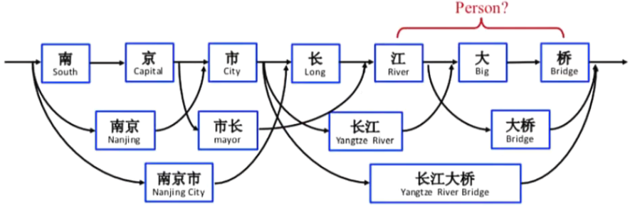
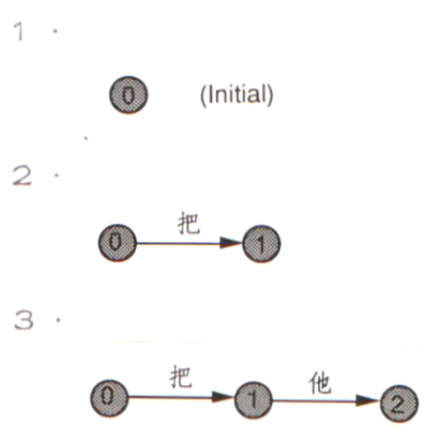
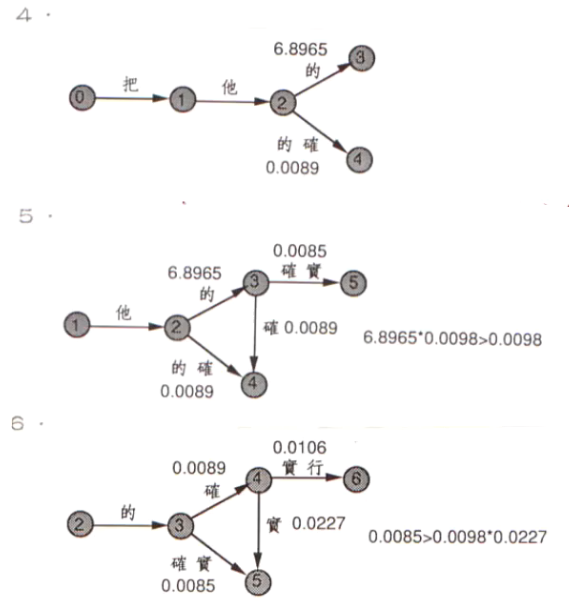
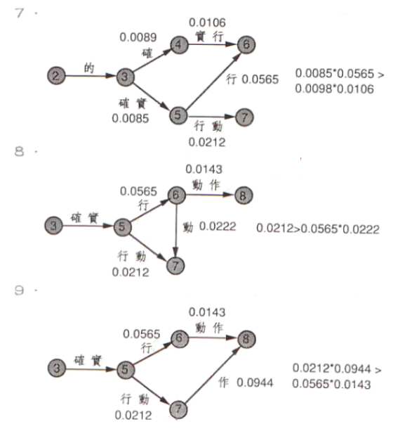
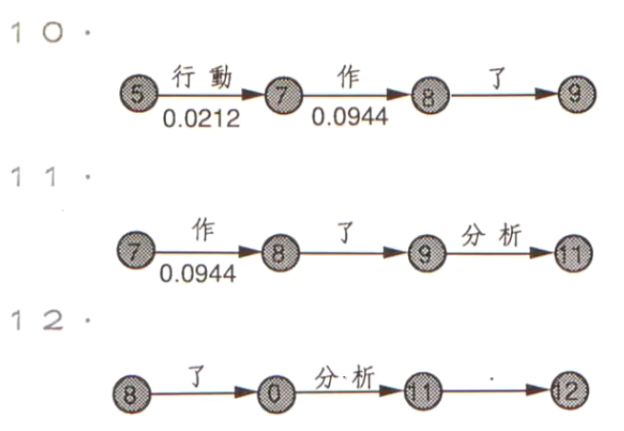
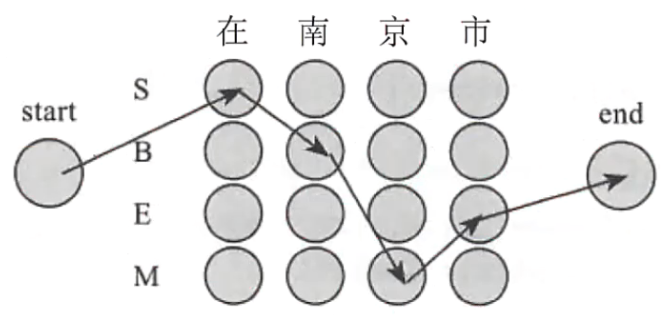

分词

N-Gram vs 中文分词
分词的难点
法则式分词法
统计式分词法

词性标注

词性标注简介
词性标注的难点
词性的种类及意义
保留某些词性的词

## N-Gram

南京市长江大桥

1. Uni-Gram: 南 京 市 长 江 大 桥
2. Bi-Gram: `南京` 京市 `市长` `长江` 江大 `大桥`
3. Tri-Gram: `南京市` 京市长 市长江 长江大 江大桥
4. 4-Gram: `南京市长` 京市长江 市长江大 `长江大桥`

✨N-Gram的优点是不需要进行中文分词，且当N够大时，所有正确的分词均会出现于N-Gram中

✨N-Gram的缺点是大多数撷取出来的词是没有语法及语意上意义；噪声过多，且无法与许多资源结合，会大大影响后续的分析

## 中文分词
1. 中文自动分词是中文自然语言处理中特有的一个问题
2. 因为中文的句子结构中，单独的汉字并非句法及语意上的最小单位，词才是中文中能够单独出现，并且自由运用的最小单位
3. 将输入句子的字符串顺序转换成词语顺序的过程就叫作分词

什么是分词？

词就是利用计算机识别出文本中词汇的过程

比如句子：南京市长江大桥

分词难点-歧义无处不在

交叉歧义（多种切分交织在一起）: 
1. 内塔内亚`胡/说`/的/确实/在理
2. 内塔内亚/胡说/的/确实/在理

组合歧义（不同情况下切分不同）: 
1. 这个人/手上有痣
2. 我们公司人手不足

真歧义（几种切分都可以)
1. 乒乓球拍/卖/完了
2. 乒乓球/拍卖/完了

分词难点-新词层出不穷

人名、地名、机构名: 刘德华 长阪坡 耀华路
网名: 你是我的谁 旺仔小馒头
公司名、产品名: 摩托罗拉谷歌爱国者腾讯网易新浪
定量词: 这三本书 这五本书
重迭词: 高高兴兴 跳跳舞

分词难点-普通词与新词互用
1. `高明`（演员）表演真好/他的表演很`高明`
2. `汪洋`（广东省长）到深圳检查工作/洞庭湖一片`汪洋`

分词难点-普通词与新词交织在一起

1. 克林顿`对内`塔尼亚`胡说`
2. 胡锦涛听取龚学`平等`同志的汇报

过去计算机分词的研究，可略分为

以构词规则为出发点的`法则式分词法`
1. 全切分
2. FMM(Forward MaximumMatching)/BMM(Backward MaximumMatching)/Bi-directionMaximum Matching

利用语料库归纳出统计数据作为凭断标准的`统计式分词法`
1. N-Gram概率模型
2. HMM概率模型

以上的分词方法除HMM外，都需依赖词典的辅助

## 法则式分词法

全切分：获得文本所有可能的切分结果. 和n-gram的区别是只切在词典里存在的词

他说的确实在理
1. 他
2. 说
3. 的确
4. 确实
5. 实在
6. 在理

FMM/BMM：把句子从左向右(从右向左)扫描一遍，遇到字典里有的最长词就标识出来，遇到不认识的字符串就分割成单字词

词典: 

1. 小沈阳
1. 沈阳
1. 演出
2. 收入
3. 分成
4. 成都
5. 都
6. 均
7. 为
8. 是
9. 9:1

实例:

小沈阳演出收入分成均为9:1:
1. FMM：小沈阳/演出/收入/分成/均/为/9:1（正确）
2. BMM：小沈阳/演出/收入/分成/均/为/9:1（正确）

小沈阳演出收入分成都是9:1:
1. FMM：小沈阳/演出/收入/分成/都/是/9:1（正确）
2. BMM：小沈阳/演出/收入/分成/均/为/9:1（正确）

词典

内塔尼亚胡
胡说
说
的
的确
确实
实在
在理

实例
内塔尼亚胡说的确实在理
1. FMM：内塔尼亚胡/说/的确/实在/理（错误）
2. BMM：内塔尼亚/胡说/的/确实/在理（错误）

Bi-directionMaximumMatching：将FMM及BMM得到的分词结果进行比较，其规则如下：

1. 如果FMM和BMM的词数不同，则取词数较少的那个结果
1. 如果FMM和BMM的词数相同，且结果相同，则返回任一个结果
1. 如果FMM和BMM的词数相同，且结果不同，则返回单字较少的那个结果

例子:
原文句子：研究生命起源
FMM：研究生命起源
BMM：研究生命起源(正确)

优点
1. 程序简单易行，开发周期短
2. 没有任何复杂计算，分词速度快

缺点
1. 歧义的处理太过简单
2. 不能识别新词
3. 分词精度不能满足实际的需要

    1. 规范文本在80%左右
    1. 互联网文本在70%左右

## 统计式分词

首先利用已切分好词的学习样本建立模型，再利用模型对预测结果进行间接推理

马尔夫假设

1. 当前状态出现的概率仅同过去有限的历史状态有关，而与其他状态无关
2. 具体到分词任务，就是文本中第i个词出现的概率仅仅依赖于它前面的i-1个词，而与其他词无关

### N-Gram概率模型

第一步：全切分:

他说的确实在理
1. 他
2. 说
3. 的确
4. 确实
5. 实在
6. 在理

第二步：Viterbi动态规划，找到贯穿句子的路径并计算每条路径的概率(以下为2阶马可夫模型)

他 说 的 确实 在理

他 说 的确 实在 理

P1=P(他)*P(说|他)*P(的|说)*P(确实|的)*P(在理|确实)·
P2=P(他)*P(说|他)*P (的确|说)*P(实在|的确)*P(理|实在)

第三步：选择概率最大的路径为切分结果

### 1阶马可夫概率模型

案例:

把他的确实行动作了分析

✨在遇到分歧路的时候, 计算概率, 选择概率最大的路

## HMM概率模型

HMM规定每个字只能是4个构词位置的其中一个

B:词首
M:词中
E:词尾
S:单字词

例子:
中文分词是文本处理不可或缺的一步

1. 分词结果：中文／分词／是／文本处理／不可或缺／的／一步
2. HMM结果：中/B 文/E 分/B 词/E 是/S 文/B 本/M 处/M 理/E 不/B 可/M 或/M 缺/E 的/S 一/B 步/E

令$c=c_1c_2 ... c_n$代表输入的句子, 例如: 中文分词
令$o=o_1o_2 ... o_n$代表输出的句子, 例如: BEBE

$max = max P(o|c) = max \frac{P(o,c)}{P(c)} = max \frac{P(c|o)*P(o)}{P(c)} = maxP(c|o)*P(o)$

$P(c|o) = P(c_1|o_1) * P(c_2|o_2) * ... * P(c_n|o_n)$

$P(o) = P(o_1) * P(o_2|o_1) * ... * P(o_n|o_{n-1})$

$P(c|o)*P(o)=P(o_1) * P(c_1|o_1) * P(o_2|o_1) * P(c_2|o_2) * ... * P(o_n|o_{n-1}) * P(c_n|o_n)$

$P(c_k|o_k)$是发射概率

$P(o_k|o_{k-1})$是转移概率

通过设置某些$P(o_k|o_{k-1})=0$, 可以排除BBB, EM等不合理的组合.

利用viterbi动态规划，找到贯穿句子的路径，计算每条路径的概率，并得到最大概率的路径

优点:
能够处理大多数常用词带来的歧义问题. 在训练语料规模足够大和覆盖领域足够多的情况下，可以获得较高的切分正确率（>=95%)

缺点:
1. 不能处理新词以及新词带来的歧义问题
2. 需要很大的训练语料
3. 分词速度相对较慢

## 分词效能评估

正确分词：伊拉克 已 连续 第四天 将 原油 倾入 波斯湾 08个词
分词结果：伊拉克 已 连续 第四天 将 原 油 倾入 波斯 湾 10个词

查准率(Precision)：6 /10=0.6
查全率(Recall):6 /8 =0.75
F1:2 *0.6 * 0.75/ (0.6 +0.75)=0.67(0 ~1)

## 词性标注

中文词汇大致可以分为名词、动词、形容词、数词、量词、代词、介词、副词、连词、感叹词、助词和拟声词等

在句法分析、信息抽取(关键词撷取)等任务中有重要作用

例子:

我走路
1. 我(人称代词, r)
2. 走(动词, v)
3. 路(名次, n)

