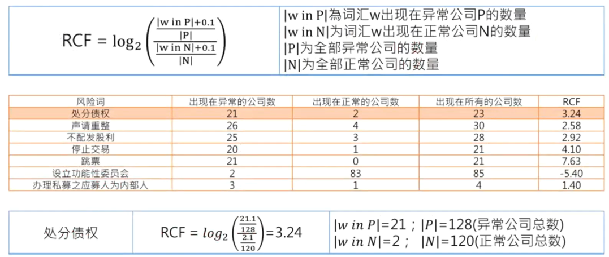

1. 根据TF、DF及IDF的关键词提取方法
1. 根据词性的关键词提取方法
1. 根据文章结构的关键词提取方法
1. 关键词的可视化-文字云

## TF-IDF

自动建构关键词的方法常采用Inverse Document Frequency(IDF）的方式行之
1. IDF = log2(N/n)
1. N是指有多少篇文章(N=5)
1. n (=DF)是指某个词出现在多少篇文章中

IDF代表着信息量，由IDF的大小我们可以得知一个词的重要程度
1. IDF越大代表这个词越重要，也越是我们想要的关键词
2. IDF越小代表这个词的索引价值也越低

在向量空间模型中，每一个文件(Document)及查询(Query)表示成N维空间坐标上的点，每一个维度代表一个关键词，在它维度上的值是根据关键词的 TF*关键词的 IDF来得到

Weight = TF * IDF

1. Weight的值越大代表这个词越重要，也越是我们想要的关键词
1. Weight的值越小代表这个词的索引价值也越低

词频TF衡量了一个词在文档中出现的频率, 出现频率越高则表示这个词越重要. 

$$
TF = \frac{词在文档中出现的次数}{文档的总词数}
$$

向文件频率IDF则表示此在文档中的分布状况, 如果一个词集中出现在某些文档，则这个词就越重要.

$$
IDF = log_{10}\frac{文档总数}{包含该词的文档数}
$$

TF×IDF值越大，则这个词成为一个关键词的概率就越大

## RCF

## 文本特征的选取

特征选取方式常见的有3种

1. 据领域专家的知识挑选最有影响的特征
2. 用数学的方法从原始特征中挑选出一些最具分类信息的特征，这种方法是一种比较精确的方法，人为因素的干扰较少，尤其适合于文本自动分类挖掘系统的应用
3. 如特征项太过稀疏，或者多词一意等状况，可用映射或变换的方法把原始特征变换为较少的新特征

