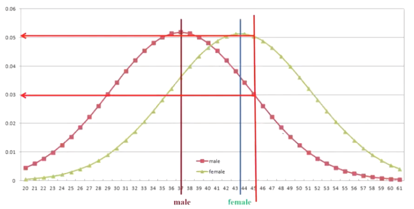
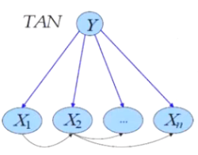

- 朴素贝叶斯
    - 独立性假设
    - 概率的归一化
    - 拉普拉斯转换
    - 空值的问题
- 不同类型的朴素贝叶斯模型
    - 针对数值型特征的朴素贝叶斯模型
    - 针对类别型及顺序型特征的朴素贝叶斯模型
    - 针对二元类别型特征的朴素贝叶斯模型

Naive Bayes

$P(Y|X)=\frac{P(X,Y)}{P(X)}=\frac{P(X,Y)×P(Y)}{P(X)×P(Y)}=P(X|Y)×\frac{P(Y)}{P(X)}$

只能做分类问题:
| RID | oge | income | student | credit_rating | Coss buys_computer |
| --- | --- | --- | --- | --- | --- |
| 1 | <=30 | high | no | fair | no |
| 2 | <=30 | high | no | excellent | no |
| 3 | 31...40 | high | no | fair | yes |
| 4 | >40 | medium | no | fair | yes |
| 5 | >40 | low | yes | fair | yes |
| 6 | >40 | low | yes | excellent | no |
| 7 | 31...40 | low | yes | excellent | yes |
| 8 | <=30 | medium | no | fair | no |
| 9 | <=30 | low | yes | fair | yes |
| 10 | >40 | medium | yes | fair | yes |
| 11 | <=30 | medium | yes | excellent | yes |
| 12 | 31...40 | medium | no | excellent | yes |
| 13 | 31...40 | high | yes | fair | yes |
| 14 | >40 | medium | no | excellent | no |

目标:
Classify X=(age="<=30", income="medium", student="yes", credit-rating="fair")

计算P(X|Y):
- P(age=<30| buys_computer=yes)=2 / 9
- P(age=<30|buys_computer=no)=3 / 5
- P(income=medium | buys_computer=yes)=4 / 9
- P(income=medium | buys_computer=no)=2 / 5
- P(student=yes|buys_computer=yes)=6 / 9
- P(student=yes | buys_computer=no)=1 / 5
- P(credit-rating=fair | buy s_computer=yes)=6 / 9
- P(credit-rating =fair |buys_computer=no) =2 / 5
- P(X | buys_computer=yes)=0.044
- P(X| buys_computer=no)=0.019

计算P(Y):
- P(buys_computer=yes)=9 / 14
- P(buys_computer=no)=5 / 14

计算P(Y|X): 
- P(buys_computer=yes|X) ≅ P(X|buys_computer=yes)P(buys_computer=yes)=0.028
- P(buys_computer=no|X) ≡ P(X|buys_computer=no)P(buys_computer=no)=0.007

✨P(X)实际不需要, 因为最终结果是比较大小, 大家都除以P(X), 不影响比较大小的结果.

概率规一化
- Adjust the probabilities to satisfy the probability theorem.
- Before 
    - $P(buys_computer=yes|X)\cong0.028$
    - $P(buys_computer=no|X)\cong0.007$

- After
    - $P(buys_computer=yes|X)\cong0.028/(0.028 + 0.007)=0.8$
    - $P(buys_computer=no|X)\cong0.007/(0.028 + 0.007)=0.2$

拉普拉斯转换

- 概率可用拉普拉斯修正法（Laplace Correction）将概率修正。
- Before 
    - $P(buys_computer = yes|X)\cong0.028$
    - $P(buys_computer = no|X)\cong0.007$。
- After
    - 假设α设为 0.001。
    - $P(buys_computer = yes|X)\cong(0.028+\alpha)/(0.035+2\times\alpha)=0.029/0.037 = 0.78$
    - $P(buys_computer = no|X)\cong(0.007+\alpha)/(0.035+2\times\alpha)=0.008/0.037 = 0.22$

独立性假设

Two assumptions: Attributes are 
- equally important a priori ✨每个字段的权重都是1, 神经网络则会给字段加权重, 而树模型本身就会进行字段的选择.
- statistically independent (given the class value) i.e., knowing the value of one attribute says nothing about the value of another (if the class is known).✨Independence assumption is never correct! But... often works well in practice. 原因是最终的结果是比较分类的概率大小, 所以独立性假设在比较过程中相消了, 也就是说两种情况都有假设不正确的问题.

另外一个案例:

| Magazine Promotion | Watch Promotion | Life Insurance Promotion | Credit Card Insurance | Sex |
| --- | --- | --- | --- | --- |
| No | No | No | No | Male |
| Yes | Yes | Yes | Yes | Female |
| No | No | No | No | Male |
| Yes | Yes | Yes | Yes | Male |
| Yes | No | Yes | No | Female |
| No | No | No | No | Female |
| Yes | Yes | Yes | Yes | Male |
| No | No | No | No | Male |
| No | No | No | No | Male |
| Yes | Yes | No | No | Female |

模型创建: 

| Sex | Magazine Promotion | Magazine Promotion| Watch Promotion | Watch Promotion| Life Insurance Promotion | Life Insurance Promotion| Credit Card Insurance | Credit Card Insurance |
| --- | --- | --- | --- | --- |
| Male/Female | Male | Female | Male | Female | Male | Female | Male | Female |
| Yes | 4 | 3 | 2 | 2 | 2 | 3 | 2 | 1 |
| No | 2 | 1 | 4 | 2 | 4 | 1 | 4 | 3 |
| Rato: yes/total | 4/6 | 3/4 | 2/6 | 2/4 | 2/6 | 3/4 | 2/6 | 1/4 |
| Rato:no/total | 2/6 | 1/4 | 4/6 | 2/4 | 4/6 | 1/4 | 4/6 | 3/4 |

目标:

Magazine Promotion= Yes
Watch Promotion = Yes
Life Insurance Promotion=No
Credit Card Insurance = No
Sex =?

计算 sex = male

$P(sex = male|E)=\frac{P(E|sex = male)P(sex = male)}{P(E)}$
$P(magazine promotion = yes|sex = male)=4/6$
$P(romotion = yes|sex = male)=2/6$（此处可能存在识别错误）
$P(life insurance promotion=no|sex=male)=4/6$
$P(insurance = no|sex = male)=4/6$
$\begin{aligned}P(E|sex = male)&=(4/6)(2/6)(4/6)(4/6)\\&=8/81\end{aligned}$
$(8/81)(3/5)\approx0.0593$
$P(sex = male|E)\approx0.0593/P(E)$。

计算 sex = female

$P(sex = female|E)=\frac{P(E|sex = female)P(sex = female)}{P(E)}$
$P(magazine promotion = yes|sex = female)=3/4$
$P(promotion = yes|sex = female)=2/4$
$P(insurance promotion = no|sex = female)= 1/4$
$P(credit card insurance = no|sex = female)=3/4$
$\begin{aligned}P(E|sex = female)&=(3/4)(2/4)(1/4)(3/4)\\&=9/128\end{aligned}$
$(9/128)(2/5)=0.0281$
$P(sex = female|E)\approx0.0281/P(E)$。

概率为0的处理:

$\frac{n+(k)(p)}{d + k}$，

k 是一个介于 0 和 1 之间的值（通常为 1），p 被选为属性可能值总数的等比例部分。如果一个属性有两个可能值，p 将为 0.5。

让我们使用这种技术重新计算前面例子中的条件概率 P(E | sex = female)。当 k = 1 且 p = 0.5 时，给定 sex = female 的证据的条件概率计算为：

$\frac{(3 + 0.5)×(2 + 0.5)×(1 + 0.5)×(3 + 0.5)}{5×5×5×5}\approx0.0176$。

空值的处理:

$Magazine Promotion = Yes$
$Watch Promotion=Unknown$
$Life Insurance Promotion =No$
$Credit Card Insurance= No$
$Sex =?$

$P(E|sex = male)=(4/6)(4/6)(4/6)=8/27$
$P(E|sex = female)=(3/4)(1/4)(3/4)=9/64$
$P(sex = male|E)\approx0.1778/P(E)$
$P(sex = female|E)\approx0.05625/P(E)$。
✨直接无视空值

医生诊断例子:

| Patient ID# | Sore Throat Fever | Swollen Glands | Congestion | Headache | Diagnosis |
| --- | --- | --- | --- | --- | --- |
| 1 | Yes | Yes | Yes | Yes | Yes | Strep throat |
| 2 | No | No | No | Yes | Yes | Allergy |
| 3 | Yes | Yes | No | Yes | No | Cold |
| 4 | Yes | No | Yes | No | No | Strep throat |
| 5 | No | Yes | No | Yes | No | Cold |
| 6 | No | No | No | Yes | No | Allergy |
| 7 | No | No | Yes | No | No | Strep throat |
| 8 | Yes | No | No | Yes | Yes | Allergy |
| 9 | No | Yes | No | Yes | Yes | Cold |
| 10 | Yes | Yes | No | Yes | Yes | Cold |

If you are a doctor, then does the first patient get what kind of disease based on the above 5 symptoms (Strep throat (链球菌喉炎), Allergy (过敏) or Cold (感冒))?

| Patient ID# | Sore Throat | Fever | Swollen Glands | Congestion | Headache | Diagnosis |
| --- | --- | --- | --- | --- | --- | --- |
| 11 | No | No | Yes | Yes | Yes |? |

In Naive Bayes Classification, for the Patient 11, we need to calculate the following three probabilities:
- P(Strep Throat | Patient 11)
- P(Allergy | Patient 11)
- P(Cold | Patient 11).

- Based on the Bayes Theorem, we can derive the following formulas.
- P(Strep Throat | Patient 11)= P(Patient 11 | Strep Throat) * P(Strep Throat) / P(Patient 11).
- P(Allergy | Patient 11)=P(Patient 11 | Allergy) * P(Allergy) / P(Patient 11)。
- P(Cold | Patient 11)=P(Patient 11 | Cold) * P(Cold) / P(Patient 11)。

Because they are all divided by P(Patient 11), we can omit this term.

- The final formulas are listed below.
    - P(Strep Throat | Patient 11)= P(Patient 11 | Strep Throat) * P(Strep Throat).
    - P(Allergy | Patient 11)=P(Patient 11 | Allergy)* P(Allergy).
    - P(Cold | Patient 11)= P(Patient 11 | Cold) * P(Cold).

If P(Strep Throat | Patient 11)>P(Allergy | Patient 11)>P(Cold | Patient 11), then we predict that the Patient 11 get the disease of Step Throat.

- P(Strep Throat | Patient 11)=P(Patient 11 | Strep Throat)*P(Strep Throat)=P(Patient 11 | Strep Throat)*0.3
- P(Strep Throat)=3/10=0.3。

- P(Patient 11 | Strep Throat)= P(Sore Throat = No| Strep Throat) * P(Fever = No | Strep Throat) *P(Swollen Glands = Yes | Strep Throat) * P(Congestion = Yes | Strep Throat)* P(Headache=Yes | Strep Throat)=1/3*2/3*3/3*1/3*1/3。

- P(Strep Throat | Patient 11)=0.0074；P(Patient 11 | Strep Throat) * P(Strep Throat)=3/10*2/(3*3*3*3)
- P(Strep Throat)=3/10
- P(Patient 11 | Strep Throat)=2/(3*3*3*3)。

Please Calculate the following two probabilities 
- P(Allergy | Patient 11)= P(Patient 11 | Allergy) * P(Allergy)
- P(Cold | Patient 11)=P(Patient 11 | Cold) * P(Cold)。

概率归一化:

Adjust the probabilities to satisfy the probability theorem.
Before:
- P(Strep Throat | Patient 11)=1/(5*3*3*3)=0.0074；
- P(Allergy | Patient 11)=0；
- P(Cold | Patient 11)=0.
After:
- P(Strep Throat | Patient 11)=0.0074/(0.0074+0+0)=1.0；
- P(Allergy | Patient 11)=0/(0.0074+0+0)=0.0；
- P(Cold | Patient 11)=0/(0.0074+0+0)=0.0.

贝叶斯只能处理类别型字段, 所以遇到数值型字段要先离散化, 或者以正态分布作为数值型字段的处理方式

$f(x)=1 /(\sigma \sqrt{2 \pi}) e^{-(x-\mu)^{2} /\left(2 \sigma^{2}\right)}$ 
where 
1. e = the exponential function
2. μ = the class mean for the given numerical attribute
3. σ = the class standard deviation for the attribute
4. x = the attribute value.

Magazine Promotion=Yes；Watch Promotion = Yes；Life Insurance Promotion=No；Credit Card Insurance=No；Age=45；Sex=?

| Magazine Promotion | Watch Promotion | Life Insurance Promotion | Credit Card Insurance | Age | Sex |
| --- | --- | --- | --- | --- | --- |
| Yes | No | No | No | 45 | Male |
| Yes | Yes | Yes | Yes | 40 | Female |
| No | No | No | No | 42 | Male |
| Yes | Yes | Yes | Yes | 30 | Male |
| Yes | No | Yes | No | 38 | Female |
| No | No | No | No | 55 | Female |
| Yes | Yes | Yes | Yes | 35 | Male |
| No | No | No | No | 27 | Male |
| Yes | No | No | No | 43 | Male |
| Yes | Yes | Yes | No | 41 | Female |

计算P(age = 45|sex = male)的概率

$P(E|sex = male)=(4/6)(2/6)(4/6)(4/6)[P(age = 45|sex = male)]$
$P(E|sex = female)=(3/4)(2/4)(1/4)(3/4)[P(age = 45|sex = female)]$

In Table 10.5 to find the mean and standard deviation scores. For the class sex=male we have: σ=7.69, μ=37.00, and x=45. Therefore the probability that age=45 given sex=male is computed as: 

$P(age = 45|sex = male)=1/(\sqrt{2\pi}7.69)e^{-(45 - 37.00)^{2}/[2(7.69)^{2}]}$.
Making the computation, we have: 

$P(age = 45|sex = male)\approx0.030$.

To determire the conditional probability for age given sex=female, we substitute σ=7.77, μ =43.50, and x=45. Specifically, 

$P(age = 45|sex = female)=1/(\sqrt{2\pi}7.77)e^{-(45 - 43.50)^{2}/[2(7.77)^{2}]}$.

Making the computation, we have: 

$P(age = 45|sex = female)\approx0.050$.

We can now determine the overall conditional probability values: 

$(E|sex = male)=(4/6)(2/6)(4/6)(4/6)(0.030)\approx.003$
$(E|sex = female)=(3/4)(2/4)(1/4)(3/4)(0.050)=.004$.

$(sex = male|E)\approx(.003)(0.60)/P(E)\approx.0018/P(E)$
$(sex = female|E)\approx(.004)(0.40)/P(E)\approx.0016/P(E)$

Once again, we ignore $P(E)$ and conclude that the instance belongs to the male class.

朴素贝叶斯有非常多好的特性，尤其在 Big Data 的环境中。同时，它支持 Incremental Learning/Updatable Learning，非常难得。

## TAN贝叶斯

Tree Augmented Naive Bayesian (TAN) is used to relax independence assumption.
It is defined by the following conditions.
- Target attribute Y is the parent of all input attributes.
- One Input attribute may have one other input attribute as the parent.

在计算×_2 的概率时，除了需参考 Y 外，还需参考×_1。
一个输入字段除跟目标字段外，最多只能跟一个输入字段有关

## sklearn中的朴素贝叶斯

由于 Python 在建模时，不接受类别型字段的输入，因此衍生出 3 种朴素贝叶斯模型的建置方法：
1. 将所有的类别型字段转为二元的 Dummy 字段后，所有的字段中的值可视为是以正态分布的方式呈现（针对数值型特征的朴素贝叶斯模型），以 sklearn.naive_bayes.GaussianNB（高斯分布）做概率的估计。
2. 将数值型字段离散化成类别型字段，再将所有的字段转为二元的 Dummy 字段（针对类别型及顺序型特征的朴素贝叶斯模型），以 sklearn.naive_bayes.BernoulliNB（伯努力分布）做概率的估计。
3. 在文本分析中，每个关键词出现在每篇文章的次数，并非以正态分布的方式呈现（针对二元类别型特征的朴素贝叶斯模型），以 sklearn.naive_bayes.MultinomialNB（多项式分布）做概率的估计。

为何是以概率分布来计算概率，而非从数据集中直接计算出概率值？

主要原因是当数据集太小时，那么从资料集中计算出来的概率值，偏差将非常严重。举例来说，观察一个质地均匀的骰子，投掷 6 次的结果是 [1,3,1,5,3,3]，质地均匀的骰子每个点出现的概率都是 1/6，如果根据观察到的数据去计算每个点的概率，和真实的概率相差将是非常大的。运用概率分布来计算概率，可解决这个问题。

