1. ID3 分类树算法：包括 ID3 的字段选择方式、ID3 算法的一些问题。
1. C4.5 分类树算法：涵盖 C4.5 的字段选择方式、C4.5 的数值型字段处理方式、C4.5 的剪枝作法。
1. CART 分类树算法：包含 CART 分类树的字段选择方式、CART 分类树的剪枝作法。
1. CHAID 分类树算法：涉及 CHAID 的字段选择方式。
1. CART 回归树算法相关内容有：CART 回归树的字段选择方式、如何利用模型树来提升 CART 回归树的效能。
1. PRISM 决策规则算法相关内容为：如何使用分类树来进行分类预测、分类树与分类规则间的关系以及 PRISM 决策规则的产生方式。

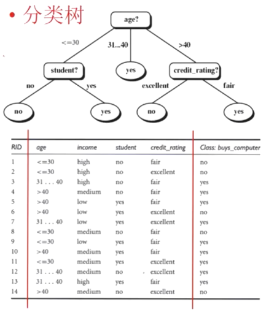
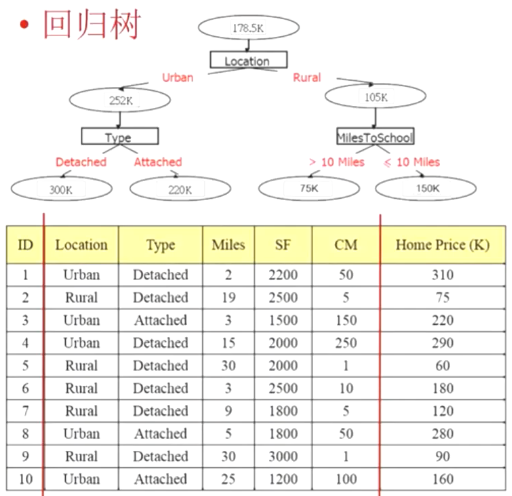

At start, all the training examples are at the root.
Partition examples recursively based on selected attributes.
- Attribute Selection (使得正确率会最高): Favoring the partitioning which makes the majority of examples belong to a single class.
- Tree Pruning (Overfitting Problem): Aiming at removing tree branches that may lead to errors when classifying test data.
- Training data may contain noise,...

| Eye | Hair | Height | Oriental |
| --- | --- | --- | --- |
| Black | Black | Short | Yes |
| Black | White | Tall | Yes |
| Black | White | Short | Yes |
| Black | Black | Tall | Yes |
| Brown | Black | Tall | Yes |
| Brown | White | Short | Yes |
| Blue | Gold | Tall | No |
| Blue | Gold | Short | No |
| Blue | White | Tall | No |
| Blue | Black | Short | No |
| Brown | Gold | Short | No |

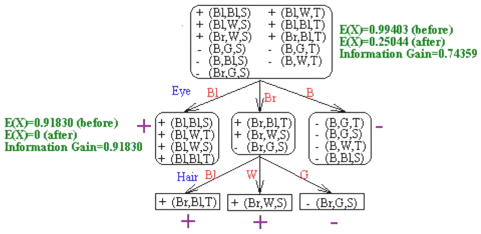
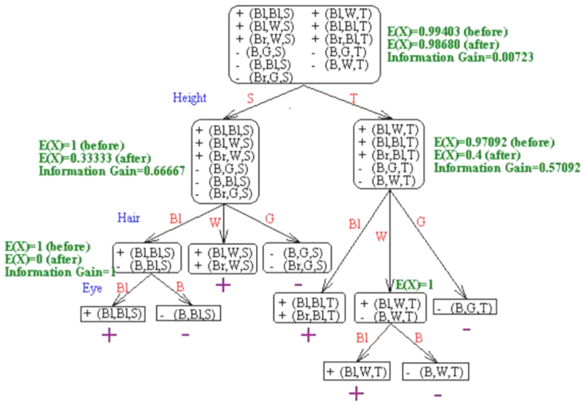 

## 属性选择

- Atribute Selection (Split Criterion) 
    - Information Gain (ID3) 
    - Gain Ratio (C4.5/ C5.0) 
    - Gini Index (CART) 
    - Chi-Square Statistic (CHAID).
- These measures are also called goodness functions and used to select the attribute to split at a tree node during the tree generation phase.

|ID|age|income|student|credit_rating|Class: buys_computer|
|----|----|----|----|----|----|
|1|<=30|high|no|fair|no|
|2|<=30|high|no|excellent|no|
|3|31...40|high|no|fair|yes|
|4|>40|medium|no|fair|yes|
|5|>40|low|yes|fair|yes|
|6|>40|low|yes|excellent|no|
|7|31...40|low|yes|excellent|yes|
|8|<=30|medium|no|fair|no|
|9|<=30|low|yes|fair|yes|
|10|>40|medium|yes|fair|yes|
|11|<=30|medium|yes|excellent|yes|
|12|31...40|medium|no|excellent|yes|
|13|31...40|high|yes|fair|yes|
|14|>40|medium|no|excellent|no|

计算信息熵(Entropy), 接近1表示平均分布, 接近0表示不均匀. 越不均匀越好, 因为可以全猜某一类.
$I(s_1,s_2)=I(9,5)=-\frac{9}{14}log_{2}\frac{9}{14}-\frac{5}{14}log_{2}\frac{5}{14}=0.940$

Next, we need to compute the entropy of each attribute. Let's start with the attribute age. We need to look at the distribution of yes and no samples for each value of age. We compute the expected information for each of these distributions.

$For age = " <=30 ":$ $i_{11}=2$ $s_{21}=3$ $I\left(s_{11}, s_{21}\right)=0.971$ 

$For age = " 31... 40 ":$ $s_{12}=4$ $s_{22}=0$ $I\left(s_{12}, s_{22}\right)=0$

$For age = " >40 ":$ $s_{13}=3$ $s_{23}=2$ $I\left(s_{13}, s_{23}\right)=0.971$

the expected information needed to classify a given sample

$E(age)=\frac{5}{14}I\left(s_{11},s_{21}\right)+\frac{4}{14}I\left(s_{12},s_{22}\right)+\frac{5}{14}I\left(s_{13},s_{23}\right)=0.694$

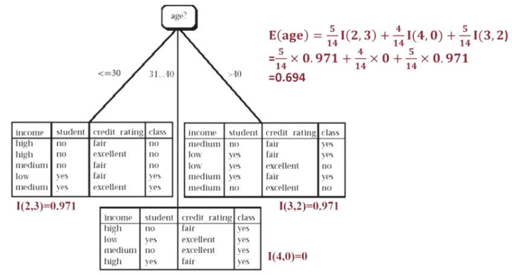

Hence, the gain in information from such a partitioning would be 

$Gain(age)=I\left(s_{1},s_{2}\right)-E(age)=0.246$. Information Gain. 

Similarly, we can compute $Gain(income)=0.029$, $Gain(student)=0.151$, and $Gain(credit rating)=0.048$. Since age has the highest information gain among the attributes, it is selected as the test attribute. A node is created and labeled with age, and branches are grown for each of the attribute's values. The samples falling into the partition for age="31...40" all belong to the same class. Since they all belong to class yes, a leaf should therefore be created at the end of this branch and labeled with yes.

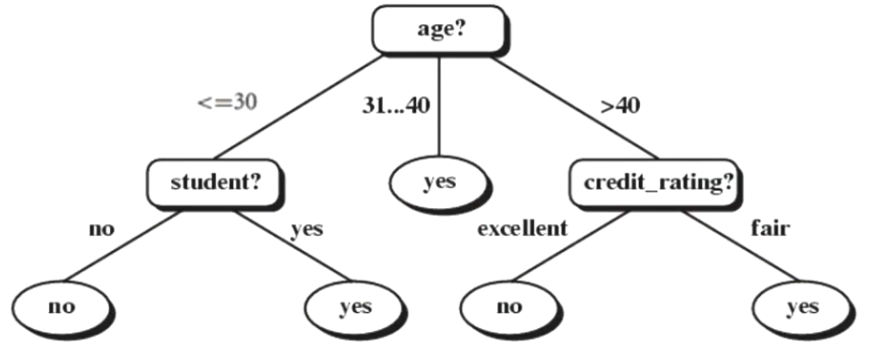

缺点: 

- Prefer Attributes with many values.

    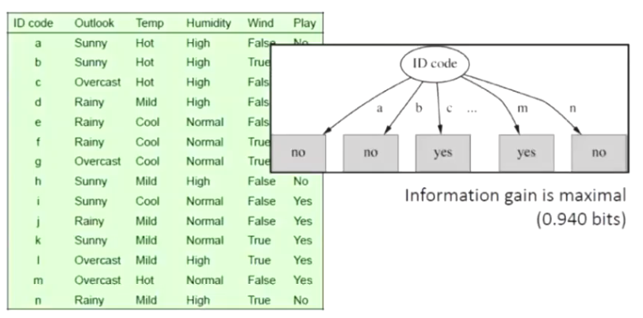

- All attributes are assumed to be categorical (discretized). It cannot handle continuous attributes.
- It cannot handle missing attribute values.
- It did not prune the tree for handling noises.

## C4.5

获利比例, 解决喜欢值多的属性

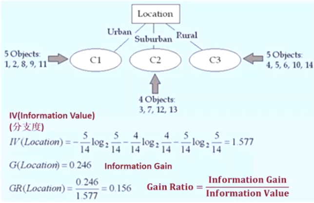
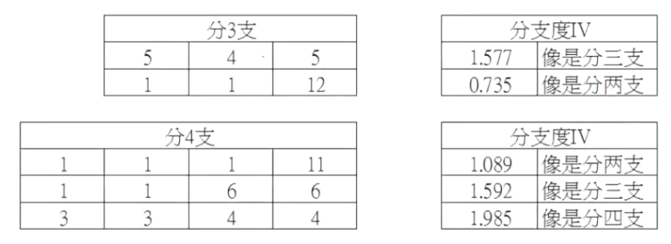

处理连续变量

1. Sort attribute values in ascending order v_1, v_2... (assume there exist n values for the continuous attribute A).
2. Perform exhaustive binary partition at each mid-point (i.e. (v_i + v_{i+1})/2).
3. For each mid-point p, calculate the entropy of the partial tree if A is partitioned at the mid-point (i.e., A <= p and A > p).
4. Select the best partition point (i.e. resulting in the maximum information gain or gain-ratio) for A.

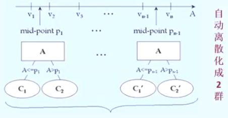

Select the best partition point for A that results in the maximum information gain or gain-ratio.

|Magazine Promotion|Watch Promotion|Life Insurance Promotion|Credit Card Insurance|Age|Sex|
|----|----|----|----|----|----|
|Yes|No|No|No|45|Male|
|Yes|Yes|Yes|Yes|40|Female|
|No|No|No|No|42|Male|
|Yes|Yes|Yes|Yes|30|Male|
|Yes|No|Yes|No|38|Female|
|No|No|No|No|55|Female|
|Yes|Yes|Yes|Yes|35|Male|
|No|No|No|No|27|Male|
|Yes|No|No|No|43|Male|
|Yes|Yes|Yes|No|41|Female|

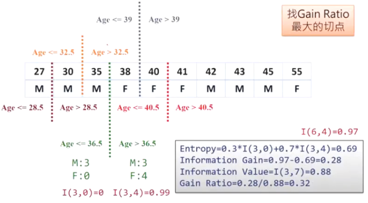

分类树剪枝(TreePruning)-Avoid Overfitting Problem

两种做法：
1. 修剪法/悲观剪枝 Buttom-Up (C4.5/CART)；
2. 盆栽法/预剪枝 Top-Down(CHAID)。

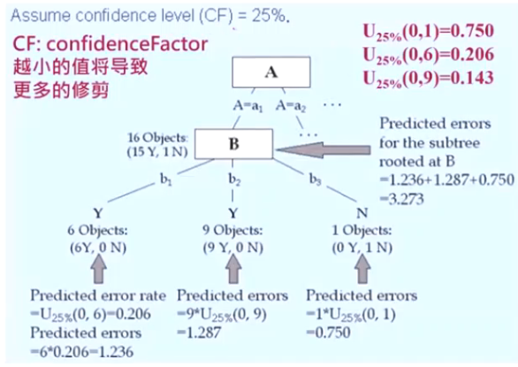
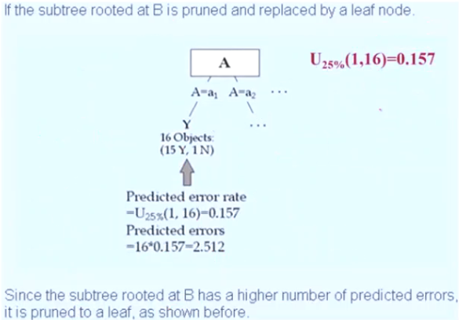

估计节点错误率的公式

$$
e = \frac{f+\frac{z^2}{2N}+z\sqrt{\frac{f}{N} - \frac{f^2}{N} + \frac{z^2}{4N^2} }}{1 + \frac{z^2}{N}}
$$

1. N is the number of examples.（N 是示例数量。）
1. E is the number of errors.（E 是错误数量。）
1. f = E/N is the observed error rate.（f = E/N 是观察到的错误率。）
1. z is the number of standard deviations corresponding to the confidence c, which for c = 25% is z = 0.69.（z 是对应置信度 c 的标准偏差数量，当 c = 25%时，z = 0.69。）
1. e is the estimated error rate.（e 是估计错误率。）

## cart

分类树算法-CART(Classification and Regression  Tree)

- 分类回归树 - CART (Classification and Regression Tree)算法是一种建构二元(Binary)分类回归树的算法。
- 它在1984年由 Breiman, Friedman, Olshen 与 Stone 四人所提出 
- CART 算法。
    - Attribute Selection 是以 Gini Index 作为评估指标。
    - Tree Pruning 是以 Bottom-Up 的方式配合验证数据集(Validation Dataset)来进行。

|编号|道路距离(单位:m)|人口密度|区域类别|捷运车站|Target 是否设立便利商店|
|----|----|----|----|----|----|
|1|<=30|高|住宅区|有|No|
|2|<=30|高|住宅区|没有|No|
|3|31~40|高|住宅区|有|Yes|
|4|>40|中|住宅区|有|Yes|
|5|>40|低|商业区|有|Yes|
|6|>40|低|商业区|没有|No|
|7|31~40|低|商业区|没有|Yes|
|8|<=30|中|住宅区|有|No|
|9|<=30|高|商业区|有|Yes|
|10|>40|中|商业区|有|Yes|
|11|<=30|中|商业区|没有|Yes|
|12|31~40|中|住宅区|没有|Yes|
|13|31~40|高|商业区|有|Yes|
|14|>40|中|住宅区|没有|No|

未选择属性钱的Gini =1-(9²/14+5²/14)=0.459。靠近0是偏某一类, 靠近0.5是平均分布. 相比熵计算, 更简单, 因为没有对数.

$$
Gini(A_i) = 1 - \sum_{j=1}^n p_j^2
$$

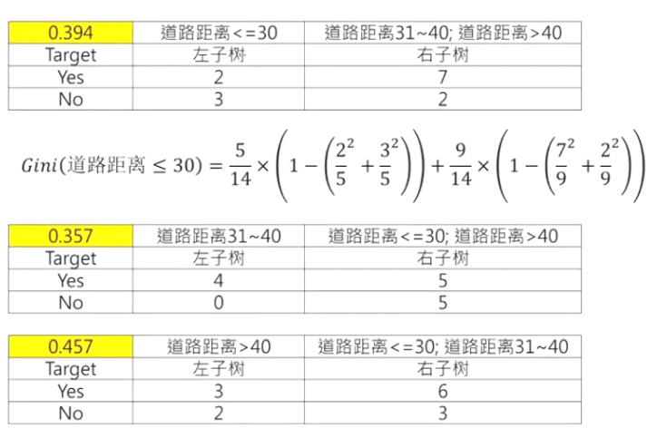

Gini(道路距离≤30)=$\frac{5}{14}×(1 - (\frac{2²}{5}+\frac{3²}{5}))+\frac{9}{14}×(1 - (\frac{7²}{9}+\frac{2}{9}))$。

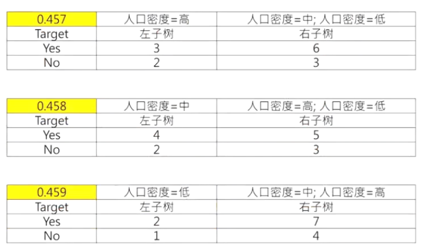

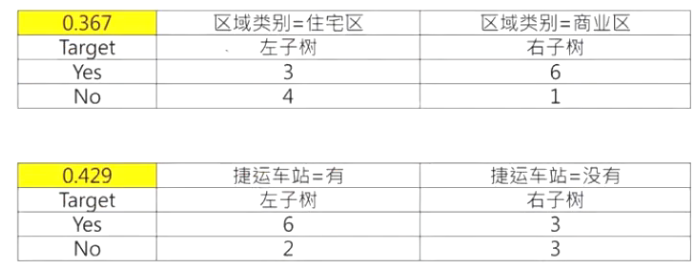

未选择属性钱的Gini =1-(9²/14+5²/14)=0.459

|属性条件|Gini Index|Gini Gain|
|----|----|----|
|道路距离<=30|0.394|0.065|
|`道路距离 31~40`|0.357|0.102|
|道路距离>40|0.457|0.002|
|人口密度=高|0.457|0.002|
|人口密度=中|0.458|0.001|
|人口密度=低|0.459|0.000|
|区域类别|0.367|0.092|
|捷运车站|0.429|0.030|

Gini - Gini Index = Gini Gain

Gini Gain越大越好

第一层分类树

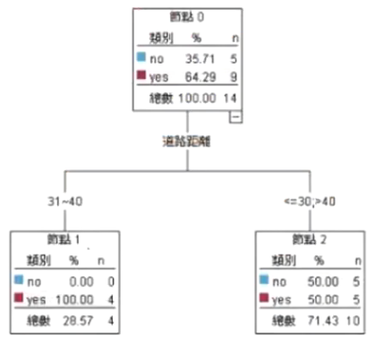

第二层分类树

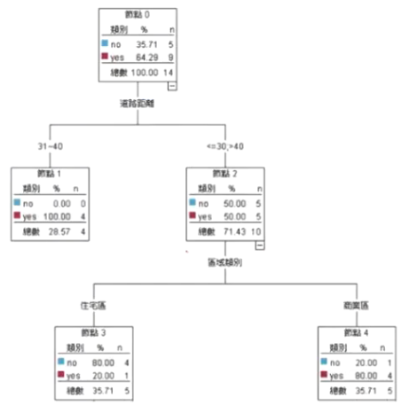

全部分类树

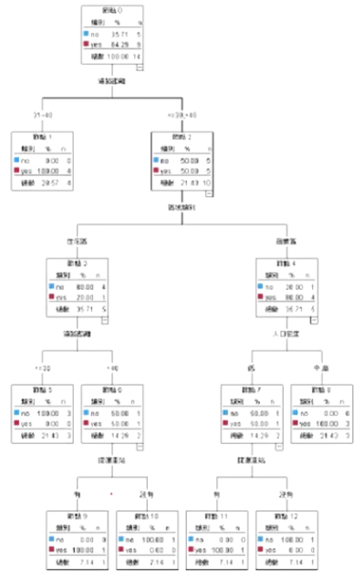

cart的剪枝方法

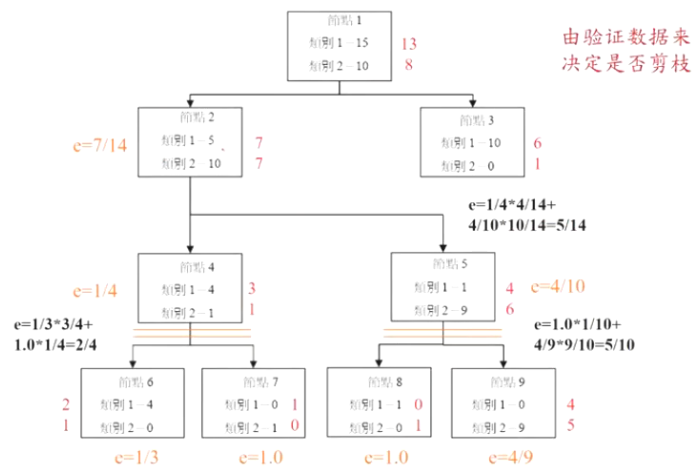
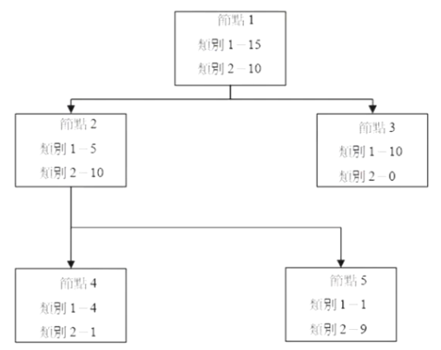

CART处理连续型变量

## CHAID分类树算法

必须是分类变量

|编号|道路距离(单位:m)|人口密度|区域类别|捷运车站|Target 是否设立便利商店|
|----|----|----|----|----|----|
|1|<=30|高|住宅区|有|No|
|2|<=30|高|住宅区|没有|No|
|3|31~40|高|住宅区|有|Yes|
|4|>40|中|住宅区|有|Yes|
|5|>40|低|商业区|有|Yes|
|6|>40|低|商业区|没有|No|
|7|31~40|低|商业区|没有|Yes|
|8|<=30|中|住宅区|有|No|
|9|<=30|高|商业区|有|Yes|
|10|>40|中|商业区|有|Yes|
|11|<=30|中|商业区|没有|Yes|
|12|31~40|中|住宅区|没有|Yes|
|13|31~40|高|商业区|有|Yes|
|14|>40|中|住宅区|没有|No|

字段选择方法-卡方统计量

- CHAID: Use chi-square statistics (x² Statistics) for attribute selection.
- Please use CHAID in the AlIElectronics customer database to select the most important attribute for the first level of the decision tree.

x² 值越大（p 值越小），代表此条件字段与目标字段的关系越密切，越是重要的条件字段。

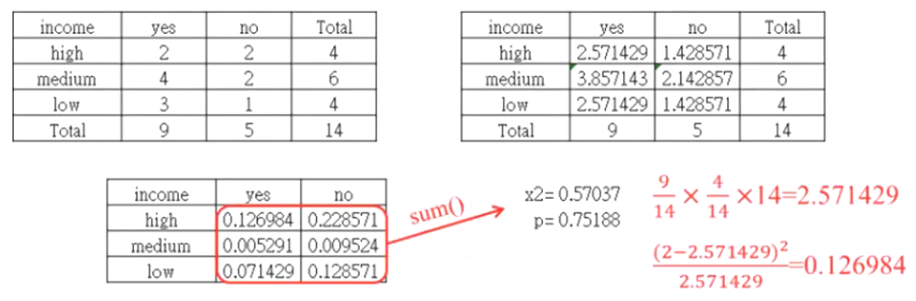

age（年龄）- `x² = 3.54667` - p = 0.16977；
income（收入）- x² = 0.57037 - p = 0.75188。
student（学生）- x² = 2.80000 - p = 0.09426；
credit_rating（信用评级）- x² = 0.93333 - p = 0.33400。

CHAID根据`p-Value决定树是否继续往下长`，是属于Top-Down的剪枝方法

## CART回归树算法

1. Regression trees differ from classification trees in that they have values rather than classes at the leaves.
2. CART (Classification and Regression Tree) was proposed by Breiman, Friedman, Olshen, and Stone in 1984. 
    1. There are constant numerical values in the leaves. 
    1. Variance is used as an impurity measure.
1. M5 was proposed by Quinlan in 1992. 
    1. A linear model is used in the leaves to improve the accuracy of the tree (Model Tree).
    1. Standard deviation is used as an impurity measure.

房价预测:

|ID|Location|Type|Miles|SF|CM|Home Price (K)|
|----|----|----|----|----|----|----|
|1|Urban|Detached|2|2200|50|310|
|2|Rural|Detached|19|2500|5|75|
|3|Urban|Attached|3|1500|150|220|
|4|Urban|Detached|15|2000|250|290|
|5|Rural|Detached|30|2000|1|60|
|6|Rural|Detached|3|2500|10|180|
|7|Rural|Detached|9|1800|5|120|
|8|Urban|Attached|5|1800|50|280|
|9|Rural|Detached|30|3000|1|90|
|10|Urban|Attached|25|1200|100|160|

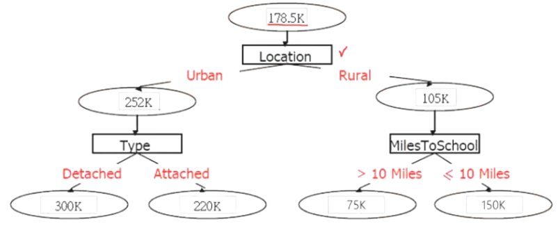

节点使用线性回归
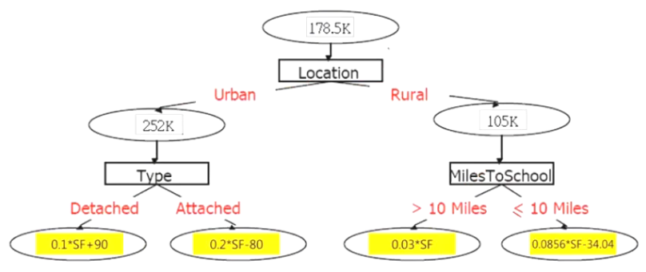

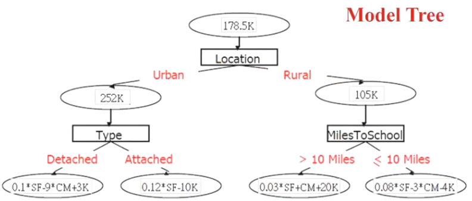

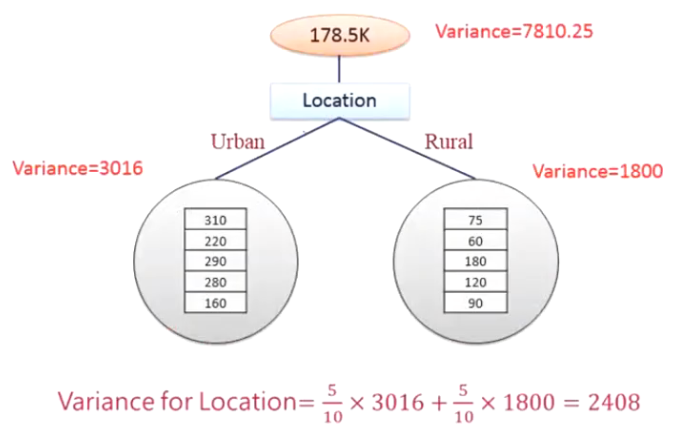

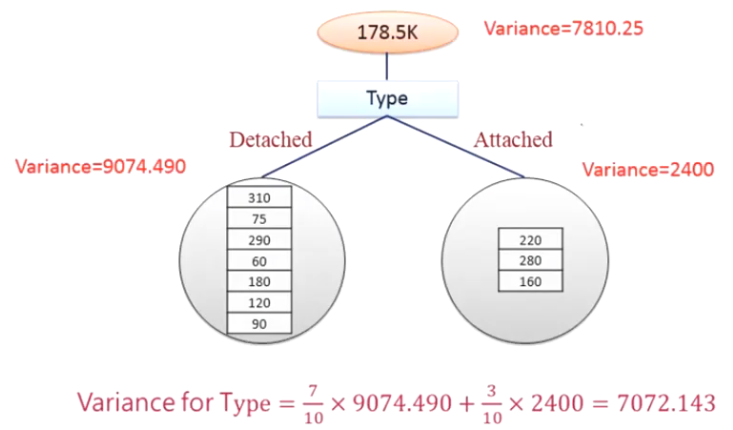

## PRISM决策规则算法

Directly - 
1. Test the attribute value of unknown sample against the tree 
2. A path is traced from root to a leaf which holds the label

Indirectly -
1. Decision tree is converted to classification rules
2. One rule is created for each path from the root to a leaf

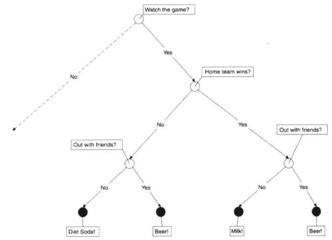

- There are 4 decision rules are generated by the tree:
    - `Watch the game and home team wins and out with friends then bear.`
    - Watch the game and home team wins and sitting at home then milk.
    - `Watch the game and home team loses and out with friend then bear.`
    - Watch the game and home team loses and sitting at home then diet soda.
- Optimization for these rules:
    - `Watch the game and out with friends then bear.`
    - Watch the game and home team wins and sitting at home then diet soda.
    - Watch the game and home team loses and sitting at home then milk.

PRISM: A Simple Bottom-upCoveringg Algorithm for Creating Rules

|Object|Height|Hair|Eyes|Class|
|----|----|----|----|----|
|01|short|blond|blue|C1|
|02|short|blond|brown|C2|
|03|tall|red|blue|C1|
|04、05|tall|dark|blue|C2|
|06|tall|blond|blue|C1|
|07|tall|dark|brown|C2|
|08|short|blond|brown|C2|

Generate Rules for C1

|ax |C1 (instances)|$S_{a_x}$|p(C1\|α_x )|
|----|----|----|
|Height=short|{1}|{1,2,8}|1/3 = 0.333|
|Height=tall|{3,6}|{3,4,5,6,7}|2/5 = 0.4|
|Hair=blond|{1,6}|{1,2,6,8}|2/4 = 0.5|
|Hair=red|{3}|{3}|1/1 = 1|
|Hair=dark|{4,5,7}|{4,5,7}|0|
|Eyes=blue|{1,3,6}|{1,3,4,5,6}|3/5 = 0.6|
|Eyes=brown|{2,7,8}|{2,7,8}|0|

Calculate p(C1|Hair = blond)

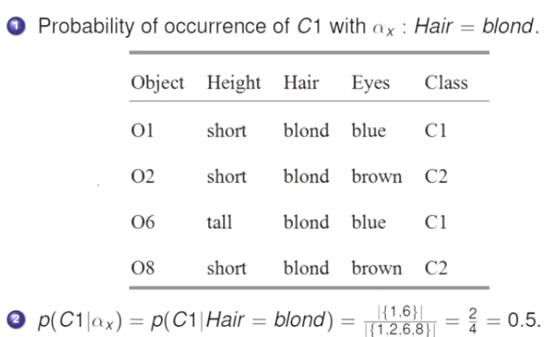

Output the Rule 1

1. Output the Rule 1 : Hair = red → C1
2. Delete Object3 from S

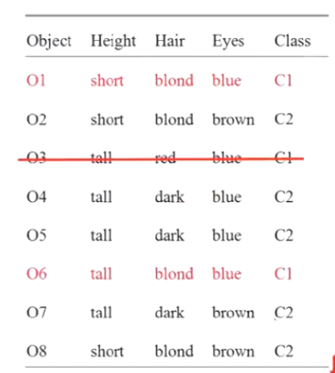

Repeat to Find the Rule 2 aboutt C1

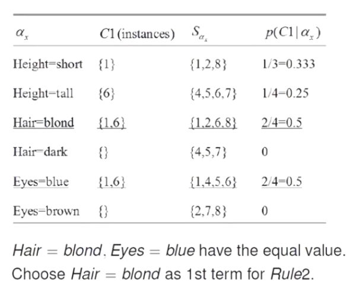

The Second Term of Rule 2 aboutt C1

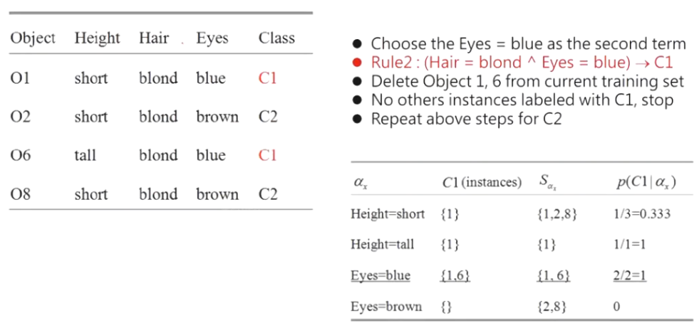

Result Comparisons for PRISM & ID3

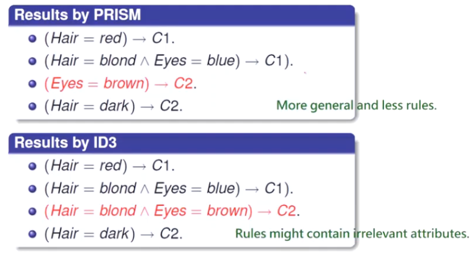

Result Comparisons for PRISM & ID3
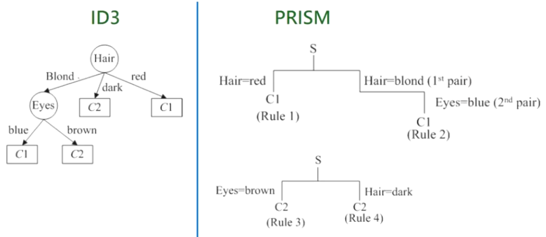

