1. 神经网络概述
1. 感知机 (Perceptron) 及感知机的极限
1. 多层感知机 (Multi-Layer Perceptron)
1. BP 神经网络
    1. 神经元的组成 1: 组合函数 (Combination Function)
    2. 神经元的组成 2: 激活函数 (Activation Function)
    3. BP 神经网络如何传递信息
    4. BP 神经网络如何修正权重值及常数项
    5. BP 神经网络与逻辑回归、线性回归及非线性回归间的关系

- 深度学习概述
- 深度神经网络（Deep Neural Networks，DNN）
- 卷积神经网络（Convolutional Neural Networks，CNN）
- 递归神经网络（Recurrent Neural Networks，RNN）

## 感知机Perceptron

感知机是美国研究人员 Rosenblatt 在 1957 年提出的。

为什么现在还要学习这么久以前的算法？原因在于，感知机可以说是造就神经网络（深度学习）的算法。

因此，学习感知机的架构，等于在学习神经网络或深度学习的重要概念。

使用感知机，也能建立计算机。

感知机是收到多个输入信号之后，再当作一个信号输出。

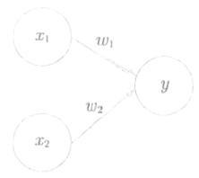

1. x1、x2 是输入信号，y 是输出信号，w1、w2 代表权重，w 是 weight 的缩写。
1. 圆圈称作 “神经元” 或 “节点”.
1. 输入信号传送到神经元时，将分别乘上原有的权重（w1×x1、w2×x2）。
1. 接下来神经元会计算传送过来的信号总和。唯有当总和超过一定数值时，才输出 1，否则输出 0，这个数值一般称之为临界值，以符号 θ 表示。

若用算式来显示上述内容，可以变成以下式子

$$
y = 

0 (w_1x_1 + w_2x_2 <= \theta)
1 (w_1x_1 + w_2x_2 > \theta)

$$

权重是控制各信号重要性的元素，权重愈重，对应该权重的信号重要性愈高

单纯的逻辑电路-ANDGate

以感知机来表现AND Gate这里要执行的工作是，决定w1、w2、0的值，以满足右图的真值表
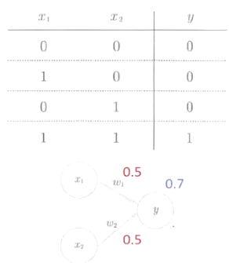

事实上，挑选满足右图的参数方法有无限多种

例如，当(w1, w2, 0)=(0.5,0.5,0.7)时会满足右图的条件
当(0.5,0.5,0.8)及(1.0,1.0,1.0)也同样满足了ANDGate的条件

单纯的逻辑电路-NAND(not and)／ORGate

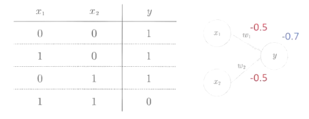

这三种Gates只有参数(权重与临界值)不同而已，只要适当调整参数，就能像百变明星饰演各种角色般，变身成不同的Gates

感知机的极限-XOR

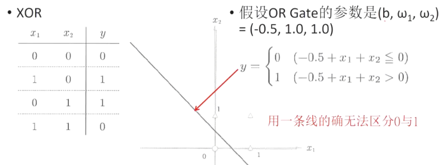

感知机的极限只能解决线性问题.

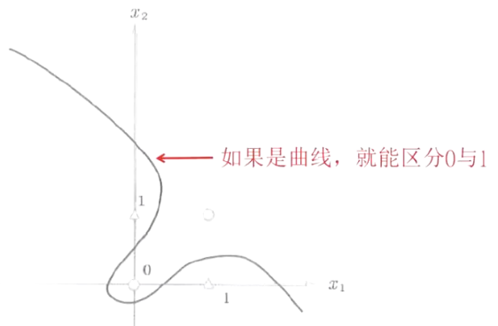

多层感知机(Multi-Layer Perceptron)

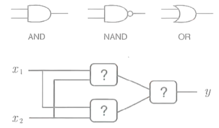

单层感知机无法实现XOR，或分离非线性区域但多层感知机就可实现XOR

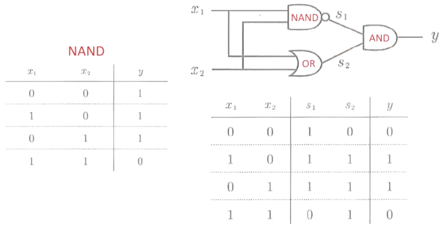

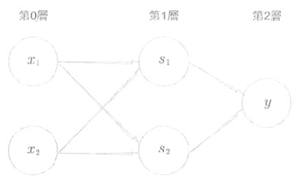

总结:

1. 感知机是具有输入和输出的算法。
1. 给予输入之后，就会输出一定的值。
1. 感知机可以将 “权重” 与 “偏置项” 当作参数来设定。
1. 使用感知机，可以表现 AND Gate 与 OR Gate 等逻辑电路。
1. XOR 无法用单层感知机来实现。
1. 使用双层感知机，可以表现 XOR Gate。
1. 相对于单层感知机只能表现线性区域，多层感知机能表现非线性区域。
1. 多层感知机（理论上）可以实现计算机。

## 神经网络
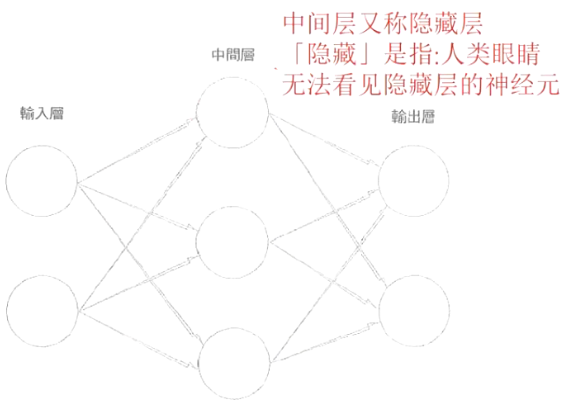

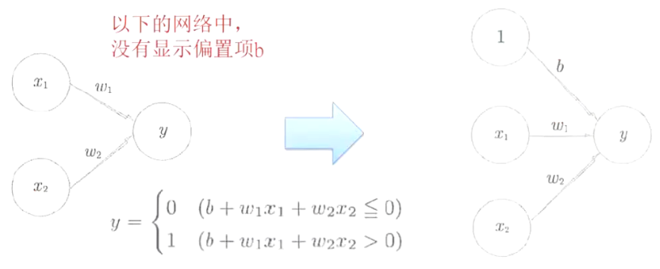

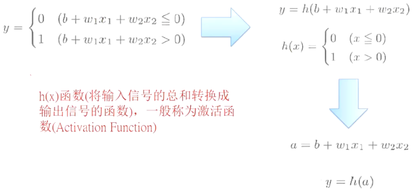

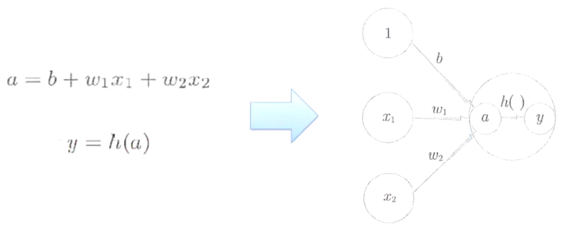

激活函数若是以临界值为分界来转换输出的函数，则称之为「阶梯函数(StepFunction)或「阶跃函数」

之前的感知机使用的是激活函数就是阶梯函数

激活函数:
Step Function: 感知机采用, 不是连续可微分, 所以不能反向传播
Sigmoid Function: BP神经网络采用
ReLU Function: 深度学习采用

Sigmoid VS Step Fun.

1. Sigmoid函数是平滑曲线，针对输入产生连续性的输出；阶梯函数是以0为界线，明确改变输出
1. 学习神经网络时，Sigmoid函数的平滑度具有重要的意义
1. 在感知机中，传递着0或1这两个值的信号；但在神经网络中，传递的是连续性的实数信号

1. 阶梯函数与Sigmoid函数还有其他共通点，就是两者皆为非线性函数. Sigmoid函数是曲线，阶梯函数是像楼梯一样曲折的直线，因此都归类于非线性函数
1. 线性函数用算式表示为h(x)=cx (c是定数). 因此，线性函数会成为一条直线
1. 神经网络必须使用激活函数中的非线性函数，因为，如果使用了线性函数，增加神经网络的层数就变得毫无意义了

使用线性函数, 无法发挥多层结构的优点如果要获得层迭的好处，就得使用激活函数中的非线性函数

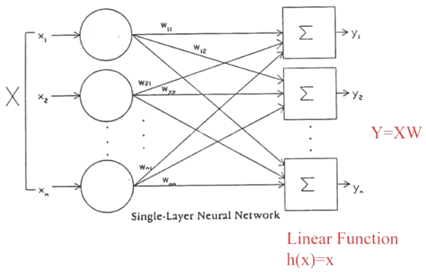
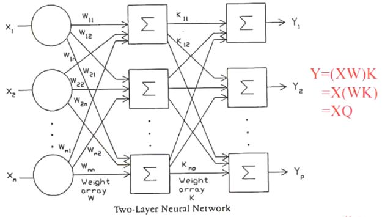

输出层的设计
1. 神经网络可以用来解决分类问题与回归问题
2. 但解决分类问题或回归问题时，必须改变输出层的激活函数
3. 回归问题可使用恒等函数(h(x)=x)或Sigmoid函数
4. 分类问题可使用的是Softmax函数(分多类)或Sigmoid函数(分两类)

softmax函数

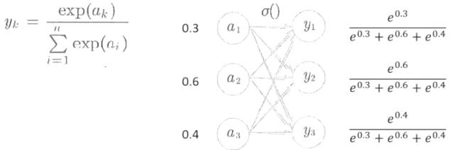

## Back Propagation(BP) Neural Networks
反向传播神经网络
又称为多层感知机/Multi-LayerPerceptrons(MLP)

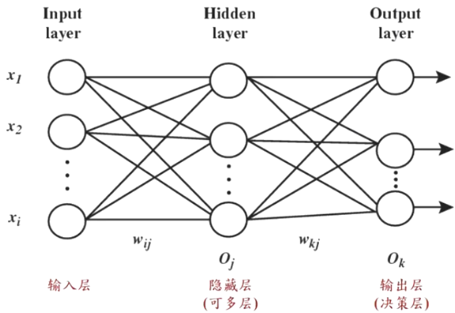

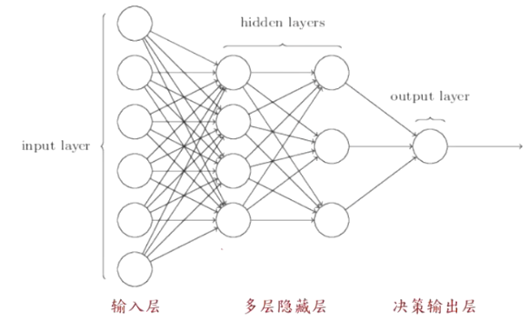

2层和1个输出节点无隐藏层
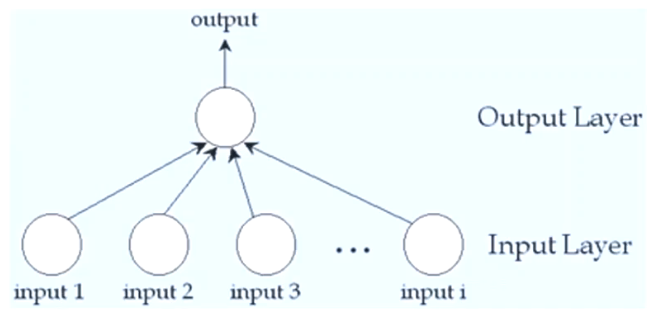

3层和1个输出节点1隐藏层

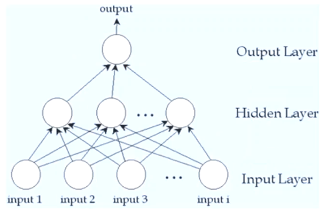

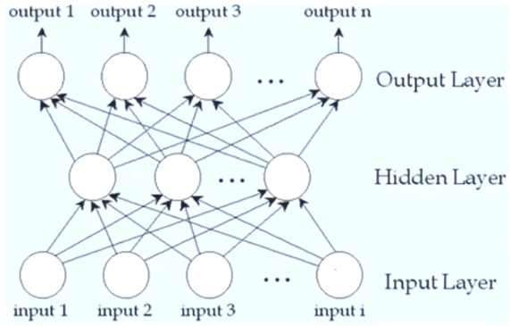

杂志喜好预测范例

✨输入最好是0~1之间, 因为激活函数sigmoid是0~1
✨喜好是标签问题, 所以用多个sigmoid输出
✨隐藏层节点数 <= $\sqrt{输入层节点数 * 输出层节点数}$, 本例中$\sqrt{9*5}$=6, 所以试用6, 5, 4, 3看效果选择

手写数字识别范例

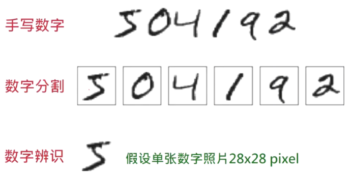 

✨这个是分类问题, 所以输出层是softmax

神经网络步骤

1. Constructing a network
    1. input data representation
    2. selection of number of layers, number of nodes in each layer
2. Training the network using training data
    1. The ultimate objective of training
    2. Obtain a set of weights that makes almost all the tuples in the training data classified correctly
3. Interpret the results.

正向传播/Forward1Pass

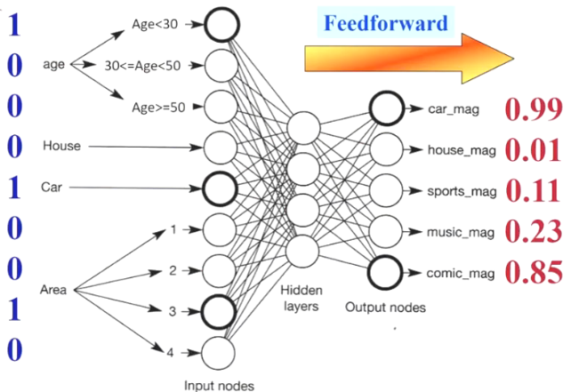

神经元(Neuro, Processing Unit)

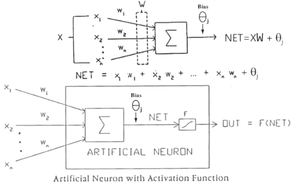
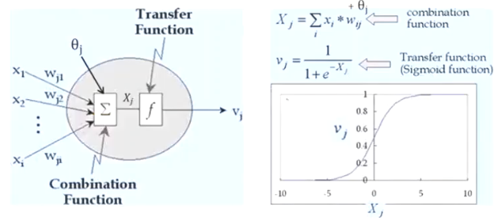

前向传播

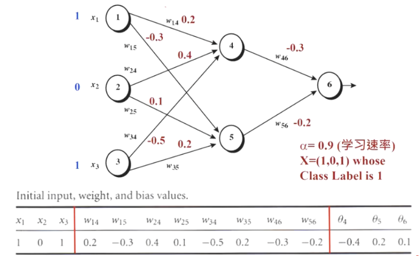

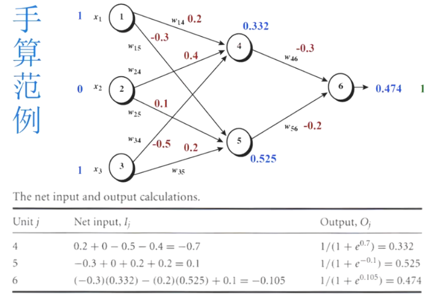

逆向权重及偏置项修正BackwardTraining
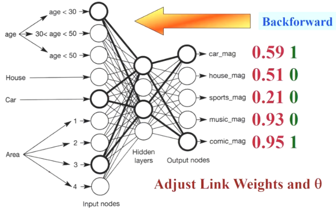

- Initial weights are set randomly（初始权重随机设置）。
- Input tuples are fed into the network one by one（输入元组逐个输入到网络中）。
- Activation values for the hidden nodes are computed（计算隐藏节点的激活值）。
- Output vector can be computed after the activation values of all hidden node are available（在所有隐藏节点的激活值可用后，可以计算输出向量）。
- Weights are adjusted using Error（使用误差调整权重）。
- Error = desired output - actual output =∑j(Tj - Oj)²（误差=期望输出-实际输出=∑j(Tj - Oj)²）。

计算每个node的值
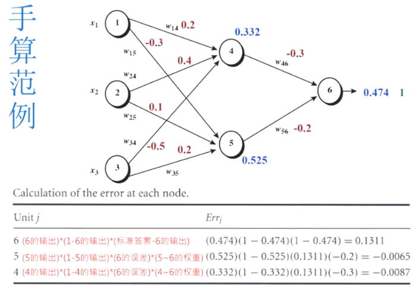

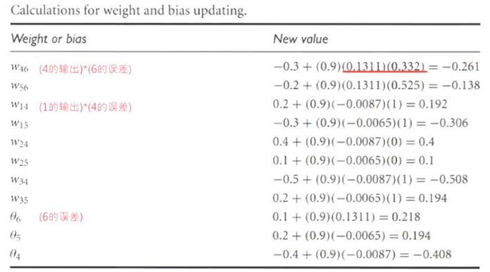

## 数值型字段的数据预处理

极值标准化
1. Input attribute values need to be standardized into the range between 0 and 1.
2. If the input attribute is continuous values or ordinal (ordered, discrete values), the value (x_i ) of this attribute is standardized as:

standardized xᵢ = (xᵢ - minimum) / (maximum - minimum)

## 类别型字段的数据预处理

- If the input attribute is a categorical one, the following schemes can be taken.（如果输入属性是分类属性，可以采用以下方案。）
- Distributed (binary) coding scheme.（分布式（二进制）编码方案。）✨不建议
    lf the input attribute assumes four possible values (say, a1, a2, a3, and a4), two input nodes are required (e.g., 00 for a1, 01 for a2,10 for a3, and 11 for a4).（如果输入属性有四个可能的值（比如 a1、a2、a3 和 a4），则需要两个输入节点（例如，a1 为 00，a2 为 01，a3 为 10，a4 为 11）。）
- 1-of-N coding scheme.（1-of-N 编码方案。）
    One input node is used for each value (e.g., 0001 for a1,0010 for a2,0100 for a3, and 1000 for a4).（每个值使用一个输入节点（例如，a1 为 0001，a2 为 0010，a3 为 0100，a4 为 1000）。）
- 1-of-N-1 coding scheme.（1-of-N-1 编码方案。）
    N - 1 input nodes are used for an attribute with N possible values (001 for a1,010 for a2, 100 for a3, and 000 for a4).（对于具有 N 个可能值的属性，使用 N - 1 个输入节点（例如，a1 为 001，a2 为 010，a3 为 100，a4 为 000）。）

## 数据预处理

- Since the Sigmoid function only generates a value between 0 and 1, the output needs to be encoded into the range between 0 and 1.（由于 Sigmoid 函数仅生成 0 到 1 之间的值，所以输出需要被编码到 0 到 1 的范围内。）
- If the output of a training example is a continuous value, one output node is sufficient and the standardization is needed.（如果训练示例的输出是连续值，一个输出节点就足够了，并且需要进行标准化。）
- If the output is one from two possible classes (e.g., high loyalty or low loyalty), you can encode the output with one node (e.g., 1 for high loyalty and 0 for low loyalty) or two nodes (e.g., 10 for high loyalty and 01 for low loyalty).（如果输出是两个可能类别中的一个（例如，高忠诚度或低忠诚度），可以用一个节点（例如，高忠诚度为 1，低忠诚度为 0）或两个节点（例如，高忠诚度为 10，低忠诚度为 01）对输出进行编码。）
- If the output is one from N possible classes (e.g., a customer's preference can be classical, rock & roll, jazz, or country music), 1-of-N coding scheme is usually adopted (e.g., 1000 for classical, 0100 for rock & roll, 0010 for jazz, and 0001 for country).（如果输出是 N 个可能类别中的一个（例如，客户的偏好可以是古典音乐、摇滚、爵士或乡村音乐），通常采用 1-of-N 编码方案（例如，古典音乐为 1000，摇滚为 0100，爵士为 0010，乡村音乐为 0001）。）

✨黄色中Default字段使用1个节点, 用sigmoid. 蓝色中Default1, Default2使用2个节点, 用softmax.
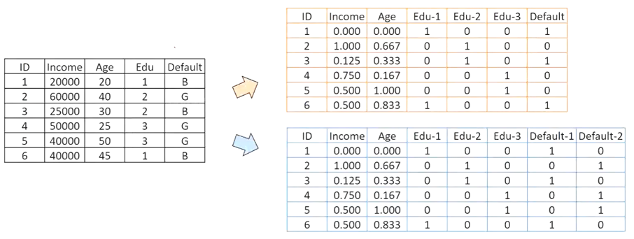

✨编码过后的值要进行还原

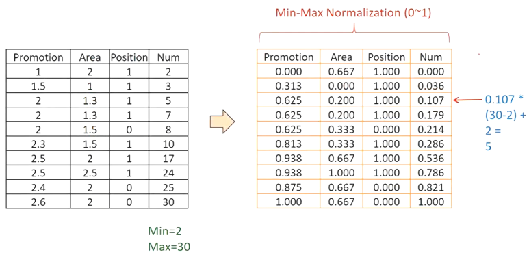

神经网络-线性回归-逻辑回归

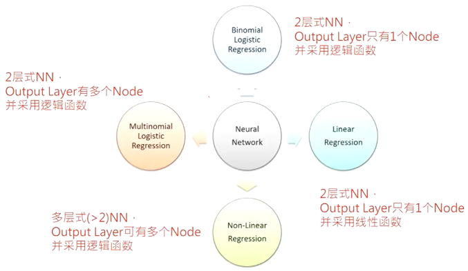

神经网络总结:
- Advantages（优点）：
    - The prediction accuracy is generally high.（预测准确率通常较高。）
    - A fast evaluation can be done.（可以进行快速评估。）
- Disadvantages（缺点）：
    - It has a long training time in general.（通常训练时间较长。）
    - It is difficult to understand the learned weights (black box).（难以理解学习到的权重（黑箱）。）

