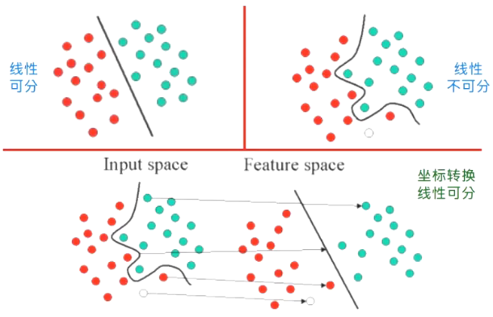
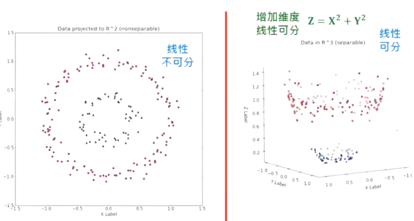
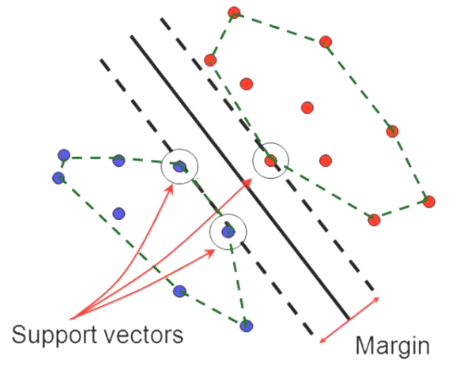
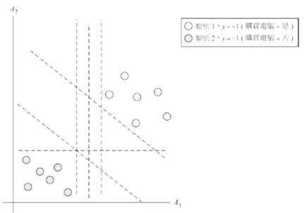
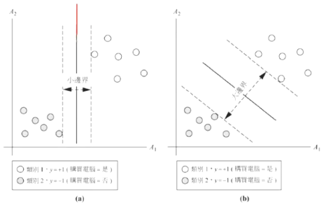
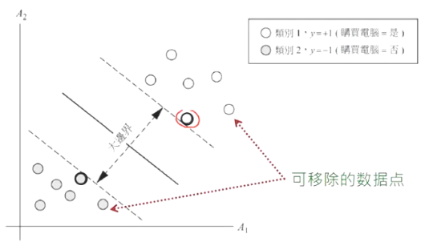
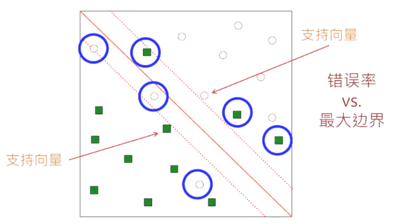
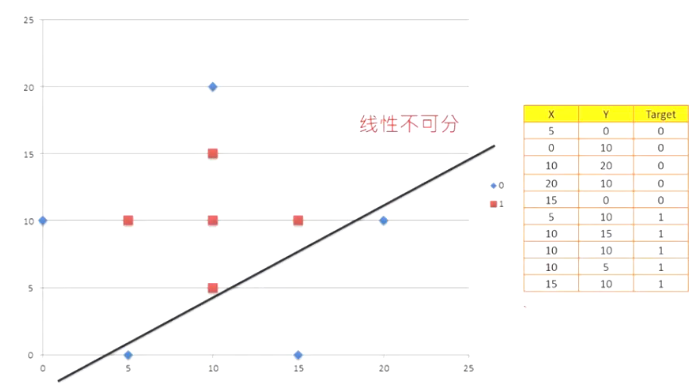
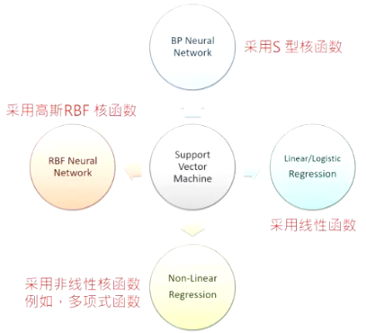

- 支持向量机概述
- 线性可分及不可分的问题
- 线性可分的支持向量机
    - 支持向量
    - 最佳的线性分割超平面及决策边界
- 线性不可分的支持向量机
    - 非线性转换
    - 核函数（Polynomial Kernel、Gaussian Radial Basis Function、Sigmoid Kernel）
- 支持向量机与神经网络间的关系
- 处理两类以上的分类问题

## 支持向量机概述

- 支持向量机（Support Vector Machine, SVM）是一种知名的二元线性/非线性分类方法，由俄罗斯的统计学家 Vapnik 等人所提出。
- 它使用一个非线性转换（Nonlinear Transformation）将原始数据映射（Mapping）至较高维度的特征空间（Feature Space）中。
- 然后在高维度特征空间中，它找出一个最佳的线性分割超平面（Linear Optimal Separating Hyperplane）来将这两类的数据分割开来。

## 线性可分与线性不可分

多项式坐标转换

## 决策边界与支持向量

1. 此分割超平面也可称为决策边界（Decision Boundary）。
1. 通过适当的非线性转换，可以将数据映射至足够高维度的特征空间，这两个类别的数据在高维度特征空间中通常能被一个超平面分隔开来。
1. SVM 利用支持向量（Support Vector）作为建构分割超平面的重要数据；而最佳的超平面系指边界（Margin）最大化的超平面。

## 线性支持向量机

由下图可以看出此数据集是线性可分的·我们可以划出一条直线来分开类别为+1与-1的数据

能够分割这两个类别的直线有无穷多条，我们希望找出其中最佳的一条分割直线·这条直线对于之前未见的数据，能够具有最小分类错误率的直线

## 最大边界超平面
1. 基本上，在训练阶段SVM将寻找具有最大边界的超平面(MaximumMarginal Hyper Plane)
2. 下图中显示两个可能的分割超平面与其对应的边界(Margin)
3. 图中的两个超平面都可以正确地分类所有给定数据，然而，我们预期有较大边界的超平面更能够正确地分类那些未知的数据
4. 这是因为边界最大的超平面，其对应的边界，能对这两类提供最大的分割度

## 支持向量

1. 支持向量(Support Vectors)落在边界的边缘上，它们是最难被分类的样本·把它分对就没有问题了
1. 下图中的支持向量用粗边圆圈表示
1. 一旦我们找到支持向量与最大边界超平面(MMH)，则此支持向量机就已经训练好了

支持向量是重要且关键的训练数据样本，因为它们最难被分类正确，如果能把它们分类正确，那么其余的训练值组也都可以被正确地分类. 换句话说, 如果我们移除支持向量以外的所有训练数据，并且再重新训练SVM，我们依然会得到相同的超平面

由于最大边界的超平面(MMH)是一个线性分界线，可用来分类线性可分割的数据，我们称此训练好的SVM分类器为线性SVM(Linear SVM)

SVM所学习得到的分类器，其复杂度取决于支持向量的数目，而不是数据的维度，因此SVM一般不会有过拟合的问题. 它能在建模之前先选择适当样本(支持向量)，然后再建立模型

一个支持向量数量稀少的SVM分类器，即使面对数据的维度十分高时，其泛化能力(Generalization)仍然会很好

## 线性不可分的支持向量机

1. SVM可同时应用于分类与数值预测的问题
2. 数据为线性不可分，找不到一条直线能分开这两个类别，此时线性SVM在训练时找不到一个可行解，我们该怎么办呢？
    1. 容忍些许错误
    2. 将线性SVM延伸为非线性SVM

### 容许错误:

### 将线性SVM延伸为非线性SVM

要将线性SVM延伸至非线性SVM，有两个主要步骤

1. 使用一个非线性转换将原始数据映射至较高维度的特征空间(FeatureSpace)，此步骤中，有许多种常见的非线性转换可供选用
2. 在高维度特征空间中找出最佳的线性分割超平面。在此处我们同样使用线性SVM，而我们在高维度特征空间中找到的最大边界超平面(MMH)，对应至原来空间就是一个非线性分割超曲面(NonlinearSeparatingHypersurface)

以下范例，使用一个非线性转换将 3D 输入向量$×=(x_1,x_2,x_3)$映射至 6D 的特征空间 Z，映像方式为$z_1 = x_1,z_2 = x_2,z_3 = x_3,z_4=(x_1)^2,z_5 = x_1x_2,z_6 = x_1x_3$。

在特征空间的决策超平面为$d(Z)=WZ + b$，它在特征空间中为线性超平面，然而当它对应到原始 3D 空间时，它是一个非线性二次多项式决策函数。
$d(Z)=w_1z_1 + w_2z_2 + w_3z_3 + w_4z_4 + w_5z_5 + w_6z_6 + b$。
$d(Z)=w_1x_1 + w_2x_2 + w_3x_3 + w_4(x_1)^2 + w_5x_1x_2 + w_6x_1x_3 + b$。

SVM常用的核函数(KernelFunction)
1. 多项式转换(PolynomialKernel)
1. 高斯RBF转换(Gaussian Radial BasisFunction)
1. Sigmoid转换(Sigmoid Kernel)

## 支持向量机与神经网络间的关系

不同的核心函数的训练结果，会对应到输入空间上不同类型的非线性分类器

神经网络的爱用者会注意到，非线性SVM所找到的分类模型，与某些著名的神经网络所用的分类模型是一模一样的
1. SVM采用高斯RBF核函数(GaussianRadialBasisKernel)所找到的分类器与RBF神经网络相同
2. SVM采用s型核函数(SigmoidFunction)所找到的分类器等同于BP神经网络
3. 不同于BP神经网络通常会收敛至区域最佳解，SVM会找到全局最佳解(Global Solution)

## 处理两类以上的分类问题
1. 一个二元sVM分类模型，只能处理一个具有两种类别(2 Classes)的数据，怎么解决有六个类别的多元分类问题呢
1. 两种解决方法
    1. One-against-Rest:：一对多
    2. One-against-One:：一对一

一对多:

1. 这个策略的想法就是针对每一个类别，分别建立一个SVM，属于此类别的样本视为(+1)，其他类别的样本视为(-1)，如此一来，就转换成一个二元分类的问题了！

2. 以Glass的数据为例，数据中有六个类别，我们便会建立六个SVM

    1. 第一个SVM：属于类别1的资料为(+1)，其他类别为(-1)，这个SVM用来区别这两者
    1. 第二个SVM：属于类别2的资料为(+1)，其他类别为(-1)，这个SVM用来区别这两者
    1. 第三个SVM：属于类别3的资料为(+1)，其他类别为(-1)，这个SVM用来区别这两者
    1. 以此类推.

1. 换句话说，针对有$t$个类别的数据，就会存在着$t$个 SVM。
2. 当有一笔新资料要预测时，会分别丢进这$t$个 SVM，得到$t$组值$(v_1,V_2,V_3...v_t)$。再从中判别最大的值出现第几个位置，那这笔数据便是属于那一类。
3. 这样的做法很直观，而且运行时间与内存并不会消耗太多。
4. 但缺点是将“剩下类别”视为同一个类别$-1$的这种做法，很容易导致$(+1,-1)$之间的数据笔数差距很大，也就是类别不平衡的问题。

一对一:

1. 这个策略的想法很像高中数学的排列组合：从 T 种类别中任取 2 种类别，共会有$C(T,2)=T(T - 1)/2$组合。
2. 所以在这个策略底下，我们便会从多元类别的数据中，任选某两个类别（2 Classes）的数据，训练一个 SVM（只能区分这两个类别），并重复这样的动作，直到所有的类别组合都训练完成为止。
3. 因此，最后会有$T(T - 1)/2$个 SVM 模型。
4. 当有一笔新数据要预测时，会分别丢进这$T(T - 1)/2$个 SVM，每一个 SVM 都会将这笔数据分到某一类，就像是投票一样：该类别会记录 +1，最后判断哪一个类别获得最多票数，即可预测这笔数据属于哪一个类别。

