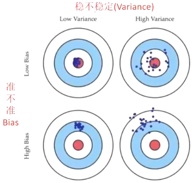
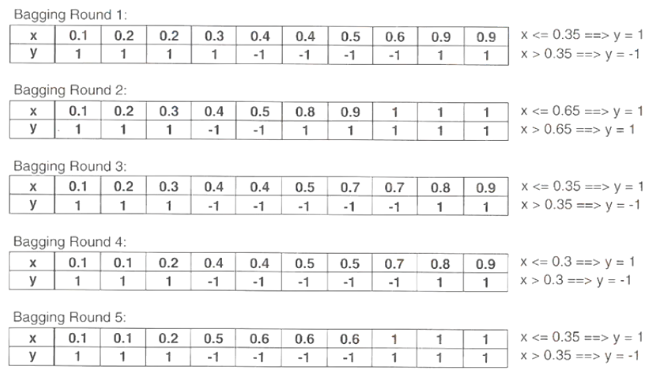
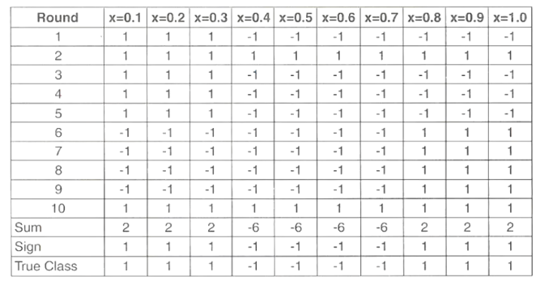
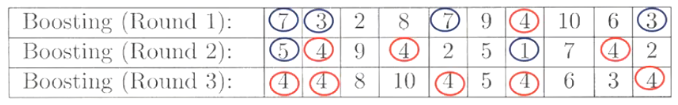
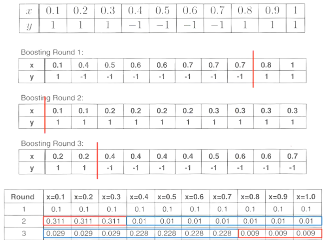
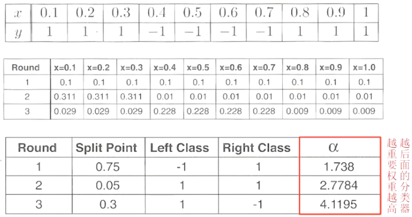
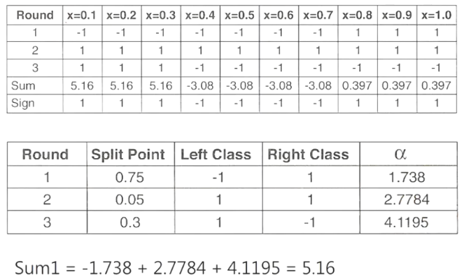
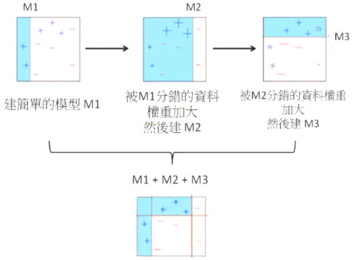

集成学习概述
抽样技术：
- 训练数据上的抽样方法
- 输入字段上的抽样方法
袋装法：
- 通用袋装法、随机森林
提升法：
- Adaboost、GBDT、xgboost、LightGBM

## 集成学习概述

如果要对其进行分类，可以大致划分为模型融合、机器学习元算法。
1. 模型融合是一个再学习的过程，将训练出的强学习器组合起来进一步提高性能。不同算法, 同一个数据.
2. 机器学习元算法则是弱学习器的组合。同一个算法, 不同的数据.

模型融合：
多数法（Max Voting）
平均法（Averaging）
加权平均法（Weighted Averaging）
堆叠法（Stacking）
混合法（Blending）

机器学习元算法：
1. 袋装法（Bagging）。
    1. 袋装通用法（Bagging Meta-Estimator）
    2. 随机森林（Random Forest）。
2. 提升法（Boosting）。
    1. Adaboost 算法
    2. XGBoost 算法
    3. Gradient Boost 算法。

## 模型融合-多数法（Max Voting）。
多数法通常用于分类问题。
在该技术中，使用多个模型来对每个数据进行预测。
每个模型的预测被视为“投票”。
我们从大多数模型得到的预测被用作最终预测。
例如，当你让 5 位同事评价你的电影时（5 分）；我们假设其中三位将它评为 4，而其中两位将它评为 5。
由于大多数评分为 4，最终评级的结果就为 4（取众数 Mode）。

## 模型融合-平均法（Averaging）。
与多数法类似，但采用所有模型的平均预测值来进行最终预测。
平均法可用于回归问题或分类问题中的概率预测。
-(5+4+5+4+4)/5=4.4。

## 模型融合-加权平均法（Weighted Averaging）。
这是平均法的扩展。根据模型的重要性分配不同的权重。
例如，如果你的两个同事都是评论者，而另一些同事没有这方面的经验，那么这两个朋友的答案相较于其他人更为重要。
-(5*0.23)+(4*0.23)+(5*0.18)+(4*0.18)+(4*0.18)+(4*0.18)=4.41。

## 模型融合-堆叠法（Stacking）

堆叠法使用来自多个模型（例如决策树、KNN 或 SVM）的预测来构建新模型。

## 模型融合-混合法(Blending)

混合法与堆叠法类似，但混合法仅使用验证集来重新建模并进行预测

## 机器学习元算法

机器学习元算法是把许多“弱”学习器通过算法集成起来变为“强”分类器。
根据个体学习器的生成方式，可分为 Bagging 和 Boosting 两大类。
Bagging 的个体学习器不存在依赖关系，可同时对样本随机采样并行化生成个体学习器。
Boosting 的个体学习器之间存在强的依赖关系：在基于前面模型的训练结果（误差）生成新的模型，所以必须串行化生成。
Bagging 的方法对样本随机取样产生多个独立模型，然后平均所有模型的预测值，旨在减小方差（Variance）——要稳。
Boosting 的方法拟合前一个模型的误差，旨在减小偏差（Bias）——要准。

## 抽样技术
SamplingTechniques

- By manipulating the training set（通过操纵训练集）。
    - In this approach, the sampling distribution determines how likely it is that an example will be selected for training（在这种方法中，抽样分布决定了一个样本被选入训练的可能性）。
    - A classifier is then built from each training set using a particular learning algorithm（然后使用特定的学习算法从每个训练集中构建一个分类器）。
    Bagging and Boosting are two examples（袋装法和提升法是两个例子）。

- By manipulating the input features（通过操纵输入特征）。
    - In this approach, a subset of input features is chosen to form each training set（在这种方法中，选择输入特征的一个子集来形成每个训练集）。
    - This approach works very well with datasets that contain highly redundant features（这种方法在包含高度冗余特征的数据集上效果很好）。
    - Random forest is an example of this type and use decision trees as its base classifier（随机森林是这种类型的一个例子，它使用决策树作为其基本分类器）。

袋装法Bagging

Consider the following dataset (y is the target)

表格内容为：
| x | 0.1 | 0.2 | 0.3 | 0.4 | 0.5 | 0.6 | 0.7 | 0.8 | 0.9 | 1 |
| --- | --- | --- | --- | --- | --- | --- | --- | --- | --- | --- |
| y | 1 | 1 | 1 | -1 | -1 | -1 | -1 | 1 | 1 |（此处 y 值缺失）|

- Suppose we apply a classifier that induces only one-level binary tree, the best split is either χ ⩽ 0.35 or χ ⩽ 0.75（假设我们应用一个仅能生成一层二叉树的分类器，最佳分割点要么是 χ ⩽ 0.35，要么是 χ ⩽ 0.75）。
- Either way, the accuracy is at most 70%（无论哪种情况，准确率最多为 70%）。

- From preceding example, even though each base classifier is just a only one-level binary tree, combining the classifiers can lead to a decision tree of depth 2（从前一个例子来看，即使每个基本分类器只是一个一层的二叉树，组合这些分类器可以得到一个深度为 2 的决策树）。
- Since every example has an equal probability of being selected, bagging does not focus on any particular instance of the training data（由于每个样本被选中的概率相等，袋装法不会专注于训练数据中的任何特定实例）。
- It is therefore less susceptible to model overfitting when applied to noise data（因此，在应用于有噪声的数据时，它不太容易出现模型过拟合）。

## 随机森林

- It is specifically designed for decision tree. Randomize the algorithm, not the training data。
- Attribute Selection for Decision Tree: Don't pick the best, pick randomly from the k best attributes。

## 提升法Boosting

- Boosting 源起于 1990 年代，由美国计算机科学家沙皮尔（Robert Schapire）所提出。
- 1995 年，亚夫·佛洛依（Yoav Freund）和沙皮尔再次改进了 Boosting 算法的一些缺点，提出了 AdaBoost 算法。
    在当时，Adaboost、随机森林与支持向量机，三者并驾齐驱，算是最好的分类器。
- 2001 年，美国史丹佛大学的统计学教授，杰罗姆傅利曼（Jerome H. Friedman）提出了 GBDT（梯度提升决策树，Gradient Boosting Decision Tree）的概念，主要是集成许多弱（决策树）分类器，以发展出最优模型的方法。
- 由于 Boosting 是利用迭代来找到优化过后的模型，一旦碰到数据集非常复杂时，背后需要上千上万次的迭代运算，造成计算瓶颈，容易拖慢计算机的计算效率。
面对这项问题，2014 年：华盛顿大学博士生陈天奇开发出 XGBoost。
- XGBoost 的全名为 eXtreme Gradient Boosting（极限梯度提升），大幅提升模型的训练速度与预测的精准度。
- 2016 年底，微软的 DMTK 团队开发出训练效率更高、准确率更高，而且计算机内存使用更低的 LightGBM（Light Gradient Boosting Machine，LGBM）高效算法。

- Boosting is an iterative procedure used to adaptively change the distribution of training example, so that the base classifiers will focus on examples that hard to classify。
- Unlike bagging, boosting assigns a weight to each training example and may adaptively change the weight at the end of each boosting round。

- Initially, the examples are assigned equal weight, 1/N, so that they are equally likely to be chosen for training.
- A sample is drawn according to the sample distribution to obtain a new training set.
- Next, a classifier is induced from the new training set and used to classify all the examples in the original data.

- With AdaBoost, it perfectly classifies all the examples in the training data.
- Because of its tendency to focus on training examples that are wrongly classified, the boosting technique can be quite susceptible to overfitting.
New Boosting Model: XGBoost. XGBoost 全称为 Extreme Gradient Boosting，

- GBDT（Gradient Boosting Decision Tree）的原理是：
- 首先使用训练集和样本真值（即标准答案）训练一棵树，使用这棵树预测训练集，得到每个样本的预测值，由于预测值与真值存在偏差，所以二者相减可以得到残差。
- 接下来训练第二棵树，此时使用残差代替真值作为标准答案，两棵树训练完成后，可以再次得到每个样本的残差。
- 然后进一步训练第三棵树，以此类推，树的总棵数可以人为指定，也可以监控某些指标如验证集上的误差来停止训练。

