1. 聚类的概念
1. 相似性的衡量
    1. 二元变量的相似性衡量
    2. 混合类别型变量与数值型变量的相似性衡量
2. 距离的计算
    1. Manhattan Distance / City-Block Distance（曼哈顿距离/城市街区距离）
    2. Euclidean Distance（欧氏距离）
3. 聚类算法的分类
    1. Exclusive vs. Non-Exclusive(Overlapping)的聚类算法
    2. 层次聚类, 划分聚类, 模糊聚类, 密度聚类

# 聚类算法分类

1. 层次聚类算法：单一链结法、完全链结法、平均链结法、中心法、Ward's 法。
1. 划分聚类法：K-Means 法、K-Medoids 法、Kohonen Self-Organizing Maps(SOM)法、两步法。
1. 模糊聚类：EM 算法。
1. 密度聚类：密度聚类算法(DBSCAN)。
1. 群数的判断：R-Squared(R2)、Semi-Parial R-Squared、Root-Mean-Square Standard Deviation(RMSSTD)、轮廓系数(Silhouette Coefficient)。

## 聚类概念

- In cluster analysis, there is no pre-classified data and no distinction between dependent and independent data.
- Instead, cluster analysis is a process to group similar objects together.
- All members in one cluster are similar to each other and different from the members of other clusters, according to some similarity metric.
    - 同一集群内成员的相似性要愈高愈好，而不同集群间成员的相异性则要愈高愈好。

Customer Segmentation

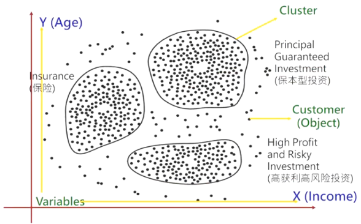
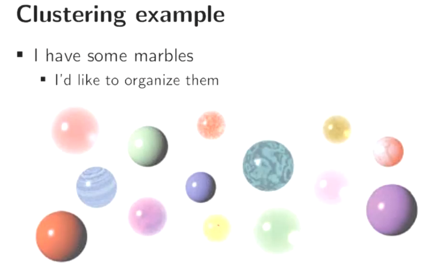 
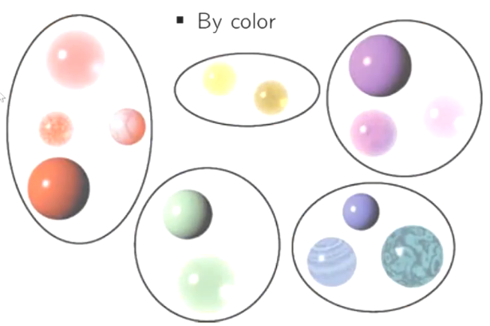 
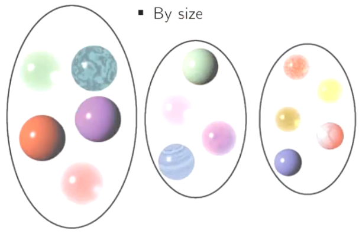 
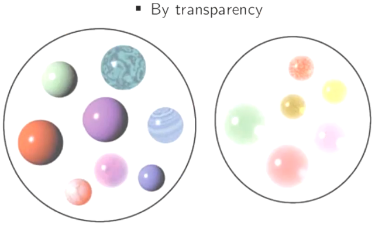 
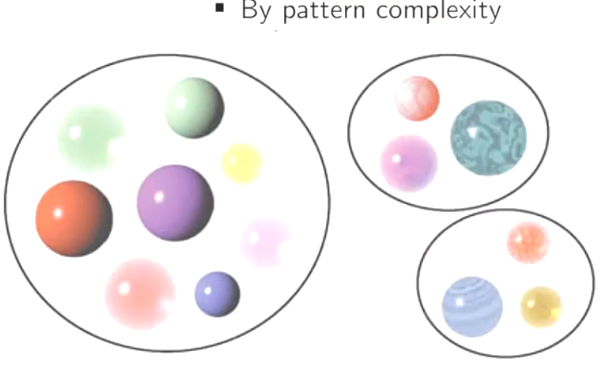

## 相似性的衡量及距离的计算

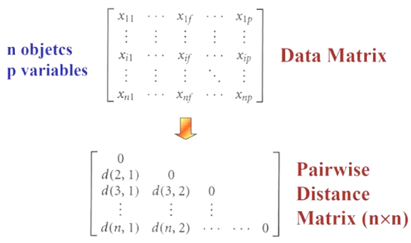

## Coefficient for Binary Variables

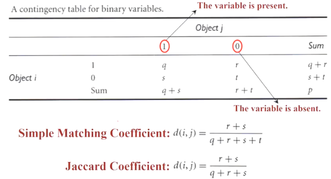

Jaccard Coefficient:

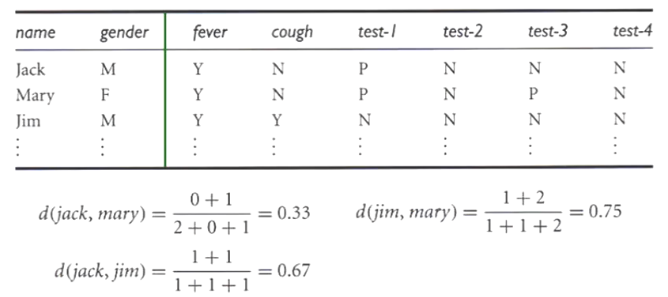

## Attribute Typess Involved in Cluster Analysis

- Interval Variables
    - An interval variable contains continuous measurements (e.g., height, weight, temperature, cost, etc.) which follow a linear scale
    - It is essential that intervals keep the same importance throughout the scale
- Nominal Variables
    - A nominal variable takes on more than two states. For example, the eye color of a person can be blue, brown, green or grey eyes
    - These states may be coded as 1,2,..., M, however their order and the interval between any two states do not have any meaning

- Ordinal Variables
    An ordinal variable takes on more than two states. For example, you may ask someone to convey his/her appreciation of some paintings in terms of the following categories: 1=detest, 2=dislike, 3=indifferent, 4=like and 5=admire. In an ordinal variable, their states are ordered in a meaningful sequence. However, the interval between any two consecutive states are not equally distanced.
- Binary Variables
    Binary variables have only two possible states. For example, the gender of a person is either female or male.

## 曼哈顿距离

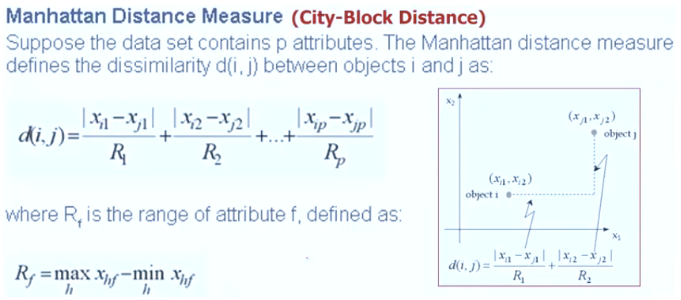

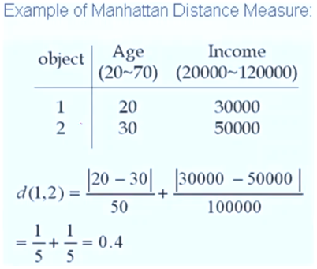

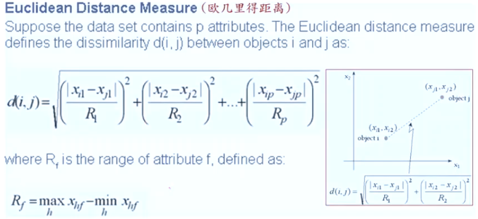

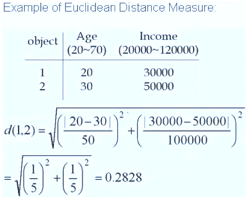

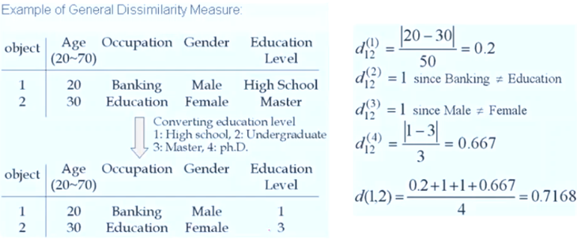

## 聚类算法分类

1. Exclusive vs. Non-Exclusive (Overlapping) Clustering Methods - K-means vs. EM.
2. Hierarchical Clustering Methods vs. Partitioning Clustering Methods.
- Hierarchical Clustering Methods.
    - Single Linkage Method & Complete Linkage Method.
    - Average Linkage Method & Centroid Method.
    - Ward's Method.
- Partitioning Clustering Methods.
    - K-Means.
    - K-Medoids (PAM,...).
    - Kohonen Self-Organizing Maps (SOM).
    - Two Step.

- Fuzzy Clustering Methods.
    - EM (Expectation Maximization Clustering Method).
- Density-based Spatial Clustering Methods.
    - DBSCAN (Density-Based Spatial Clustering of Applications with Noise).

## Hierarchical Methods
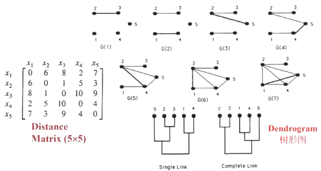

## 单一连接法

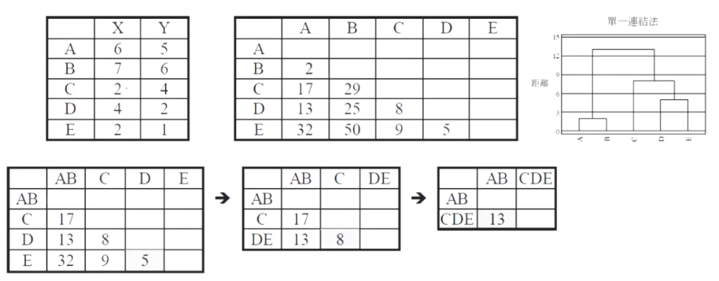

## 完全连接法(Complete Linkage Method)
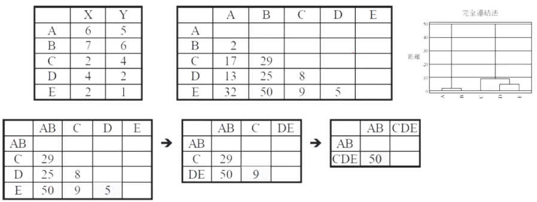

## 平均连接法(Average Linkage Method)

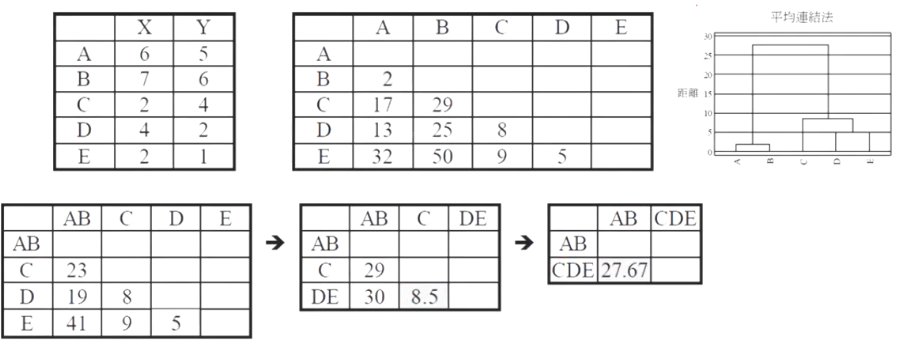

## 中心连接法(Centroid Method)
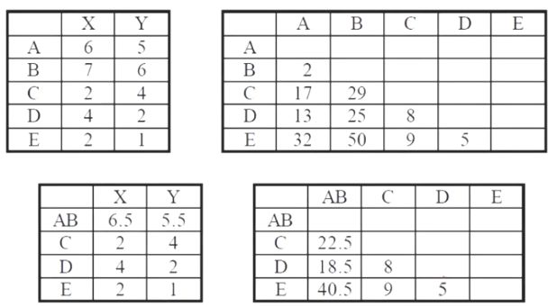

## Ward's Method
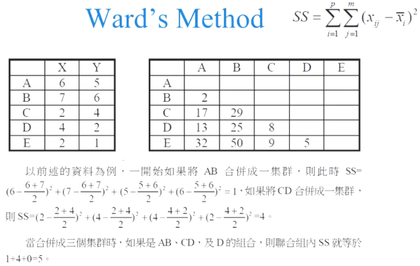
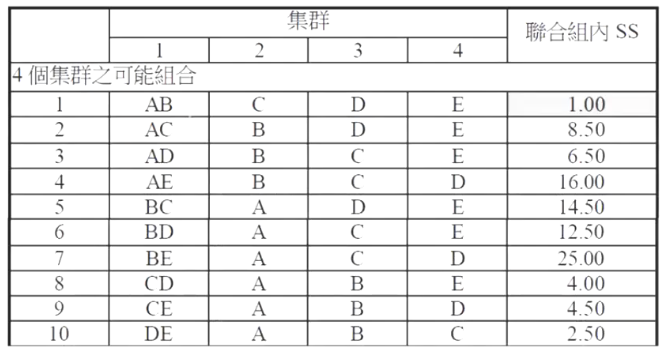
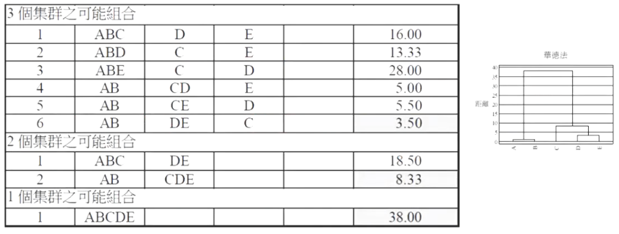

在大部分的研究中，以使用平均链接法及华德法（Ward's Method）较佳，而以单一连结法较差。
划分方法（Partitioning Methods）又优于层次方法（Hierarchical Methods）。
两步法（TwoStep）。

K-均值法（K-Means）→将数据切分成许多小群（例如 50 群）→层次聚类方法（Hierarchical Clustering Methods）→决定群数。

## 群数的判断

1. 如果使用阶层式聚类分析法，在集结完成后，接下来就要判断应分成几个群集才算恰当. 一般可以用陡坡图来判断.
2. 以前述使用华德法(Ward's Method)进行聚类分析的例子，各阶段SS系数分别为1.00、3.50、8.33、38.00，其陡坡图如下

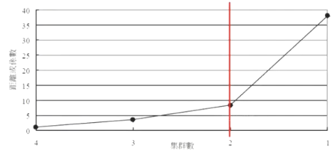

## 划分聚类算法
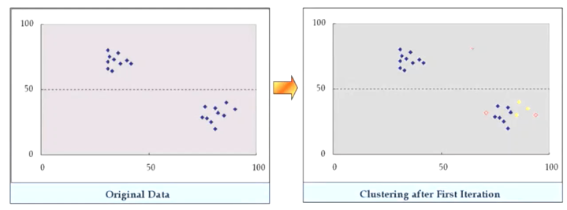

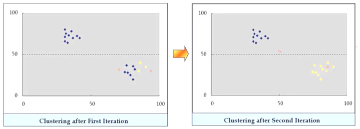

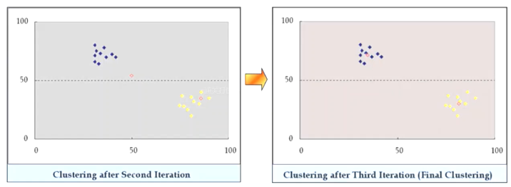

Advantage
- Fast 
Disadvantages 
- Sensitive to Outliers. ✨可以做离群值检测
- Not an Optimal Solution.

    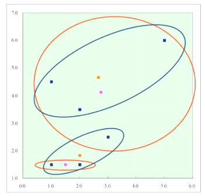

- Can just handle numerical data.

- 中心点的选取关系着分类的结果。如果中心点选择不当，分类的结果就可能不是很理想。
- 常用的方法有以下：
    - 随机选取 K 个样本点作为初始的类群中心点。
    - 先选择第 1 个样本点当第 1 群的中心；其次选择与第 1 个中心点的距离超过既定标准的下一个样本点当第 2 群的中心点；接着选择与第 1、2 个中心点的距离超过既定标准的下一个样本当第 3 群的中心；依此类推，直到选出 K 个群的中心为止。

## Alglgorithm PAM

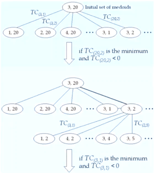

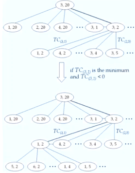

K-Means can handle large data sets efficiently but is limited to interval-scaled attributes and sensitive to outliers.
PAM is capable of handling various attribute types but is not efficient when clustering large data sets.

## SOM example: initialize prototype

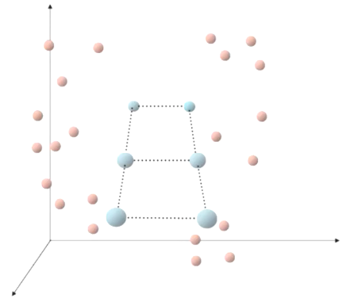 
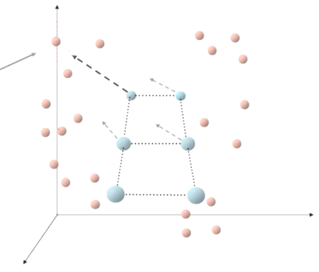 
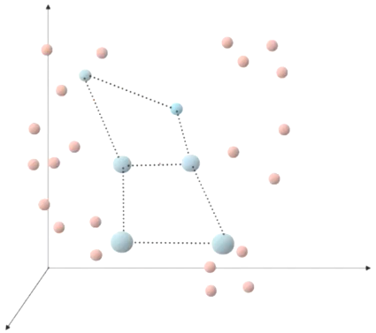 
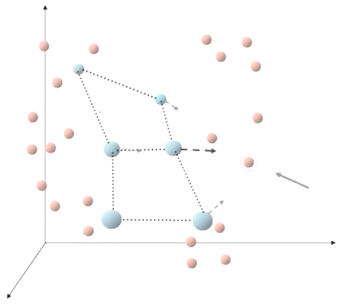 
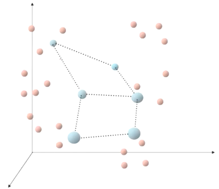 
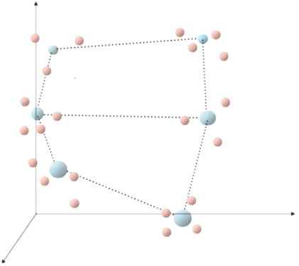

## 模糊聚类

- Hard (Exclusive) Clustering.
    - Objects are assigned to a single cluster. K-Means.
- Soft (Non-Exclusive) Clustering.
    - Objects have probability distribution over clusters.EM (Soft Version of K-Means).

## K-Means(A Special Kind of EM)

- Initialization.
    Randomly select cluster centers.
- E Step.
    - Euclidean Distance to Each Cluster Center 
    - The probability is either 0 or 1.
- M Step.
    Recalculate cluster centers.
- Convergence.
    Cluster centers do not change.

## EM

- Initialization.
    Randomly select cluster centers and variances.
- E Step.
    - Gaussian Distribution for Each Cluster.
    - The probability is between 0 and 1.
- M Step.
    Recalculate cluster centers and variances.
- Convergence.
    - Cluster centers do not change.

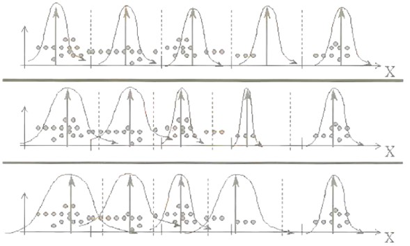

## 密度聚类算法(DBSCAN)

- DBSCAN (Density-Based Spatial Clustering of Applications with Noise) is proposed in 1996.
- Unlike the K-mean, DBSCAN does not need to specify the number of clusters.
    - It can automatically detect the number of clusters based on your input data and parameters.
- DBSCAN can find arbitrary shape clusters that k-means are not able to find.

- DBSCAN can handle noise and outliers.
- All the outliers will be identified and marked without been classified into any cluster.
- Therefore, DBSCAN can also be used for Anomaly Detection (Outlier Detection).
- There are two parameters we need to set for DBSCAN.
    - Eps: Maximum radius of the neighborhood.
    - MinPts: Minimum number of points in an Eps-neighbourhood of that point.

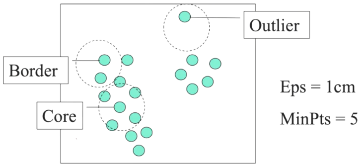 
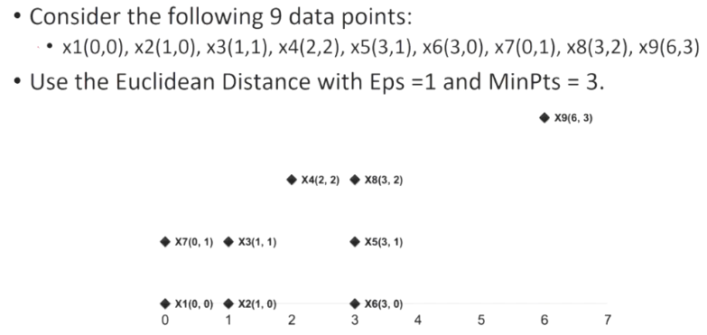 
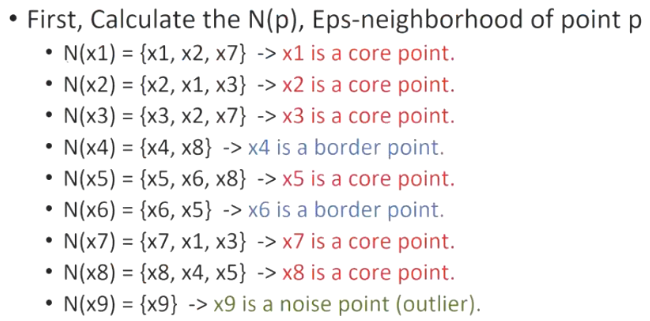 
 
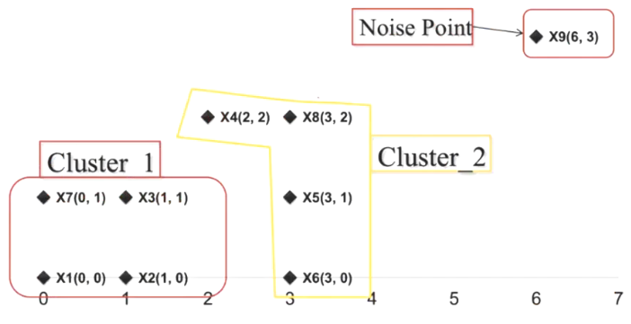

优点：
- 不需要事先指定群集数。
- 可轻松处理噪音，不受离群值影响。
- 它没有严格的形状，它可以正确地容纳许多数据点。

缺点：
- 无法使用不同密度的数据集。
- 对聚类超参数敏感：eps 和 min_points。
- 如果数据过于稀疏，则表现不佳。
- 密度测量（密度可达和密度相连）可能受抽样影响。

## 群数的判断

有四种常用的群数判断方法：
- Sum of Square (SS)。
- R-Squared (R2)。
- Semi-Partial R-Squared。
- Silhouette Coefficient (轮廓系数)。

## 群数的判断(R^2)

1. SS 可分为组间（SSB）、组内（SSW）及全体（SST），SSB+SSW=SST。
2. 随着观察体（集群）的合并，集群数目愈来愈少，集群内的异质性愈来愈高，因此 SSW 就会愈来愈大。
3. 由于聚类分析的主要目的在使集群内的差异较小，而集群间的差异较大，因此 R²要大一些。
4. 如果由于观察体（集群）的合并，使得 R²突然减小，表示应停止合并。

## 群数的判断(Semi-Partial R2)

## 轮廓系数(Silhouette  Coefficient)

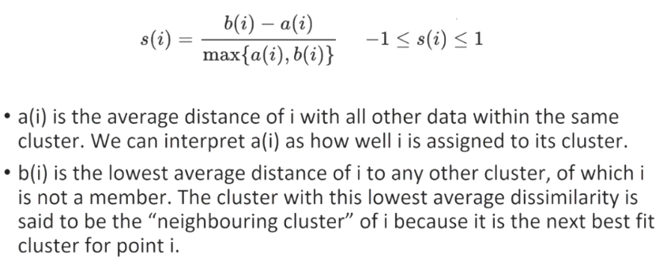
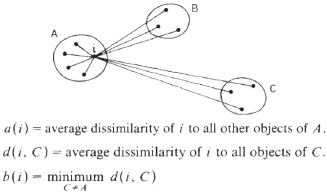
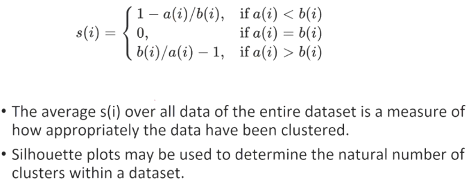 
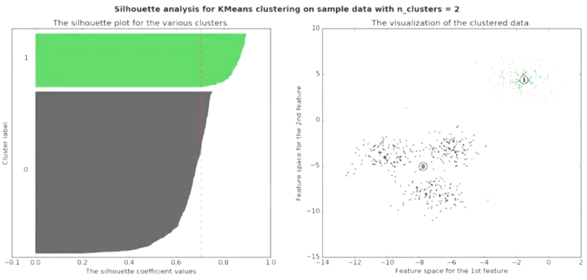 
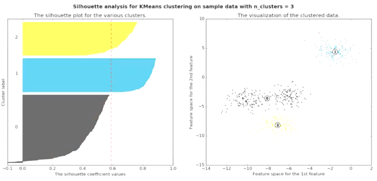 
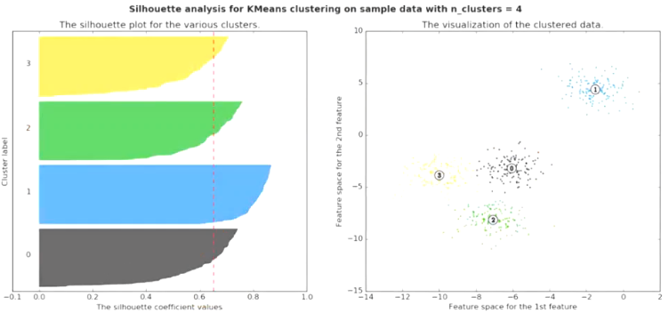 
 
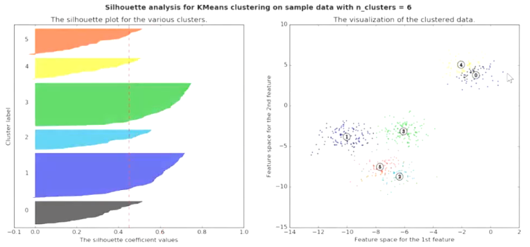 
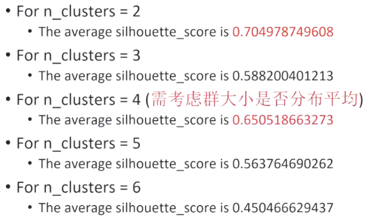

