关联规则的概念
关联规则的评估指标 - 支持度、置信度
Apriori 算法 - 暴力法的弊端
Apriori 算法 - Apriori 算法的实例说明 - 候选项集的产生
Apriori 算法 - Apriori 算法的实例说明 - 候选项集的缩减
Apriori 算法的缺点及瓶颈
FP-Growth 算法

- 再谈评估指标 
- 支持度与置信度的问题、提升度指标、关联规则的生成
- 关联规则的延伸 
- 虚拟商品、负向关联规则、相依性网络

- Association Rule Mining
    Finding frequent patterns or associations among itemsets in transaction databases 
- Applications
    Market basket analysis (marketing strategy: items to put on sale at reduced prices), cross-marketing, catalog design, shelf space layout design, etc. 
- Examples
    - Rule form: Body → Head [Support, Confidence] 
    - buys(x, "Computer") → buys(x, "Software") [2 %, 60 %] 
    - major(x, "CS") Λ takes (x, "DB) → grade(x, "A") [1 %, 75%]

## Rule Measures:Support and Confidence

|Transaction ID|Items Bought|
|----|----|
|100|A,B,C|
|2000|A,C|
|3000|A,D|
|4000|B,E,F|

For rule A → C. 
1. Support = Support({A, C}) = 50%. 
2. Confidence = Support({A, C}) / Support({A}) = 66.6%.

Typically, association rules are considered interesting if they satisfy both a minimum support threshold and a minimum confidence threshold.

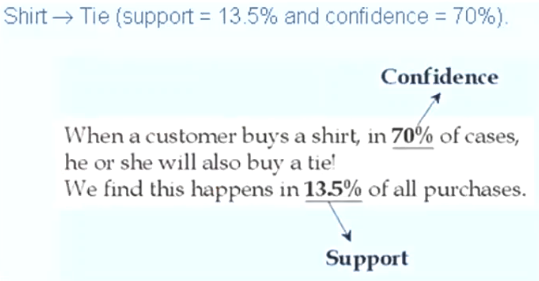

Let minimum support 50%, and minimum confidence 50%, we have 
- A → C [50%, 66.6 %] 
- C → A [50%,100%].

## Apriori算法
The number of itemsets of a given cardinality tends to grow exponentially
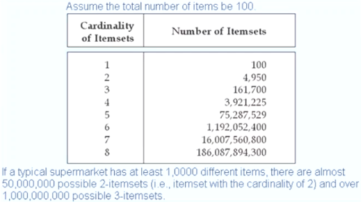

- Find the frequent itemsets, the sets of items that have minimum support.
    - A subset of a frequent itemset must also be a frequent itemset. i.e., if {AB} is a frequent itemset, both {A} and {B} should be a frequent itemset.
    - Iteratively find frequent itemsets with cardinality from 1 to k (k-itemset).
- Use the frequent itemsets to generate association rules.
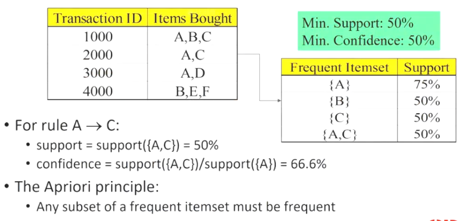

## Apriori算法的实例说明

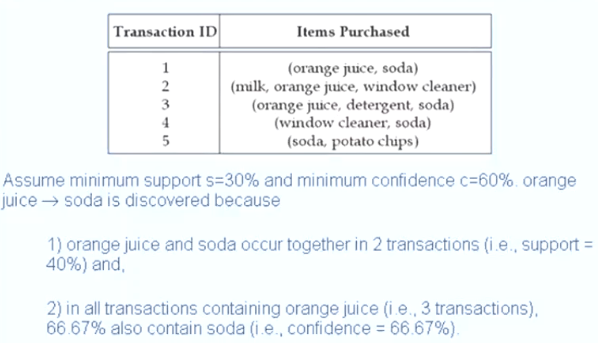 
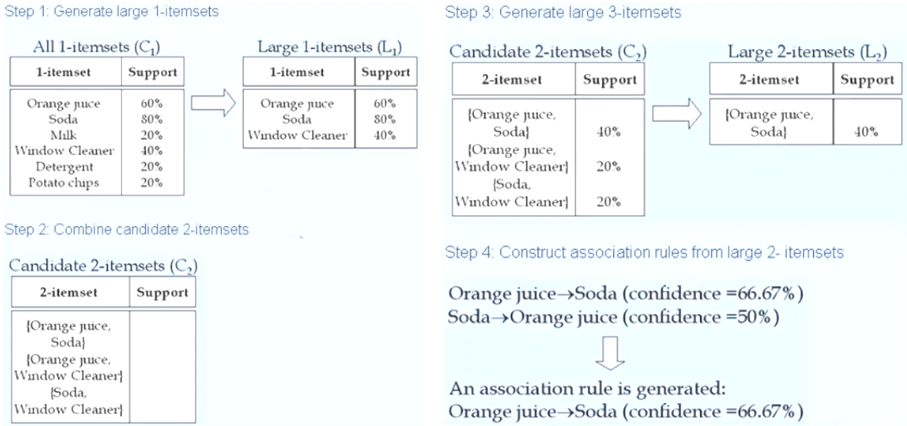 
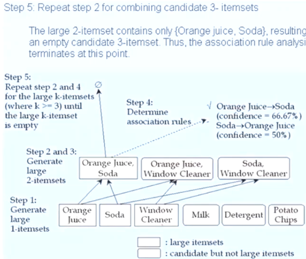 
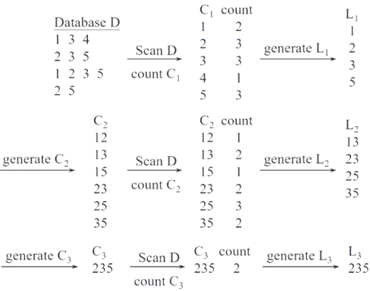 
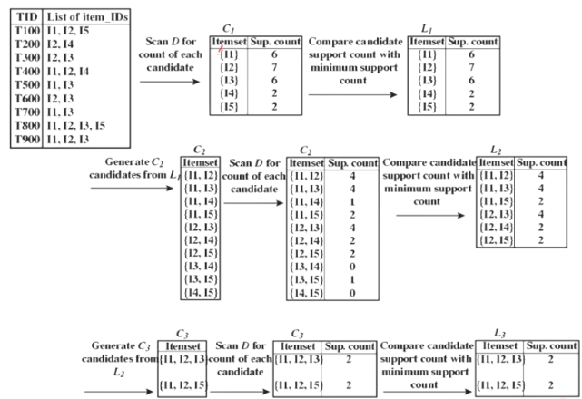

- L3={abc, abd, acd, ace, bcd}
- Self-joining: L3*L3 - abcd from abc and abd；acde from acd and ace
- Pruning - acde is removed because ade is not in L3
- C4={abcd}

## Performance Bottlenecks

- The core of the Apriori algorithm: 
    - Use frequent (k - 1)-itemsets to generate candidate frequent k-itemsets. 
    - Use database scan and pattern matching to collect counts for the candidate itemsets.
- The bottleneck of Apriori: 
    - Huge candidate sets: 
        - 10^4 frequent 1-itemset will generate 107 candidate 2-itemsets. 
        - To discover a frequent pattern of size 100, e.g., {a_1, a_2,.., a_100}, one needs to generate 2^100 ≈ 10^30 candidates. 
    - Multiple scans of database: 
        - Needs (n + 1) scans, n is the length of the longest pattern.

## FP-Growth算法

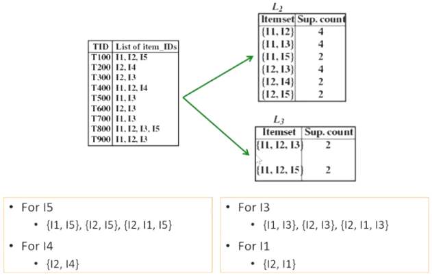 
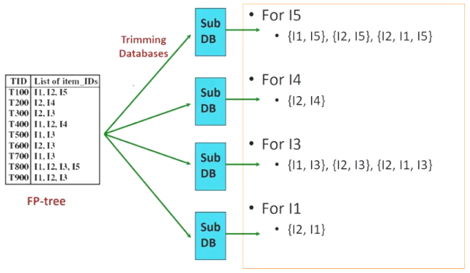 
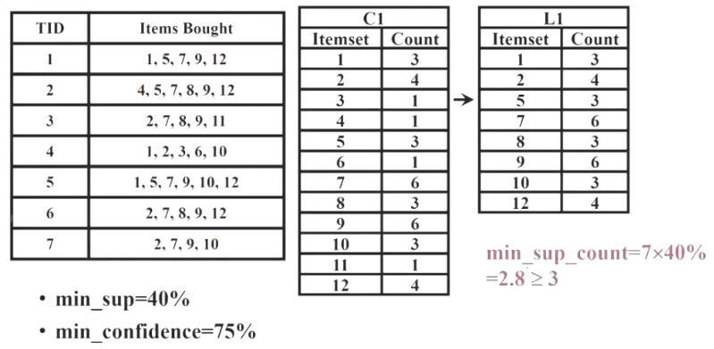 
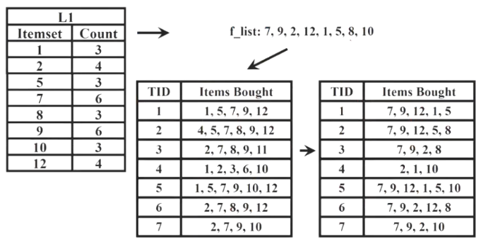 
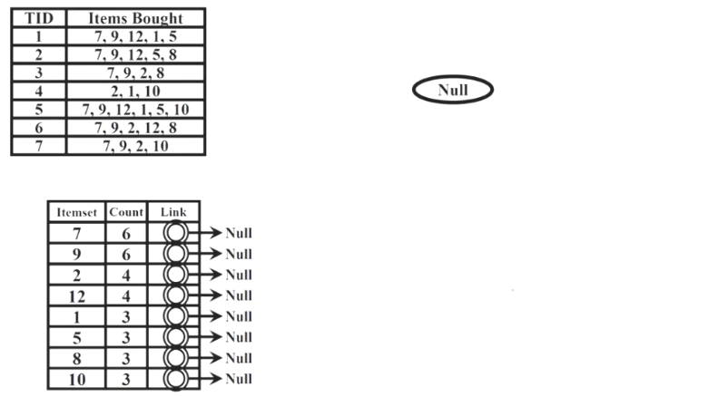 
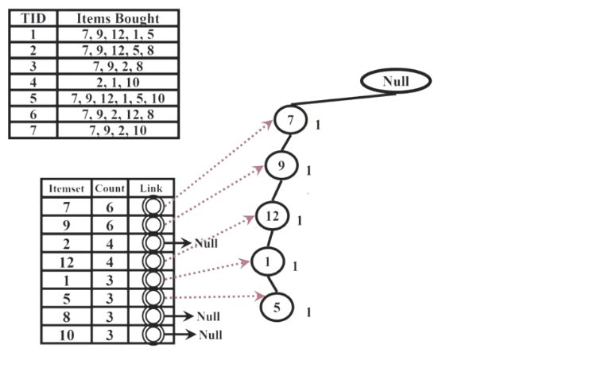 
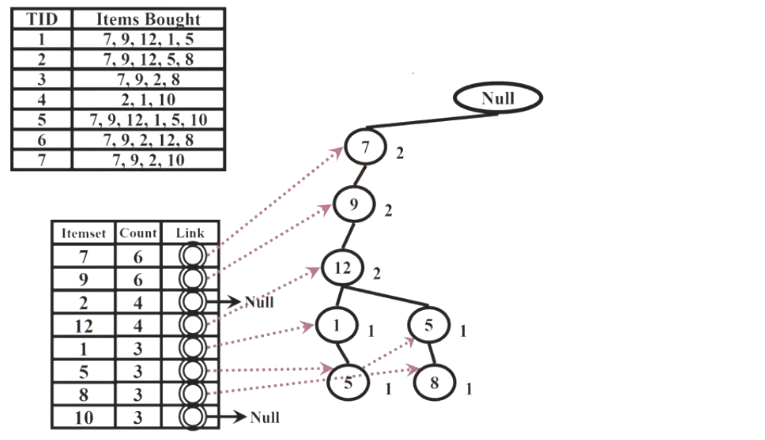 
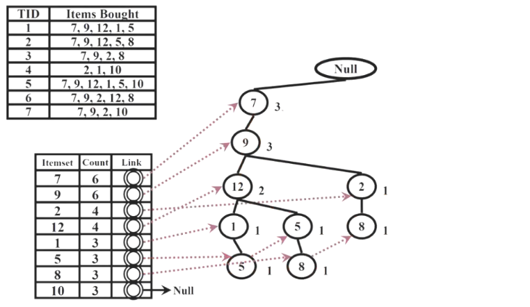 
 
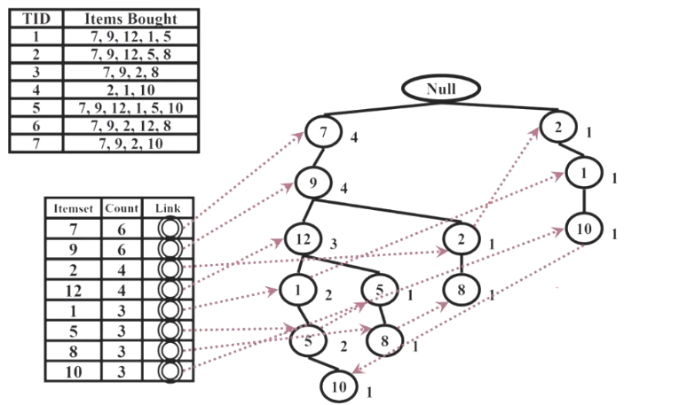 
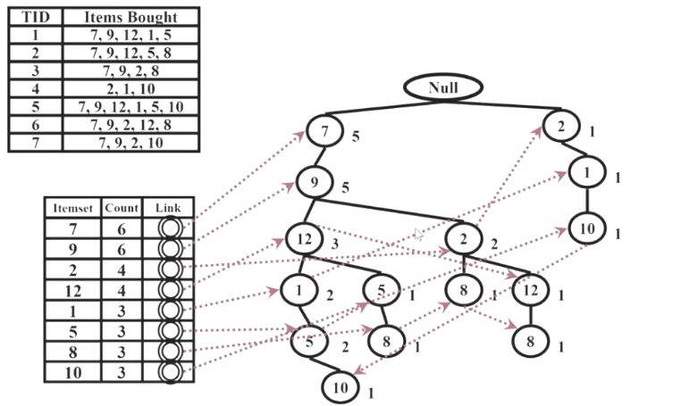 
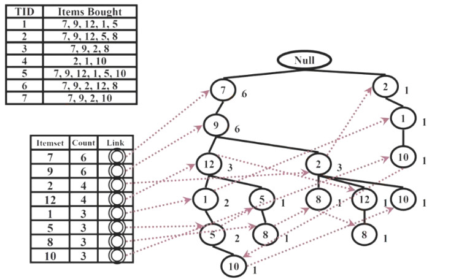 
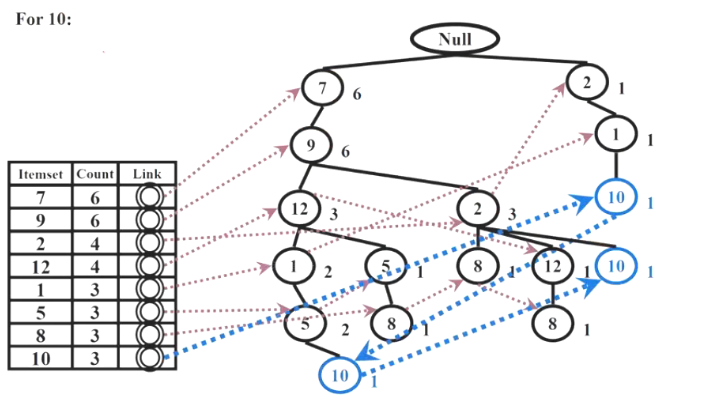 
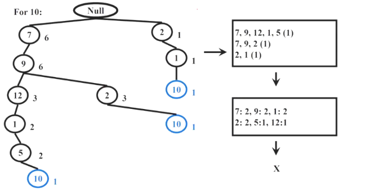 
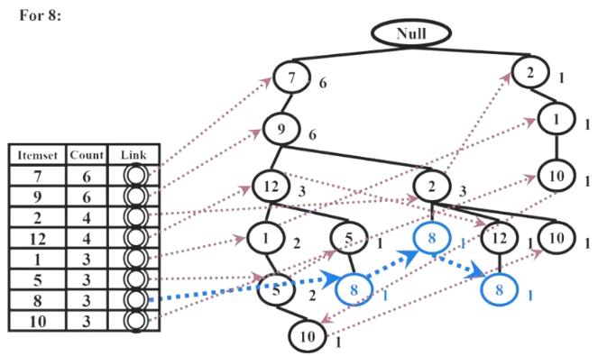 
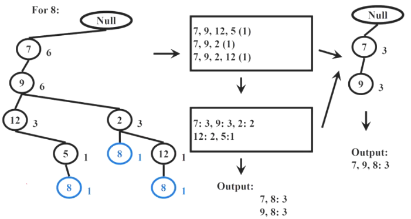 
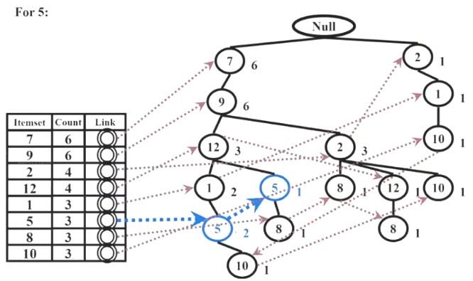 
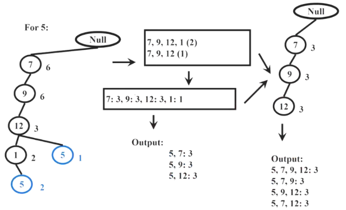 
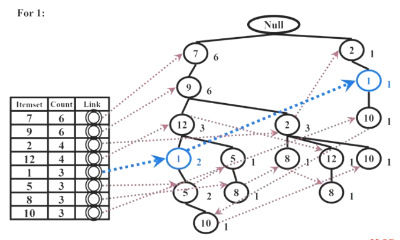 
 
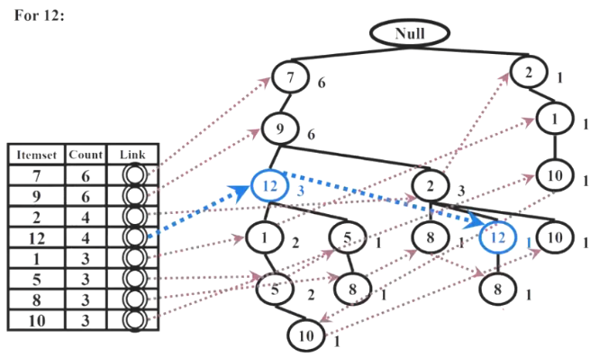 
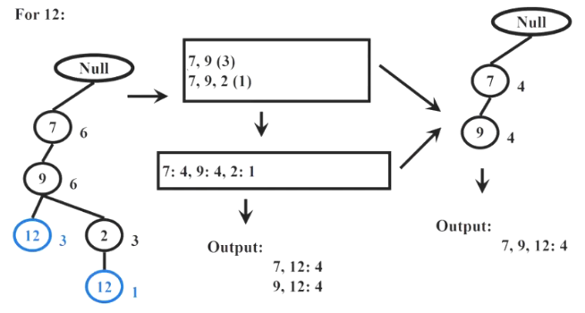 
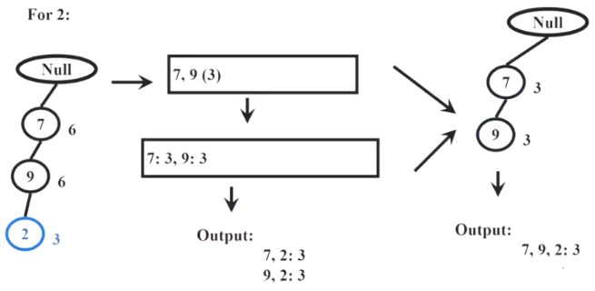 
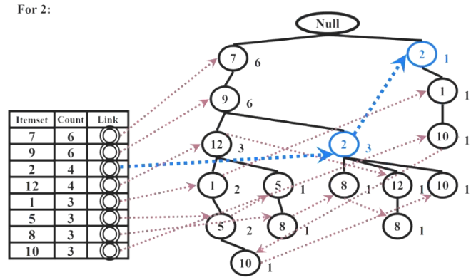 
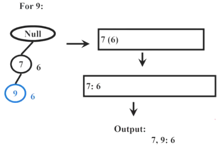 
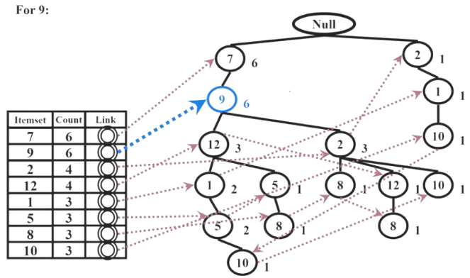

## 再谈评估指标

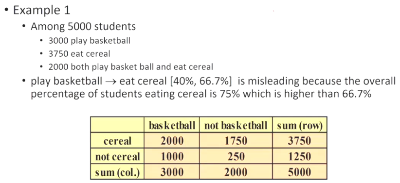 
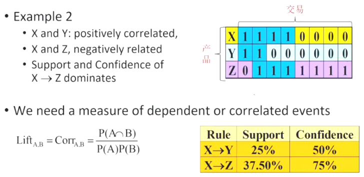 

## 关联规则的生成

关联规则的生成一般很少人提及（多数只讲到频繁项集（Frequent Itemset），但也是非常重要而且不简单。
举例来说，假如产生出一个频繁项集{A,B,C,D}，要如何产生它的关联规则？以下几个方法可以参考。

Exhaustive Approach（用暴力法产生所有的规则：简单但花费太多时间）
1. 要尝试任意的组合：
    1. {A,B,C}->{D}，
    1. {A,B,D}->{C}，
    1. {A,C,D}->{B}，
    1. {B,C,D}->{A}，
    1. {A,B}->{C,D}，
    1. {A,C}->{B,D}，
    1. {A,D}->{B,C}，
    1. {B,C}->{A,D}，
    1. {B,D}->{A,C}，
    1. {C,D}->{A,B}，
    1. {A}->{B,C,D}，
    1. {B}->{A,C,D}，
    1. {C}->{A,B,D}，
    1. {D}->{A,B,C}。
2. 因为要产生的规则太多，且要花的时间很多，所以几乎所有的软件或套件都只产生结果是单一项的规则：
    1. {A,B,C}->{D}，
    1. {A,B,D}->{C}，
    1. {A,C,D}->{B}，
    1. {B,C,D}->{A}。

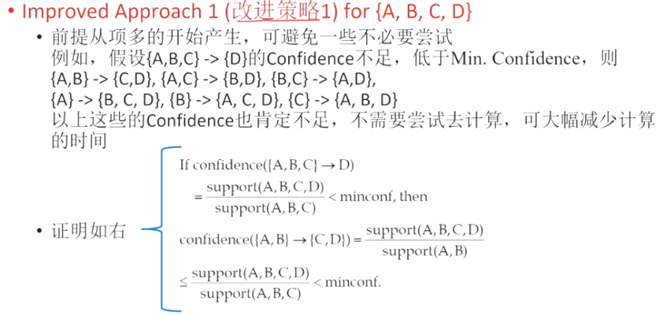

Improved Approach 2 (改进策略 2) for {A,B,C,D}。
1. 前提从项少的开始产生，可避免一些不必要尝试。例如，假设{A,B}->{C,D}的 Confidence 足够，大于等于 Min. Confidence，则{A,B,C}->{D}，{A,B,D}->{C}以上这些的 Confidence 也肯定足够，不需要尝试去计算，可大幅减少计算的时间。
2. 证明跟改进策略 1 相同。

## 关联规则的延伸
Different region exhibit different selling patterns. Thus, including as virtual item the information on the location or the type of stores (existing or new) where the purchase was made will enable the comparisons between locations or types within a single chain.

Virtual item may include information on whether the purchase was made with cash, a credit card or check. The inclusion of such virtual item allows to analyze the association between the payment method and items purchased.

Virtual item may include information on the day of the week or the time of the day the transaction occurred. The inclusion of such virtual item allows to analyze the association between the transaction time and items purchased.

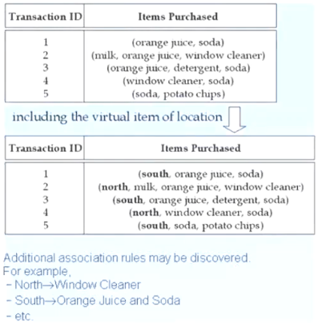

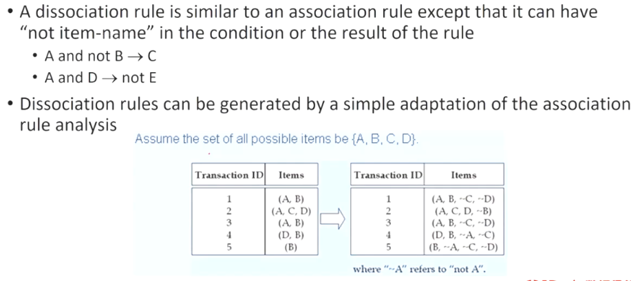

-The size of a typical transaction grows because it now includes inverted items.
-The total number of items used in the analysis doubles.
-Since the amount of computation grows exponentially with the number of items, doubling the number of items seriously degrades performance.
-The frequency of the inverted items tends to be much larger than the frequency of the original items. So, it tends to produce rules in which all items are inverted. These rules are less likely to be actionable.
-not A and not B → not C.
-It is useful to invert only the most frequent items in the set used for analysis. It is also useful to invert some items whose inverses are of interest.

## 序列模式

- 序列模式的概念
- 序列模式的评估指标 - 支持度、置信度
- AprioriAll 算法及实例说明 - 候选项集的产生、候选项集的缩减
- AprioriAll 算法的缺点及瓶颈
- PrefixSpan 算法及实例说明
- 序列模式的延伸(状态移转网络)

