- 数据集的切割
    训练-测试数据的方式、交叉验证的方式
- 分类模型的评估：
    - 混淆矩阵、正确率（Accuracy）、查准率（Precision）、查全率（Recall）、F-指标（F-Measure），模型在一个决策点的评估
    - KS 图（KS Chart）、ROC 图（ROC Chart）及 GINI 图（GINI Chart）、回应图（Response Chart）、增益图（Gain Chart）、提升图（Lift Chart）、收益图（Profit Chart），模型的整体评估
- 回归模型的评估：
    平均绝对误差（Mean Absolute Error）、平均平方误差（Mean Squared Error）、均方根误差（Root Mean Squared Error）、R^2 及 Adjusted R^2

## 数据集的切割 Dataset Segmentations

1. 训练数据(Training Dataset)
2. 测试数据(TestDataset)

可采用分层抽样的方式来进行，以保持数据在目标字段上分布的一致性

- 数据分割：
    - 80%训练数据，在训练数据上可以做任何分析；
    - 20%测试数据，在测试数据上不可做任何分析。
- 全部数据集：
    - 1000 笔数据（违约客户 Yes:No = 300:700）。
    - 训练数据集：800 笔数据。
    - 测试数据集：200 笔数据。

## 分层抽样

- 全部数据集：1000 笔数据（违约客户 Yes:No = 300:700）。
- 数据分割方式1 
    - 随机从 1000 笔数据中选取 800 笔做为训练数据集
    - 剩余的 200 笔做为测试数据集。
- 数据分割方式 1 的缺点（若不计较也可使用）：违约客户 Yes:No 分布的比例与母体（300:700）不合。

- 全部数据集：1000 笔数据（违约客户 Yes:No = 300:700）。
- 数据分割方式 2：
    - 随机从 700 笔信用良好的数据中选取 80%（560 笔）加入训练数据集，剩余的 20%（140 笔）则加入测试数据集；
    - 随机从 300 笔信用不良的数据中选取 80%（240 笔）加入训练数据集，剩余的 20%（60 笔）则加入测试数据集。

1. 训练集（Training Set）是用来训练模型 M。
1. 测试集（Test Set）是用来测试模型 M 的效能。
1. 有些机器学习的算法为防止模型过拟合，会将一部分训练集的数据分离出来当作验证集（Validation Set），去修正模型。
1. 通常训练集会占多数的数据，测试集及验证集占比较少。
    1. 训练集：60%。
    2. 测试集：20%。
    3. 验证集：20%。

## 10-FoldCross-Validation

- Cross-Validation 的 Fold 数越多，对模型的评估越好，但比较耗时。
- Leave-One-Out-Cross-Validation 是 Cross-Validation 的最复杂版本，但最耗时。
- 建立模型时最好先建立一个 Baseline Model，以作为比较的基准。分类问题：用众数建模。回归问题：用均值或中位数建模。

## 模型评估-ConfusionMatrix

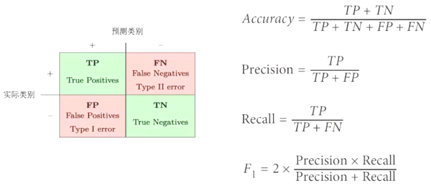 
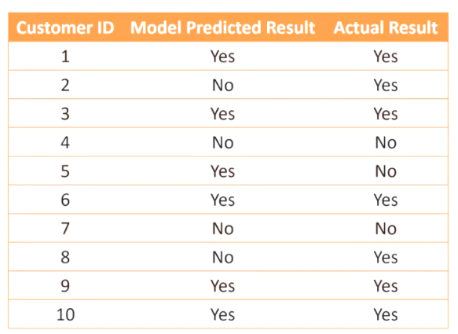 
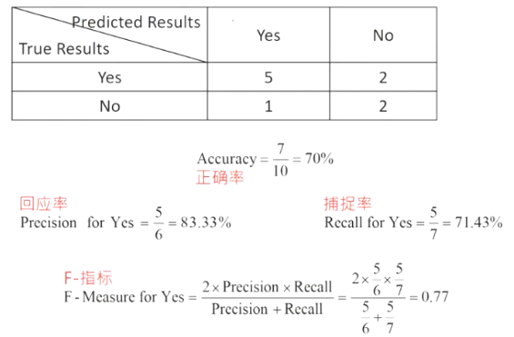 
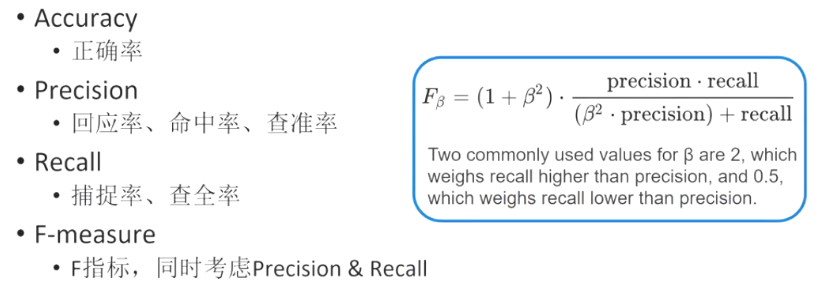

✨F_1值更接近precision和recall的低值

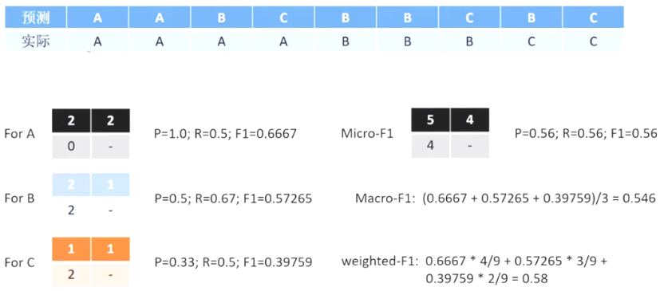

## 模型的整体评估

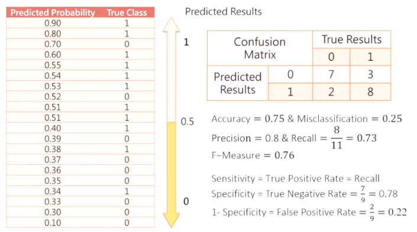
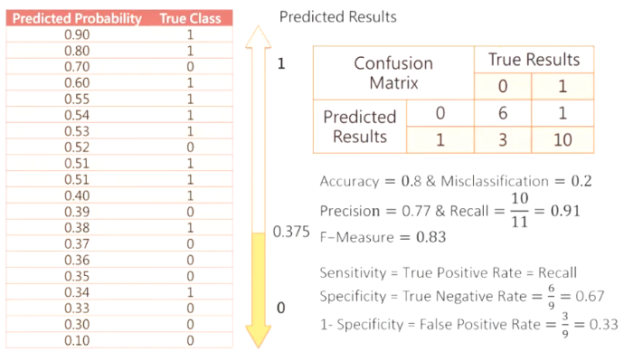

## ks(60)

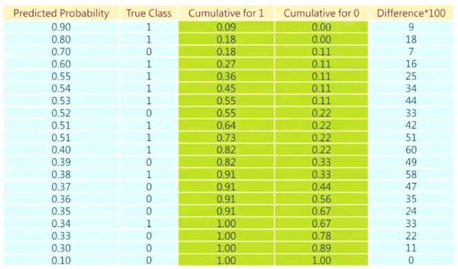

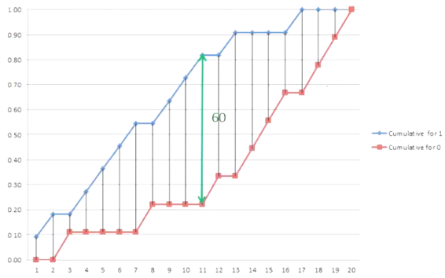

- K-S（Kolmogorov-Smirnov）chart measures performance of classification models.
- K-S is a measure of the degree of separation between the positive and negative distributions.
    - The K-S is 100 if the scores partition the population into two separate groups in which one group contains all the positives and the other all the negatives.
    - If the model cannot differentiate between positives and negatives, then the K-S would be 0 (the model selects cases randomly).
    - The higher the value the better the model is at separating the positive from negative cases.

K-S Statistics 
- 小于 20：此模型无鉴别力。
- 20~40 之间：此模型勉强接受。
- 41~50 之间：此模型有好的区别能力。
- 51~60 之间：此模型有很好的区别能力。
- 61~75 之间：此模型有非常好的区别能力。
- 大于 75：此模型异常，可能有问题。

## Profit(Correct=+100, Wrong=-200)

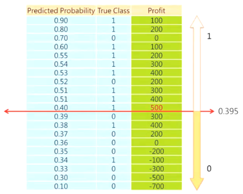

## Statistical Graphics - ROC Chart

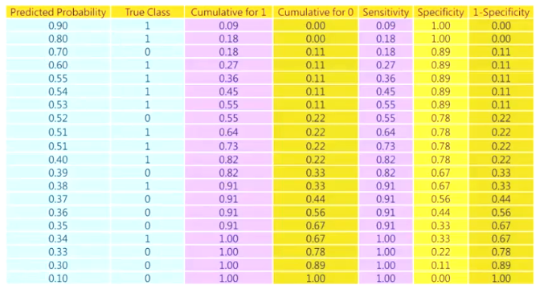
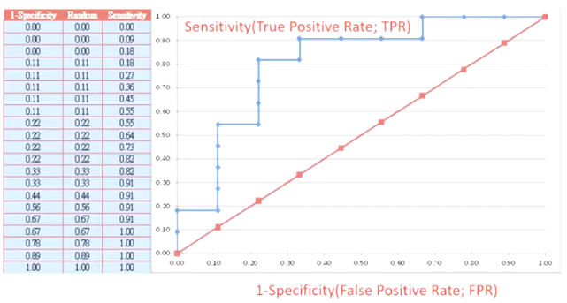
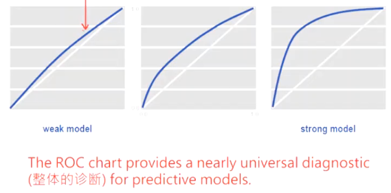
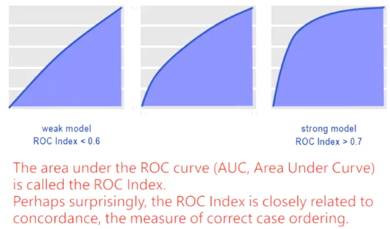

## AUC

- Area under ROC curve is often used as a measure of quality of the classification models.
- A random classifier has an area under the curve of 0.5, while AUC for a perfect classifier is equal to 1.
- In practice, most of the classification models have an AUC between 0.5 and 1.

## Gini Coefficient
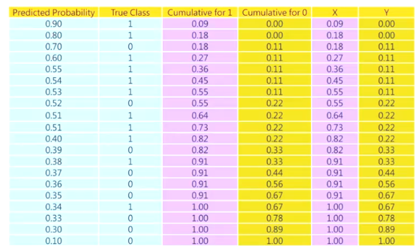
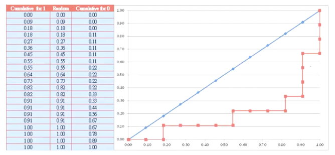
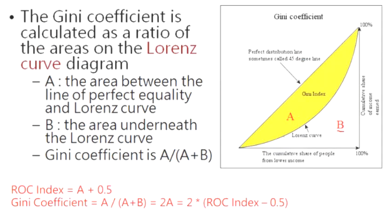

## 比较
|描述|Gini 系数范围|K-S 值范围|AUC 值范围|模型区辨能力|
| ---- | ---- | ---- | ---- | ---- |
|模型无区辨能力|0|＜20%|=50%|无区辨能力|
|模型区辨能力极差|0~40%|20%~30%|50%~70%|极差|
|可接受之区辨能力|40%~60%|30%~50%|70%~80%|可接受|
|非常良好之区辨能力|60%~80%|50%~75%|80%~90%|非常良好|
|可能有模型配适过度之疑虑|80%~100%|>75%|90%~100%|可能配适过度|

## Response Chart

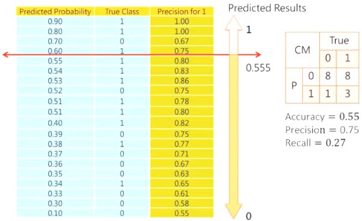
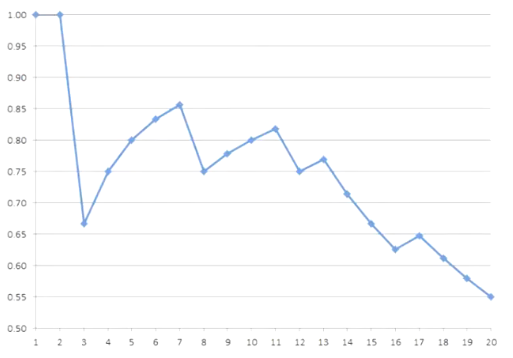

## Gain Chart

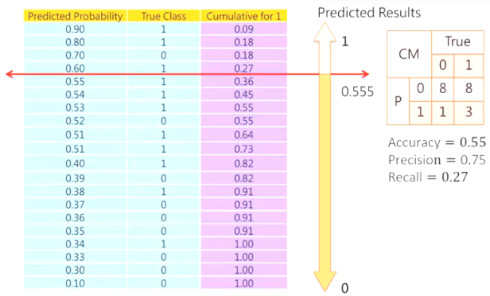
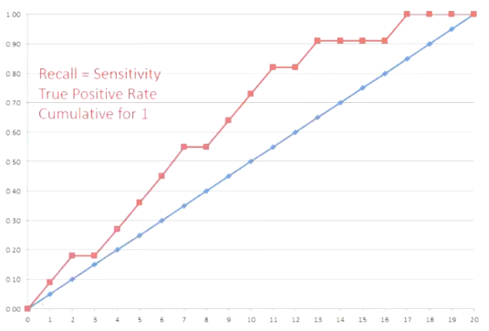
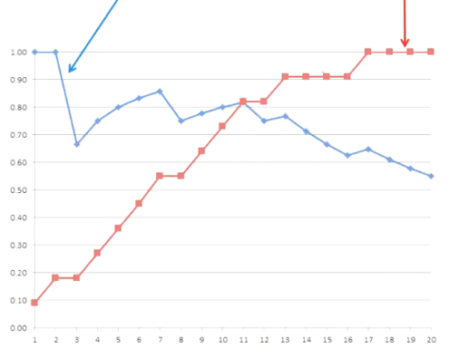

## Lift Chart

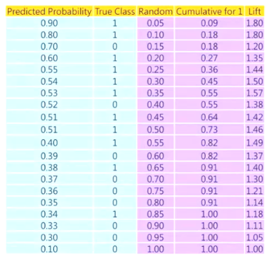
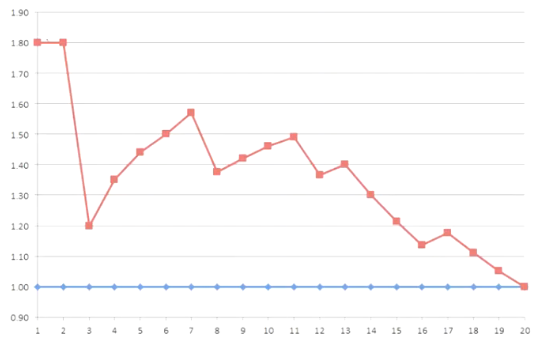

## 回归模型的评估

- MAE (Mean Absolute Error)：$MAE=\frac{1}{n}\sum_{i=1}^{n}\vert y_{i}-\hat{y}_{i}\vert$。
- MSE (Mean Squared Error)：$MSE=\frac{1}{n}\sum_{i=1}^{n}(y_{i}-\hat{y}_{i})^{2}$。
- RMSE (Root Mean Squared Error)：$RMSE=\sqrt{MSE}$。
- R² and Adjusted R²。

- There are two models, A and B, each with two observations.
- Both models have the same MAE, 10; however, MSE would consider Model A (MSE = 100) worse than Model B (MSE = 50).
- Model A has errors of 0 and 10 and thus its MSE is 0^2 + 10^2 = 100.
- Model B has two errors of 5 each, and thus its MSE is 5^2 + 5^2 = 50.
- There is no range for MAE and MSE.

- SST (Total Sum of Squares)：目标字段的总变异，$SST=\sum_{i=1}^{n}(y_{i}-\overline{y})^{2}$。
- SSR (Sum of Squares due to Regression)：目标字段的可解释变异，$SSR=\sum_{i=1}^{n}(\hat{y}_{i}-\overline{y})^{2}$。
- SSE (Sum of Squares due to Error)：目标字段的不可解释变异，$SSE=\sum_{i=1}^{n}(y_{i}-\hat{y}_{i})^{2}$。
- SST = SSR + SSE（总变异 = 可解释变异 + 不可解释变异）。

$R^{2}=1-\frac{SSE}{SST}$，其中$0\leq R^{2}\leq1$表示好的模型。

- 改善 R²评估模型的一些问题：
- 调整的 R²（Adjusted R²→越大越好）
    - $Adjusted R^{2}=1-\left(\left(1-R^{2}\right) × \frac{N - 1}{N - P - 1}\right)$，
    - N：样本数，
    - P：输入字段的个数。
    - 因为增加新的输入字段后，R²会变大，会有高估模型效能的倾向，因此以调整的 R²来作为评估的方式会较理想。
- AIC（Akaike Information Criterion）→越小越好。
- BIC（Bayesian Information Criterion）→越小越好。

