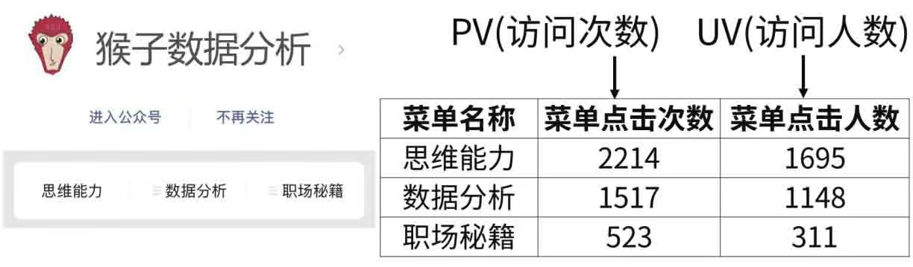
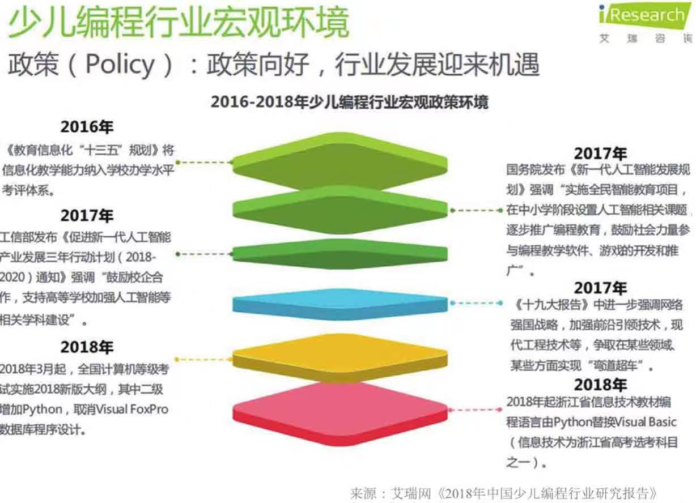
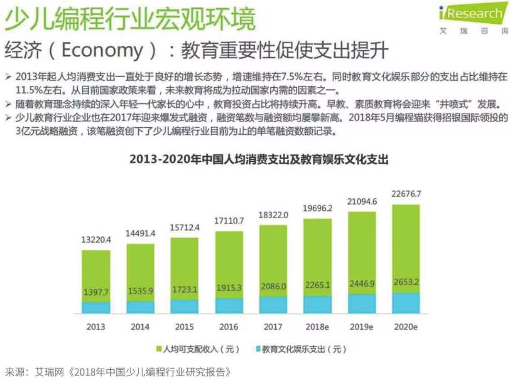
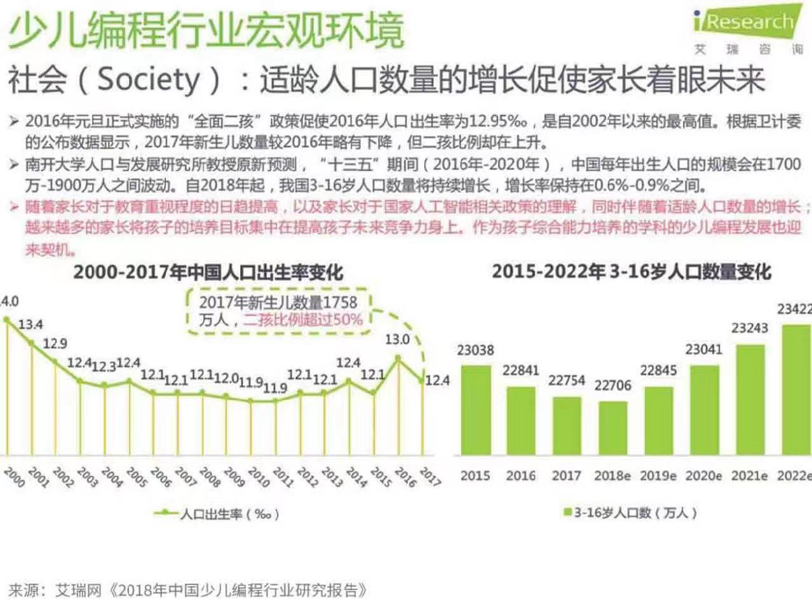
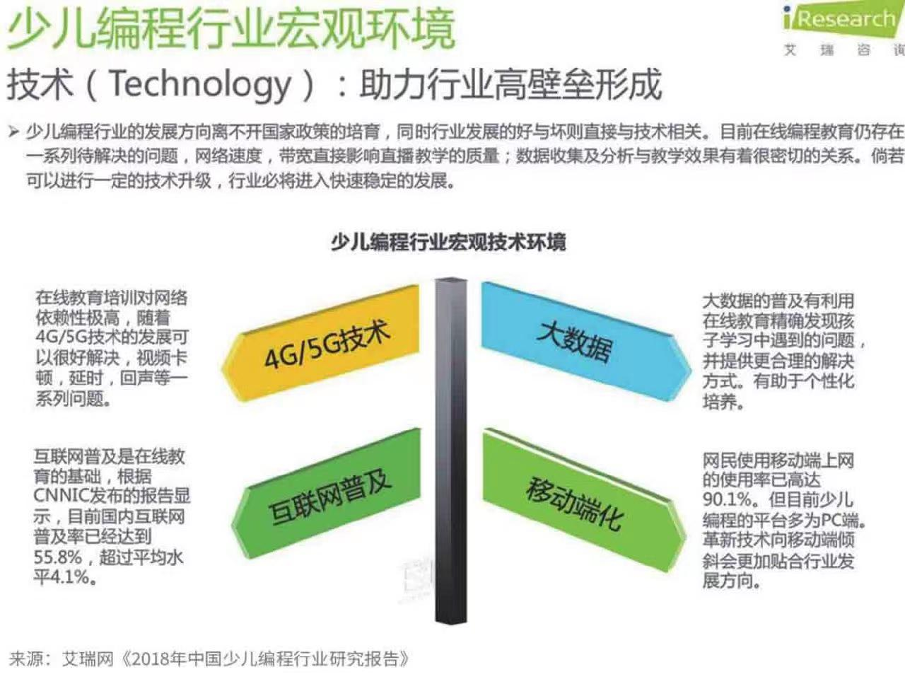

# 同步异步

## 数据分析作用

1. 对过去, 根因分析, 机器除了故障, 是哪个零件有问题
2. 对现在, 决策, 买房应该考虑哪些因素
3. 对未来, 预测, 未来股票是涨是跌

## 用户数据

### 新增用户
日新增用户数

### 活跃用户（不活跃用户）
首先要定义活跃（每日打开app定义为日活跃，每月打开一次app定义为月活跃）
活跃率是指活跃用户在总用户中的占比， 根据时间又可以分为日活跃率，周活跃率，月活跃率等

### 留存用户（流失用户）
新增用户中经过一段时间可能会有一部分用户逐渐流失了，那么留下来的用户就称为留存用户。
留存和流失正好是相反的概念。
首先要定义流失用户，比如把取消关注的用户定义为流失用户，那么继续关注公众号的用户就是留存用户。
 
反应用户留存的指标，用留存率来表示。第1天新增的用户中，在第N天还使用过产品的用户数，除以第1天新增总用户数就留存率。

根据时间留存率可以分为：次日留存率，3日留存率，7日留存率，30日留存率。
第1天新增用户100个，第2天这100个人里有40个人打开过App，那么次日留存率=40/100=40%。如果第7天这100个人里有20个人打开过App，那么第7日留存率=20/100=20%。Facebook有一个著名的40-20-10法则，也就是新用户次日留存率为40%，第7日留存率为20%，第30日留存率为10%，有这个表现的产品属于数据比较好的。

## 行为数据

### PV和UV
PV和UV
PV（访问次数，Page View）：一定时间内某个页面的浏览次数，用户每打开一个网页可以看作一个PV。例如，某一个网页1天中被打开10次，那么PV为10。

UV（访问人数，Unique Visitor）：一定时间内访问某个页面的人数。例如，某一个网页1天中被1个人打开过10次，那么UV是1。虽然这位用户在1天中打开该网页10次，但是这位用户都只能算一个人，所以UV是1，而不是10。

通过比较PV或者UV的大小，可以看到用户喜欢产品的哪个功能，不喜欢哪个功能，从而根据用户行为来优化产品。例如，比较上面的菜单栏点击次数（PV），点击次数最多的菜单名称表示用户最喜欢这个菜单的功能，那么就可以将该菜单放到公众号显著的位置。2）

### 转发率
转发率现在很多产品为了实现“病毒式”推广都有转发功能，转发率=转发某功能的用户数／看到该功能的用户数（图1-13）。例如，公众号推送一篇文章给用户有10万用户打开了文章，其中有1万用户转发了这篇文章，那么该文章转发率=1万（转发这篇文章的用户数）/10万（该文章的UV访问人数）。

### 转化率
例如你有一家淘宝店铺，转化率=购买产品的人数／所有到达店铺的人数。“双11”当天，有100个用户看到了你店铺的推广信息，被吸引进入店铺，最后有10个人购买了店铺里的东西，那么转化率=10（购买产品的人数）/100（到店铺的人数）=10%。
在广告业务中，广告转化率=点击广告进入推广网站的人数／看到广告的人数。例如经常使用百度，搜索结果里会有广告，如果有100个人看到了广告，其中有10个人点击广告进入推广网站，那么转化率=10（点击广告进入推广网站的人数）/100（看到广告的人数）=10%。

### K因子

K因子（K-factor）可用来衡量推荐的效果，即一个发起推荐的用户可以带来多少新用户。K因子=平均每个用户向多少人发出邀请×接收到邀请的人转化为新用户的转化率。假设平均每个用户会向20个朋友发出邀请，而平均的转化率为10%的话，K因子=20×10%=2。当K>1时，新增用户数就会像滚雪球一样增大。如果K<1的话，那么新增用户数到某个规模时就会停止通过自传播增长。

## 产品数据
### 总量
用来衡量业务总量的指标有：成交总额，成交数量，访问时长
GMV（Gross Merchandise Volume），它就是指成交总额，也就是零售业说的“流水”。成交总额包括销售额、取消订单金额、拒收订单金额和退货订单金额。
成交数量对于电商产品就是下单的产品数量。对于教育行业，就是下单课程的数量。
访问时长指用户使用App或者网站的总时长。

### 人均
人均付费=总收入／总用户数，人均付费在游戏行业也叫ARPU（Average Revenue Per User），在电商行业也叫客单价。
付费用户人均付费（ARPPU，Average Revenue Per Paying User）= 总收入／付费人数，这个指标用于统计付费用户的平均收入。
人均访问时长=总时长／总用户数，用于统计每个人使用产品的平均时长。

### 付费
付费率=付费人数／总用户数。付费率能反映产品的变现能力和用户质量。例如，某App产品有100万注册用户，其中10万用户有过消费，那么该产品的付费率=付费人数（10万）/总用户数（100万）=10%。
复购率是指重复购买频率，用于反映用户的付费频率。复购率指一定时间内，消费两次以上的用户数／付费人数。例如，微信收账管理小程序可以帮助商家统计通过微信转账的用户，图1-19是某商家2019年的统计界面，其中累计顾客数（付费人数）是1099，回头客数（重复购买用户数）是46，那么复购率=重复购买用户数（46）/付费人数（1099）=4.2%。

### 产品
常见的几个指标是热销产品数、好评产品数、差评产品数。这里可以根据具体的业务需求，灵活扩展使用。

## 推广付费指标
### 展位广告
展示位广告出现在网站或手机App的顶部、App的开屏等。开屏广告就是当用户打开手机App时，会有几秒的广告时间，例如打开微博、知乎时会先给你展示一个开屏广告。这种类型的广告通常是按展示次数付费（CPM，Cost Per Mille），也就是有多少人看到了该广告。

### 搜索广告
例如搜索引擎（百度等）的关键字搜索广告、电商搜索广告（淘宝直通车等）。广告主为某一个搜索关键词出价，用户看到的搜索结果是按广告主出价的高低来排名的。这种类型的广告是按点击次数付费（CPC，Cost Per Click），也就是有多少人点击了该广告。

### 信息流广告
例如微博、今日头条、知乎、朋友圈（信息流）里的广告。这种广告是根据用户的兴趣爱好来推荐的。这种类型的广告按点击次数付费（CPC）或者按投放的实际效果付费（CPA，Cost Per Action）。按投放的实际效果付费（CPA，Cost Per Action）包括：CPD（Cost Per Download）：按App的下载数付费；CPI（Cost Per Install）：按安装App的数量付费，也就是下载后有多少人安装了App；

CPS（Cost Per Sales）：按完成购买的用户数或者销售额来付费。这几个指标其实就在我们的日常生活中，例如你打开知乎App，在开屏的几秒展示的广告叫作按展示次数付费（CPM）；你对这个广告感兴趣，点击了广告，叫作按点击次数付费（CPC）；看到广告里的介绍，你没忍住下单购买了商品，叫作按投放的实际效果付费（CPA）。在决定将产品投放到哪个渠道的时候，要清楚你的目标用户是谁，目标用户在哪。如果你是一款为企业服务的软件，在娱乐网站打广告就非常不合适。目前主流广告平台都支持这三种方式的付费：按展示次数付费（CPM）、按点击次数付费（CPC）和按投放的实际效果付费（CPA）。广告主可以按自己的产品需求来灵活选择。一般来说，如果是推广一个新的产品，要选择按App的下载数付费（CPD）。因为新产品还没有人知道，用下载数来衡量，是比较划算的。等有一定的品牌影响力积累了，再用按点击次数付费（CPC）或者按投放的实际效果付费（CPA）。

## 分析方法
### 5w2h

### 逻辑树分析

### 行业分析方法
PEST分析方法是对公司发展宏观环境的分析，所以经常用于行业分析。通常是从政策、经济、社会和技术这四个方面来分析的
政治（policy），经济（Economy），社会（society），技术（Technology）

### 多维度拆解分析

### 对比分析方法
A/B测试的背后也是用了对比分析方法。什么是A/B测试？做过App功能设计的读者朋友可能经常会面临多个设计方案的选择，例如某个按钮是用蓝色还是黄色，是放左边还是放右边。传统的解决方法通常是集体讨论表决，或者由某位专家或领导来拍板，实在决定不了时也有随机选一个上线的。虽然传统解决办法多数情况下也是有效的，但A/B测试可能是解决这类问题的一个更好的方法。简单来说，A/B测试就是为同一个目标制定两个版本，这两个版本只有某个方面不一样，其他方面保持一致。例如两个版本只有按钮的颜色不一样，让一部分用户使用A版本（实验组），另一部分用户使用B版本（对照组）。试运行一段时间后，分别统计两组用户的表现，然后对两组数据进行对比分析，最后选择效果更好的版本正式发布给全部用户（图2-46）。

A/B测试是怎么来的呢？2007年，谷歌的产品经理丹·西罗克是奥巴马竞选团队“新媒体分析部门”的负责人。他用A/B测试优化了竞选网站的“捐款”按钮，使得捐款金额增加了5700万美元。他对这个“捐款”按钮做了什么呢？西罗克在奥巴马捐赠页面上进行了A/B测试，发现：（1）对于第一次访问竞选网站的用户，按钮文字是“捐赠并领取礼物”效果最好；（2）对于长期访问竞选网站，但是从来没有捐款的用户，按钮文字是“捐款”效果最好；（3）对于过去曾经捐过款的用户，按钮文字是“捐助”效果最好。在奥巴马就任总统后，西罗克创办了一家网站优化公司（Optimizely），这家公司的客户名单里是各个总统的竞选团队。现在A/B测试已经广泛应用于互联网公司的产品优化。例如，缤客是一家线上国际旅游公司，类似于携程。这家公司每年要做大量的A/B测试来提升用户体验。这家公司是如何做A/B测试的呢？一般而言，如果一家公司要做A/B测试，要设立一个专门的团队。但是缤客通过内部一个专门做A/B测试的平台，把A/B测试这件事情变得简单，几乎每个员工都可以方便地进行各种测试来验证自己的想法。在这家公司做A/B测试的流程是这样的：（1）发起申请，在申请里写清楚：为什么做这次A/B测试？A/B测试的受益者是用户还是旅行社？以前做过哪些A/B测试？（2）如果申请通过，A/B测试就上线了。平台会自动监控测试过程和生成分析报告。再来看一个案例。在经济形势不好的时候，拉动消费有一个办法是发消费券。用户领取消费券后，在结账的时候就可以抵扣对应的金额。但是消费券还有个不好的影响—日本曾经向用户发放过消费券，但是效果却不好。因为一旦不发消费券了，消费很快就会下降，也就是没有长期效果。为了拉动受疫情影响的消费，杭州在2020年3月底到4月向本地居民发放了消费券，效果如何呢？北京大学光华管理学院的研究团队和蚂蚁金服研究院联合发布的一份报告，对这次消费券发放效果进行了研究。研究团队使用的方法就是A/B测试。实验组是杭州3月27日第一期消费券发放后的用户，对照组是没有领消费券的用户。在消费券过期后，与对照组相比，实验组的消费没有明显减少。也就是说，用户并没有因为之前用了消费券，之后就减少消费，所以这次消费券发放效果很好。这次效果好的原因在于，之前日本发的是实体现金券，而这次杭州发的是数字消费券。数字消费券的一大好处就是方便，用户在支付宝、微信等平台上就能领取。

### 假设检验分析方法

### 相关分析方法

### 群组分析方法（同期群分析方法）
群组分析方法”（也叫同期群分析方法）是按某个特征，将数据分为不同的组，然后比较各组的数据，说白了就是对数据分组然后来对比。这个分析方法在我们生活中经常可见，例如，在学校上体育课的时候，体育老师考虑到男生和女生的运动项目不一样，会把男生分为一组打篮球，女生分为一组跳绳。这其实是按性别

### 假设检验

