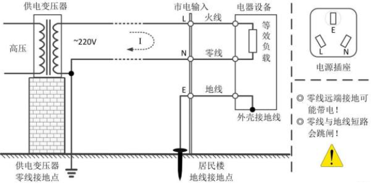

# 装修

## 准备阶段

### 主材与辅材

1. 辅材: 装修看不见的材料, 如水管, 电线, 水泥砂浆.
2. 主材: 装修看得见的材料, 如瓷砖, 地板, 洁具, 卫具.

### 全包半包清包

装修主要分为: 设计 + 施工 + 材料三大部分. 根据每个部分负责人不同可分为:

1. 全包: 商家负责施工+辅材+主材
2. 半包: 商家负责施工+辅材
3. 清包: 商家负责施工

### 硬装和软装

1. 硬装: 固定的, 如水电, 墙面, 地面, 洁具, 卫具
2. 软装: 移动的, 如沙发, 茶几, 摆件, 绿植

## 设计

### 预算

1. 设计费
2. 人工
3. 辅材
4. 主材: 门窗, 地面(瓷砖, 地板, 踢脚线, 美缝), 墙面(瓷砖, 瓷片, 墙纸, 墙布, 乳胶漆), 洁具卫具灯具, 开关
5. 暖通: 中央空调, 风管机, 地暖, 新风, 全屋净水
6. 定制(成品): 橱柜, 鞋柜, 衣柜, 餐边柜
7. 家电: 空调, 冰箱, 洗衣机, 油烟机

### 设计图纸

1. 平面布置图
2. 施工图
3. 效果图

## 硬装

### 拆改(杂工)

1. 拆: 用石膏板和保护膜遮盖好保护的地方
2. 砌: 红砖
3. 补: 补有损坏的地方

### 墙固地固

涂界面剂, 把墙面的的粉尘锁住, 让基层材料和面层材料更加的贴合

### 放线

1. 标记所有开关插座, 灯线, 灯槽, 吊顶, 窗帘盒, 家具, 家电, 新建墙体的实际位置和尺寸.
2. 吊顶完成线, 门洞完成线, 墙面找平完成线, 贴砖完成面, 水平基准线.

### 水(水电工)

1. 水的分类

    1. 给水: 直径25的PPR管, 要求不漏, 打压测试
        1. 左热水
        2. 右冷水
    2. 排水: 直径75, 110, PVC管, 要求不漏不堵不臭.
        1. 排废水: 洗手盆, 洗菜盆, 地漏
        2. 排污水: 马桶

2. 安装位置

    走地走天皆可, 弯头连接件是直角, 所以只能横平竖直

### 电(水电工)

1. 电的分类

    1. 强电:
        1. 种类
            1. 火线: 电路中输送电的电源线。
            2. 零线: 变压器二次侧中性点（N）引出的线路，与相线（L）构成回路，对用电设备进行供电。通常情况下，零线在变压器二次侧中性点（N）处与保护地线（PE）重复接地（PEN），起到双重保护作用。
            3. 地线: 不用于工作回路，只作为保护线。利用大地的绝对“0”电压，当设备外壳发生漏电，电流会迅速流入大地，即使发生PE线有开路的情况，也会从附近的接地体流入大地。（从变压器中性点接地后引出主干线并每间隔20-30米重复接地）

            

        2. 粗细, 回路配电箱二级开关.  口诀: 二点五以下乘以九, 往上减一顺号走
            1. 1.5平方承载电流: 1.5 * 9 = 13.5A, 3000W, 照明回路
            2. 2.5平方承载电流: 2.5 * 9 = 22.5A, 5000W, 普通插座
            3. 4平方承载电流: 4*8 = 32A, 7000W, 厨卫, 普通空调
            4. 6平方承载电流: 6*7 = 42A, 9000W, 中央空调
            5. 地线建议2.5平方
        3. BV单股硬线, 没必要BVR多股软线
        4. 电线管PVC
        5. 智能开关: 零火版智能开关, 记得接零线

    2. 弱电: 电话线, 闭路线, 网线(六类线, 每个房间都留包括厨房, 卫生间)

2. 安装位置

    走地走天走墙皆可

    1. 墙面横平竖直, 避免打钉误碰
    2. 地面没必要横平竖直, 但是横屏竖直好看, 价格差不多

### 泥瓦(泥瓦工或木板工)

1. 砌墙
2. 包管, 把裸露的下水管包起来
3. 回填, 下沉式卫生间. 建筑余料回填(推荐), 发泡水泥回填(推荐), 陶粒回填,  架空回填
4. 找平
5. 找坡
6. 防水, 容易漏水的地方刷防水涂料, 有地漏排水的地方都做防水
7. 瓷砖, 结实耐用好打理, 导热快

    1. 瓷片: 尺寸小, 密度高, 吸水率高, 质量差, 价格低. 用于墙面, 如厨房, 卫生间
    2. 瓷砖: 尺寸大, 密度低, 吸水率低, 质量好, 价格高. 用于地面

    不要地砖上墙, 不要过门石, 要美缝(亚光砖用环氧彩砂)

8. 地板, 不用水泥, 直接扣上去卖地板的贴. 不耐脏, 导热差, 不耐潮, 易变型.

    1. 强化复合地板: 基材是密度板, 饰面是三聚氰胺纸贴面
    2. 实木复合地板:
        1. 多层实木复合地板: 基材多层板, 饰面贴皮
        2. 三层实木复合地板: 上下两层用木板, 中间木条拼接, 饰面用贴皮
    3. 实木地板: 基材是实木, 饰面刷漆. 要打龙骨.
    4. WPC: Wood Plastic Composite, 木头和塑料, 未普及
    5. SPC: Stone Plastic Composite, 石头和塑料

9. 踢脚线

    1. 功能
        1. 装饰作用
        2. 防脏

        ✨无踢脚线造价较高

    2. 材质:

        1. PVC
        2. 竹木纤维
        3. 金属
        4. 瓷砖
        5. 实木

        前3中, 可卡扣, 牢固不容易掉, 可预埋电线

### 木作(木工)

1. 窗帘盒, 美观
2. 吊顶, 美观走线
    1. 石膏板, 客餐厅, 卧室
    2. 铝扣板, 集成吊顶, 厨房, 卫生间
    3. 龙骨选轻钢龙骨

### 油漆(油漆工)

1. 刮两层腻子找平
2. 打砂
3. 1层底漆
4. 2层面漆

✨墙不要贴砖; 不用墙纸; 墙布性价比低, 不好修补; 硅藻泥, 性价比低; 艺术涂料, 贵; 集成墙板不推荐

### 硬装的独立部分

1. 暖通

    1. 空调:

        1. 中央空调: 一台外机拖多台内机
        2. 风管机: 一台外机拖一台内机
        3. 分体式空调: 一台外机拖一台内机

    2. 取暖:

        1. 空调
        2. 暖气片
        3. 地暖
            1. 水地暖热得慢, 电费低
            2. 电地暖热得快, 电费高.

    3. 新风:

        1. 管道式: 好看, 贵
        2. 壁挂式: 不好看, 便宜

    4. 净水系统:

        1. 入户净水: 过滤杂质, 反冲洗前置过滤器
        2. 软水: 过滤水垢
        3. 饮用净水: 过滤金属细菌

2. 窗

    1. 开启方式

        1. 推拉窗: 推拉方向左右或上下, 不占空间, 开启面积大, 通风效果好. 密封差, 不保温, 不隔热. 价格贵.
        2. 悬窗: 上悬, 中悬, 下悬. 开启角度小.
        3. 平开窗: 内开, 外开. 可以结合悬窗, 做内开内倒, 或外开外悬

            比较|内开|外开
            --|--|--
            屋内面积|遮挡, 但可购买180度|不遮挡
            清洁|方便|不方便
            纱窗|方便, 美, 便宜|不方便, 丑, 贵
            结构|简单|在内开基础上拓展, 复杂

    2. 材质

        1. 木窗, 淘汰
        2. 铝合金门窗, 没有隔热条. 耐腐蚀, 不生锈, 不容易变形. 缺点传冷传热太快
        3. 塑钢窗, 外面是PVC塑料, 里面添加钢衬. 隔热好, 缺点是容易变形.
        4. 断桥铝(推荐), 铝框从中间断掉, 加入隔热层
        5. 断桥钢, 贵

    3. 性能

        1. 抗风压(安全)
        2. 水密(防水)
        3. 气密(防风)
        4. 保温: $K<2.5W/(m^2*K)$
        5. 隔声: $Rw+Ctr \ge 45dB$

    4. 配置
        1. 结构: 窗纱一体纱窗宽度会占用宽度, 所以窗纱一体个效果一般不如单窗, 所以推荐单体窗+外挂纱窗.
        2. 型材: 
            1. 铝合金:
                1. 选择`原生铝`, 不选再生铝
                2. 型材壁厚选择`1.8mm`
                3. 窗口内`一体折弯`
            2. 胶条:
                1. 中间等压胶条: 搭接隔热条, `选择PA66`不要PVC, 韧性, 硬度高
                2. 中间密封胶条: 选`硫化焊接工艺`, `三元乙丙材质`
                3. 室外侧止口胶条: 挡室外水
                4. 室内侧止口胶条: 阻隔残余水分蒸发回流(隐藏合页)
        3. 玻璃: 由玻璃厂生产, 选择带`3C认证`的, 原片场: 南玻, 台玻, 耀皮, 信义. 区别不大.
            1. 保温: 热传导(物体, 中空玻璃), 热对流(空气, 中空冲氩气), 热辐射(真空, Low-E)
                1. 中空(合片), 双玻一腔(入门), 三玻两腔(中端), 四玻三腔(极致), n玻n-1腔
                2. 充氩气(5%)
                3. Low-E(10%): 镀银, 反射热辐射

                ✨冷边条, 如果选暖边条(TPSS), 必须双选冲氩气和Low-E, 因为TPSS
                ✨Low Emissivity Glass(LOW E)
            2. 隔声:
                1. 三玻夹胶一中空(中配)
                2. 选`四玻双夹胶一中空`

        4. 五金
            1. 合页
                1. 明装合页, 破坏室内侧止口胶条的完整性
                2. 暗装合页(铰链), 做到180度开启
            2. 执手, 无底座
            3. 智能开关?
        5. 纱窗
            1. 形式
                1. 卷轴(平开, 推拉), 强度不够, 容易坏
                2. 推拉(推拉)
                3. 框中框(内开), 不能开, 只能拆卸
                4. 平开
            2. 材质
                1. 金刚网, 防护性高, 影响采光通风
                2. 选择`高透网`, 防护性低, 采光透风好
        6. 品牌
            1. 富轩: 10年起雾免费换, 25年超长质保
            2. 博仕, 正金, 新豪轩, 仅自爆, 起雾不赔

    5. 个人配置

        1. 单体内开窗, 外挂, 高透纱窗
        2. 四玻双夹胶一中空
        3. 无底座执手, 180暗装合页

3. 门

    1. 位置分类
        1. 卧室门
        2. 卫生间门
        3. 厨房门

    2. 材质

        1. 木门: 保温, 隔音
            1. 实木门
            2. 实木复合门: 上下两面用实木薄板, 中间用其他材料填充(蜂窝纸板, 密度板, 桥动力学板, 实木填充)
        2. 金属门: 不怕潮, 不怕水

    3. 组成

        1. 门板
        2. 门框
        3. 门套

## 软装

### 木具定制

1. 设计
2. 板材
    1. 基材: 木头+胶, 区别在于是木头粉末, 颗粒, 木条还是木板

    2. 饰面: 区别在于实木皮, 纸皮, 塑料皮贴面, 还是刷漆, 烤漆, 刷木蜡油
        1. 贴面: 三聚氰胺纸, PVC覆膜, PET吸塑, 实木贴皮
        2. 涂料: 烤漆(汽车工艺, 贵), 刷漆(清漆, 混油), 木蜡油(渗透到木材里, 更环保美观)

    3. 性能
        1. 环保性, 甲醛, 用胶越少越好. 环保等级: E1 E0 Enf
        2. 稳定性, 是否容易出现形变
        3. 握钉力, 钉子在板材上钉的牢不牢
        4. 防潮度, 木材密度和饰面防水影响

    4. 分类
        1. 实木: 实木板材, 多块木材拼贴而成
            1. 密度板(纤维板): 木头粉末+胶水
            2. 颗粒板(刨花板): 木头颗粒+胶水
            3. 欧松板(OSB板): 大刨片+MDI胶
            4. 多层板: 木头薄片+胶水
            5. 生态板(大芯板): 将木方粘贴成整板上下贴一层薄木板
            6. 实木板: 多块木板(仅横向或者纵向拼贴)+胶水
        2. 原木: 实木锯材, 一整块锯下来的完整木头

        维度|环保|形变|握钉力|防潮|外观|价格
         ---- | ---- | ---- | ---- | ---- | ---- | ----
        决定因素|胶水|稳定性|木材结构|木材密度/饰面/封边|木材纹理/雕刻|成本
        第一梯队|实木板|颗粒板/欧松板/密度板|实木板/多层板/欧松板|多层板/实木板|实木板纹理|颗粒板/密度板
        第二梯队|生态板/多层板|实木板/多层板|颗粒板|颗粒板/欧松板|实木板和密度板雕刻|欧松板/多层板/生态板
        第三梯队|颗粒板/欧松板/密度板|生态板|密度板/生态板|生态板/密度板|其他靠贴面|实木板

        ✨颗粒板多层板性价比高

        板材类型选择:

        3. 方案一（不推荐）: 全部选用颗粒板
        4. 方案二（推荐）: 橱柜浴室柜的柜体选用多层板，其他全部选用颗粒板
        5. 方案三（推荐）: 所有柜体全部选用多层板，所有柜门全部选用颗粒板

    5. 品牌

        1. 国产大牌：兔宝宝、千年舟、莫干山、露水河、大亚、大王椰、万华等
        2. 进口大牌：爱格、可丽芙、克诺斯邦等

3. 加工
4. 配件

    1. 五金配件: 合页, 衣通, 拉手, 滑轨, 拉直器, 拉篮, 碗篮, 水槽, 水龙头

        1. 国内品牌: 东泰, 悍高, 顶固, 诺米
        2. 国外品牌: 百隆, 格拉斯, 海蒂斯, 海福乐, 萨郦奇

    2. 台面:

        1. 石英石
        2. 不锈钢(不推荐)
        3. 岩板, 贵. 品牌: 冠珠, 一诺, 中盛, 德利丰, 蒙娜丽莎

    3. 洗菜盆: 不锈钢下盆
    4. 洗手盆: 陶瓷一体

5. 安装

### 窗帘

1. 样式:

    1. 滑轨+窗帘盒(推荐)
    2. 罗马杆

2. 材质:

    1. 涤纶: 卧室 垂感好, 耐用, 遮光度高, 抗皱, 易清洗, 不透风, 不贵.
    2. 亚麻: 书房 透光, 透风, 抑菌, 清洗麻烦, 易皱, 缩水
    3. 棉麻: 客厅 和亚麻类似
    4. 丝绒: 垂感好, 厚重, 遮光, 吸音, 保温隔热, 实惠, 比较容易沾灰
    5. 百叶帘: 厨房, 卫生间, 防水防潮

### 床垫

1. 棕垫
2. 弹簧垫
    1. 面料层(最好能拆解)
    2. 铺垫层(最好能拆解)
    3. 弹簧层
        1. 独立袋装弹簧: 翻身不影响旁边人
        2. 整网弹簧: 翻身影响别人

### 家用电器

1. 抽油烟机
    1. 风量
    2. 风压
    3. 吸烟口位置
2. 燃气灶
    1. 不要集成灶, 沸水进入电路板, 不容易清理, 高度集成故障率高

    1. 热负载
    2. 热效率

3. 洗碗机
    1. 安装方式: 嵌入式, 水槽式, 独立式
    2. 洗涤方式: 喷淋式, 超声波式
    3. 烘干方式: 冷凝, 热交换, 热风, 晶蕾
    4. 容量: 6套, 8套, 12套
    5. 杀菌
    6. 存碗
4. 冰箱
    1. 尺寸: 嵌入式是从底部散热, 普通是从背部散热
    2. 分区
    3. 制冷方式: 直冷(老式采用), 风冷, 风直混冷
    4. 循环系统: 一个风机配一个循环器. 双循环是冷藏, 冷冻独立, 不容易串味
    5. 定频变频: 变频噪音更低, 耗电小
    6. 能效等级: 1级
    7. 保鲜方式: 湿度, 温度, 含氧量
5. 洗衣机
    1. 洗净原理: 滚筒, 波轮
    2. 洗净比: 不用在意
    3. 电机: 直驱BLDC(推荐), DD
    4. 容量: 10公斤
