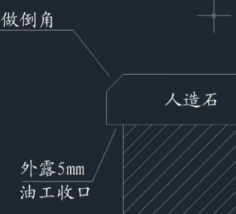
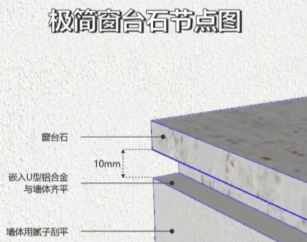
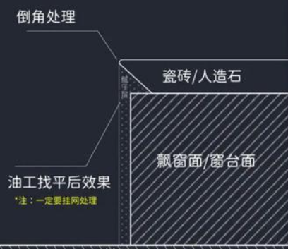
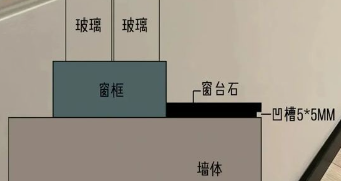

# 窗台石

## 最佳实践

1. 窗台石(如果瓷砖美缝能做到一体也可以考虑)
2. 使用U型铝合金内凹

## 安装时间

第一次刷乳胶漆之前安装, 避免现场切割的粉尘飞到墙面

## 材质选择

1. 天然大理石: 硬度不均匀, 天然开裂, 纹理好
2. 人造大理石: 颜色多
3. 瓷砖: 造价便宜, 施工方便, 注意`美缝`
4. 岩板
5. 石英石: 硬度高, 刮不花
6. 木质材料: 简单便捷, 易潮

## 结构

1. 小耳朵: 方便安装窗套, 没有窗套就不需要
2. 比墙面突出: 不同材质, 连接处容易开裂
3. 下挂: 水会顺着下挂直接滴到地上, 防止水流到墙上

    不要下挂的两种做法:
    1. 直接比墙面多出5mm, 但不要下挂. 有水顺着流到墙面的风险, 但不大

        

    2. 内凹(使用U型铝合金或直接切割), 因此也要注意墙面刷漆时要挂网. 内凹的部分容易积灰, 解决办法是凹陷部分石膏填平
        1. U型铝合金

            

        2. 直接切割45度, 或者

            

        3. 和铝合金一样做个凹槽

            

4. 上平面屋内侧线打磨做倒角

## 参考

1. https://www.163.com/dy/article/J4SL4DUR0540B07R.html
2. https://www.bilibili.com/video/BV1da411h79P
3. https://www.bilibili.com/video/BV14u411P7ZU
4. https://www.bilibili.com/video/BV1k14y1r7ag