# 集合符号

方法论(methodology)是关于方法(method)的学问(-ology=a field of study)。是关于人们认识世界、改造世界的方法的理论, 是研究方法的学说。
1. 世界观主要解决世界`是什么`的问题
2. 方法论主要解决`怎么办`的问题。

方法是人们实现特定目的的手段或途径. 方法论是`理论`，是`学说`。但是这个理论/学说，研究的主要内容是`方法`。比如:

1. 找寻达成目的的方法, 即研究有没有方法的问题
2. 达成目的有ABC三种方法, 哪个更优, 即研究最优方法的问题
3. 随着时间推移, 方法有没有优化空间, 研究方法优化的问题

各行业的方法论:

1. 哲学家的方法论指, 按规律办事中的`规律`
2. 科学家的方法论指, 数学模型
3. 企业家的方法论指, 流程

## 底层方法论

上层的具体方法论都是根据底层的抽象方法论建立起来的

### 主观和客观, 个人和他人

1. 个人
    1. 主观: 故意, 过失, 意外, 不可抗力
    2. 客观: 自己的行为以及结果
2. 他人
    也可以说是环境, 社会, 也属于客观的范畴

断舍离:

1. 断, 与个人的主观情绪, 如物喜己悲的情绪
2. 舍, 与外在的物, 如无用的物品
3. 离, 与外在的人, 如无效的社交

个人他人的损益:

1. 损人损己的事情: 理性一点就不会做
1. 损人益己的事情: 道德一点就不会做
1. 益人益己的事情: 不好找
1. 益人损己的事情: 很高境界

主观客观的想要与需要:

1. 主观不想要客观不需要的事情: 当然不做
1. 主观想要客观不需要的事情: 理性决定不做
1. 主观不想要客观需要的事情: 理性决定做
1. 主观想要客观需要的事情: 当然做

### 主要矛盾, 次要矛盾, 矛盾的相互转换

机会成本, 主要矛盾就是机会成本大的, 次要矛盾就是机会成本低的
可以量化组主要矛盾和次要矛盾对事件的影响, 如果各自占50%, 则矛盾量相当

## 上层方法论

### 学习方法论

笔记
什么时候要整理,
不能写一句, 整理一句, 力求每一句完美. 可以在适当的情况下停下来整理.

比如在章, 节为单位, 停下来整理已经学习过的内容.

## 天地人

1. 天, 不是天空, 是天命, 命运(个人的客观部分)
2. 地, 不是土地, 是自然(他物)
3. 人, 就是其他人, 社会(他人)

教员说, 与天斗其乐无穷, 与地斗其乐无穷, 与人斗其乐无穷.

## 学习与考试的关系(理论思维和实践思维)

学习的模式(理论思维)是: 知识 -> 问题(理论 -> 实践)
考试的模式(实践思维)是: 问题 -> 知识(实践 -> 理论)

理论联系实际包含两个方面:
1. 理论的具体内容, 某个具体的理论内容是否符合实践内容
2. 实践到理论的联系关系, 如果从实践中快速检索到所需要的理论
3. 理论到实践的联系关系, 如果从理论中快速检索到对应的实践

# 做事方法

1. 首先论证合理性(存在与否)

    首先从逻辑推导: 一个事情, 做了之后, 会不会有效, 存不存在这样的效果

2. 其次论证有效性(程度大小)

    根据整体的占比, 估算整体的效果. 比如100人中, 有一个1人有问题, 我们针对这个人的优化成果平均到100人上, 是多少?

## 知道不知道

“你知道你知道”表示对某些事物有着明确且自信的认知，例如熟练掌握的专业技能。
“你知道你不知道”体现了一种有自知之明的状态，知道自己在某些方面存在知识或经验的不足，就像明白自己对某种外语不够精通。
“你不知道你知道”意味着某些知识或经验已经存在于潜意识中，但尚未被清晰地意识到，直到特定情境触发才会显现出来。比如，在解决一个难题时，突然运用到了很久以前学到但未曾想起的知识。
“你不知道你不知道”则反映了一种认知的盲区，对某些领域或问题完全没有意识到自己的无知，这可能会限制个人的发展和学习。比如对于一个全新的前沿科技领域，可能根本没有意识到自己对其一无所知。
这四种认知状态提醒我们要不断反思和探索自己的认知边界，努力将“不知道”转变为“知道”，并挖掘那些潜在的“不知道自己知道”的知识和能力。您对这几种认知状态有什么特别的感受或想法吗？

1. 知道知道

    一个问题, 知道有处理方法, 且已经掌握了该处理方法

2. 知道不知道

    遇到问题, 知道有处理方法, 但自己尚未掌握, 可索引去学习

    完整的读API文档, 就是在解决不知道不知道的问题. 以pandoc为例, 在平时的使用中不知道有`--number-sections`选项可以给标题直接加数字. 只有通过阅读整个API才能将不知道不知道转化为知道知道.

3. 不知道不知道

    遇到问题, 不知道如何处理, 且不知道有无方法能解决该问题

3. 不知道知道

    遇到问题, 一时忘记了解决办法, 但实际已经掌握了该方法. 换句话说是没将已经掌握的方法和对应的问题对应起来

方法是理论, 问题是实际, 方法解决问题, 就是理论联系实际.

## 人的情绪分类
1. 喜
2. 怒
3. 哀
4. 惧

## 坚决果断的错, 也不能犹豫不决的对

## 知识点的串并联

一道考题考察串联知识点是指: 知识点前后有依赖关系
一道考题考察并联知识点是指: 知识点前后没有依赖关系, 是并行, 堆积

## 一个章节的分类

1. 知识区: 书本的原本, 加一些自己的间接
2. 考点区: 根据考题总结的考点
3. 考题区: 区分不同的考题, 比如判断题, 案例题, 问答题等.

    ✨注意这里没有选择题, 因为选择题的本质是多个判断题的组合. 由于选择题多个选项会跨越多个章节, 所以把他们拆分成不同的判断题放在对应的章节里更加合适

## 方法论与方法

方法论是研究方法的方法.

比如一个问题有ABC三个方法, 通过比较选择最优的方法A的过程就是方法论.

## 想象空间, 语言空间, 现实空间

意思, 表示, 事物

如何让语言准确表达想象空间, 从而唯一确定现实空间.

## 事情分解

## 所有的事情都可画流程图, 用实体和关系来表示

思路最终最重要, 思路就是实体和关系的图

## 论文结构

1. 是什么(提出问题, 问题是什么)
2. 为什么(分析问题, 产生问题的原因)
3. 怎么办(解决问题, 解决问题)

## 概念

了解事物的思路

- 概念
    - 性质(常见于数学)
    - 特点(常见于一般概念)
    - 步骤

## 思路逻辑

思路是最精简的逻辑表达

## 写作的目的

1. 让对面理解一个概念, 这时就要考虑对方的知识水平, 是否要从理论的基础讲起, 还是可以从理论的中间部分讲起.

