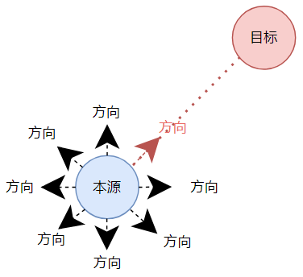
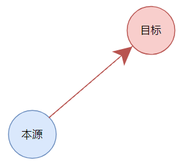

# 目标和方向和努力

## 最佳实践

1. 做一件事关键在于制定目标, 目标一定是可验证的:
    1. 不可验证的目标
        1. 提升自己的编程架构水平
        2. 提升自己的法律水平
    2. 可验证的目标
        1. 通过高级架构师考试
        2. 通过法律职业资格考试
2. 有了目标, 才会有方向, 方向就是指方法
3. 努力的一定在对的方向上, 如果方向错了, 可能越努力离目标越远.

## 目标和方向和努力的关系

### 本源

本源就是当前的状态

### 无目标的本源

无目标的本源, 会有很多的方向

### 有目标的本源

有目标的本源, 方向就唯一确定

### 有方向的前进

朝着方向努力即可达成目标

