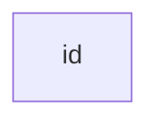
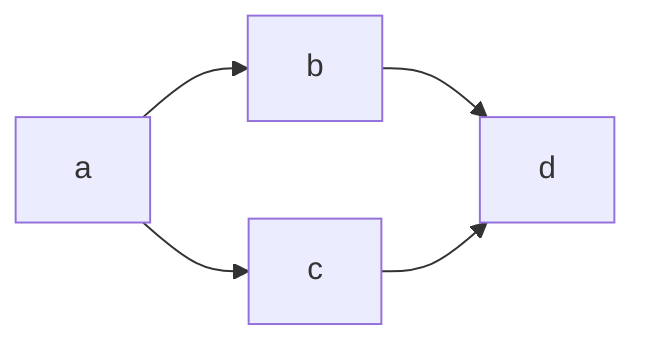
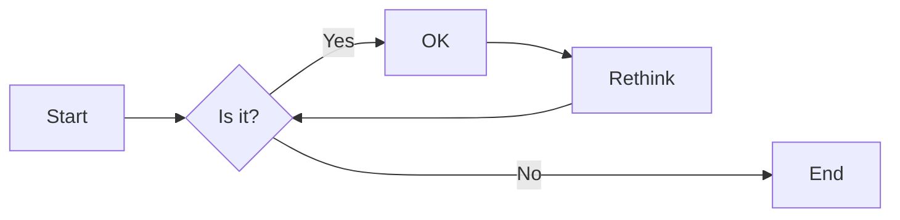
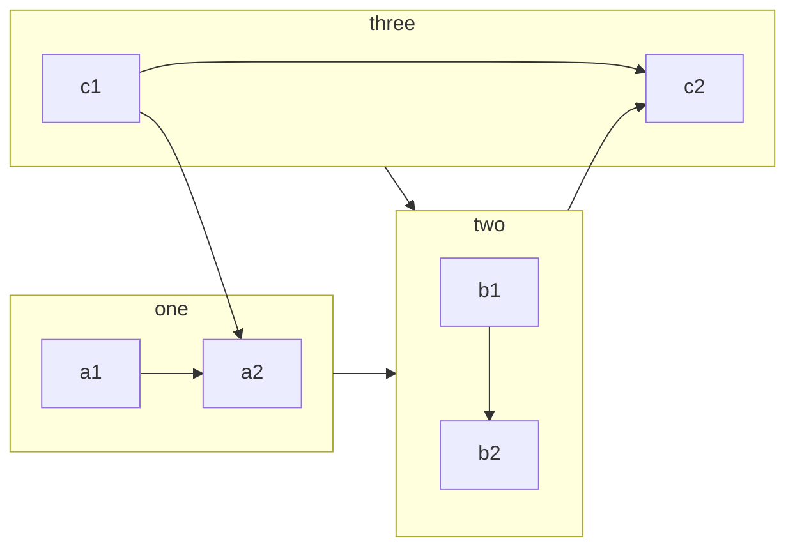

# flowchart

# 流程图(flowchart)
使用[mermaid](https://mermaid.js.org/)的优势是比较迅速的作图, 缺点不能控制图形的位置. 可以[在线制作](https://mermaid.live/edit)

## 流程图介绍

流程图由由节点和连线组成.  
使用`graph`指定流程图类型.  
使用`L(left)`, `R(right)`, `T(top)`, `B(bottom)`指定流程图的方向.

1. TB - top to bottom
2. BT - bottom to top
3. RL - right to left
4. LR - left to right

## 绘制节点

### 绘制一个节点
```
graph LR;
    id
```



### 给节点添加内容
```
graph LR;
id1[This is the text in the box]
```


### 更改节点形状

1. 圆角矩形(round edges)

    ```
    graph LR;
    id1(This is the text in the box)
    ```

    ```mermaid
    graph LR;
    id1(This is the text in the box)
    ```

2. 圆形

    ```
    graph LR;
    id1((This is the text in the circle))
    ```

    ```mermaid
    graph LR;
    id1((This is the text in the circle))
    ```

3. 菱形(rhombus)

    ```
    graph LR;
    id1{This is the text in the box}
    ```


    ```mermaid
    graph LR;
    id1{This is the text in the box}
    ```


## 连线绘制

### 连线形状

1. 箭头直线

    ```
    graph LR;
    A-->B
    ```


    ```mermaid
    graph LR;
    A-->B
    ```

2. 无箭头连线

    ```
    graph LR;
    A --- B
    ```


    ```mermaid
    graph LR;
    A --- B
    ```

3. 虚线

    ```
    graph LR;
    A-.->B;
    ```


    ```mermaid
    graph LR;
    A-.->B;
    ```

4. 加粗连线

    ```
    graph LR;
    A ==> B
    ```


    ```mermaid
    graph LR;
    A ==> B
    ```

### 连线添加文字

1. 箭头文字

    ```
    graph LR;
    A-->|This is the text|B
    ```


    ```mermaid
    graph LR;
    A-->|This is the text|B
    ```

2. 无箭头直线

    ```
    graph LR;
    A---|This is the text|B
    ```

    ```mermaid
    graph LR;
    A---|This is the text|B
    ```


3. 虚线文字

    ```
    graph LR;
    A-.-|This is the text|B
    ```

    ```mermaid
    graph LR;
    A-.-|This is the text|B
    ```


4. 加粗文字

    ```
    graph LR;
    A===|This is the text|B
    ```


    ```mermaid
    graph LR;
    A===|This is the text|B
    ```

## 组合

```
graph LR;
a --> b & c--> d
```





## 控制连线的长度

Length|1|2|3
--|--|--|--
Normal|---|----|-----
Normal with arrow|-->|--->|---->
Thick|===|====|=====
Thick with arrow|==>|===>|====>
Dotted|-.-|-..-|-...-
Dotted with arrow|-.->|-..->|-...->

```
graph LR;
    A[Start] --> B{Is it?}
    B -- Yes --> C[OK]
    C --> D[Rethink]
    D --> B
    B -- No ----> E[End]
```





## 子图

通过`subgraph`定义子图  
子图也可以当成一个节点


```
graph LR;
    c1-->a2
    subgraph one
    a1-->a2
    end
    subgraph two
    b1-->b2
    end
    subgraph three
    c1-->c2
    end
    one --> two
    three --> two
    two --> c2
```





## 修改样式

1. 给单个节点添加样式

    ```
    graph LR;
        id1(Start)-->id2(Stop)
        style id1 fill:#f9f,stroke:#333,stroke-width:4px
        style id2 fill:#bbf,stroke:#f66,stroke-width:2px,color:#fff,stroke-dasharray: 5 5
    ```


    ```mermaid

    graph LR;
        id1(Start)-->id2(Stop)
        style id1 fill:#f9f,stroke:#333,stroke-width:4px
        style id2 fill:#bbf,stroke:#f66,stroke-width:2px,color:#fff,stroke-dasharray: 5 5
    ```

2. 定义样式类

    ```
    graph LR;
        A:::someclass --> B
        classDef someclass fill:#f96
    ```


    ```mermaid

    graph LR;
        A:::someclass --> B
        classDef someclass fill:#f96
    ```


## 注释
使用`%%`进行注释


参考:
- https://www.diagrams.net/blog/mermaid-diagrams
- https://mermaid.js.org/syntax/flowchart.html


## 翻译
- nodes: 节点
- edges: 连线
- flowchart: 流程图
