 # 流程图规范

## 元素说明
样式|名称|说明
--|--|--
|开始/结束|椭圆或者圆角矩形表示开始和结束
|行为|矩形表示
|条件判断|零星表示条件判断
|行为组|矩形中多两道竖线, 表示一组行为
|文档|行为的一种, 表示该行为产生了一个文档

## 案例
### 普通流程图

1. `将需求写在杯子上`, 使用了`文档行为`, 表示该行为产生了一个文档
2. `制作奶茶`是行为组, 包含了制作奶茶的多个行为

### 泳道图

在流程图的基础上, 增加更多的维度, 比如增加了`角色(顾客,奶茶店员)`, `阶段(准备阶段, 交易阶段, 交付阶段)`

 