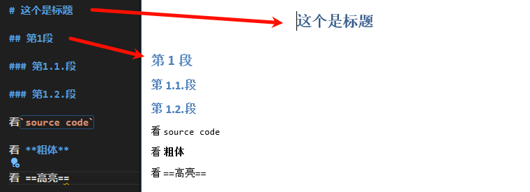

# pandoc_option


## 最佳实践

### 配置文件设置

将参数都写在配置文件中

```yml
# option.yml文件默认放在`C:\Users\name\AppData\Roaming\pandoc`下的`defaults`文件夹中
shift-heading-level-by: -1
number-sections: true
reference-doc: custom.docx
resource-path: ['C:\Users\Xinyu\AppData\Roaming\pandoc'] # 指定reference-doc(模板文件)的路径
```

### 标题等级设置
和markdown规范一致, 在marddown规范中, 一级标题`#`是文章的标题. 所以设置`shift-heading-level-by: -1`.




## 通用设置

参数|描述
--|--
`-f FORMAT, -r FORMAT, --from=FORMAT, --read=FORMAT`|输入的文本格式(如果不指定, 默认根据文件名判断)
`-t FORMAT, -w FORMAT, --to=FORMAT, --write=FORMAT`|输出的文本格式(如果不指定, 默认根据文件名判断)
`-o FILE, --output=FILE`|输出文件(如果不指定, 默认是标准输出)
`--data-dir=DIRECTORY`|pandoc的配置文件存放目录, 如模板文件. 如果不指定, linux默认是`$HOME/.local/share`, win默认是`%APPDATA%\pandoc`. 可以通过`pandoc --version`来查看
`-d FILE, --defaults=FILE`|默认参数文件, 默认搜索工作目录, 其次搜索`--data-dir`. 内容可参考[defaults-files](https://pandoc.org/MANUAL.html#defaults-files)
`--bash-completion`|命令补全, 在`.bashrc`中设置`eval "$(pandoc --bash-completion)"`
`--verbose`|冗长显示debug信息
`--quiet`|不输出信息
`--fail-if-warnings[=true|false]`|有任何的警告, 都退出
`--log=FILE`|输出日志
`--list-input-formats`|列举支持的输入格式
`--list-output-formats`|列举支持的输出格式
`--list-extensions[=FORMAT]`|
`--list-highlight-languages`|列举代码块支持的语言类型
`-v, --version`|查看版本
`-h, --help`|帮助信息

## 输入设置

参数|描述
--|--
`--shift-heading-level-by=NUMBER`|`-1`表示将二级标题作为一级标题(2+(-1)=1), 一级标题作为题目(1+(-1)=0)
`--indented-code-classes=CLASSES`|
`--default-image-extension=EXTENSION`|当没有图片名中没有格式时, 通过该参数指定
`--file-scope[=true|false]`|
`-F PROGRAM, --filter=PROGRAM`|
`-L SCRIPT, --lua-filter=SCRIPT`|
`-M KEY[=VAL], --metadata=KEY[:VAL]`|
`--metadata-file=FILE`|
`-p, --preserve-tabs[=true|false]`|
`--tab-stop=NUMBER`|
`--track-changes=accept|reject|all`|
`--extract-media=DIR`|
`--abbreviations=FILE`|
`--trace[=true|false]`|

## 输出配置

参数|描述
--|--
`-s, --standalone`|单文件模式
`--template=FILE|URL`|模板文件, [参考](https://pandoc.org/MANUAL.html#templates)
`-V KEY[=VAL], --variable=KEY[:VAL]`|
`--sandbox[=true|false]`|
`-D FORMAT, --print-default-template=FORMAT`|
`--print-default-data-file=FILE`|
`--eol=crlf|lf|native`|
`--dpi=NUMBER`|
`--wrap=auto|none|preserve`|
`--columns=NUMBER`|设置每行的字数
`--toc[=true|false], --table-of-contents[=true|false]`|正文前设置目录
`--toc-depth=NUMBER`|目录的深度
`--strip-comments[=true|false]`|默认不输出注释
`--no-highlight`|不高亮代码
`--highlight-style=STYLE|FILE`|高亮代码的样式
`--print-highlight-style=STYLE|FILE`|
`--syntax-definition=FILE`|
`-H FILE, --include-in-header=FILE|URL`|
`-B FILE, --include-before-body=FILE|URL`|
`-A FILE, --include-after-body=FILE|URL`|
`--resource-path=SEARCHPATH`|图片等资源的路径, 默认是当前目录
`--request-header=NAME:VAL`|
`--no-check-certificate[=true|false]`|

## 特殊的输出设置

参数|描述
--|--
`--embed-resources[=true|false]`|单HTML文件, 无依赖资源
`--html-q-tags[=true|false]`|
`--ascii[=true|false]`|
`--reference-links[=true|false]`|
`--reference-location=block|section|document`|
`--markdown-headings=setext|atx`|
`--list-tables[=true|false]`|
`--top-level-division=default|section|chapter|part`|
`-N, --number-sections`|给章节加上序号
`--number-offset=NUMBER[,NUMBER,…]`|如果想要`first top-level heading`序号为`6`, 则需要指定`--number-offset=5`
`--listings[=true|false]`|
`-i, --incremental[=true|false]`|
`--slide-level=NUMBER`|`revealjs, pptx`
`--section-divs[=true|false]`|
`--email-obfuscation=none|javascript|references`|
`--id-prefix=STRING`|
`-T STRING, --title-prefix=STRING`|
`-c URL, --css=URL`|
`--reference-doc=FILE|URL`|


## 参考
https://pandoc.org/MANUAL.html#options


