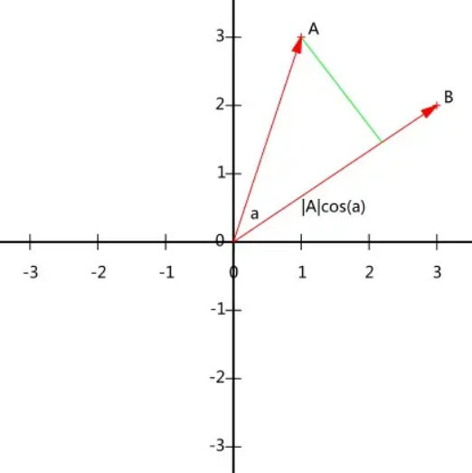

PCA(Principal Component Analysis)

## 向量表示与基变换

### 内积
两个向量的A和B内积:

$$
(a_1, a_2, ..., a_n) \cdot (b_1, b_2, ..., b_n)^T = a_1b_1+a_2b_2+...+a_nb_n
$$

内积运算将两个向量映射为实数, 从几何角度来分析, 假设假设 A 和 B 均为二维向量，则：
$$
A=(x_1, y_1), B=(x_2, y_2), A \cdot b = |A||B|cos(\alpha)
$$

看出 A 与 B 的内积等于 A 到 B 的投影长度乘以 B 的模。

$$
A \cdot b = |A|cos(\alpha) \cdot |B|
$$

如果假设 B 的模为 1，即让$|B|=1$, 那么就变成了

$$
A \cdot B = |A|cos(\alpha)

$$

也就是说: A 与 B 的内积值等于 A 向 B 所在直线投影的标量大小。

### 基

我们常说的坐标系中, 向量 (3,2) 其实隐式引入了一个定义：以 x 轴和 y 轴上正方向长度为 1 的向量为标准。向量 (3,2) 实际是说在 x 轴投影为 3 而 y 轴的投影为 2。注意投影是一个标量，所以可以为负。

所以，对于向量 (3, 2) 来说，如果我们想求它在  这组基下的坐标的话，分别内积即可。当然，内积完了还是 (3, 2)。

$$
\begin{pmatrix}
 1 & 0 \\
 0 & 1 
 \end{pmatrix}
 \cdot (3, 2)^T = (3, 2)^T
$$

所以，我们大致可以得到一个结论，我们要准确描述向量，首先要确定一组基，然后给出在基所在的各个直线上的投影值，就可以了。为了方便求坐标，我们希望这组基向量模长为 1。因为向量的内积运算，当模长为 1 时，内积可以直接表示投影。然后还需要这组基是线性无关的，我们一般用正交基，非正交的基也是可以的，不过正交基有较好的性质。

### 基变换的矩阵表示

先做一个练习：对于向量 (3,2) 这个点来说，在$(\frac{1}{\sqrt{2}},\frac{1}{\sqrt{2}})$和$(-\frac{1}{\sqrt{2}},\frac{1}{\sqrt{2}}$)这组基下的坐标是多少？

可以用矩阵相乘的形式简洁的表示这个变换：
$$
\begin{pmatrix}
    \frac{1}{\sqrt{2}} & \frac{1}{\sqrt{2}} \\
    -\frac{1}{\sqrt{2}} & \frac{1}{\sqrt{2}} 
\end{pmatrix}

\begin{pmatrix}
    3 \\
    2
\end{pmatrix}
=
\begin{pmatrix}
    \frac{5}{\sqrt{2}} \\
    -\frac{5}{\sqrt{2}}
\end{pmatrix}

$$

左边矩阵的两行分别为两个基，乘以原向量，其结果刚好为新基的坐标。推广一下，如果我们有$m$个二维向量，只要将二维向量按列排成一个两行$m$列矩阵，然后用“基矩阵”乘以这个矩阵就可以得到了所有这些向量在新基下的值。例如对于数据点$(1,1),(2,2),(3,3)$可以这样表示：

$$
\begin{pmatrix}
    \frac{1}{\sqrt{2}} & \frac{1}{\sqrt{2}} \\
    -\frac{1}{\sqrt{2}} & \frac{1}{\sqrt{2}} 
\end{pmatrix}

\begin{pmatrix}
1 & 2 & 3\\
1 & 2 & 3
\end{pmatrix}
=
\begin{pmatrix}
    \frac{2}{\sqrt{2}} & \frac{4}{\sqrt{2}} & \frac{6}{\sqrt{2}}\\
    0 & 0 & 0
\end{pmatrix}

$$

上述分析给矩阵相乘找到了一种物理解释：两个矩阵相乘的意义是将右边矩阵中的每一列向量  变换到左边矩阵中以每一行行向量为基所表示的空间中去。也就是说一个矩阵可以表示一种线性变换。如果基的数量(左矩阵的行数)少于向量本身的维数，则可以达到降维的效果。

## 最大可分性
如何选择基才是最优的? 或者说，如果我们有一组$N$维向量，现在要将其降到$K$维（$K < N$），那么我们应该如何选择$K$个基才能最大程度保留原有的信息？那就是希望投影后的投影值尽可能分散，因为如果重叠就会有样本消失。当然这个也可以从熵的角度进行理解，熵越大所含信息越多。

### 方差

数值的分散程度，可以用数学上的方差来表述。一个变量的方差可以看做是每个元素与变量均值的差的平方和的均值，即：

$$
Var(a) = \frac{1}{m}\sum_{i=1}^m(a_i - \mu)^2
$$

为了方便处理，我们将每个变量的均值都化为0，因此方差可以直接用每个元素的平方和除以元素个数表示：
$$
Var(a) = \frac{1}{m}\sum_{i=1}^m a_1^2
$$

于是上面的问题被形式化表述为：寻找一个一维基，使得所有数据变换为这个基上的坐标表示后，方差值最大。

### 协方差
在一维空间中我们可以用方差来表示数据的分散程度。而对于高维数据，使用协方差. 为了让两个变量尽可能表示更多的原始信息，我们希望它们之间不存在线性相关性.

协方差公式为：

$$
Cov(a,b) = \frac{1}{m-1}\sum_{i=1}^m(a_i-\mu_a)(b_i - \mu_b)
$$

由于均值为 0，所以我们的协方差公式可以表示为：

$$
Cov(a, b) = \frac{1}{m} \sum_{i=1}^m a_ib_i
$$

当样本数较大时，不必在意其是$m$还是$m-1$，为了方便计算，我们分母取$m$。

当协方差为$0$时，表示两个变量只是线性不相关(非独立, 可能是非线性相关)。为了让协方差为$0$，我们选择第二个基时只能在与第一个基正交的方向上进行选择，因此最终选择的两个方向一定是正交的。

至此，我们得到了降维问题的优化目标：将一组$N$维向量降为$K$维，其目标是选择$K$个单位正交基，使得原始数据变换到这组基上后，各变量两两间协方差为$0$，而变量方差则尽可能大（在正交的约束下，取最大的$K$个方差）。

### 协方差矩阵

最终要达到的目的与变量内方差及变量间协方差有密切关系。因此我们希望能将两者统一表示，仔细观察发现，两者均可以表示为内积的形式，而内积又与矩阵相乘密切相关。于是我们有：

假设我们只有$a$和$b$两个变量，那么我们将它们按行组成矩阵$X$：
$$
X = 
\begin{pmatrix}
    a_1 & a_2 & ... & a_m \\
    b_1 & b_2 & ... & b_m 
\end{pmatrix}
$$

则协方差矩阵可以表示为:

$$
\frac{1}{m}XX^T =
\begin{pmatrix}
    \frac{1}{m} \sum_{i=1}^m a_i^2 & \frac{1}{m} \sum_{i=1}^m a_i b_i \\
    \frac{1}{m} \sum_{i=1}^m a_i b_i & \frac{1}{m} \sum_{i=1}^m b_i^2 
\end{pmatrix}
=
\begin{pmatrix}
    Cov(a, a) & Cov(a, b) \\
    Cov(b, a) & Cov(b, b)
\end{pmatrix}

$$

这个矩阵对角线上的分别是两个变量的方差，而其它元素是 a 和 b 的协方差。两者被统一到了一个矩阵里。

### 矩阵对角化
根据我们的优化条件(方差最大, 协方差为0)，我们需要将除对角线外的其它元素化为 0，并且在对角线上将元素按大小从上到下排列（变量方差尽可能大）, 

原矩阵与基变换后矩阵协方差矩阵的关系: 设原始数据矩阵$X$对应的协方差矩阵为$C$, 而$P$是一组基按行组成的矩阵，设 $Y=PX$，则$Y$为$X$对$P$做基变换后的数据。设$Y$的协方差矩阵为$D$，我们推导一下$D$与$C$的关系：
$$
D = \frac{1}{m}YY^T \\
= \frac{1}{m}(PX)(PX)^T \\
= \frac{1}{m}PXX^TP^T \\
= P(\frac{1}{m}XX^T)P^T \\
=PCP^T
$$

我们要找的$P$是能让原始协方差矩阵对角化的$P$。换句话说，优化目标变成了寻找一个矩阵$P$，满足$PCP^T$是一个对角矩阵，并且对角元素按从大到小依次排列，那么$P$的前$K$行就是要寻找的基，用$P$的前$K$行组成的矩阵乘以$X$就使得$X$从$N$维降到了$K$维并满足上述优化条件。

至此，我们离 PCA 还有仅一步之遥，我们还需要完成对角化。
由上文知道，协方差矩阵$C$是一个是对称矩阵，在线性代数中实对称矩阵有一系列非常好的性质：

- 实对称矩阵不同特征值对应的特征向量必然正交。
- 设特征向量$\lambda$重数为$r$，则必然存在$r$个线性无关的特征向量对应于$\lambda$重，因此可以将这$r$个特征向量单位正交化。

由上面两条可知，一个$n$行$n$列的实对称矩阵一定可以找到$n$个单位正交特征向量，设这$n$个特征向量为$e_1,e_2,...,e_n$，我们将其按列组成矩阵：$E=(e_1,e_2,...,e_n)$。则对协方差矩阵 C 有如下结论：
$$
E^TCE = \Lambda =
\begin{pmatrix}
    \lambda_1 &  \\
              & \lambda_2 \\ 
              &           & ... \\
              &           &         & \lambda_n\\ 
\end{pmatrix}
$$
其中$\Lambda$为对角矩阵，其对角元素为各特征向量对应的特征值（可能有重复）。到这里，已经找到了需要的矩阵 P：$P=E^T$  。

$P$是协方差矩阵的特征向量单位化后按行排列出的矩阵，其中每一行都是$C$的一个特征向量。如果设$P$按照$\Lambda$中特征值的从大到小，将特征向量从上到下排列，则用$P$的前$K$行组成的矩阵乘以原始数据矩阵$X$，就得到了我们需要的降维后的数据矩阵$Y$。

## 求解步骤

设有$m$条$n$维数据:

1. 将原始数据按列组成$m$行$n$列矩阵$X$；
2. 将$X$的每一行进行零均值化，即减去这一行的均值；
3. 求出协方差矩阵$C=\frac{1}{m}XX^T$；
4. 求出协方差矩阵的特征值及对应的特征向量；
5. 将特征向量按对应特征值大小从上到下按行排列成矩阵，取前#k#行组成矩阵$p$；
6. $Y=PX$即为降维到$k$维后的数据。

## 参考
- [【机器学习】降维——PCA（非常详细）](https://zhuanlan.zhihu.com/p/77151308)
- [Making sense of principal component analysis, eigenvectors & eigenvalues](https://stats.stackexchange.com/questions/2691/making-sense-of-principal-component-analysis-eigenvectors-eigenvalues/140579#140579)
- [机器学习中SVD总结](https://mp.weixin.qq.com/s/Dv51K8JETakIKe5dPBAPVg)
- [主成分分析（PCA）原理详解](https://zhuanlan.zhihu.com/p/37777074)
- [矩阵特征值和特征向量详细计算过程](https://blog.csdn.net/Junerror/article/details/80222540)
- [终于弄懂了特征值和特征向量到底有什么意义](https://k.sina.com.cn/article_6367168142_17b83468e001005yrv.html)
- [特征值和特征向量](https://zhuanlan.zhihu.com/p/95836870)

