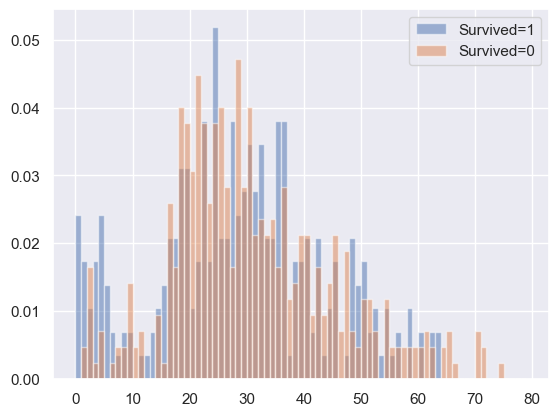
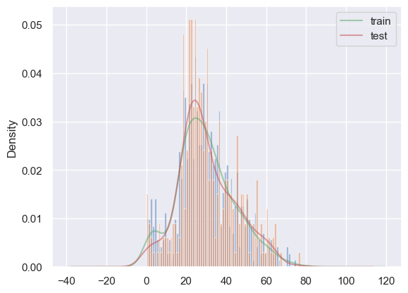
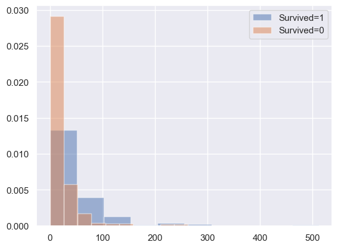
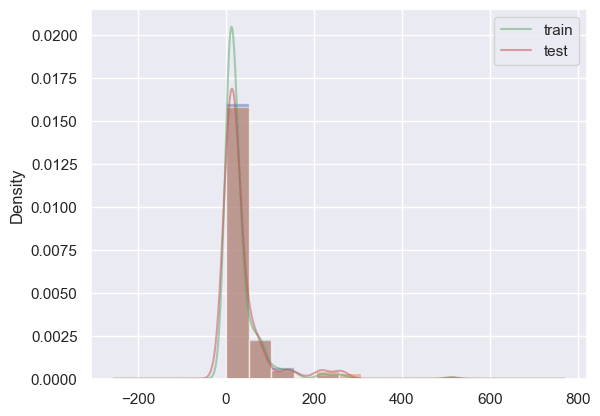
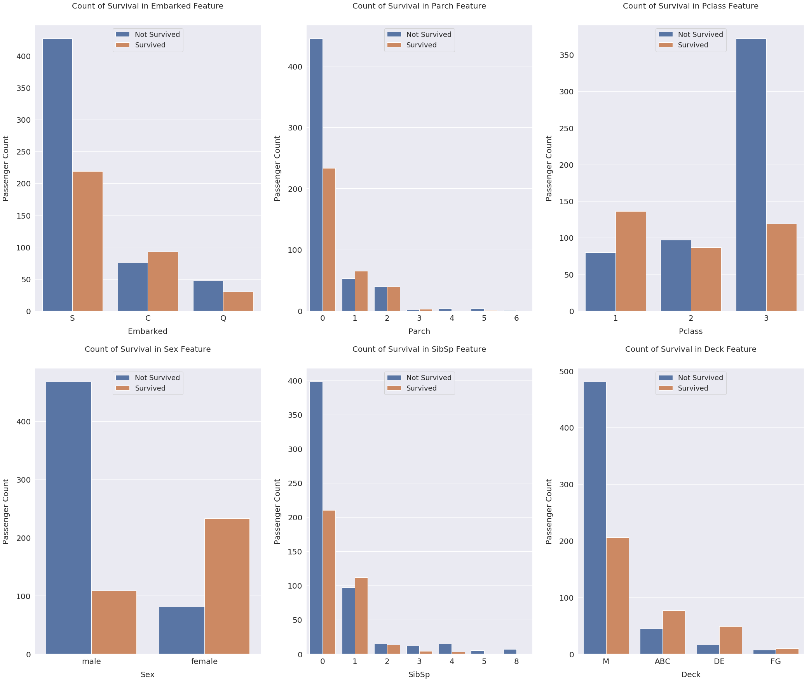
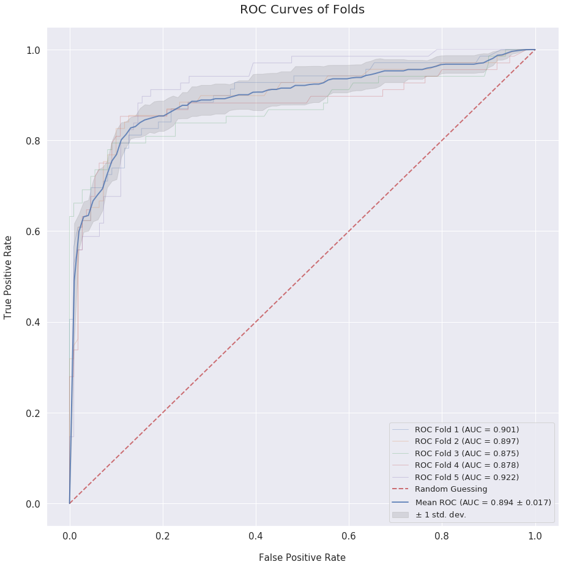

## 业务理解

泰坦尼克号于1909年3月31日在爱尔兰动工建造，1911年5月31日下水，次年4月2日完工试航。1912年4月10日她从英国南安普顿出发，途径法国瑟堡和爱尔兰昆士敦，驶向美国纽约。在14日晚23时40分左右，泰坦尼克号与一座冰山相撞，导致船体裂缝进水。次日凌晨2时20分左右，泰坦尼克号断为两截后沉入大西洋，其搭载的2224名船员及乘客，在本次海难中逾1500人丧生。

Kaggle平台为我们提供了一个竞赛案例[Titanic: Machine Learning from Disaster](https://www.kaggle.com/c/titanic)，在该案例中，我们将探究什么样的人在此次海难中幸存的几率更高，并通过构建预测模型来预测乘客生存率。

## 数据理解

### [字段](https://www.kaggle.com/c/titanic/data)
1. PassengerId: 行唯一标识, 对目标没有作用
2. Survived: 要预测的目标变量(target variable), 0 或 1
    1. 1 = Yes(生还)
    2. 0 = No(未生还)
3. Pclass: 乘客舱位的经济等级, Ordinal:
    1. 1 = Upper Class(上等舱)
    2. 2 = Middle Class(中等舱)
    3. 3 = Lower Class(低等舱)
4. Name: 
5. Sex: 性别, Categorical
6. Age: 年龄, 以年为单位, Numerical
7. SibSp: siblings and spouse, 乘客的兄弟姐妹和配偶的总数, Numerical
8. Parch: parents and children, 乘客的孩子和父母的总数(一些孩子和保姆一起, 所以Parch=0), Numerical
9. Ticket: 乘客的票号, Categorical
10. Fare: 乘客的乘船费用, Numerical
11. Cabin: 乘客的区域号, Categorical
12. Embarked: 登船的地点, Categorical
    1. C = Cherbourg
    2. Q = Queenstown
    3. S = Southampton


### 数据形状
```python

```

1. 训练集有891行, 11个特征, 1个目标

    PassengerId|Survived|Pclass|Name|Sex|Age|SibSp|Parch|Ticket|Fare|Cabin|Embarked
    --|--|--|--|--|--|--|--|--|--|--|--
    690|1|1|Madill, Miss. Georgette Alexandra|female|15.0|0|1|24160|211.3375|B5|S
    526|0|3|Farrell, Mr. James|male|40.5|0|0|367232|7.7500|NaN|Q
    279|0|3|Rice, Master. Eric|male|7.0|4|1|382652|29.1250|NaN|Q


2. 测试集有418行, 11个特征, 目标列为空

    PassengerId|Pclass|Name|Sex|Age|SibSp|Parch|Ticket|Fare|Cabin|Embarked
    --|--|--|--|--|--|--|--|--|--|--
    1287|1|Smith, Mrs. Lucien Philip (Mary Eloise Hughes)|female|18.0|1|0|13695|60.0000|C31|S
    1202|3|Cacic, Mr. Jego Grga|male|18.0|0|0|315091|8.6625|NaN|S
    1095|2|Quick, Miss. Winifred Vera|female|8.0|1|1|26360|26.0000|NaN|S


### 异常值查看

```python
df_train = pd.read_csv('./kaggle/input/titanic/train.csv')
df_train['dataset'] = 'train'
df_test = pd.read_csv('./kaggle/input/titanic/test.csv')
df_test['dataset'] = 'test'
df_all = pd.concat([df_train, df_test]).reset_index(drop=True)

df_all.info()
```

Age/Cabin/Embarked/Fare四项数据有缺失值，其中Cabin字段缺失近四分之三的数据。


### 查看特征与标签间关系

#### Embarked

```python
df_train.groupby('Embarked', group_keys=False).apply(lambda x: len(x.loc[x['Survived']==1,:])/len(x))
```
1. Embarked为"C"的乘客，其生存率为0.55
1. Embarked为"Q"的乘客，其生存率为0.39
1. Embarked为"S"的乘客，其生存率为0.34

法国登船乘客生存率较高, 可能是因为法国登船的人, 会乘坐Pclass=1的舱位
```python
df_all_count = df_all.groupby(['Embarked','Pclass']).count()[['PassengerId']].rename(columns={'PassengerId': 'Count'}).reset_index()
df_all_count['Embarked_sum'] = df_all_count.groupby('Embarked')['Count'].transform(sum)
df_all_count['Pclass_ratio'] = df_all_count['Count']/df_all_count['Embarked_sum']
```

#### Parch

当乘客同行的父母及子女数量适中时，生存率较高

```python
df_train.groupby('Parch', group_keys=False).apply(lambda x: len(x.loc[x['Survived']==1,:])/len(x))
```


#### SibSp

当乘客同行的同辈数量适中时生存率较高

```python
df_train.groupby('SibSp', group_keys=False).apply(lambda x: len(x.loc[x['Survived']==1,:])/len(x))
```

#### Pclass
乘客客舱等级越高，生存率越高

```python
df_train.groupby('Pclass', group_keys=False).apply(lambda x: len(x.loc[x['Survived']==1,:])/len(x))
```

#### Sex

女性的生存率远高于男性
```python
df_train.groupby('Sex', group_keys=False).apply(lambda x: len(x.loc[x['Survived']==1,:])/len(x))
```


#### Age

```python
df_train['Age_cut'] = pd.cut(df_train['Age'],80)
df_train.groupby('Age_cut', group_keys=False).apply(lambda x: 0 if len(x) == 0 else len(x.loc[x['Survived']==1,:])/len(x))
```


#### Fare
```python
df_train['Fare_cut'] = pd.cut(df_train['Fare'],80)
df_train.groupby('Fare_cut', group_keys=False).apply(lambda x: 0 if len(x) == 0 else len(x.loc[x['Survived']==1,:])/len(x))

```

fare的分布呈左偏的形态，其偏度skewness=4.37较大，说明数据偏移平均值较多，因此我们需要对数据进行对数化处理，防止数据权重分布不均匀。
```python
#对数化处理fare值
full['Fare']=full['Fare'].map(lambda x: np.log(x) if x>0 else 0)
```


## 特征工程


对数据的缺失值、异常值进行处理，便于对数据进一步分析。本数据集有四个字段的数据存在缺失情况，即Cabin/Embarked/Fare/Age，未发现数据存在明显异常情况。其中Age字段缺失较多且为连续型数值，挖取更多特征后再填充缺失值。

### Cabin缺失值填充
对Cabin缺失值进行处理，利用U（Unknown）填充缺失值

```python
full['Cabin']=full['Cabin'].fillna('U')

```

### Embarked缺失值填充
众数填充
```python
full['Embarked']=full['Embarked'].fillna('S') 

```

### Fare缺失值填充

利用3等舱，登船港口为英国，舱位未知旅客的平均票价来填充缺失值。

```python
full['Fare']=full['Fare'].fillna(full[(full['Pclass']==3)&(full['Embarked']=='S')&(full['Cabin']=='U')]['Fare'].mean())
```


### Name中的头衔信息-Title

旅客姓名数据中包含头衔信息，不同头衔也可以反映旅客的身份，而不同身份的旅客其生存率有可能会出现较大差异。头衔为'Mr'及'Officer'的乘客，生存率明显较低。


```python
#构造新特征Title
full['Title']=full['Name'].map(lambda x:x.split(',')[1].split('.')[0].strip())

TitleDict={}
TitleDict['Mr']='Mr'
TitleDict['Mlle']='Miss'
TitleDict['Miss']='Miss'
TitleDict['Master']='Master'
TitleDict['Jonkheer']='Master'
TitleDict['Mme']='Mrs'
TitleDict['Ms']='Mrs'
TitleDict['Mrs']='Mrs'
TitleDict['Don']='Royalty'
TitleDict['Sir']='Royalty'
TitleDict['the Countess']='Royalty'
TitleDict['Dona']='Royalty'
TitleDict['Lady']='Royalty'
TitleDict['Capt']='Officer'
TitleDict['Col']='Officer'
TitleDict['Major']='Officer'
TitleDict['Dr']='Officer'
TitleDict['Rev']='Officer'

full['Title']=full['Title'].map(TitleDict)

full.loc[full['dataset']=='train',:].groupby('Title', group_keys=False).apply(lambda x: len(x.loc[x['Survived']==1,:])/len(x))
```

## FamilyNum及FamilySize信息

将Parch及SibSp字段整合得到一名乘客同行家庭成员总人数FamilyNum的字段，再根据家庭成员具体人数的多少得到家庭规模FamilySize这个新字段。

家庭成员人数在2-4人时，乘客的生存率较高，当没有家庭成员同行或家庭成员人数过多时生存率较低。我们按照家庭成员人数多少，将家庭规模分为“小、中、大”三类：

```python
full['familyNum']=full['Parch']+full['SibSp']+1

def familysize(familyNum):
    if familyNum==1:
        return 0
    elif (familyNum>=2)&(familyNum<=4):
        return 1
    else:
        return 2

full['familySize']=full['familyNum'].map(familysize)
full.loc[full['dataset']=='train',:].groupby('familySize', group_keys=False).apply(lambda x: len(x.loc[x['Survived']==1,:])/len(x))

```


## Cabin客舱类型信息-Deck

Cabin字段的首字母代表客舱的类型，也反映不同乘客群体的特点，可能也与乘客的生存率相关。提取Cabin字段首字母.当乘客的客舱类型为B/D/E时，生存率较高；当客舱类型为U/T时，生存率较低。

```python

full['Deck']=full['Cabin'].map(lambda x:x[0])

full.loc[full['dataset']=='train',:].groupby('Deck', group_keys=False).apply(lambda x: len(x.loc[x['Survived']==1,:])/len(x))
```


## 共票号乘客数量TickCot及TickGroup
当TickCot大小适中时，乘客生存率较高。

```python

#提取各票号的乘客数量

full['TickCot']=full['Ticket'].map(full['Ticket'].value_counts())

full.loc[full['dataset']=='train',:].groupby('TickCot', group_keys=False).apply(lambda x: len(x.loc[x['Survived']==1,:])/len(x))

#按照TickCot大小，将TickGroup分为三类。
def TickCountGroup(num):
    if (num>=2)&(num<=4):
        return 0
    elif (num==1)|((num>=5)&(num<=8)):
        return 1
    else :
        return 2
#得到各位乘客TickGroup的类别
full['TickGroup']=full['TickCot'].map(TickCountGroup)

full.loc[full['dataset']=='train',:].groupby('TickGroup', group_keys=False).apply(lambda x: len(x.loc[x['Survived']==1,:])/len(x))

```

## Age缺失值填充-构建随机森林模型预测缺失的数据


```python

#筛选数据集
AgePre=full[['Age','Parch','Pclass','SibSp','Title','familyNum','TickCot']]
#进行one-hot编码
AgePre=pd.get_dummies(AgePre)
ParAge=pd.get_dummies(AgePre['Parch'],prefix='Parch')
SibAge=pd.get_dummies(AgePre['SibSp'],prefix='SibSp')
PclAge=pd.get_dummies(AgePre['Pclass'],prefix='Pclass')

AgePre=pd.concat([AgePre,ParAge,SibAge,PclAge],axis=1)


#拆分实验集和预测集
AgeKnown=AgePre[AgePre['Age'].notnull()]
AgeUnKnown=AgePre[AgePre['Age'].isnull()]

#生成实验数据的特征和标签
AgeKnown_X=AgeKnown.drop(['Age'],axis=1)
AgeKnown_y=AgeKnown['Age']
#生成预测数据的特征
AgeUnKnown_X=AgeUnKnown.drop(['Age'],axis=1)

#利用随机森林构建模型
from sklearn.ensemble import RandomForestRegressor
rfr=RandomForestRegressor(random_state=None,n_estimators=500,n_jobs=-1)
rfr.fit(AgeKnown_X,AgeKnown_y)
#预测年龄
AgeUnKnown_y=rfr.predict(AgeUnKnown_X)
#填充预测数据
full.loc[full['Age'].isnull(),['Age']]=AgeUnKnown_y

```


## 同组识别
虽然通过分析数据已有特征与标签的关系可以构建有效的预测模型，但是部分具有明显共同特征的用户可能与整体模型逻辑并不一致。如果将这部分具有同组效应的用户识别出来并对其数据加以修正，就可以有效提高模型的准确率。在Titancic案例中，我们主要探究相同姓氏的乘客是否存在明显的同组效应。

提取两部分数据，分别查看其“姓氏”是否存在同组效应（因为性别和年龄与乘客生存率关系最为密切，因此用这两个特征作为分类条件）：


1. 12岁以上男性：找出男性中同姓氏均获救的部分；
2. 女性以及年龄在12岁以下儿童：找出女性及儿童中同姓氏均遇难的部分。


男性同组效应分析：


大多数同姓氏的男性存在“同生共死”的特点，因此利用该同组效应，我们对生存率为1的姓氏里的男性数据进行修正，提升其预测为“可以幸存”的概率。

女性及儿童同组效应分析：


与男性组特征相似，女性及儿童也存在明显的“同生共死”的特点，因此利用同组效应，对生存率为0的姓氏里的女性及儿童数据进行修正，提升其预测为“并未幸存”的概率。


对数据集中这些姓氏的两组数据数据分别进行修正：

男性数据修正为：1、性别改为女；2、年龄改为5；
女性及儿童数据修正为：1、性别改为男；2、年龄改为60。

```python

#提取乘客的姓氏及相应的乘客数
full['Surname']=full['Name'].map(lambda x:x.split(',')[0].strip())
full['SurnameNum']=full['Surname'].map(full['Surname'].value_counts())
#将数据分为两组
MaleDf=full[(full['Sex']=='male')&(full['Age']>12)&(full['familyNum']>=2)]
FemChildDf=full[((full['Sex']=='female')|(full['Age']<=12))&(full['familyNum']>=2)]

MSurNamDf=MaleDf['Survived'].groupby(MaleDf['Surname']).mean()

MSurNamDf.value_counts()

MSurNamDict=MSurNamDf[MSurNamDf.values==1].index

FCSurNamDf=FemChildDf['Survived'].groupby(FemChildDf['Surname']).mean()

FCSurNamDf.value_counts()

FCSurNamDict=FCSurNamDf[FCSurNamDf.values==0].index

#对数据集中这些姓氏的男性数据进行修正：1、性别改为女；2、年龄改为5。
full.loc[(full['Survived'].isnull())&(full['Surname'].isin(MSurNamDict))&(full['Sex']=='male'),'Age']=5
full.loc[(full['Survived'].isnull())&(full['Surname'].isin(MSurNamDict))&(full['Sex']=='male'),'Sex']='female'

#对数据集中这些姓氏的女性及儿童的数据进行修正：1、性别改为男；2、年龄改为60。
full.loc[(full['Survived'].isnull())&(full['Surname'].isin(FCSurNamDict))&((full['Sex']=='female')|(full['Age']<=12)),'Age']=60
full.loc[(full['Survived'].isnull())&(full['Surname'].isin(FCSurNamDict))&((full['Sex']=='female')|(full['Age']<=12)),'Sex']='male'
```


## 筛选子集
在对数据进行分析处理的过程中，数据的维度更高了，为提升数据有效性需要对数据进行降维处理。通过找出与乘客生存率“Survived”相关性更高的特征，剔除重复的且相关性较低的特征，从而实现数据降维。

先人工初步筛除与标签预测明显不相关或相关度很低的特征，再查看剩余特征与标签之间的相关性大小做进一步降维。


```python

#人工筛选
fullSel=full.drop(['Cabin','Name','Ticket','PassengerId','Surname','SurnameNum'],axis=1)
#查看各特征与标签的相关性
corrDf=pd.DataFrame()
corrDf=fullSel.corr()
corrDf['Survived'].sort_values(ascending=True)

fullSel=fullSel.drop(['familyNum','SibSp','TickCot','Parch'],axis=1)
#one-hot编码
fullSel=pd.get_dummies(fullSel)
PclassDf=pd.get_dummies(full['Pclass'],prefix='Pclass')
TickGroupDf=pd.get_dummies(full['TickGroup'],prefix='TickGroup')
familySizeDf=pd.get_dummies(full['familySize'],prefix='familySize')

fullSel=pd.concat([fullSel,PclassDf,TickGroupDf,familySizeDf],axis=1)

```


## 本文所需要依赖

```python
import numpy as np
import pandas as pd
import matplotlib.pyplot as plt
import seaborn as sns
sns.set(style="darkgrid")
from sklearn.ensemble import RandomForestClassifier
from sklearn.preprocessing import OneHotEncoder, LabelEncoder, StandardScaler
from sklearn.metrics import roc_curve, auc
from sklearn.model_selection import StratifiedKFold
import string
```

## 读取数据并进行基本探索


```python
import numpy as np
import pandas as pd
import matplotlib.pyplot as plt
import seaborn as sns
sns.set(style="darkgrid")
from sklearn.ensemble import RandomForestClassifier
from sklearn.preprocessing import OneHotEncoder, LabelEncoder, StandardScaler
from sklearn.metrics import roc_curve, auc
from sklearn.model_selection import StratifiedKFold
import string


df_train = pd.read_csv('./data/train.csv')
df_train['dataset'] = 'train'
df_test = pd.read_csv('./data/test.csv')
df_test['dataset'] = 'test'
df_all = pd.concat([df_train, df_test], sort=True).reset_index(drop=True)


df_all_col = pd.DataFrame()
df_all_col['dtypes'] = df_all.dtypes
df_all_col['missing'] = df_all.apply(lambda col: col.isnull().sum()).astype('int64')
df_all_col['missing_ratio'] = df_all.apply(lambda col: col.isnull().sum()/len(col)).astype('float64')


options = {
    'Age': 'num',
    'Cabin': 'cat',
    'Embarked': 'cat',
    'Fare': 'num',
    'Name': 'cat',
    'Parch': 'rank',
    'PassengerId': 'num',
    'Pclass': 'rank',
    'Sex': 'cat',
    'SibSp': 'rank',
    'Survived': 'cat',
    'Ticket': 'cat',
    'dataset': 'cat'
}
for key in options.keys():
    df_all_col.loc[key,'stat_type'] = options[key]

df_all_col
```

1. `dtypes`是pandas保存的类型
2. `missing`是每列的缺失值
3. `missing_ratio`是每列缺失值的占比
4. `stat_type`统计学中的数学分类, 有数值型(num), 分类型(cat), 排序型(rank)

              dtypes  missing  missing_ratio stat_type
Age          float64      263       0.200917       num
Cabin         object     1014       0.774637       cat
Embarked      object        2       0.001528       cat
Fare         float64        1       0.000764       num
Name          object        0       0.000000       cat
Parch          int64        0       0.000000      rank
PassengerId    int64        0       0.000000       num
Pclass         int64        0       0.000000      rank
Sex           object        0       0.000000       cat
SibSp          int64        0       0.000000      rank
Survived     float64      418       0.319328       cat
Ticket        object        0       0.000000       cat
dataset       object        0       0.000000       cat


1. Age, Embarked和Fare三个字段, 有较少的缺失值, 可以通过统计方法填补. 
2. Cabin有80%缺失值, 不能直接使用统计方法填补.

✨将训练集和测试集的数据连接其处理缺失值, 否则会造成过拟合. 


## 构建属性的相似度矩阵

```python
df_all_corr = df_all.corr().abs()
```

                  Age      Fare     Parch  PassengerId    Pclass     SibSp  Survived
Age          1.000000  0.178740  0.150917     0.028814  0.408106  0.243699  0.077221
Fare         0.178740  1.000000  0.221539     0.031428  0.558629  0.160238  0.257307
Parch        0.150917  0.221539  1.000000     0.008942  0.018322  0.373587  0.081629
PassengerId  0.028814  0.031428  0.008942     1.000000  0.038354  0.055224  0.005007
Pclass       0.408106  0.558629  0.018322     0.038354  1.000000  0.060832  0.338481
SibSp        0.243699  0.160238  0.373587     0.055224  0.060832  1.000000  0.035322
Survived     0.077221  0.257307  0.081629     0.005007  0.338481  0.035322  1.000000
     

✨`coor()`方法只对数值型数据起作用.


## Age字段处理


### 缺失值处理

1. 简单处理, 可以使用`Age`的整体的中位数填补
2. 使用使用Pclass分类后的中位数. 因为Pclass和Age有0.408106相似度, 和目标变量Survived有0.338481相似度.


    ```python
    df_all_corr_stack= df_all_corr.stack().reset_index().rename(columns={"level_0": "Feature 1", "level_1": "Feature 2", 0: 'Correlation'})
    df_all_corr_stack.loc[df_all_corr_stack['Feature 1'] == 'Age', :].sort_values(by='Correlation').reset_index(drop=True)
    age_by_pclass_sex = df_all.groupby(['Sex', 'Pclass']).median()['Age'].reset_index()
    age_by_pclass_sex
    ```


        Sex  Pclass   Age
    0  female       1  36.0
    1  female       2  28.0
    2  female       3  22.0
    3    male       1  42.0
    4    male       2  29.5
    5    male       3  25.0

3. 将Sex也加入分组中, 因为在以Pclass分组的前提下, 可以看到, females(女性)比males(男性)的中位数相对较低.

    ```python
    age_by_pclass_sex = df_all.groupby(['Sex', 'Pclass']).median()['Age'].reset_index()
    age_by_pclass_sex
    ```
        Sex  Pclass   Age
    0  female       1  36.0
    1  female       2  28.0
    2  female       3  22.0
    3    male       1  42.0
    4    male       2  29.5
    5    male       3  25.0

    ```python
    df_all['Age'] = df_all.groupby(['Sex', 'Pclass'])['Age'].apply(lambda x: x.fillna(x.median()))
    ```

## Embarked

Embarked是只有2个缺失值的分类变量. 两个记录有相同的票号, 且都是女性. 也就是说她们知道彼此, 且在同一个港口登船. `Embarked`女性的众数是C(Cherbourg), 但是并不意味着他们就是从C登船的.

Age	Cabin	Embarked	Fare	Name	Parch	PassengerId	Pclass	Sex	SibSp	Survived	Ticket
38.0	B28	NaN	80.0	Icard, Miss. Amelie	0	62	1	female	0	1.0	113572
62.0	B28	NaN	80.0	Stone, Mrs. George Nelson (Martha Evelyn)	0	830	1	female	0	1.0	113572

[Martha Evelyn Stone: Titanic Survivor](https://www.encyclopedia-titanica.org/titanic-survivor/martha-evelyn-stone.html)一文中提到Stone, Mrs. George Nelson (Martha Evelyn)和她的佣人Icard, Miss. Amelie在 S (Southampton)登船. 所以使用S填补缺失值.

```python

df_all['Embarked'] = df_all['Embarked'].fillna('S')
```

## Fare

Fare只有一个缺失值, 他和家庭成员多少(Parch, SibSp)和Pclass(舱位的经济等级)有关. 所以使用Pclass=3, Parch=0, SibSp=0的中位数填补比较合适.


Age|Cabin|Embarked|Fare|Name|Parch|PassengerId|Pclass|Sex|SibSp|Survived|Ticket
--|--|--|--|--|--|--|--|--|--|--|--
60.5|NaN|S|NaN|Storey, Mr. Thomas|0|1044|3|male|0|NaN|3701


```python
med_fare = df_all.groupby(['Pclass', 'Parch', 'SibSp']).median()['Fare'][3][0][0]
df_all['Fare'] = df_all['Fare'].fillna(med_fare)
```

### Cabin
Titanic甲板从上往下按ABCDEFG的顺序排列, 很明显, 上层甲板上的人更容易生还.


1. A: promenade deck(散步甲板)
2. B: Bridge deck(桥接甲板)
3. C: Shelter deck
4. D: Saloon deck
5. E: Upper deck
6. F: Middle deck
7. G: Lower deck

`Cabin`的第一位是甲板的位置, 后面是房间号, 提取所在甲板位置:

```python
df_all['Deck'] = df_all['Cabin'].apply(lambda s: s[0] if pd.notnull(s) else 'M')
df_all['Deck'].value_counts().sort_index()
```

A      22
B      65
C      94
D      46
E      41
F      21
G       5
M    1014
T       1


```python
df_all_count = df_all.groupby(['Deck', 'Pclass']).count()[['Name']].rename(columns={'Name': 'Count'}).reset_index()

df_all_count['deck_sum'] = df_all_count.groupby('Deck')['Count'].transform(sum)
df_all_count['deck_ratio'] = df_all_count['Count']/df_all_count['deck_sum']

```
   Deck  Pclass  Count  deck_sum  deck_ratio
0     A       1     22        22    1.000000
1     B       1     65        65    1.000000
2     C       1     94        94    1.000000
3     D       1     40        46    0.869565
4     D       2      6        46    0.130435
5     E       1     34        41    0.829268
6     E       2      4        41    0.097561
7     E       3      3        41    0.073171
8     F       2     13        21    0.619048
9     F       3      8        21    0.380952
10    G       3      5         5    1.000000
11    M       1     67      1014    0.066075
12    M       2    254      1014    0.250493
13    M       3    693      1014    0.683432
14    T       1      1         1    1.000000


1. 在甲板(Deck), 有6间房子被标记为 T, U, W, X, Y, Z, 但是在数据集中只显示T
2. ABC有100%的1等级舱
3. D有87%的1等舱和13%的2等舱
4. E有83%的1等舱, 10%的2等舱, 7%的3等舱
5. F有62%的2等舱, 38%的3等舱
6. G有100%的3等舱
7. DE给所有等级舱位
8. FG给2, 3等级舱位
9. 有1个乘客是T区域, 他是1等舱, T和A相似, 所以将其改为A
10. 使用M代替缺失值, 因为太难填补了.


```python
# Passenger in the T deck is changed to A
idx = df_all[df_all['Deck'] == 'T'].index
df_all.loc[idx, 'Deck'] = 'A'
```

每一个Deck都有不同的生还率.

1. A, B, C标记为ABC, 因为他们只有1等舱乘客
2. D, E标记为DE, 因为他们乘客的生还率相似
3. F, G标记为FG, 因为他们乘客的生还率相似
4. M单独标记, 因为他的生还率最低.

```python
df_all['Deck'] = df_all['Deck'].replace(['A', 'B', 'C'], 'ABC')
df_all['Deck'] = df_all['Deck'].replace(['D', 'E'], 'DE')
df_all['Deck'] = df_all['Deck'].replace(['F', 'G'], 'FG')

df_all['Deck'].value_counts()
```

M      1014
ABC     181
DE       87
FG       26
T         1


## 目标分布

训练集中:
1. 38.38%(342/891)是类别1
2. 61.62%(549/891)是类别0


## 特征中的目标分布

### 连续特征

#### Age
Age<15时有较高的生还率


```python
import matplotlib.pyplot as plt
fig, ax = plt.subplots()

df_train.loc[df_train['Survived'] == 1, 'Age']

ax.hist(df_train.loc[df_train['Survived'] == 1, 'Age'], bins=range(80), density=True, alpha=0.5, label='Survived=1')
ax.hist(df_train.loc[df_train['Survived'] == 0, 'Age'], bins=range(80), density=True, alpha=0.5, label='Survived=0') 

ax.legend()
plt.show()

```






1. Fare在尾巴部分有更好的生还率

```python

import matplotlib.pyplot as plt
fig, ax = plt.subplots()

df_train['Fare'].max()

df_train.loc[df_train['Survived'] == 1, 'Fare']

ax.hist(df_train.loc[df_train['Survived'] == 1, 'Fare'], bins=10, density=True, alpha=0.5, label='Survived=1')
ax.hist(df_train.loc[df_train['Survived'] == 0, 'Fare'], bins=10, density=True, alpha=0.5, label='Survived=0') 

ax.legend()
plt.show()
```

```python
import matplotlib.pyplot as plt
fig, ax = plt.subplots()

df_train.loc[df_train['Survived'] == 1, 'Fare']
ax.hist(df_train['Fare'], bins=10, density=True, alpha=0.5, label='_train')
ax.hist(df_test['Fare'], bins=10, density=True, alpha=0.5, label='_test') 
df_train['Fare'].plot(kind = 'kde', alpha=0.5, label = 'train')
df_test['Fare'].plot(kind = 'kde', alpha=0.5, label = 'test')
ax.legend()
plt.show()

```



### 分类特征

每个特征至少有一个类别有高的死亡率, 这对预测有很好的作用.

Parch 和 SibSp表名, 只有一个亲人的, 生还率更高.




## 特征工程


### 连续变量分箱


#### Fare
使用13个分位点分割Fare特征. 分割后, Fare较低的生还率较低, 较高的生还率较高.
```python
df_all['Fare'] = pd.qcut(df_all['Fare'], 13)
df_all.groupby(['Fare', 'Survived']).size().reset_index()
```

                 Fare  Survived   0
0      (-0.001, 7.25]       0.0  72
1      (-0.001, 7.25]       1.0  11
2        (7.25, 7.75]       0.0  39
3        (7.25, 7.75]       1.0  18
4       (7.75, 7.896]       0.0  68
5       (7.75, 7.896]       1.0  15
6       (7.896, 8.05]       0.0  48
7       (7.896, 8.05]       1.0  14
8        (8.05, 10.5]       0.0  60
9        (8.05, 10.5]       1.0  18
10       (10.5, 13.0]       0.0  35
11       (10.5, 13.0]       1.0  30
12     (13.0, 15.742]       0.0  33
13     (13.0, 15.742]       1.0  16
14    (15.742, 23.25]       0.0  32
15    (15.742, 23.25]       1.0  36
16     (23.25, 26.55]       0.0  41
17     (23.25, 26.55]       1.0  36
18    (26.55, 34.075]       0.0  40
19    (26.55, 34.075]       1.0  25
20   (34.075, 56.496]       0.0  41
21   (34.075, 56.496]       1.0  34
22   (56.496, 83.475]       0.0  25
23   (56.496, 83.475]       1.0  38
24  (83.475, 512.329]       0.0  15
25  (83.475, 512.329]       1.0  51


#### Age

使用10个分位点分割Age特征.

```python
df_all['Age'] = pd.qcut(df_all['Age'], 10)
df_all.groupby(['Age', 'Survived']).size().reset_index()
```
              Age  Survived    0
0   (0.169, 16.0]       0.0   45
1   (0.169, 16.0]       1.0   55
2    (16.0, 21.0]       0.0   72
3    (16.0, 21.0]       1.0   32
4    (21.0, 22.0]       0.0   33
5    (21.0, 22.0]       1.0   36
6    (22.0, 25.0]       0.0  129
7    (22.0, 25.0]       1.0   35
8    (25.0, 26.0]       0.0   12
9    (25.0, 26.0]       1.0    6
10   (26.0, 29.5]       0.0   46
11   (26.0, 29.5]       1.0   30
12   (29.5, 34.0]       0.0   54
13   (29.5, 34.0]       1.0   40
14   (34.0, 40.0]       0.0   47
15   (34.0, 40.0]       1.0   48
16   (40.0, 48.0]       0.0   62
17   (40.0, 48.0]       1.0   29
18   (48.0, 80.0]       0.0   49
19   (48.0, 80.0]       1.0   31


### Frequency Encoding
Family_Size是通过SibSp, Parch和1来创建的, 其中1是乘客本人.
1. Family_Size = 1, 标记为Alone
2. Family_Size = 2, 3, 4标记为Small
1. Family_Size = 5, 6, 标记为Medium
2. Family_Size = 7, 8, 11, 标记为Large


```python
df_all['Family_Size'] = df_all['SibSp'] + df_all['Parch'] + 1
family_map = {1: 'Alone', 2: 'Small', 3: 'Small', 4: 'Small', 5: 'Medium', 6: 'Medium', 7: 'Large', 8: 'Large', 11: 'Large'}
df_all['Family_Size_Grouped'] = df_all['Family_Size'].map(family_map)
```


### Ticket

将Ticket分组求和, 和Family_Size的区别是, 同样的票会在一组, 不同的家庭成员可能在不同组里. 因为Ticket的前缀信息, 已经在Pclass或Embarked中提取出来了, 所以没必要使用前缀信息分组.

可以看到, 2,3,4人一组的生还概率大. 这个特征和Family-size非常相似, 是又有所不同.
```python
df_all['Ticket_Frequency'] = df_all.groupby('Ticket')['Ticket'].transform('count')

```

### name
名字的前缀可以提取性别. 将Miss, Mrs, Ms, Mlle, Lady, Mme, the Countess, Dona替换成Miss/Mrs/Ms, 因为他们都是女性. Dr, Col, Major, Jonkheer, Capt, Sir, Don, Rev替换成Dr/Military/Noble/Clergy, 因为他们有相同的特征. Master是独一无二的前缀, 特指26岁以下的男性.

Is_Married(是否结婚)可以通过Mrs前缀获得.


```python
df_all['Title'] = df_all['Name'].str.split(', ', expand=True)[1].str.split('.', expand=True)[0]
df_all['Is_Married'] = 0
df_all['Is_Married'].loc[df_all['Title'] == 'Mrs'] = 1
```


## 目标编码
extract_surname方法是从Name属性中抽取surname. Family特征从抽取的surname中获取. 这样做的目的是为了以家庭为单位进行聚合.

```python
def extract_surname(data):    
    families = []
    # 遍历每一行
    for i in range(len(data)):
        name = data.iloc[i]
        # 如果name字段里有'(', 则去掉()里的内容
        if '(' in name:
            name_no_bracket = name.split('(')[0] 
        else:
            name_no_bracket = name
        # 将姓氏作为家庭标志
        family = name_no_bracket.split(',')[0]
        # 去掉姓氏中的标签符号
        for c in string.punctuation:
            family = family.replace(c, '').strip()
        families.append(family)
    return families

df_all['Family'] = extract_surname(df_all['Name'])
df_train = df_all.loc[:890]
df_test = df_all.loc[891:]
dfs = [df_train, df_test]

```


Family_Survival_Rate是在训练集中计算家庭的生还率(测试集中没有). 在训练集和测试集中同时出现的家庭名称, 会有这个特征. 这个特征只是针对2个成员以上的家庭.
Family_Survival_Rate_NA特征是只为在测试集中出现的家庭创建的.

Ticket_Survival_Rate和Ticket_Survival_Rate_NA用相同的方法创建.
Survival_Rate是Ticket_Survival_Rate和Family_Survival_Rate的均值
Survival_Rate_NA是Ticket_Survival_Rate_NA和Family_Survival_Rate_NA的合并.


```python
# Creating a list of families and tickets that are occuring in both training and test set
non_unique_families = [x for x in df_train['Family'].unique() if x in df_test['Family'].unique()]
non_unique_tickets = [x for x in df_train['Ticket'].unique() if x in df_test['Ticket'].unique()]

df_family_survival_rate = df_train.groupby('Family')['Survived', 'Family','Family_Size'].median()
df_ticket_survival_rate = df_train.groupby('Ticket')['Survived', 'Ticket','Ticket_Frequency'].median()

family_rates = {}
ticket_rates = {}

for i in range(len(df_family_survival_rate)):
    # Checking a family exists in both training and test set, and has members more than 1
    if df_family_survival_rate.index[i] in non_unique_families and df_family_survival_rate.iloc[i, 1] > 1:
        family_rates[df_family_survival_rate.index[i]] = df_family_survival_rate.iloc[i, 0]

for i in range(len(df_ticket_survival_rate)):
    # Checking a ticket exists in both training and test set, and has members more than 1
    if df_ticket_survival_rate.index[i] in non_unique_tickets and df_ticket_survival_rate.iloc[i, 1] > 1:
        ticket_rates[df_ticket_survival_rate.index[i]] = df_ticket_survival_rate.iloc[i, 0]
mean_survival_rate = np.mean(df_train['Survived'])

train_family_survival_rate = []
train_family_survival_rate_NA = []
test_family_survival_rate = []
test_family_survival_rate_NA = []

for i in range(len(df_train)):
    if df_train['Family'][i] in family_rates:
        train_family_survival_rate.append(family_rates[df_train['Family'][i]])
        train_family_survival_rate_NA.append(1)
    else:
        train_family_survival_rate.append(mean_survival_rate)
        train_family_survival_rate_NA.append(0)
        
for i in range(len(df_test)):
    if df_test['Family'].iloc[i] in family_rates:
        test_family_survival_rate.append(family_rates[df_test['Family'].iloc[i]])
        test_family_survival_rate_NA.append(1)
    else:
        test_family_survival_rate.append(mean_survival_rate)
        test_family_survival_rate_NA.append(0)
        
df_train['Family_Survival_Rate'] = train_family_survival_rate
df_train['Family_Survival_Rate_NA'] = train_family_survival_rate_NA
df_test['Family_Survival_Rate'] = test_family_survival_rate
df_test['Family_Survival_Rate_NA'] = test_family_survival_rate_NA

train_ticket_survival_rate = []
train_ticket_survival_rate_NA = []
test_ticket_survival_rate = []
test_ticket_survival_rate_NA = []

for i in range(len(df_train)):
    if df_train['Ticket'][i] in ticket_rates:
        train_ticket_survival_rate.append(ticket_rates[df_train['Ticket'][i]])
        train_ticket_survival_rate_NA.append(1)
    else:
        train_ticket_survival_rate.append(mean_survival_rate)
        train_ticket_survival_rate_NA.append(0)
        
for i in range(len(df_test)):
    if df_test['Ticket'].iloc[i] in ticket_rates:
        test_ticket_survival_rate.append(ticket_rates[df_test['Ticket'].iloc[i]])
        test_ticket_survival_rate_NA.append(1)
    else:
        test_ticket_survival_rate.append(mean_survival_rate)
        test_ticket_survival_rate_NA.append(0)
        
df_train['Ticket_Survival_Rate'] = train_ticket_survival_rate
df_train['Ticket_Survival_Rate_NA'] = train_ticket_survival_rate_NA
df_test['Ticket_Survival_Rate'] = test_ticket_survival_rate
df_test['Ticket_Survival_Rate_NA'] = test_ticket_survival_rate_NA

for df in [df_train, df_test]:
    df['Survival_Rate'] = (df['Ticket_Survival_Rate'] + df['Family_Survival_Rate']) / 2
    df['Survival_Rate_NA'] = (df['Ticket_Survival_Rate_NA'] + df['Family_Survival_Rate_NA']) / 2 

```


## 特征转换

### 标签编码非数值特征

Embarked, Sex, Deck , Title 和 Family_Size_Grouped, Age和Fare, 通过LabelEncoder转化为0~n.

```python
non_numeric_features = ['Embarked', 'Sex', 'Deck', 'Title', 'Family_Size_Grouped', 'Age', 'Fare']

for df in dfs:
    for feature in non_numeric_features:        
        df[feature] = LabelEncoder().fit_transform(df[feature])
```

### one-hot编码分类特征
Pclass, Sex, Deck, Embarked, Title通过OneHotEncoder编码. Age和Fare不编码, 因为他们是有序特征.

```python
cat_features = ['Pclass', 'Sex', 'Deck', 'Embarked', 'Title', 'Family_Size_Grouped']
encoded_features = []

for df in dfs:
    for feature in cat_features:
        encoded_feat = OneHotEncoder().fit_transform(df[feature].values.reshape(-1, 1)).toarray()
        n = df[feature].nunique()
        cols = ['{}_{}'.format(feature, n) for n in range(1, n + 1)]
        encoded_df = pd.DataFrame(encoded_feat, columns=cols)
        encoded_df.index = df.index
        encoded_features.append(encoded_df)

df_train = pd.concat([df_train, *encoded_features[:6]], axis=1)
df_test = pd.concat([df_test, *encoded_features[6:]], axis=1)
```


```python
df_all = concat_df(df_train, df_test)
drop_cols = ['Deck', 'Embarked', 'Family', 'Family_Size', 'Family_Size_Grouped', 'Survived',
             'Name', 'Parch', 'PassengerId', 'Pclass', 'Sex', 'SibSp', 'Ticket', 'Title',
            'Ticket_Survival_Rate', 'Family_Survival_Rate', 'Ticket_Survival_Rate_NA', 'Family_Survival_Rate_NA']

df_all.drop(columns=drop_cols, inplace=True)

df_all.head()
```


Age	Deck_1	Deck_2	Deck_3	Deck_4	Embarked_1	Embarked_2	Embarked_3	Family_Size_Grouped_1	Family_Size_Grouped_2	Family_Size_Grouped_3	Family_Size_Grouped_4	Fare	Is_Married	Pclass_1	Pclass_2	Pclass_3	Sex_1	Sex_2	Survival_Rate	Survival_Rate_NA	Ticket_Frequency	Title_1	Title_2	Title_3	Title_4
2	0.0	0.0	0.0	1.0	0.0	0.0	1.0	0.0	0.0	0.0	1.0	0	0	0.0	0.0	1.0	0.0	1.0	0.383838	0.0	1	0.0	0.0	0.0	1.0
7	1.0	0.0	0.0	0.0	1.0	0.0	0.0	0.0	0.0	0.0	1.0	11	1	1.0	0.0	0.0	1.0	0.0	1.000000	1.0	2	0.0	0.0	1.0	0.0
4	0.0	0.0	0.0	1.0	0.0	0.0	1.0	1.0	0.0	0.0	0.0	3	0	0.0	0.0	1.0	1.0	0.0	0.383838	0.0	1	0.0	0.0	1.0	0.0
7	1.0	0.0	0.0	0.0	0.0	0.0	1.0	0.0	0.0	0.0	1.0	10	1	1.0	0.0	0.0	1.0	0.0	0.383838	0.0	2	0.0	0.0	1.0	0.0
7	0.0	0.0	0.0	1.0	0.0	0.0	1.0	1.0	0.0	0.0	0.0	3	0	0.0	0.0	1.0	0.0	1.0	0.383838	0.0	1	0.0	0.0	0.0	1.0


## 建模


```python
X_train = StandardScaler().fit_transform(df_train.drop(columns=drop_cols))
y_train = df_train['Survived'].values
X_test = StandardScaler().fit_transform(df_test.drop(columns=drop_cols))

print('X_train shape: {}'.format(X_train.shape))
print('y_train shape: {}'.format(y_train.shape))
print('X_test shape: {}'.format(X_test.shape))
```


### 随机森林

创建两个随机森林模型, 一个是单一模型, 另一个是k-fold cross validation.

single_best_model准确率是0.82775, 主要用来进行测试和调参.
leaderboard_model是k-fold多个模型的组合, 适用于具体应用.


```python
single_best_model = RandomForestClassifier(criterion='gini', 
                                           n_estimators=1100,
                                           max_depth=5,
                                           min_samples_split=4,
                                           min_samples_leaf=5,
                                           max_features='auto',
                                           oob_score=True,
                                           random_state=SEED,
                                           n_jobs=-1,
                                           verbose=1)

leaderboard_model = RandomForestClassifier(criterion='gini',
                                           n_estimators=1750,
                                           max_depth=7,
                                           min_samples_split=6,
                                           min_samples_leaf=6,
                                           max_features='auto',
                                           oob_score=True,
                                           random_state=SEED,
                                           n_jobs=-1,
                                           verbose=1) 
```


```python
N = 5
oob = 0
probs = pd.DataFrame(np.zeros((len(X_test), N * 2)), columns=['Fold_{}_Prob_{}'.format(i, j) for i in range(1, N + 1) for j in range(2)])
importances = pd.DataFrame(np.zeros((X_train.shape[1], N)), columns=['Fold_{}'.format(i) for i in range(1, N + 1)], index=df_all.columns)
fprs, tprs, scores = [], [], []

skf = StratifiedKFold(n_splits=N, random_state=N, shuffle=True)

for fold, (trn_idx, val_idx) in enumerate(skf.split(X_train, y_train), 1):
    print('Fold {}\n'.format(fold))
    
    # Fitting the model
    leaderboard_model.fit(X_train[trn_idx], y_train[trn_idx])
    
    # Computing Train AUC score
    trn_fpr, trn_tpr, trn_thresholds = roc_curve(y_train[trn_idx], leaderboard_model.predict_proba(X_train[trn_idx])[:, 1])
    trn_auc_score = auc(trn_fpr, trn_tpr)
    # Computing Validation AUC score
    val_fpr, val_tpr, val_thresholds = roc_curve(y_train[val_idx], leaderboard_model.predict_proba(X_train[val_idx])[:, 1])
    val_auc_score = auc(val_fpr, val_tpr)  
      
    scores.append((trn_auc_score, val_auc_score))
    fprs.append(val_fpr)
    tprs.append(val_tpr)
    
    # X_test probabilities
    probs.loc[:, 'Fold_{}_Prob_0'.format(fold)] = leaderboard_model.predict_proba(X_test)[:, 0]
    probs.loc[:, 'Fold_{}_Prob_1'.format(fold)] = leaderboard_model.predict_proba(X_test)[:, 1]
    importances.iloc[:, fold - 1] = leaderboard_model.feature_importances_
        
    oob += leaderboard_model.oob_score_ / N
    print('Fold {} OOB Score: {}\n'.format(fold, leaderboard_model.oob_score_))   
    
print('Average OOB Score: {}'.format(oob))
```


### 特征的重要程度


```python
importances['Mean_Importance'] = importances.mean(axis=1)
importances.sort_values(by='Mean_Importance', inplace=True, ascending=False)

plt.figure(figsize=(15, 20))
sns.barplot(x='Mean_Importance', y=importances.index, data=importances)

plt.xlabel('')
plt.tick_params(axis='x', labelsize=15)
plt.tick_params(axis='y', labelsize=15)
plt.title('Random Forest Classifier Mean Feature Importance Between Folds', size=15)

plt.show()
```


### ROC曲线


```python
def plot_roc_curve(fprs, tprs):
    
    tprs_interp = []
    aucs = []
    mean_fpr = np.linspace(0, 1, 100)
    f, ax = plt.subplots(figsize=(15, 15))
    
    # Plotting ROC for each fold and computing AUC scores
    for i, (fpr, tpr) in enumerate(zip(fprs, tprs), 1):
        tprs_interp.append(np.interp(mean_fpr, fpr, tpr))
        tprs_interp[-1][0] = 0.0
        roc_auc = auc(fpr, tpr)
        aucs.append(roc_auc)
        ax.plot(fpr, tpr, lw=1, alpha=0.3, label='ROC Fold {} (AUC = {:.3f})'.format(i, roc_auc))
        
    # Plotting ROC for random guessing
    plt.plot([0, 1], [0, 1], linestyle='--', lw=2, color='r', alpha=0.8, label='Random Guessing')
    
    mean_tpr = np.mean(tprs_interp, axis=0)
    mean_tpr[-1] = 1.0
    mean_auc = auc(mean_fpr, mean_tpr)
    std_auc = np.std(aucs)
    
    # Plotting the mean ROC
    ax.plot(mean_fpr, mean_tpr, color='b', label='Mean ROC (AUC = {:.3f} $\pm$ {:.3f})'.format(mean_auc, std_auc), lw=2, alpha=0.8)
    
    # Plotting the standard deviation around the mean ROC Curve
    std_tpr = np.std(tprs_interp, axis=0)
    tprs_upper = np.minimum(mean_tpr + std_tpr, 1)
    tprs_lower = np.maximum(mean_tpr - std_tpr, 0)
    ax.fill_between(mean_fpr, tprs_lower, tprs_upper, color='grey', alpha=.2, label='$\pm$ 1 std. dev.')
    
    ax.set_xlabel('False Positive Rate', size=15, labelpad=20)
    ax.set_ylabel('True Positive Rate', size=15, labelpad=20)
    ax.tick_params(axis='x', labelsize=15)
    ax.tick_params(axis='y', labelsize=15)
    ax.set_xlim([-0.05, 1.05])
    ax.set_ylim([-0.05, 1.05])

    ax.set_title('ROC Curves of Folds', size=20, y=1.02)
    ax.legend(loc='lower right', prop={'size': 13})
    
    plt.show()

plot_roc_curve(fprs, tprs)
```



### 提交

```python
class_survived = [col for col in probs.columns if col.endswith('Prob_1')]
probs['1'] = probs[class_survived].sum(axis=1) / N
probs['0'] = probs.drop(columns=class_survived).sum(axis=1) / N
probs['pred'] = 0
pos = probs[probs['1'] >= 0.5].index
probs.loc[pos, 'pred'] = 1

y_pred = probs['pred'].astype(int)

submission_df = pd.DataFrame(columns=['PassengerId', 'Survived'])
submission_df['PassengerId'] = df_test['PassengerId']
submission_df['Survived'] = y_pred.values
submission_df.to_csv('submissions.csv', header=True, index=False)
submission_df.head(10)
```


## 参考

1. https://www.kaggle.com/code/gunesevitan/titanic-advanced-feature-engineering-tutorial/notebook
2. https://zhuanlan.zhihu.com/p/50194676


