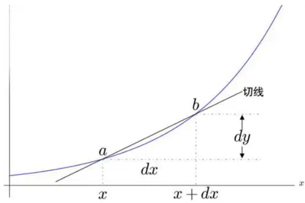

我们现在所学的微分学一定是按照先极限、后导数、再微分这个顺序来学。但数学历史上, 是先微分, 再极限, 最后导数.

## 古典微分学

出于对函数变化趋势的研究需要，数学家们迫切想要知道函数在某一点处的变化值是多少。如下图：

将函数值$y$的变化量直接定义为$dy$，而将自变量$x$的变化量直接定义为$dx$。只要$dx$足够小，也就是说$b$点足够趋近于$a$，函数的割线就足够能够描绘出函数在这个邻域中的变化情况。

当时给出的定义是$dx$无限小，则割线就会无限与其切线重合。那么小到一定程度（b与a重合），则割线自然就成为了切线。这个定义漏洞百出。因为我们都知道两点才能确定一条直线，如果b点都与a点重合了，那怎么会把切线给确定出来呢？这个定义漏洞百出。因为我们都知道两点才能确定一条直线，如果b点都与a点重合了，那怎么会把切线给确定出来呢？关于切线的问题本质上并没有得到解决

由于上述问题, 只能强行定义dy为y的微分，dx为x的微分（微分即微小的变化量）。然后把dy/dx定义为导数，也就是切线的斜率（即因变量微分与自变量微分之比为导数）。因此导数在那个时候又叫做微分的商。虽然定义了导数来表示斜率，通过点斜式解决了切线的求法。这就是古典微分学的思想.

但是这样的定义带来很多问题, 在计算导数时，就采取了这种方式：

$$
\begin{split} 
\frac{dx^2}{dx} &= \frac{f(x + dx) - f(x)}{dx}  \\ 
&=\frac{(x + dx)^2 - x^2}{dx} \\ 
&=\frac{x^2 + 2xdx + dx^2 - x^2}{dx} \\
&=\frac{2xdx + dx^2}{dx} \\
&=2x + dx\colorbox{yellow}{(将dx进行约分, dx不能为0)} \\
&=2x \colorbox{yellow}{(将dx=0, 才能得到2x)}
\end{split}
$$

dx到底是什么，一会为0，一会又不为0？为什么一个量会有两种不同形态，而且还能完全没道理的自由转换？于是第二次数学危机就这样爆发了。无穷小量直接挑战了数学的严谨性！

古典微分学的特点：
1. dy和dx表示的是自变量和因变量的具体的变化。
2. 根据想象中的无穷小这个东西，定义了切线。
3. 然后将切线的斜率定义为导数。

## 极限微分学
终于极限被发明了出来。相应的什么是无穷小，也有了确切的、具体的定义。

基于极限是怎么定义导数:

$$f^\prime(x)=\lim\limits_{\Delta x\to 0}\dfrac{f(x+\Delta x)-f(x)}{\Delta x}$$

也就是所谓切线，其实就是趋近于0时，割线的极限。所谓无穷小，就是极限为0的量。那么导数还是切线的斜率，这是没有变的。

古典微分学和极限微分学:

1. 相同的地方：都是表示微小变化的量。
2. 不同的地方:古典微分是直接将变化的具体值定义成了微分, $dy = \Delta y$. 而在极限微分学中, 则是$dy \approx  \Delta y$, 个符号的变化，其实就是极限理论的运用。

回到之前的式子:
$$
\begin{split} 
\frac{dx^2}{dx} &= \frac{f(x + dx) - f(x)}{dx}  \\ 
&=\frac{(x + dx)^2 - x^2}{dx} \\ 
&=\frac{x^2 + 2xdx + dx^2 - x^2}{dx} \\
&=\frac{2xdx + dx^2}{dx} \\
&=2x + dx\colorbox{green}{(将dx进行约分, dx是无限趋近于0的值, 不为0)} \\
&=2x \colorbox{green}{(dx是无限趋近于0的值, 可以忽略)}
\end{split}
$$

## 导数与微分
1. 微分是指$x$, $y$的极小的变化量$\Delta x$和$\Delta y$, 写作$dx$和$dy$
2. 导数是微分的商$f'(x) = \frac{\Delta y}{\Delta x} = \frac{dy}{dx}$

## 参考

1. https://www.zhihu.com/question/264955988

