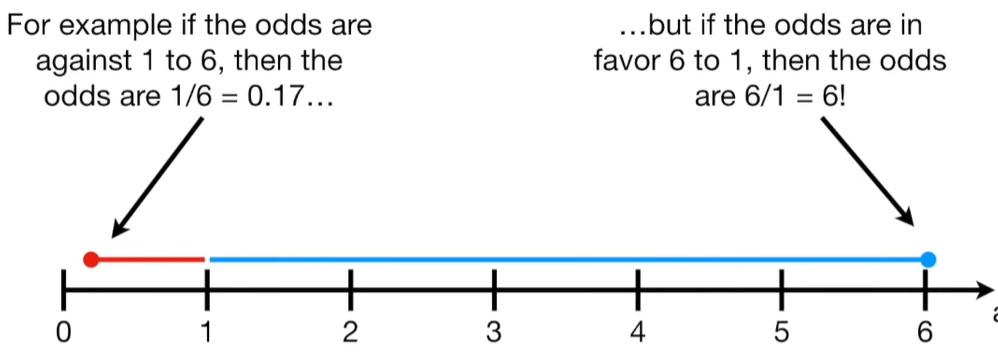

# 对数几率

## 几率(Odds)

### 基本概念

在概率统计中，Odds是指某一事件发生的概率与该事件不发生的概率之比。如果用$p$表示事件发生的概率，那么该事件不发生的概率为$1 - p$，则Odds的计算公式为：$\text{Odds}=\frac{p}{1 - p}$。

### 几率与概率的关系
1. 几率是一件事可能发生于不发生的概率之比, 概率是一件事可能发生的概率于该事件所有能情况(发生和不发生)的比. 比如:
    
    

2. 概率$p$的取值范围是$[0,1]$，而Odds的取值范围是$[0,+\infty)$。
    1. 当$p = 0$时，$\text{Odds}=0$，表示事件不可能发生；
    2. 当$p = 0.5$时，$\text{Odds}=1$，表示事件发生和不发生的可能性相等；
    3. 当$p = 1$时，$\text{Odds}\to+\infty$，表示事件必然发生。

    

### 应用

在体育赛事的博彩中，Odds常被用来表示某队或某选手获胜的可能性及相应的赔付比例。例如，一场足球比赛中，某队的获胜Odds为2，这意味着如果投注该队获胜，若该队最终取胜，投注者将获得两倍于本金的回报。

## 对数几率

### 基本概念

可以看到几率不是左右对称的, 比如$odds = 1/6 = 0.17$, 但是$odds = 6/1 =6$. 看起来0.17要比6小得多, 而不是对称相反. 

这个问题可以通过`log()`函数来解决, 比如$log(1/6) = log(0.17) = -1.79$, $log(6/1) = log(6) = 1.79$. 他们相对于0是对称的.

对数几率（logOdds），就是对上述几率取自然对数（以$e$为底的对数，通常用$\ln$表示或者其他底数的对数（比如常用对数以10为底，用$\lg$表示所得到的结果，即 $\text{logOdds} = \ln(\frac{p}{1 - p})$ 。

### 与概率的相互转换
- 已知对数几率求概率，可以通过以下公式进行转换（以自然对数为例）：
\[p = \frac{1}{1 + e^{-\text{logOdds}}}\]
- 反过来，已知概率求对数几率就是前面提到的计算方式：$\text{logOdds} = \ln(\frac{p}{1 - p})$。

## 几率, 概率于逻辑回归

线性回归：$y = w x + b$，其中以 $w$ 和 $b$ 拟合 $y$。

对数几率回归：$\ln\frac{y}{1-y}=wx+b$，以$w$，$b$拟合$\ln\frac{y}{1-y}$。

逻辑回归: $y=\frac{1}{1 + e^{-(wx + b)}}$。

对数几率的逆函数(Inverse Function)是逻辑函数:
1. 对上式两侧取以e为底的指数

    $\frac{y}{1-y}=e^{wx + b}$

2. 两边同乘$1 - y$

    $y = e^{wx + b}-ye^{wx + b}$。

3. 移项:
    
    $(1 + e^{wx + b})y = e^{wx + b}$。

4. 两边同除以$(1 + e^{wx + b})$

    $y=\frac{e^{wx + b}}{1 + e^{wx + b}}$。

5. 右边分子分母同事除以$wx + b$

    $y=\frac{1}{1 + e^{-(wx + b)}}$。

## 参考
1. https://www.youtube.com/watch?v=ARfXDSkQf1Y