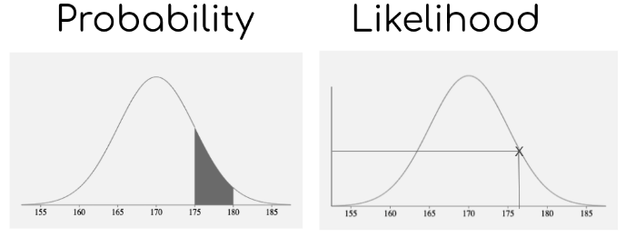
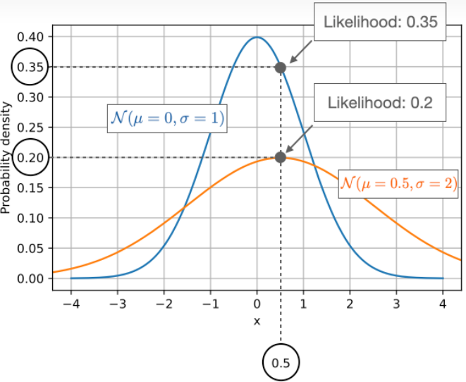

似然函数（Likelihood Function）和概率密度函数（Probability Density Function，简称PDF）都是描述数据和参数关系的重要数学工具。尽管两者在形式上具有相似性，它们在解释、用途和计算方面有着明显的不同。

概率函数通常被记作$P(x \mid \theta)$, 其中$\theta$是模型参数, $x$是观测到的数据.
似然函数通常被记作$L(\theta \mid x)$, 其中$\theta$是模型参数, $x$是观测到的数据.

和概率密度函数形式上很相似，但它们所描述的是两个完全不同的概念.
1. 似然函数: 描述已经观察到事件$x$，而参数$\theta$是什么的可能性。数据是已知的，我们考虑参数的变化。
2. 概率函数: 描述在固定的参数$\theta$下，某一事件$x$发生的可能性。参数是固定的，我们考虑数据的变化。

## 似然函数

考虑一个投掷硬币的例子，其中硬币正面出现的概率是 ( p )，反面出现的概率是 ( 1-p )。
若我们观察到了3次正面和2次反面，似然函数可以写作：
$$
L(p \mid X) = p^3 \times (1-p)^2
$$
这个函数描述了在观察到3次正面和2次反面后，不同的p值对应的合理程度。

## 概率密度函数

概率密度函数（Probability Density Function, PDF）描述了一个连续随机变量在各个特定值上的“密度”，也就是该值出现的相对可能性。对于离散随机变量，这个概念被称为概率质量函数（Probability Mass Function, PMF）。

对于连续随机变量 X，其概率密度函数 f(x) 定义为：

$$f(x)=lim _{\Delta x \to 0} \frac{P(x \leq X<x+\Delta x)}{\Delta x}$$

例子：假设一个随机变量 X 遵循标准正态分布（Standard Normal Distribution），其概率密度函数为：$f(x)=\frac{1}{\sqrt{2 \pi}} e^{-\frac{x^2}{2}}$。这个函数描述了 X 取各个不同值的可能性。

## 概念

概率与似然是站在两个角度上看待问题。假设样本集为$X$ ，环境参数为$\theta$.

1. 当环境参数$\theta$已知时为概率问题：概率即是给定模型参数后，对样本合理性的描述，而不涉及任何观测数据。
2. 当环境参数$\theta$未知时为似然问题：似然即是给定样本观测数据，从而推测可能产生这个结果的环境参数。似然问题也称为逆概(Converse Probability)问题。

例子:

1. 假设掷一枚硬币正面朝上概率为 $\theta = 0.5$ ，求掷10次硬币中有7次正面朝上的概率；
2. 有一个硬币有的概率正面朝上，为确定$\theta$做如下实验：掷10次硬币得到一个正反序列——HHTTHTHHHH。

显然，(Qa)可以不依赖任何观测数据计算出 ，即最终的观测数据在0.117附近则认为是合理的；(Qb)则是通过观测数据构造似然函数来反推环境参数：事实上，这符合人类认识的规律——即在不断地实践中获得观测数据，再从观测数据中总结经验规律(对应于模型参数)。在机器学习中，也往往是需要机器根据已有的数据学到相应的分布——即确定由$\theta$决定的模型。

✨概率密度值相较于似然值, 类似于概率相较于频率值

## 参考
1. https://zhuanlan.zhihu.com/p/669590767

