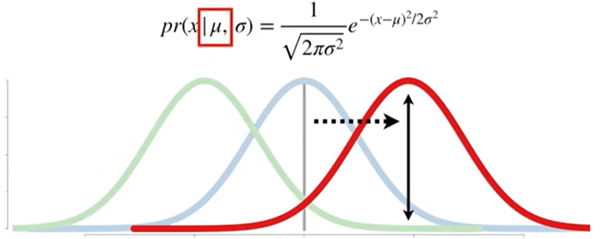
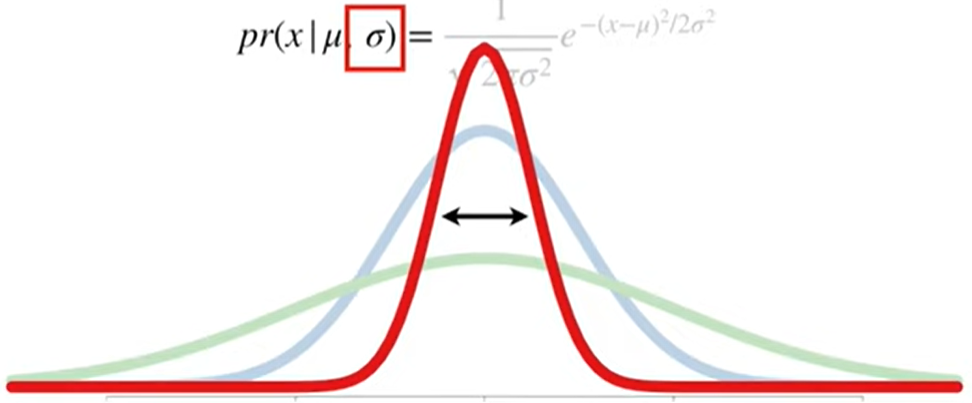
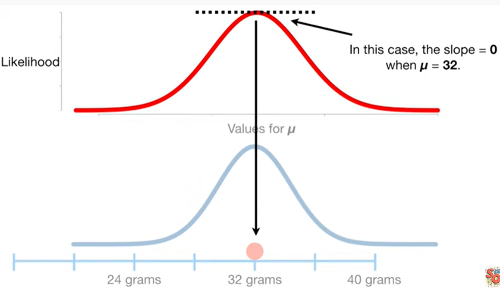
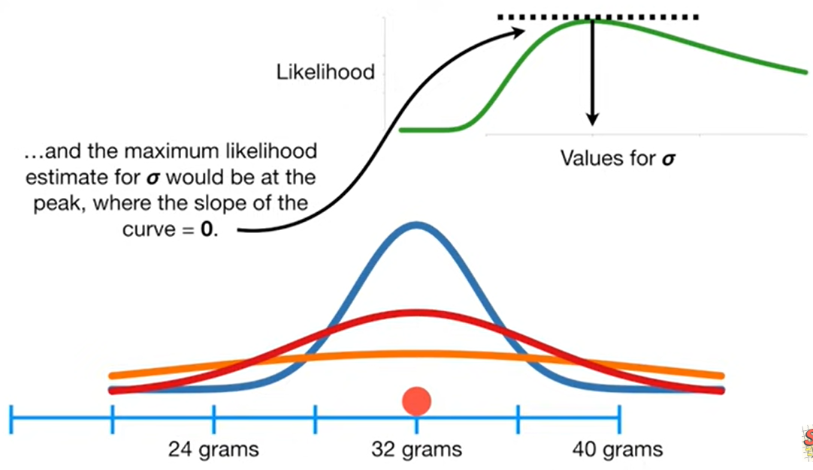
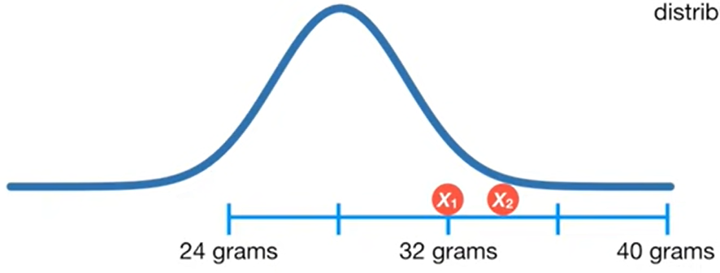
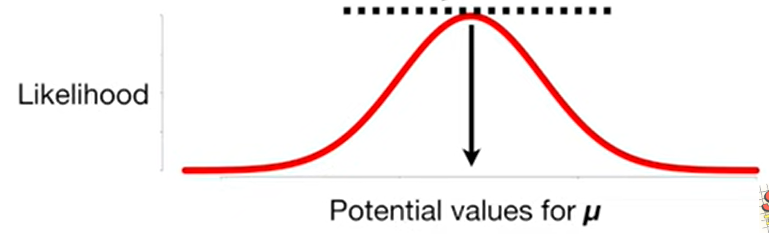
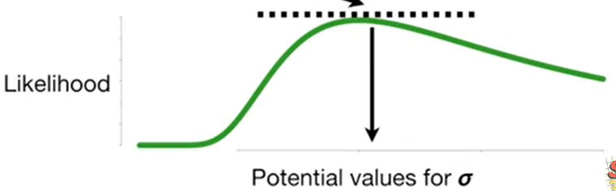
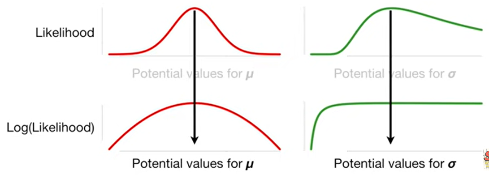
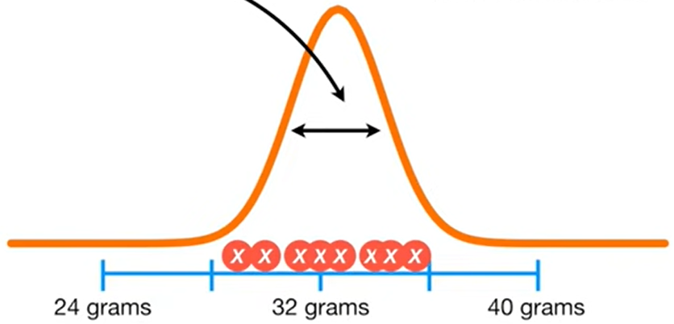

# 最大似然估计

## 直觉

$$ p(x|\mu,\sigma) = \frac{1}{\sqrt{2\pi\sigma^2}}e^{-(x-\mu)^2/2\sigma^2} $$

这个是正态分布(normal distribution)的等式, 他有2个参数:
1. $\mu$(均值, mean), 决定正态分布均值的位置. 越小, 分布左移; 越大, 分布右移.

    

2. $\sigma$(标准差, standard deviation), 决定正态分布的形状. 越小, 瘦高;越大, 矮胖.

我们从给定的数据里$x$, 使用正态分布的似然值(likelihood)来找到最优的$\mu$和$\sigma$.

$$ L(\mu,\sigma|x) = \frac{1}{\sqrt{2\pi\sigma^2}}e^{-(x-\mu)^2/2\sigma^2} $$

比如, 我们将$\mu=20$带入, 会得到非常小的似然值.

$$ L(\mu=20|x=32,\sigma=2) = \frac{1}{\sqrt{2\pi\sigma^2}}e^{-(x-\mu)^2/2\sigma^2} =0.0000000003 $$

将似然值画出来, y轴是似然值, x轴是不同的均值$\mu$. 每次改变均值$\mu$我们都对应画出似然值.

可以确定当斜率(slope)为0时, 到达似然只的顶峰, 这时$\mu=32$.

现在, 我们可以固定均值$\mu=32$, 把他当成已知的, 就如数据集$x$一样, 然后带入不同的$\sigma$值, 找到最大的似然值. 同样的, 是在斜率为0时, 到达似然值的顶峰, 这时$\sigma=$

## 两个数据

使用两个数据集来计算似然值, 这里设$\mu=28$和$\sigma=2$. 由于$x_1=32$和$x_2 = 34$是独立的, 所以

$$L(\mu=28,\sigma=2|x_1=32 and x_2 = 34) = L(\mu=28,\sigma=2|x_1=32) \cdot L(\mu=28,\simga=2|x_2=34)=0.000006$$

## n个数据

同理, 对于n个数据, 公式如下:

$$ L(\mu,\sigma|x_1,x_2,...,x_n) = L(\mu,\sigma|x_1) \cdot ... \cdot L(\mu,\sigma|x_n)  = \frac{1}{\sqrt{2\pi\sigma^2}}e^{-(x_1-\mu)^2/2\sigma^2}\cdot ... \cdot  \frac{1}{\sqrt{2\pi\sigma^2}}e^{-(x_n-\mu)^2/2\sigma^2}$$

## 估计

使用最大似然估计$\mu$和$\sigma$.

$$L(\mu,\sigma|x_1,x_2,...,x_n)$$
$$= L(\mu,\sigma|x_1) \cdot ... \cdot L(\mu,\sigma|x_n)$$
$$= \frac{1}{\sqrt{2\pi\sigma^2}}e^{-(x_1-\mu)^2/2\sigma^2}\cdot ... \cdot  \frac{1}{\sqrt{2\pi\sigma^2}}e^{-(x_n-\mu)^2/2\sigma^2} $$

把$\sigma$作为一个常数, 对$\mu$求偏导, 当$\mu=0$时取得最大似然值.

把$\mu$作为一个常数, 对$\sigma$求偏导, 当$\sigma=0$时取得最大似然值.

在求导之前, 我们对似然函数做对数(log)转换, 因为这样会简化求导. 似然函数和对数似然函数会在相同的$\mu$和$\sigma$值到达顶峰.

$$ln(L(\mu,\sigma|x_1,x_2,...,x_n))$$
$$= ln(\frac{1}{\sqrt{2\pi\sigma^2}}e^{-(x_1-\mu)^2/2\sigma^2}\cdot ... \cdot  \frac{1}{\sqrt{2\pi\sigma^2}}e^{-(x_n-\mu)^2/2\sigma^2}) $$

首先, 适用对数将乘法转换为加法:

$$= ln(\frac{1}{\sqrt{2\pi\sigma^2}}e^{-(x_1-\mu)^2/2\sigma^2}) + ln(\frac{1}{\sqrt{2\pi\sigma^2}}e^{-(x_n-\mu)^2/2\sigma^2}) $$

关注其中一个因子:

$$ ln(\frac{1}{\sqrt{2\pi\sigma^2}}e^{-(x_1-\mu)^2/2\sigma^2}) $$

将乘法转换为加法:

$$ =ln(\frac{1}{\sqrt{2\pi\sigma^2}}) + ln(e^{-(x_1-\mu)^2/2\sigma^2}) $$

左侧将分式转化为指数形式: 

$$ =ln((2\pi\sigma^2)^{-1/2}) + ln(e^{-(x_1-\mu)^2/2\sigma^2}) $$

右侧将指数转换为乘法形式:

$$ =ln((2\pi\sigma^2)^{-1/2}) - \frac{(x_1-\mu)^2}{2\sigma^2}ln(e) $$

左侧将-1/2指数转换为乘法形式, 右侧$ln(e)= 1$化简

$$ =-\frac{1}{2}ln(2\pi\sigma^2)- \frac{(x_1-\mu)^2}{2\sigma^2} $$

左侧将乘法转换为加法

$$ =-\frac{1}{2}ln(2\pi)-\frac{1}{2}ln(\sigma^2) - \frac{(x_1-\mu)^2}{2\sigma^2} $$

将$ln(\sigma^2)$ 转化为 $2 \cdot ln(\sigma)$
$$ =-\frac{1}{2}ln(2\pi)-ln(\sigma) - \frac{(x_1-\mu)^2}{2\sigma^2} $$

回到最初的似然公式:
$$= ln(\frac{1}{\sqrt{2\pi\sigma^2}}e^{-(x_1-\mu)^2/2\sigma^2}) + ln(\frac{1}{\sqrt{2\pi\sigma^2}}e^{-(x_n-\mu)^2/2\sigma^2}) $$

将其转化为:

$$ -\frac{1}{2}ln(2\pi)-ln(\sigma)-\frac{(x_1-\mu)^2}{2\sigma^2} - ... - \frac{1}{2}ln(2\pi)-ln(\sigma)- \frac{(x_n-\mu)^2}{2\sigma^2}$$
$$ -\frac{n}{2}ln(2\pi)-nln(\sigma)-\frac{(x_1-\mu)^2}{2\sigma^2} - ... - \frac{(x_n-\mu)^2}{2\sigma^2}$$

对数似然函数化简后的等式求$\mu$的偏导, 当导数为0时, 求得极值位置.

$$\frac{\partial}{\partial\mu}ln(L(\mu,\sigma)|x_1,...,x_n) $$
$$ = \frac{\partial}{\partial\mu}-\frac{n}{2}ln(2\pi)-nln(\sigma)-\frac{(x_1-\mu)^2}{2\sigma^2} - ... - \frac{(x_n-\mu)^2}{2\sigma^2} $$
$$ = 0 - 0 + \frac{(x_1-\mu)}{\sigma^2} + \frac{(x_n-\mu)}{\sigma^2} $$
$$ = \frac{1}{\sigma^2}((x_1+...+x_n)-n\mu)  =0$$
$$ \mu = \frac{x_1+...+x_n}{n}  $$

这个就是正态分布的中心的位置:

同样的道理, 我们可以求$\sigma$:

$$\frac{\partial}{\partial\sigma}ln(L(\mu,\sigma)|x_1,...,x_n) $$
$$= -\frac{n}{\sigma}+ \frac{1}{\sigma^3}((x_1-\mu)^2+...+(x_n-\mu)^2)=0$$
$$ \sigma^2 = \frac{(x_1-\mu)^2+...+(x_n-\mu)^2}{n} $$

因此, 求得最大似然值对应的额$\sigma$:

## 参考
1. https://www.youtube.com/watch?v=Dn6b9fCIUpM
2. https://zhuanlan.zhihu.com/p/669590767